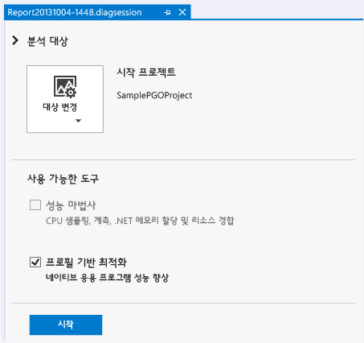
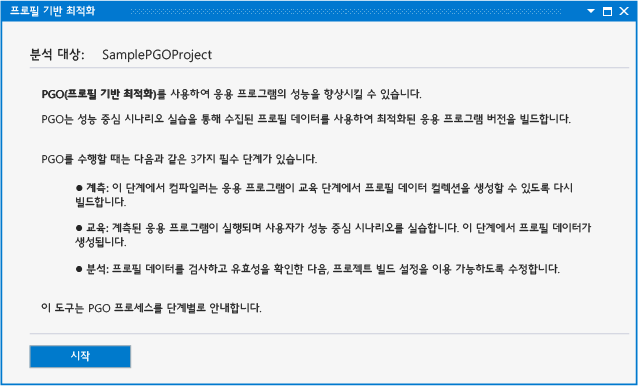
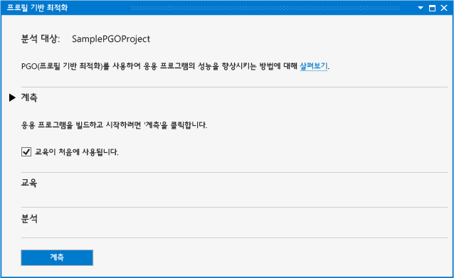
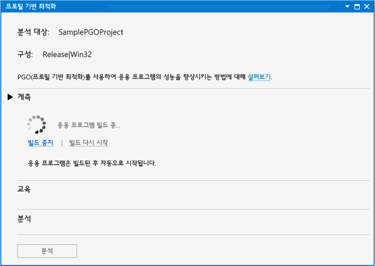
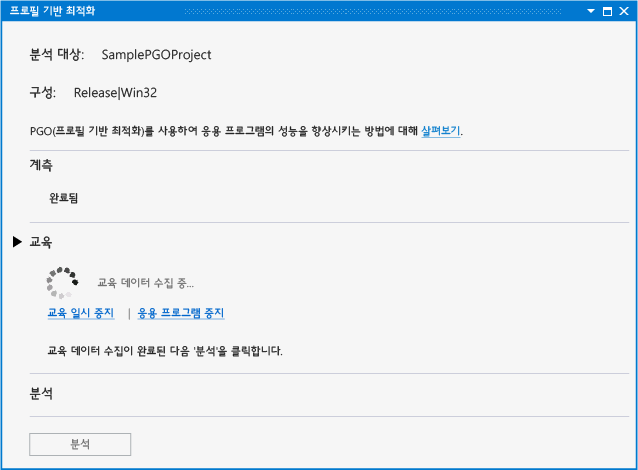
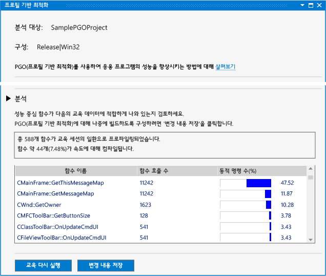
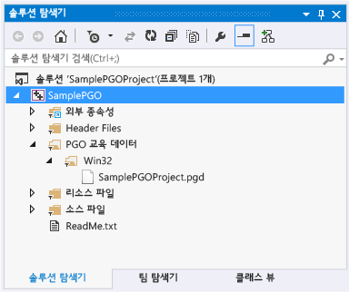
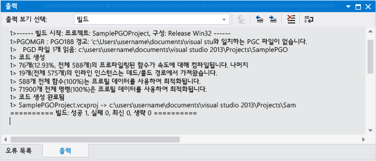

# Visual Studio 2013 성능 및 진단 허브의 프로필 기반 최적화

Visual Studio 2013을 사용 하는 경우 Visual c + +의 성능 및 진단 허브에서 플러그 인 프로필 기반 최적화는 개발자를 위한 프로필 기반 최적화 환경을 간소화 합니다. 있습니다 수 [다운로드 하 여](http://go.microsoft.com/fwlink/p/?LinkId=327915) Visual Studio 웹 사이트에서. 이후 버전의 Visual Studio에서 플러그 인 지원 되지 않습니다.

PGO(프로필 기반 최적화)는 사용자의 상호 작용 방식에 최적화된 x86 및 x64 네이티브 응용 프로그램을 빌드하는 데 도움을 줍니다. PGO는 다중 단계 프로세스: 프로 파일링을 위해 계측 된 응용 프로그램 빌드 만들고 후 "교육"을 수행 즉, 공통 사용자 상호 작용 시나리오를 통해 계측된 된 응용 프로그램을 실행합니다. 캡처된 프로파일링 데이터를 저장한 다음에는 결과를 사용해서 전체 프로그램 최적화를 안내하도록 응용 프로그램을 다시 빌드합니다. Visual Studio 또는 명령줄에서 이러한 단계를 개별적으로 수행할 수 있지만 PGO 플러그인은 이 프로세스를 중앙화하고 간소화합니다. PGO 플러그인은 필요한 모든 옵션을 설정하고, 각 단계를 안내하고, 분석을 보여주고, 결과를 사용해서 크기 및 속도에 맞게 각 기능을 최적화하도록 빌드를 구성합니다. 또한 PGO 플러그인을 사용하면 응용 프로그램 교육을 쉽게 다시 실행하고 코드를 변경할 때 빌드 최적화 데이터를 업데이트할 수 있습니다.

## 전제 조건

수행 해야 [PGO 플러그인을 다운로드](http://go.microsoft.com/fwlink/p/?LinkId=327915) 성능 및 진단 허브에서 사용 하려면 먼저 Visual Studio에 설치 합니다.

## 연습: PGO 플러그인을 사용하여 응용 프로그램 최적화

우선, Visual Studio에서 기본 Win32 데스크톱 응용 프로그램을 만듭니다. 최적화하려는 네이티브 응용 프로그램이 이미 있으면 이를 사용하고 이 단계는 건너뛸 수 있습니다.

### 응용 프로그램을 만들려면

1. 메뉴 모음에서 **파일**, **새로 만들기**, **프로젝트**를 차례로 선택합니다.

1. 왼쪽된 창에는 **새 프로젝트** 대화 상자에서 **설치 됨**, **템플릿**, **Visual c + +** 를 선택한 후  **MFC**합니다.

1. 가운데 창에서 선택 **MFC 응용 프로그램**합니다.

1. 프로젝트에 대 한 이름을 지정-예를 들어 **SamplePGOProject**-에 **이름** 상자입니다. **확인** 단추를 선택합니다.

1. 에 **개요** 의 페이지는 **MFC 응용 프로그램 마법사** 대화 상자에서 선택 하는 **마침** 단추입니다.

그런 다음, 응용 프로그램의 빌드 구성을 릴리스로 설정해서 PGO 빌드 및 교육 단계를 준비합니다.

### 빌드 구성을 설정하려면

1. 메뉴 모음에서 **빌드**, **구성 관리자**를 선택합니다.

1. 에 **Configuration Manager** 대화 상자에서 선택 하는 **활성 솔루션 구성** 드롭 다운 단추를 선택 **릴리스**합니다. 선택 된 **닫기** 단추입니다.

성능 및 진단 허브 열기-메뉴 모음에서 **분석**, **성능 및 진단**합니다. 그러면 프로젝트 형식에 사용할 수 있는 분석 도구가 포함된 진단 세션 페이지가 열립니다.

**사용 가능한 도구**, 선택는 **프로필 기반 최적화** 확인란 합니다. 선택 된 **시작** PGO 플러그인을 시작 하는 단추입니다.

**프로필 기반 최적화** 페이지에서는 응용 프로그램의 성능을 향상 시키기 위해 플러그인에서 사용 하는 단계를 설명 합니다. 선택 된 **시작** 단추입니다.

에 **계측** 사용 섹션을는 **교육이 처음 설정 됨** 를 학습의 일부로 응용 프로그램의 시작 단계를 포함할지 여부를 선택할 수 있습니다. 이 옵션을 선택하지 않으면, 교육을 명시적으로 설정할 때까지 실행 중인 계측된 응용 프로그램에서 교육 데이터가 기록되지 않습니다.

선택은 **계측** 특별 한 컴파일러 옵션 집합이 사용 하 여 앱을 작성 하는 단추입니다. 컴파일러가 생성된 코드에 검사 지침을 삽입합니다. 이러한 지침은 교육 단계 중에 프로파일링 데이터를 기록합니다.

응용 프로그램의 계측된 빌드가 완료되면 응용 프로그램이 자동으로 시작됩니다.

빌드하는 동안 오류 또는 경고가 발생 한 경우 먼저 수정 하 고 눌러 **빌드 다시 시작** 를 계측 된 빌드를 다시 시작 합니다.

응용 프로그램이 시작 되는 경우 사용할 수 있습니다는 **교육 시작** 및 **일시 중지** 에서는 정적으로 연결 된 **학습** 프로 파일링 정보가 기록 되는 시간을 제어 하는 섹션. 사용할 수는 **응용 프로그램 중지** 및 **응용 프로그램 시작** 링크를 중지 하 고 앱을 다시 시작 합니다.

교육을 하는 동안, 시나리오를 살펴보고 코드를 최적화하기 위해 PGO 플러그인에 필요한 프로파일링 정보를 캡처합니다. 교육을 완료 하는 경우 응용 프로그램을 닫거나 선택은 **응용 프로그램 중지** 링크 합니다. 선택 된 **분석** 분석 단계를 시작 하려면 합니다.

분석이 완료 되 면는 **분석** 섹션에 사용자 시나리오 교육 단계 중에 캡처된 프로 파일링 정보의 보고서가 표시 됩니다. 이 보고서에서는 사용자의 응용 프로그램이 호출한 기능 및 가장 많은 시간이 소비된 함수를 조사할 수 있습니다. PGO 플러그인은 이 정보를 사용해서 속도를 최적화할 응용 프로그램 기능과 크기를 최적화할 기능을 확인할 수 있습니다. PGO 플러그인은 교육 중 기록한 사용자 시나리오에 대해 가장 작고 가장 빠른 응용 프로그램을 만들기 위한 빌드 최적화를 구성합니다.

교육으로 예상된 된 프로 파일링 정보가 캡처를 선택할 수 있습니다 **변경 내용 저장** 이후 빌드 최적화를 위해 프로젝트에 분석된 된 프로필 데이터를 저장 합니다. 프로필 데이터를 삭제 하 고 처음부터 다시 교육을 시작 하려면 선택 **교육 다시 실행**합니다.

프로필 데이터 파일은 프로젝트에서 저장 한 **PGO 교육 데이터** 폴더입니다. 이 데이터는 응용 프로그램에서 컴파일러 빌드 최적화 설정을 제어하는 데 사용됩니다.

분석 후, PGO 플러그인은 컴파일 중 프로필 데이터를 사용해서 응용 프로그램을 선택적으로 최적화할 수 있도록 프로젝트에서 빌드 옵션을 설정합니다. 계속해서 동일한 프로필 데이터를 사용해서 응용 프로그램을 수정하고 빌드할 수 있습니다. 응용 프로그램이 빌드되었으면 빌드 출력에 프로필 데이터를 사용해서 얼마나 많은 기능 및 명령이 최적화되었는지 보고됩니다.

개발 중 상당한 코드를 변경한 경우 최상의 최적화 효과를 얻기 위해 응용 프로그램을 다시 교육해야 할 수 있습니다. 프로필 데이터를 사용해서 80% 이하의 기능 또는 명령이 최적화된 것으로 빌드 출력에 보고될 경우 응용 프로그램을 다시 교육하는 것이 좋습니다.