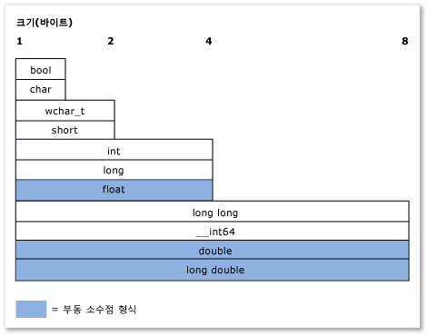

# <a name="c-type-system-modern-c"></a>C++ 형식 시스템(최신 C++)
개념이 *형식* 는 c + +에서 매우 중요 합니다. 모든 변수, 함수 인수 및 함수 반환 값은 형식이 있어야 컴파일할 수 있습니다. 또한 모든 식(리터럴 값 포함)은 확인 전 컴파일러가 암시적으로 형식을 지정합니다. 형식의 몇 가지 예로 **int** 정수 값을 저장할 **double** 부동 소수점 값을 저장 (라고도 *스칼라* 데이터 형식), 또는 표준 라이브러리 클래스 [std::basic_string](../standard-library/basic-string-class.md) 텍스트를 저장 합니다. 정의 하 여 고유한 형식을 만들 수 있습니다는 **클래스** 하거나 **구조체**합니다. 이 형식은 변수에 할당되는(또는 식 결과) 메모리 양, 해당 변수에 저장할 수 있는 값의 유형, 이러한 값(비트 패턴)의 해석 방법 및 여기에 대해 수행할 수 있는 작업을 지정합니다. 이 문서에는 C++ 형식 시스템의 주요 기능에 대한 비공식적 개요가 들어 있습니다.  
  
## <a name="terminology"></a>용어  
 **변수**: 바로 가기 링크 이름을 정의 된 코드의 범위에 걸쳐 참조 데이터에 액세스 하 사용할 수 있도록 데이터의 양에의 이름입니다. C + +에서는 *변수에* 는 일반적으로 참조 하는 데 스칼라 데이터 형식 인스턴스는 일반적으로 다른 형식의 인스턴스를 호출 하는 반면 *개체*합니다.  
  
 **개체**: 단순 성과 일관성에 대 한이 문서에서는 용어 *개체* 를 가리키도록 모든 인스턴스는 클래스 또는 구조체의 일반적인 의미에서 사용 하는 경우에 모든 형식이 포함 됩니다 스칼라 변수를 포함 합니다.  
  
 **POD 형식이** (일반 이전 데이터): c + +에서 데이터 유형의 비공식적 범주는 스칼라 형식으로 나타냅니다 (기본 유형 섹션 참조) 또는 *POD 클래스*합니다. POD 클래스는 POD가 아닌 정적 데이터 멤버가 없으며 사용자 정의 생성자, 사용자 정의 소멸자 또는 사용자 정의 할당 연산자가 없습니다. 또한 POD 클래스에는 가상의 함수, 기본 클래스 및 비공개 또는 보호된 비정적 데이터 멤버가 없습니다. POD 유형은 주로 외부 데이터 교환(예: POD 유형만 있는 C 언어로 작성된 모듈)에 사용됩니다.  
  
## <a name="specifying-variable-and-function-types"></a>변수 및 함수 형식 지정  
 C + +는 한 *강력한* 언어 이며 이기도 *정적으로 형식화 된*; 모든 개체에 형식이 있고 해당 형식은 (필요가 정적 데이터 개체와 혼동) 변경 되지 합니다.   
**변수를 선언 하는 경우** 코드에서 해당 형식을 명시적으로 지정 하거나 사용 합니다 **자동** 이니셜라이저에서 형식을 추론 하도록 컴파일러에 지시 하는 키워드입니다.   
**함수를 선언 하는 경우** 코드에서 각 인수 및 해당 반환 값의 형식을 지정 해야 하거나 **void** 아무 값도 함수에서 반환 하는 경우. 임의 형식의 인수를 허용하는 함수 템플릿을 사용하는 경우는 예외입니다.  
  
 먼저 변수를 선언한 후에는 나중에 형식을 변경할 수 없습니다. 그러나 변수 값 또는 함수의 반환 값을 다른 형식의 다른 변수에 복사할 수 있습니다. 이러한 작업 이라고 *형식 변환*, 있는 경우에 따라 필요 하지만 데이터가 손실 되거나 부르며 발생할 수 있는 곳도 있습니다.  
  
 POD 형식의 변수를 선언할 때 초기화, 즉 초기 값을 제공하는 것이 좋습니다. 변수를 초기화할 때까지 해당 메모리 위치에 이전에 있던 비트로 구성된 "가비지" 값을 가지고 있습니다. 특히 초기화를 처리하는 다른 언어를 사용하는 경우 C++의 이 특성을 기억해야 합니다. 비 POD 클래스 형식의 변수를 선언할 경우 생성자가 초기화를 처리합니다.  
  
 다음 예제에서는 각각에 대한 일부 설명을 포함한 몇 가지 간단한 변수 선언을 보여 줍니다. 또한 컴파일러가 특정 변수의 후속 작업을 허용하거나 거부하기 위해 형식 정보를 사용하는 방법을 보여줍니다.  
  
```cpp  
int result = 0;              // Declare and initialize an integer.  
double coefficient = 10.8;   // Declare and initialize a floating   
                             // point value.  
auto name = "Lady G.";       // Declare a variable and let compiler   
                             // deduce the type.  
auto address;                // error. Compiler cannot deduce a type   
                             // without an intializing value.  
age = 12;                    // error. Variable declaration must  
                             // specify a type or use auto!  
result = "Kenny G.";         // error. Can’t assign text to an int.  
string result = "zero";      // error. Can’t redefine a variable with  
                             // new type.  
int maxValue;                // Not recommended! maxValue contains   
                             // garbage bits until it is initialized.  
```  
  
## <a name="fundamental-built-in-types"></a>기본(기본 제공) 형식  
 일부 언어와 달리, C++에는 다른 형식이 파생되는 유니버설 기본 형식이 없습니다. 여러 언어의 Visual c + + 구현을 포함 *기본 형식*라고도 *기본 제공 형식*합니다. 와 같은 숫자 형식이 포함 됩니다 **int**, **double**, **긴**, **bool**와 **char** 및**wchar_t** 각각 ASCII 및 유니코드 문자 형식입니다. 가장 기본적인 유형 (제외한 **bool**, **double**를 **wchar_t** 와 관련 유형) 미등록 버전이 변수에 저장할 수 있는 값의 범위를 수정 하는 합니다. 예를 들어를 **int**, 32 비트 부호 있는 정수를 저장 하는 값을 나타낼 수-2,147,483,648에서 2,147,483,647까지 합니다. **부호 없는 int**, 0에서 4,294,967,295 사이의 값을 저장할 수는 32 비트도 저장 됩니다. 각 사례에서 사용할 수 있는 값의 총 수는 동일하며, 범위만 다릅니다.  
  
 제어 기본 항목은 어떤 작업을 수행할 수 있는지 및 기본 형식 및 방법들이 다른 기본 형식으로 변환될 수 있는지를 통제하도록 만든 컴파일러에 의해 인식됩니다. 기본 제공 형식 및 크기와 숫자 제한의 전체 목록은 참조 하세요 [기본 형식](../cpp/fundamental-types-cpp.md)합니다.  
  
 다음 그림은 기본 제공 형식의 상대적 크기를 보여 줍니다.  
  
   
  
 다음 표에는 가장 자주 사용하는 기본 형식이 나와 있습니다.  
  
|형식|크기|주석|  
|----------|----------|-------------|  
|int|4바이트|정수 값에 대한 기본 선택입니다.|  
|double|8바이트|부동 소수점 값에 대한 기본 선택입니다.|  
|bool|1바이트|true 또는 false가 될 수 있는 값을 나타냅니다.|  
|char|1바이트|UNICODE로 변환되지 않는 이전 C 스타일 문자열 또는 std::string 개체의 ASCII 문자에 사용합니다.|  
|wchar_t|2바이트|UNICODE 형식(Windows의 경우 UTF-16, 운영 체제마다 다를 수 있음)으로 인코딩할 수 있는 "와이드" 문자 값을 나타냅니다. `std::wstring` 형식 문자열에 사용되는 문자 형식입니다.|  
|unsigned char|1바이트|C++에는 기본 `byte` 형식이 없습니다.  바이트 값을 나타내려면 부호 없는 문자를 사용합니다.|  
|unsigned int|4바이트|비트 플래그에 대한 기본 선택입니다.|  
|long long|8바이트|매우 큰 정수 값을 나타냅니다.|  
  
## <a name="the-void-type"></a>void 형식입니다.  
 **void** 형식이 특수 형식이; 형식의 변수를 선언할 수 없습니다 **void**, 형식의 변수를 선언할 수 있지만 `void *` (에 대 한 포인터 **void**), 즉 원시 (형식화 되지 않은) 메모리를 할당 하는 경우에 작업이 필요한 경우도 있습니다. 그러나에 대 한 포인터 **void** 은 보장 되지 않는 형식 및 일반적으로 사용은 최신 c + +에서는 것이 좋습니다. 함수 선언에는 **void** 반환 값 이면 함수는 값을 반환 하지 않습니다는이 일반적이 고 허용 가능한 사용 **void**합니다. C에 필요한 언어 함수는 0 매개 변수를 선언 하는 동안 **void** 예를 들어, 매개 변수 목록에서 `fou(void)`,이 이렇게 했지만 최신 c + + 및 선언 해야 `fou()`합니다. 자세한 내용은 [형식 변환 및 형식 안전성](../cpp/type-conversions-and-type-safety-modern-cpp.md)합니다.  
  
## <a name="const-type-qualifier"></a>const 형식 한정자  
 기본 제공 또는 사용자 정의 형식은 const 키워드로 정규화할 수 있습니다. 또한 멤버 함수가 필요할 수도 **상수**-한정 또는 **const**-오버 로드 합니다. 값을 **const** 형식을 초기화 한 후 수정할 수 없습니다.  
  
```cpp  
  
const double PI = 3.1415;  
PI = .75 //Error. Cannot modify const variable.  
  
```  
  
 합니다 **상수** 한정자는 함수 및 변수 선언에 광범위 하 게 사용 하 고 "const 정확성" c + +의 중요 한 개념은 기본적으로 사용 하는 의미 **const** 컴파일 타임을 보장 하기 위해 값이 실수로 수정 되지 않습니다. 자세한 내용은 [const](../cpp/const-cpp.md)합니다.  
  
 A **const** 해당 비 const 버전과 구분 예를 들어 **const int** 에서 고유 형식인 **int**합니다. C + +를 사용할 수 있습니다 **const_cast** 연산자를 제거 해야 경우 해당 가끔 *const ness* 변수에서 합니다. 자세한 내용은 [형식 변환 및 형식 안전성](../cpp/type-conversions-and-type-safety-modern-cpp.md)합니다.  
  
## <a name="string-types"></a>String 형식  
 엄격히 말해, c + + 언어에 기본 제공 문자열 형식이 없습니다. **char** 하 고 **wchar_t** 단일 문자 저장-종료 null 값을 추가 문자열과 비슷하게 이러한 형식의 배열을 선언 해야 합니다 (예를 들어, ASCII `'\0'`) 하나 배열 요소에 유효한 문자를 지난 문자 (라고도 *C 스타일 문자열*). 훨씬 더 많은 코드를 작성해야 하거나 외부 문자열 유틸리티 라이브러리 함수를 사용해야 하는 C 스타일 문자열입니다. 하지만 최신 c + + 표준 라이브러리 형식에 `std::string` (8 비트 **char**-문자열 형식) 또는 `std::wstring` (16 비트 **wchar_t**-입력 문자열)입니다. 모든 호환 c + + 빌드 환경에 포함 된 표준 라이브러리의 일부 이기 때문에 이러한 c + + 표준 라이브러리 컨테이너 네이티브 문자열 형식으로 생각할 수 있습니다. 간단히 `#include <string>` 지시문을 사용하여 이러한 형식을 프로그램에서 사용할 수 있도록 만듭니다. (MFC 또는 ATL을 사용하지 않는 경우 CString 클래스도 사용할 수 있지만 C++ 표준에 포함되지는 않습니다.) 현대 C++에서는 null로 끝나는 문자 배열(앞에서 언급한 C 스타일 문자열)을 사용하지 않는 것이 좋습니다.  
  
## <a name="user-defined-types"></a>사용자 정의 형식  
 정의 하는 경우는 **클래스**를 **구조체**를 **union**, 또는 **열거형**, 해당 구문이 기본 형식인 것 처럼 코드의 나머지 부분에서 사용은 . 메모리 크기는 잘 알려져 있고, 사용법에 관한 규정이 컴파일 시간 검사, 가동 시 프로그램 수명 점검을 위해 적용됩니다. 기본 제공 형식과 사용자 정의 형식 간 기본적 차이는 다음과 같습니다.  
  
-   컴파일러는 기본적으로 사용자 정의 형식을 인식하지 못합니다. 먼저 컴파일 프로세스 중 정의 발견할 때 형식의 알아냅니다.  
  
-   오버로드를 통해 적합한 연산자를 클래스 멤버 또는 비멤버 함수로 정의하여 해당 형식에서 수행할 수 있는 연산자와 다른 형식으로 변환할 수 있는 방법을 지정합니다. 자세한 내용은 [함수 오버 로드](function-overloading.md)합니다.  
  
-   정적 형식(개체 형식을 절대 변경할 수 없는 규칙)일 필요는 없습니다. 메커니즘을 통해 *상속* 하 고 *다형성*, 클래스 (클래스의 개체 인스턴스라고 함)의 사용자 정의 형식으로 선언 된 변수에 런타임 시 보다에서 다른 형식을 가질 수 있습니다 컴파일 시간입니다. 자세한 내용은 [상속](../cpp/inheritance-cpp.md)을 참조하세요.  
  
## <a name="pointer-types"></a>포인터 형식  
 C 언어의 초기 버전부터 시작해서 C++에서는 계속하여 특수 선언자`*`(별표)를 사용하여 포인터 형식의 변수를 선언할 수 있습니다. 포인터 형식은 메모리에서 실제 데이터 값이 저장되는 위치의 주소를 저장합니다. 최신 c + +에서는 이러한 이라고 *원시 포인터*, 및 특수 연산자를 통해 코드에 액세스 하는 `*` (별표) 또는 `->` (사용 하 여 dash 큰-보다). 이 이라고 *역참조*를 사용 하는 것에 대 한 포인터는 스칼라 또는 개체의 멤버에 대 한 포인터를 역참조는 여부에 따라 달라 집니다. 포인터 형식 사용은 C 및 C++ 프로그램 개발 환경에서 가장 까다롭고 복잡한 요소 중 하나였습니다. 이 섹션에서는 몇 가지 팩트 및 최신 c + + 것에 더 이상 필수 (또는 권장) 하지만, 원하는 경우 원시 포인터를 사용 하는 방법 설명의 발전으로 인해 전혀 개체 소유권에 대 한 원시 포인터를 사용 하 여 [스마트 포인터](../cpp/smart-pointers-modern-cpp.md) ( 자세히 설명이 섹션의 끝). 원본 포인터를 개체 관찰 시 사용하면 편하고 안전하지만 개체 소유권 획득에 사용해야 할 경우 소유한 개체의 생성 및 제거 방법을 신중하게 고려하고 주의해서 사용해야 합니다.  
  
 가장 먼저 알아야 할 점은 원시 포인터 변수를 선언하는 것은 포인터 변수 역참조가 있는 경우 포인터를 참조하는 메모리 위치의 주소를 저장하는 데 필요한 메모리를 할당한다는 것입니다. 데이터 값 자체에 대 한 메모리 할당 (라고도 *백업 저장소*) 아직 할당 되지 않습니다. 즉, 기본 포인터 변수를 선언하면 실제 데이터 변수가 아니라 메모리 주소 변수를 만듭니다. 포인터 변수에 백업 저장소에 대한 올바른 주소가 포함되어 있는지 확인하기 전에 포인터 변수를 역참조하면 프로그램에서 정의되지 않은 동작(일반적으로 심각한 오류)이 발생합니다. 다음 예제에서는 이런 종류의 오류를 보여 줍니다.  
  
```cpp  
int* pNumber;       // Declare a pointer-to-int variable.  
*pNumber = 10;      // error. Although this may compile, it is  
                    // a serious error. We are dereferencing an  
                    // uninitialized pointer variable with no  
                    // allocated memory to point to.  
```  
  
 이 예제는 실제 정수 데이터 또는 할당된 유효한 메모리 주소를 저장하기 위해 할당된 메모리 없이 포인터를 역참조합니다. 다음은 다음 오류를 해결한 코드입니다.  
  
```cpp  
    int number = 10;          // Declare and initialize a local integer  
                              // variable for data backing store.  
    int* pNumber = &number;   // Declare and initialize a local integer  
                              // pointer variable to a valid memory  
                              // address to that backing store.  
...  
    *pNumber = 41;            // Dereference and store a new value in   
                              // the memory pointed to by  
                              // pNumber, the integer variable called  
                              // "number". Note "number" was changed, not  
                              // "pNumber".  
```  
  
 수정된 코드 예제는 로컬 스택 메모리를 사용하여 `pNumber`가 가리키는 백업 저장소를 만듭니다. 간단히 기본 형식을 사용합니다. 실제로 포인터에 대 한 백업 저장소는 라는 메모리 영역에 동적으로 할당 하는 대부분의 대개 사용자 정의 형식 합니다 *힙* (또는 *무료 저장소*)를 사용 하 여를 **새** 키워드 표현식 (C 스타일 프로그래밍에서는 이전 `malloc()` C 런타임 라이브러리 함수가 사용 됨). 할당 된 후 이러한 변수는 일반적으로 라고 개체 클래스 정의의 기반이 되는 경우에 특히 합니다. 사용 하 여 할당 된 메모리 **새** 해당 의해 삭제 되어야 합니다 **삭제** 문 (또는 사용 하는 경우는 `malloc()` 할당, C 런타임 함수를 함수 `free()`).  
  
 그러나 삭제를 동적으로 할당 된 개체-라는 리소스 버그가 발생 하는 복잡 한 코드에서 특히를 잊기 쉽습니다를 *메모리 누수*합니다. 그러므로 최신 C++에서는 원시 포인터를 사용하지 않는 것이 좋습니다. 에 대 한 원시 포인터를 래핑할 향상 하는 것은 항상을 [스마트 포인터](../cpp/smart-pointers-modern-cpp.md), (스마트 포인터에 대 한 범위를 벗어날) 하는 경우 해당 소멸자가 호출 됩니다; 메모리를 자동으로 해제 됩니다는 스마트 포인터를 사용 하 여 있습니다 거의 c + + 프로그램에서 버그의 전체 클래스를 제거 합니다. 다음 예에서 `MyClass`는 `DoSomeWork();`의 공용 메서드를 가진 사용자 정의 형식입니다.  
  
```cpp  
void someFunction() {  
    unique_ptr<MyClass> pMc(new MyClass);  
    pMc->DoSomeWork();  
}  
  // No memory leak. Out-of-scope automatically calls the destructor  
  // for the unique_ptr, freeing the resource.  
```  
  
 스마트 포인터에 대 한 자세한 내용은 참조 하세요. [스마트 포인터](../cpp/smart-pointers-modern-cpp.md)합니다.  
  
 포인터 변환에 대 한 자세한 내용은 참조 하세요. [형식 변환 및 형식 안전성](../cpp/type-conversions-and-type-safety-modern-cpp.md)합니다.  
  
 일반적으로 참조 포인터에 대 한 자세한 내용은 [포인터](../cpp/pointers-cpp.md)합니다.  
  
## <a name="windows-data-types"></a>Windows 데이터 형식  
 C 및 C++의 클래식 Win32 프로그래밍에서 대부분의 함수에는 매개 변수 및 반환 값 형식을 지정하는 Windows 관련 typedefs 및 #define 매크로(`windef.h`에 정의됨)가 사용됩니다. 이러한 Windows 데이터 유형은 주로 C/c + + 기본 제공 형식에 지정 된 특수 이름 (별칭)입니다. 이러한 typedefs 및 전처리기 정의의 전체 목록은 참조 하세요 [Windows 데이터 형식](http://msdn.microsoft.com/4553cafc-450e-4493-a4d4-cb6e2f274d46)합니다. HRESULT, LCID와 같은 이러한 typedefs 중 일부는 유용하며 설명을 포함합니다. INT와 같은 다른 형식은 특별한 의미가 없으며 기본적 C++ 형식의 별칭입니다. 그 외 Windows 데이터 유형은 C 프로그래밍 및 16비트 프로세서 시기부터 내려온 이름을 그대로 가지고 있으며 최신 하드웨어 또는 운영 체제에 다른 목적과 의미를 가지고 있지 않습니다. 특수 데이터 형식으로 나열 하는 Windows 런타임 라이브러리와 연결 된 밖에도 [Windows 런타임 기본 데이터 형식](http://msdn.microsoft.com/b5735851-ec07-48c1-92b4-ca9f768096f6)합니다. 현대적인 C++에서 일반적인 지침은 Windows 형식이 값 해석 방식에 대해 추가적인 의미를 전달하지 않는 한 C++ 기본 형식을 사용하는 것입니다.  
  
## <a name="more-information"></a>추가 정보  
 C++ 형식 시스템에 대한 자세한 내용은 다음 항목을 참조하십시오.  
  
|||  
|-|-|  
|[값 형식](../cpp/value-types-modern-cpp.md)|설명 *값 형식* 용도 관련 된 문제와 함께 합니다.|  
|[형식 변환 및 형식 안전성](../cpp/type-conversions-and-type-safety-modern-cpp.md)|일반적인 형식 변환 문제를 설명하고 이러한 문제를 방지하는 방법을 보여 줍니다.|  
  
## <a name="see-also"></a>참고자료  
 [C + +의 진화](../cpp/welcome-back-to-cpp-modern-cpp.md)   
 [C++ 언어 참조](../cpp/cpp-language-reference.md)   
 [C++ 표준 라이브러리](../standard-library/cpp-standard-library-reference.md)