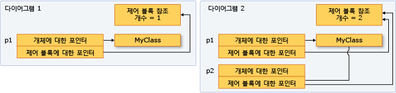

# 방법: shared_ptr 인스턴스 만들기 및 사용
`shared_ptr` 형식은 둘 이상의 소유자가 메모리에 있는 개체의 수명을 관리하는 시나리오를 위해 디자인된 C++ 표준 라이브러리의 스마트 포인터입니다. `shared_ptr`을 초기화한 후 복사, 함수 인수의 값으로 전달 및 다른 `shared_ptr` 인스턴스로 할당할 수 있습니다. 모든 인스턴스는 동일한 개체를 가리키고 새 `shared_ptr`이 추가되거나 범위를 벗어나거나 다시 설정될 때마다 하나의 "제어 블록"에 대한 액세스를 공유합니다. 참조 횟수가 0에 도달하면 메모리 리소스 및 제어 블록이 삭제됩니다.  
  
 다음 그림에서는 한 개의 메모리 위치를 가리키는 여러 `shared_ptr` 인스턴스를 보여 줍니다.  
  
   
  
## 예  
 가능 하면 사용 된 [make_shared](../standard-library/memory-functions.md#make_shared) 만드는 함수를 `shared_ptr` 메모리 리소스를 처음 만들어질 때. `make_shared`는 예외로부터 안전합니다. 동일한 호출을 사용하여 제어 블록 및 리소스에 대한 메모리를 할당하고 이를 통해 생성 오버헤드가 감소됩니다. `make_shared`를 사용하지 않는 경우 `shared_ptr` 생성자에 전달하기 전에 새 명시적 식을 사용하여 개체를 만들어야 합니다. 다음 예제에서는 새 개체와 함께 `shared_ptr`을 선언하고 초기화하는 다양한 방법을 보여 줍니다.  
  
 [!code-cpp[stl_smart_pointers#1](../cpp/codesnippet/CPP/how-to-create-and-use-shared-ptr-instances_1.cpp)]  
  
## 예  
 다음 예제에서는 이미 다른 `shared_ptr`로 할당된 개체의 소유권을 공유하는 `shared_ptr` 인스턴스를 선언하고 초기화하는 방법을 보여 줍니다. `sp2`가 초기화된 `shared_ptr`임을 가정하십시오.  
  
 [!code-cpp[stl_smart_pointers#2](../cpp/codesnippet/CPP/how-to-create-and-use-shared-ptr-instances_2.cpp)]  
  
## 예  
 `shared_ptr` 유용도 c + + 표준 라이브러리 컨테이너의 요소를 복사 하는 알고리즘을 사용 하는 경우입니다. `shared_ptr`에 요소를 래핑한 다음 내부 메모리가 필요할 때까지 유효하거나 더 이상 유효하지 않음을 인식하며 해당 요소를 다른 컨테이너에 복사할 수 있습니다. 다음 예제에서는 벡터의 `replace_copy_if` 인스턴스에서 `shared_ptr` 알고리즘을 사용하는 방법을 보여 줍니다.  
  
 [!code-cpp[stl_smart_pointers#4](../cpp/codesnippet/CPP/how-to-create-and-use-shared-ptr-instances_3.cpp)]  
  
## 예  
 `dynamic_pointer_cast`, `static_pointer_cast` 및 `const_pointer_cast`를 사용하여 `shared_ptr`을 캐스팅할 수 있습니다. 이러한 함수는 `dynamic_cast`, `static_cast` 및 `const_cast` 연산자와 비슷합니다. 다음 예제에서는 기본 클래스에서 `shared_ptr`의 벡터에 있는 각 요소의 파생 형식을 테스트한 다음 요소를 복사하고 이에 대한 정보를 표시하는 방법을 보여 줍니다.  
  
 [!code-cpp[stl_smart_pointers#5](../cpp/codesnippet/CPP/how-to-create-and-use-shared-ptr-instances_4.cpp)]  
  
## 예  
 `shared_ptr`을 다음과 같은 방법으로 다른 함수에 전달할 수 있습니다.  
  
-   `shared_ptr`을 값으로 전달합니다. 이 방법은 복사 생성자를 호출하고 참조 횟수를 늘리며 호출 수신자를 소유자로 변경합니다. 이 작업에는 적은 양의 오버헤드가 있으며 이는 상당 부분 전달하는 `shared_ptr` 개체 수에 따라 달라질 수 있습니다. 호출자와 호출 수신자 사이의 코드 계약(암시적 또는 명시적)이 호출 수신자가 소유자일 것을 요구하는 경우 이 옵션을 사용합니다.  
  
-   참조 또는 const 참조로 `shared_ptr`을 전달합니다. 이 경우 참조 횟수는 늘어나지 않고 호출 수신자는 호출자가 범위를 벗어나지 않는 한 포인터에 액세스할 수 있습니다. 또는 호출 수신자는 참조를 기반으로 `shared_ptr`을 만들고 이에 따라 공유 소유자가 됩니다. 호출자가 호출 수신자를 모르는 경우 또는 `shared_ptr`을 전달해야 하고 성능상의 이유로 복사 작업을 하지 않아야 할 경우 이 옵션을 사용합니다.  
  
-   내부 포인터 또는 내부 개체에 대한 참조를 전달합니다. 이를 통해 호출 수신자는 개체를 사용하지만 소유권을 공유하거나 수명을 연장할 수 없습니다. 호출 수신자가 원시 포인터에서 `shared_ptr`을 만드는 경우 새 `shared_ptr`은 원본에 독립적이고 내부 리소스를 제어하지 않습니다. 호출자와 호출 수신자 사이의 계약이 호출자가 `shared_ptr` 수명에 대한 소유권을 보유함을 명확하게 지정하는 경우 이 옵션을 사용하십시오.  
  
-   `shared_ptr`을 전달하는 방법을 결정할 때 호출 수신자가 내부 리소스의 소유권을 공유해야 하는지 여부를 확인합니다. "소유자"는 기본 리소스를 필요할 때까지 내부 리소스를 활성 상태로 유지할 수 있는 개체 또는 함수입니다. 호출 수신자가 포인터의 수명을 해당(함수의) 수명 이상으로 확장할 수 있음을 보장해야 하는 경우 첫 번째 옵션을 사용합니다. 호출 수신자의 수명 연장 여부를 고려하지 않는 경우 참조로 전달하고 호출 수신자는 이를 복사하거나 복사하지 않습니다.  
  
-   내부 포인터에 도우미 함수 액세스를 제공해야 하고 도우미 함수가 포인터를 사용하고 호출 함수가 반환되기 전에 반환하는 것을 알고 있는 경우 해당 함수는 내부 포인터의 소유권을 공유하지 않아야 합니다. 호출자의 `shared_ptr` 수명 내에 포인터에 액세스해야 합니다. 이러한 경우 참조로 `shared_ptr`을 전달하거나 원시 포인터 또는 참조를 내부 개체로 전달하는 것이 안전합니다. 이 방법으로 전달하면 약간의 성능 이점이 제공되고 프로그래밍 의도를 표시하는 데 유용할 수도 있습니다.  
  
-   경우에 따라 `std:vector<shared_ptr<T>>`의 예제에서 각 `shared_ptr`을 람다 식 본문 또는 명명된 함수 개체로 전달해야 할 수도 있습니다. 람다 또는 함수가 포인터를 저장하지 않는 경우 참조로 `shared_ptr`을 전달하여 각 요소에 대한 복사 생성자를 호출하지 않습니다.    
  
## 예  
 다음 예제에서는 `shared_ptr`이 `shared_ptr` 인스턴스가 소유하는 메모리의 포인터를 비교할 수 있도록 다양한 비교 연산자를 오버로드하는 방법을 보여 줍니다.  
  
 [!code-cpp[stl_smart_pointers#3](../cpp/codesnippet/CPP/how-to-create-and-use-shared-ptr-instances_6.cpp)]  
  
## 참고 항목  
 [스마트 포인터](../cpp/smart-pointers-modern-cpp.md)