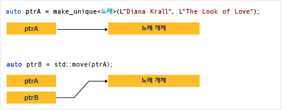

# 방법: unique_ptr 인스턴스 만들기 및 사용
A [unique_ptr](../standard-library/unique-ptr-class.md) 포인터를 공유 하지 않습니다. 다른 위치로 복사할 수 없습니다 `unique_ptr`, 함수 값으로 전달 또는 만들어지는 사본이 필요한 모든 c + + 표준 라이브러리 알고리즘에 사용 합니다. `unique_ptr`은 이동만 할 수 있습니다. 즉, 메모리 리소스의 소유권이 다른 `unique_ptr`로 이전되어 원래 `unique_ptr`이 더 이상 소유하지 않습니다. 소유권이 여러 개이면 프로그램 논리가 복잡해지기 때문에 개체를 하나의 소유자로 제한하는 것이 좋습니다. 따라서 일반 c + + 개체에 대 한 스마트 포인터를 할 때 사용 하 여 `unique_ptr`, 생성할 때와 `unique_ptr`를 사용 하 여는 [make_unique](../standard-library/memory-functions.md#make_unique) 도우미 함수입니다.  
  
 다음 다이어그램은 두 `unique_ptr` 인스턴스 사이의 소유권 이전을 보여 줍니다.  
  
   
  
 `unique_ptr` 에 정의 된 `<memory>` c + + 표준 라이브러리의 헤더입니다. 원시 포인터 만큼 효율적 정확 하 게 하 고 c + + 표준 라이브러리 컨테이너에서 사용할 수 있습니다. 추가 `unique_ptr` c + + 표준 라이브러리 컨테이너에는 인스턴스는 효율적이 때문에 이동 생성자의는 `unique_ptr` 복사 작업이 필요 하지 않습니다.  
  
## 예  
 다음 예제에서는 `unique_ptr` 인스턴스를 어떻게 만들고 이를 함수 사이에서 어떻게 전달하는지를 보여 줍니다.  
  
 [!code-cpp[stl_smart_pointers#210](../cpp/codesnippet/CPP/how-to-create-and-use-unique-ptr-instances_1.cpp)]  
  
 이러한 예는 `unique_ptr`의 기본적인 특징을 보여 주며 이동은 가능하지만 복사되지 않을 수 있습니다. "이동"이 소유권을 새 `unique_ptr`로 이전하고 이전 `unique_ptr`을 다시 설정합니다.  
  
## 예  
 다음 예제에서는 `unique_ptr` 인스턴스를 만들고 이를 벡터에 사용하는 방법을 보여 줍니다.  
  
 [!code-cpp[stl_smart_pointers#211](../cpp/codesnippet/CPP/how-to-create-and-use-unique-ptr-instances_2.cpp)]  
  
 루프 범위에서 `unique_ptr`이 참조로 전달됩니다. 여기에서 값으로 전달하려는 경우 `unique_ptr` 복사 생성자가 삭제되기 때문에 컴파일러는 오류를 throw합니다.  
  
## 예  
 다음 예제에서는 클래스 멤버인 `unique_ptr`을 초기화하는 방법을 보여 줍니다.  
  
 [!code-cpp[stl_smart_pointers#212](../cpp/codesnippet/CPP/how-to-create-and-use-unique-ptr-instances_3.cpp)]  
  
## 예  
 사용할 수 있습니다 [make_unique](../standard-library/memory-functions.md#make_unique) 만들려는 `unique_ptr` 를 배열에 있지만 사용할 수 없습니다 `make_unique` 배열 요소를 초기화 합니다.  
  
 [!code-cpp[stl_smart_pointers#213](../cpp/codesnippet/CPP/how-to-create-and-use-unique-ptr-instances_4.cpp)]  
  
 더 많은 예제를 참조 하십시오. [make_unique](../standard-library/memory-functions.md#make_unique)합니다.  
  
## 참고 항목  
 [스마트 포인터](../cpp/smart-pointers-modern-cpp.md)   
 [make_unique](../standard-library/memory-functions.md#make_unique)
