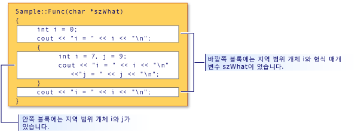

# <a name="scope-c"></a>범위 (C++)

클래스, 함수 또는 변수 같은 프로그램 요소를 선언 하면 해당 이름 "표시" 및 프로그램의 특정 부분에 사용 되는 수 있습니다. 이름이 표시 되는 컨텍스트 라고 해당 *범위*합니다. 예를 들어, 변수를 선언 하는 경우 `x` 함수 안의 `x` 에 해당 함수 본문 내에서 표시 됩니다. 있기 *로컬 범위*합니다. 프로그램;에서 같은 이름의 다른 변수를 가질 수 있습니다. 다양 한 범위에서 서로으로 단일 정의 규칙을 위반 하지 않는 및 오류가 발생 하지 합니다.

자동 static이 아닌 변수에 범위 만들어지고 프로그램 메모리에서 제거 하는 경우에 결정 합니다. 

범위는 다음과 같은 6 개의 종류가 있습니다.

- **전역 범위** 전역 이름은 네임 스페이스는 클래스, 함수 또는 외부에서 선언 된 하나입니다. 그러나 c + +에서 암시적 전역 네임 스페이스와도 이러한 이름은 존재합니다. 글로벌 이름의 범위 선언 지점부터 선언 된 파일의 끝까지 확장 됩니다. 전역 이름, 표시 유형도의 규칙에 의해 제어 됩니다 [링크](program-and-linkage-cpp.md) 프로그램에서 다른 파일의 이름이 표시 되는지 여부를 결정 합니다.

- **Namespace 범위** 내에서 선언 하는 이름을 [네임 스페이스](namespaces-cpp.md), 모든 클래스 또는 열거형 정의 또는 함수 블록 외부에서 선언 된 지점에서 네임 스페이스의 끝에 표시 됩니다. 다른 파일에 걸쳐 여러 블록에는 네임 스페이스를 정의할 수 있습니다.

- **로컬 범위** 매개 변수 이름을 포함 하 여 람다 또는 함수 내에서 선언 된 이름은 지역 범위를 갖습니다. 이러한는 "지역" 라고도 합니다. 만 선언 지점에서 람다 또는 함수 본문의 끝에 표시 됩니다. 로컬 범위는이 문서의 뒷부분에 설명 하는 블록 범위 종류입니다.

- **클래스 범위** 클래스 멤버의 이름 전체 선언 시점에 상관 없이 클래스 정의에서 확장 하는 클래스 범위가 포함 됩니다. 클래스 멤버 액세스 가능성은에 의해 제어를 추가로 **공용**, **개인**, 및 **보호** 키워드입니다. 멤버 선택 연산자를 사용 하 여 public 또는 protected 멤버를 액세스할 수 있습니다 (**합니다.** 또는 **->**) 또는 멤버 포인터 연산자 (**.\***  또는 **-> \***).

- **문 범위** 에 선언 된 이름은 한 **에 대 한**, **경우**, **동안**, 또는 **전환** 문이 끝날 때까지 표시 됩니다.는 문 블록입니다.

- **함수 범위** A [레이블](labeled-statements.md) 는 함수 범위가 선언 지점 전에 함수 본문 전체에서 볼 것을 의미 합니다. 함수 범위를 사용 하면 같은 문에 작성할 수 `goto cleanup` 하기 전에 `cleanup` 레이블이 선언 됩니다.

## <a name="hiding-names"></a>이름 숨기기

이름을 포함된 블록에서 선언하여 숨길 수 있습니다. 다음 그림에서는 `i`가 내부 블록 안에서 다시 선언되므로 바깥쪽 블록 범위에서 `i`와 연결된 변수가 숨겨집니다.

  블록 범위 및 이름 숨기기

 그림에 표시된 프로그램의 출력은 다음과 같습니다.

```cpp
i = 0
i = 7
j = 9
i = 0
```

> [!NOTE]
> `szWhat` 인수는 함수 범위에 있는 것으로 간주되므로 함수의 가장 바깥쪽 블록에서 선언된 것처럼 취급됩니다.

## <a name="hiding-class-names"></a>클래스 이름 숨기기

 함수, 개체, 변수 또는 열거자를 동일한 코드에서 선언하여 클래스 이름을 숨길 수 있습니다. 그러나 클래스 이름에 액세스할 수 있습니다 키워드가 접두사로 붙는 경우 **클래스**합니다.

```cpp
// hiding_class_names.cpp
// compile with: /EHsc
#include <iostream>
using namespace std;

// Declare class Account at global scope.
class Account
{
public:
    Account( double InitialBalance )
        { balance = InitialBalance; }
    double GetBalance()
        { return balance; }
private:
    double balance;
};

double Account = 15.37;            // Hides class name Account

int main()
{
    class Account Checking( Account ); // Qualifies Account as 
                                       //  class name

    cout << "Opening account with balance of: "
         << Checking.GetBalance() << "\n";
}
//Output: Opening account with balance of: 15.37
```

> [!NOTE]
> 모든 위치에서 클래스 이름 (`Account`)이 호출 되는 전역 범위 변수 Account와 구별 하기 위해 class 키워드를 사용 해야 합니다. 이 규칙은 범위 결정 연산자(::)의 왼쪽에 클래스 이름이 나타나는 경우에는 적용되지 않습니다. 범위 결정 연산자의 왼쪽에 있는 이름은 항상 클래스 이름으로 간주됩니다.

 다음 예제에서는 형식의 개체에 대 한 포인터를 선언 하는 방법을 `Account` 를 사용 하 여 **클래스** 키워드:

```cpp
class Account *Checking = new class Account( Account );
```

 `Account` 앞의 문에서 괄호 안에 이니셜라이저에 전역 범위에; 유형은 **double**합니다.

> [!NOTE]
> 이 예제와 같이 식별자 이름을 다시 사용하는 것은 좋지 않은 프로그래밍 스타일로 간주됩니다.

 포인터에 대 한 자세한 내용은 참조 [파생 형식](http://msdn.microsoft.com/en-us/aa14183c-02fe-4d81-95fe-beddb0c01c7c)합니다. 클래스 개체의 선언 및 초기화에 대 한 정보를 참조 하십시오. [클래스, 구조체 및 공용 구조체](../cpp/classes-and-structs-cpp.md)합니다. 사용 하는 방법에 대 한 내용은 **새** 및 **삭제** 가능한 저장소 연산자, 참조 [새 및 delete 연산자](new-and-delete-operators.md)합니다.

## <a name="hiding-names-with-global-scope"></a>전역 범위에 있는 이름 숨기기

 블록 범위에 같은 이름을 명시적으로 선언 하 여 전역 범위와 함께 이름을 숨길 수 있습니다. 그러나 전역 범위 이름 수에 액세스할 수 범위 결정 연산자를 사용 하 여 (`::`).

```cpp
#include <iostream>

int i = 7;   // i has global scope, outside all blocks
using namespace std;

int main( int argc, char *argv[] ) {
   int i = 5;   // i has block scope, hides i at global scope
   cout << "Block-scoped i has the value: " << i << "\n";
   cout << "Global-scoped i has the value: " << ::i << "\n";
}
```

```Output
Block-scoped i has the value: 5
Global-scoped i has the value: 7
```

## <a name="see-also"></a>참고 항목

 [기본 개념](../cpp/basic-concepts-cpp.md)