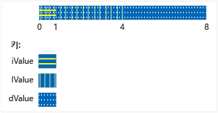

# <a name="unions"></a>Unions
`union`은 모든 멤버가 동일한 메모리 위치를 공유하는 사용자 정의 형식입니다. 즉, 지정된 시간에 공용 구조체에는 멤버 목록의 개체가 둘 이상 포함될 수 없습니다. 또한 공용 구조체의 멤버 수에 관계없이 항상 가장 큰 멤버를 저장할 수 있을 만큼 충분한 메모리를 사용해야 합니다.  
  
 공용 구조체는 개체는 많고 메모리는 제한된 경우 메모리를 보존하는 데 유용할 수 있습니다. 그러나 언제든지 기록된 마지막 멤버에 액세스할 수 있도록 해야 하므로 특별히 주의하여 올바르게 사용해야 합니다. 멤버 형식에 특수한 생성자가 있으면 추가 코드를 작성하여 해당 멤버를 명시적으로 생성하고 삭제해야 합니다. 공용 구조체를 사용하기 전에 해결하려는 문제가 기본 클래스와 파생 클래스 중 어떤 클래스를 사용하여 더 잘 표현할 수 있는지를 고려해야 합니다.  
  
## <a name="syntax"></a>구문  
  
```cpp  
union [name]  { member-list };  
```  
  
#### <a name="parameters"></a>매개 변수  
 `name`  
 공용 구조체에 지정된 형식 이름입니다.  
  
 `member-list`  
 공용 구조체에 포함할 수 있는 멤버입니다. 설명 부분을 참조하세요.  
  
## <a name="remarks"></a>설명  
  
## <a name="declaring-a-union"></a>공용 구조체 선언  
 `union` 키워드를 사용하여 공용 구조체의 선언을 시작하고 중괄호로 멤버 목록을 묶습니다.  
  
```cpp  
// declaring_a_union.cpp  
union RecordType    // Declare a simple union type  
{  
    char   ch;  
    int    i;  
    long   l;  
    float  f;  
    double d;  
    int *int_ptr;  
};   
int main()  
{  
    RecordType t;  
    t.i = 5; // t holds an int  
    t.f = 7.25 // t now holds a float   
}  
```  
  
## <a name="using-unions"></a>공용 구조체 사용  
 이전 예제에서 공용 구조체에 액세스하는 코드는 데이터를 보유하고 있는 멤버를 알고 있어야 합니다. 이 문제의 가장 일반적인 솔루션은 현재 공용 구조체에 저장되는 데이터의 형식을 나타내는 추가 열거형 멤버와 함께 구조체의 용 구조체를 묶는 것입니다. 이 라고는 *구분 된 공용 구조체* 다음 예제에서는 기본 패턴을 보여 줍니다.  
  
```cpp  
#include "stdafx.h"  
#include <queue>  
  
using namespace std;  
  
enum class WeatherDataType  
{  
    Temperature, Wind  
};  
  
struct TempData  
{  
    int StationId;  
    time_t time;  
    double current;  
    double max;  
    double min;  
};  
  
struct WindData  
{  
    int StationId;  
    time_t time;  
    int speed;  
    short direction;  
};  
  
struct Input  
{  
    WeatherDataType type;  
    union  
    {  
        TempData temp;  
        WindData wind;  
    };  
};  
  
// Functions that are specific to data types  
void Process_Temp(TempData t) {}  
void Process_Wind(WindData w) {}  
  
// Container for all the data records  
queue<Input> inputs;  
void Initialize();  
  
int main(int argc, char* argv[])  
{  
    Initialize();  
    while (!inputs.empty())  
    {  
        Input i = inputs.front();  
        switch (i.type)  
        {  
        case WeatherDataType::Temperature:  
            Process_Temp(i.temp);  
            break;  
        case WeatherDataType::Wind:  
            Process_Wind(i.wind);  
            break;  
        default:  
            break;  
        }  
        inputs.pop();  
  
    }  
    return 0;  
}  
  
void Initialize()  
{  
    Input first, second;  
    first.type = WeatherDataType::Temperature;  
    first.temp = { 101, 1418855664, 91.8, 108.5, 67.2 };  
    inputs.push(first);  
  
    second.type = WeatherDataType::Wind;  
    second.wind = { 204,1418859354, 14, 27 };  
    inputs.push(second);  
}  
  
```  
  
 이전 예제에서는 입력 구조체의 공용 구조체에 이름이 없습니다. 이는 익명 공용 구조체이며 해당 멤버는 구조체의 직접 멤버인 것처럼 액세스할 수 있습니다. 익명 공용 구조체에 대한 자세한 내용은 아래 섹션을 참조하세요.  
  
 물론 이전 예제에서는 공통 기본 클래스에서 파생되는 클래스를 사용하고 컨테이너에 있는 각 개체의 런타임 형식에 기반하여 코드를 분기함으로써 해결할 수 있는 문제를 보여 줍니다. 따라서 코드를 더 쉽게 유지 관리하고 이해할 수 있지만 공용 구조체를 사용하는 경우보다 느릴 수도 있습니다. 또한 공용 구조체를 사용하면 전혀 관련이 없는 형식을 저장하고, 공용 구조체 변수 자체의 형식을 변경하지 않고도 저장된 값의 형식을 동적으로 변경할 수 있습니다. 따라서 요소가 서로 다른 형식의 다양한 값을 저장하는 MyUnionType의 유형이 다른 배열을 만들 수 있습니다.  
  
 이전 예제의 `Input` 구조체는 쉽게 악용될 수 있습니다. 데이터를 보유하는 멤버에 액세스하는 판별자를 올바르게 사용하는 것은 전적으로 사용자의 책임입니다. 다음 예제에 표시된 대로 공용 구조체를 private로 설정하고 특별한 액세스 함수를 제공하면 악용으로부터 보호할 수 있습니다.  
  
## <a name="unrestricted-unions-c11"></a>무제한 공용 구조체(C++11)  
 C++03 이전 버전에서는 형식에 사용자가 제공한 생성자, 소멸자 또는 할당 연산자가 없는 한 클래스 형식과 함께 비정적 데이터 멤버를 공용 구조체에 포함할 수 있습니다. C++ 11에서는 이러한 제한이 제거됩니다. 이러한 멤버를 공용 구조체에 포함하면 컴파일러는 사용자가 제공하지 않은 특수 멤버 함수를 삭제된 것으로 자동으로 표시합니다. 공용 구조체가 클래스 또는 구조체 내부에서 익명 공용 구조체인 경우 사용자가 제공하지 않은 클래스 또는 구조체의 특수 멤버 함수는 삭제된 것으로 표시됩니다. 다음 예제에서는 공용 구조체의 멤버 중 하나에 이러한 특별한 처리가 필요한 멤버가 있는 경우를 처리하는 방법을 보여 줍니다.  
  
```cpp  
// for MyVariant  
#include <crtdbg.h>  
#include <new>  
#include <utility>  
  
// for sample objects and output  
#include <string>  
#include <vector>  
#include <iostream>  
  
using namespace std;  
  
struct A   
{  
    A() = default;  
    A(int i, const string& str) : num(i), name(str) {}  
  
    int num;  
    string name;  
    //...  
};  
  
struct B   
{  
    B() = default;  
    B(int i, const string& str) : num(i), name(str) {}  
  
    int num;  
    string name;  
    vector<int> vec;  
    // ...  
};  
  
enum class Kind { None, A, B, Integer };  
  
#pragma warning (push)  
#pragma warning(disable:4624)  
class MyVariant  
{  
public:  
    MyVariant()  
        : kind_(Kind::None)  
    {  
    }  
  
    MyVariant(Kind kind)  
        : kind_(kind)  
    {  
        switch (kind_)  
        {  
        case Kind::None:  
            break;  
        case Kind::A:  
            new (&a_) A();  
            break;  
        case Kind::B:  
            new (&b_) B();  
            break;  
        case Kind::Integer:  
            i_ = 0;  
            break;  
        default:  
            _ASSERT(false);  
            break;  
        }  
    }  
  
    ~MyVariant()  
    {  
        switch (kind_)  
        {  
        case Kind::None:  
            break;  
        case Kind::A:  
            a_.~A();  
            break;  
        case Kind::B:  
            b_.~B();  
            break;  
        case Kind::Integer:  
            break;  
        default:  
            _ASSERT(false);  
            break;  
        }  
        kind_ = Kind::None;  
    }  
  
    MyVariant(const MyVariant& other)  
        : kind_(other.kind_)  
    {  
        switch (kind_)  
        {  
        case Kind::None:  
            break;  
        case Kind::A:  
            new (&a_) A(other.a_);  
            break;  
        case Kind::B:  
            new (&b_) B(other.b_);  
            break;  
        case Kind::Integer:  
            i_ = other.i_;  
            break;  
        default:  
            _ASSERT(false);  
            break;  
        }  
    }  
  
    MyVariant(MyVariant&& other)  
        : kind_(other.kind_)  
    {  
        switch (kind_)  
        {  
        case Kind::None:  
            break;  
        case Kind::A:  
            new (&a_) A(move(other.a_));  
            break;  
        case Kind::B:  
            new (&b_) B(move(other.b_));  
            break;  
        case Kind::Integer:  
            i_ = other.i_;  
            break;  
        default:  
            _ASSERT(false);  
            break;  
        }  
        other.kind_ = Kind::None;  
    }  
  
    MyVariant& operator=(const MyVariant& other)  
    {  
        if (&other != this)  
        {  
            switch (other.kind_)  
            {  
            case Kind::None:  
                this->~MyVariant();  
                break;  
            case Kind::A:  
                *this = other.a_;  
                break;  
            case Kind::B:  
                *this = other.b_;  
                break;  
            case Kind::Integer:  
                *this = other.i_;  
                break;  
            default:  
                _ASSERT(false);  
                break;  
            }  
        }  
        return *this;  
    }  
  
    MyVariant& operator=(MyVariant&& other)  
    {  
        _ASSERT(this != &other);  
        switch (other.kind_)  
        {  
        case Kind::None:  
            this->~MyVariant();  
            break;  
        case Kind::A:  
            *this = move(other.a_);  
            break;  
        case Kind::B:  
            *this = move(other.b_);  
            break;  
        case Kind::Integer:  
            *this = other.i_;  
            break;  
        default:  
            _ASSERT(false);  
            break;  
        }  
        other.kind_ = Kind::None;  
        return *this;  
    }  
  
    MyVariant(const A& a)  
        : kind_(Kind::A), a_(a)  
    {  
    }  
  
    MyVariant(A&& a)  
        : kind_(Kind::A), a_(move(a))  
    {  
    }  
  
    MyVariant& operator=(const A& a)  
    {  
        if (kind_ != Kind::A)  
        {  
            this->~MyVariant();  
            new (this) MyVariant(a);  
        }  
        else  
        {  
            a_ = a;  
        }  
        return *this;  
    }  
  
    MyVariant& operator=(A&& a)  
    {  
        if (kind_ != Kind::A)  
        {  
            this->~MyVariant();  
            new (this) MyVariant(move(a));  
        }  
        else  
        {  
            a_ = move(a);  
        }  
        return *this;  
    }  
  
    MyVariant(const B& b)  
        : kind_(Kind::B), b_(b)  
    {  
    }  
  
    MyVariant(B&& b)  
        : kind_(Kind::B), b_(move(b))  
    {  
    }  
  
    MyVariant& operator=(const B& b)  
    {  
        if (kind_ != Kind::B)  
        {  
            this->~MyVariant();  
            new (this) MyVariant(b);  
        }  
        else  
        {  
            b_ = b;  
        }  
        return *this;  
    }  
  
    MyVariant& operator=(B&& b)  
    {  
        if (kind_ != Kind::B)  
        {  
            this->~MyVariant();  
            new (this) MyVariant(move(b));  
        }  
        else  
        {  
            b_ = move(b);  
        }  
        return *this;  
    }  
  
    MyVariant(int i)  
        : kind_(Kind::Integer), i_(i)  
    {  
    }  
  
    MyVariant& operator=(int i)  
    {  
        if (kind_ != Kind::Integer)  
        {  
            this->~MyVariant();  
            new (this) MyVariant(i);  
        }  
        else  
        {  
            i_ = i;  
        }  
        return *this;  
    }  
  
    Kind GetKind() const  
    {  
        return kind_;  
    }  
  
    A& GetA()  
    {  
        _ASSERT(kind_ == Kind::A);  
        return a_;  
    }  
  
    const A& GetA() const  
    {  
        _ASSERT(kind_ == Kind::A);  
        return a_;  
    }  
  
    B& GetB()  
    {  
        _ASSERT(kind_ == Kind::B);  
        return b_;  
    }  
  
    const B& GetB() const  
    {  
        _ASSERT(kind_ == Kind::B);  
        return b_;  
    }  
  
    int& GetInteger()  
    {  
        _ASSERT(kind_ == Kind::Integer);  
        return i_;  
    }  
  
    const int& GetInteger() const  
    {  
        _ASSERT(kind_ == Kind::Integer);  
        return i_;  
    }  
  
private:  
    Kind kind_;  
    union  
    {  
        A a_;  
        B b_;  
        int i_;  
    };  
};  
#pragma warning (pop)  
  
int main()  
{  
    A a(1, "Hello from A");  
    B b(2, "Hello from B");  
  
    MyVariant mv_1 = a;  
  
    cout << "mv_1 = a: " << mv_1.GetA().name << endl;  
    mv_1 = b;  
    cout << "mv_1 = b: " << mv_1.GetB().name << endl;  
    mv_1 = A(3, "hello again from A");  
    cout << R"aaa(mv_1 = A(3, "hello again from A"): )aaa" << mv_1.GetA().name << endl;  
    mv_1 = 42;  
    cout << "mv_1 = 42: " << mv_1.GetInteger() << endl;  
  
    b.vec = { 10,20,30,40,50 };  
  
    mv_1 = move(b);  
    cout << "After move, mv_1 = b: vec.size = " << mv_1.GetB().vec.size() << endl;  
  
    cout << endl << "Press a letter" << endl;  
    char c;  
    cin >> c;  
}  
#include <queue>  
#include <iostream>  
using namespace std;  
  
enum class WeatherDataType  
{  
    Temperature, Wind  
};  
  
struct TempData  
{  
    TempData() : StationId(""), time(0), current(0), maxTemp(0), minTemp(0) {}  
    TempData(string id, time_t t, double cur, double max, double min)  
        : StationId(id), time(t), current(cur), maxTemp(max), minTemp(0) {}  
    string StationId;  
    time_t time = 0;  
    double current;  
    double maxTemp;  
    double minTemp;  
};  
  
struct WindData  
{  
    int StationId;  
    time_t time;  
    int speed;  
    short direction;  
};  
  
struct Input  
{  
    Input() {}  
    Input(const Input&) {}  
  
    ~Input()  
    {  
        if (type == WeatherDataType::Temperature)  
        {  
            temp.StationId.~string();  
        }  
    }  
  
    WeatherDataType type;  
    void SetTemp(const TempData& td)  
    {  
        type = WeatherDataType::Temperature;  
  
        // must use placement new because of string member!  
        new(&temp) TempData(td);  
    }  
  
    TempData GetTemp()  
    {  
        if (type == WeatherDataType::Temperature)  
            return temp;  
        else  
            throw logic_error("Can't return TempData when Input holds a WindData");  
    }  
    void SetWind(WindData wd)  
    {  
        // Explicitly delete struct member that has a   
        // non-trivial constructor  
        if (type == WeatherDataType::Temperature)  
        {  
            temp.StationId.~string();  
        }  
        wind = wd; //placement new not required.  
    }  
    WindData GetWind()  
    {  
        if (type == WeatherDataType::Wind)  
        {  
            return wind;  
        }  
        else  
            throw logic_error("Can't return WindData when Input holds a TempData");  
    }  
  
private:  
  
    union  
    {  
        TempData temp;  
        WindData wind;  
    };  
};  
  
```  
  
 공용 구조체는 참조를 저장할 수 없습니다. 공용 구조체는 상속을 지원하지 않습니다. 따라서 공용 구조체 자체를 기본 클래스로 사용하거나, 다른 클래스에서 상속하거나, 가상 함수를 가질 수 없습니다.  
  
## <a name="initializing-unions"></a>공용 구조체 초기화  
 중괄호 안에 식을 배치하여 동일한 문에서 공용 구조체를 선언하고 초기화할 수 있습니다. 식이 확인되면 공용 구조체의 첫 번째 필드에 할당됩니다.  
  
```cpp  
#include <iostream>  
using namespace std;  
  
union NumericType  
{  
    short       iValue;  
    long        lValue;    
    double      dValue;    
};  
  
int main()  
{  
    union NumericType Values = { 10 };   // iValue = 10  
    cout << Values.iValue << endl;  
    Values.dValue = 3.1416;  
    cout << Values.dValue) << endl;  
}  
/* Output:  
 10  
 3.141600  
*/  
  
```  
  
 `NumericType` 공용 구조체는 다음 그림과 같이 개념적으로 메모리에 배열됩니다.  
  
   
NumericType 공용 구조체에 데이터 저장  
  
## <a name="anonymous_unions"></a> 익명 공용 구조체  
 익명 공용 구조체는 없이 선언 된 공용 구조체는 *클래스 이름* 또는 *선언 자 목록*합니다.  
  
```cpp  
union  {  member-list  }    
```  
  
익명 공용 구조체에 선언된 이름은 비멤버 변수처럼 직접 사용됩니다. 따라서 익명 공용 구조체에 선언된 이름은 주변 범위에서 고유해야 합니다.  
  
명명 된 공용 구조체에 대 한 제한 사항 외에도 익명 공용 구조체 추가 제한 사항이 적용 됩니다.  
  
-   으로 선언 해야 **정적** 파일 또는 네임 스페이스 범위에서 선언 된 경우.  
  
-   익명 공용 구조체에는 공용 멤버만 포함할 수 있으며 전용 및 보호된 멤버를 포함하면 오류가 생성됩니다.  
  
-   멤버 함수를 사용할 수 없습니다.  
  
## <a name="see-also"></a>참고 항목  
 [클래스 및 구조체](../cpp/classes-and-structs-cpp.md)   
 [키워드](../cpp/keywords-cpp.md)   
 [class](../cpp/class-cpp.md)   
 [struct](../cpp/struct-cpp.md)