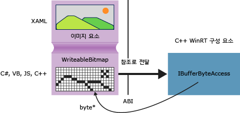

# <a name="obtaining-pointers-to-data-buffers-ccx"></a>데이터 버퍼에 대한 포인터 얻기(C++/CX)
Windows 런타임에서 [Windows::Storage::Streams::IBuffer](http://msdn.microsoft.com/library/windows/apps/windows.storage.streams.ibuffer.aspx) 인터페이스는 데이터 버퍼에 액세스할 수 있는 언어 중립적인 스트림 기반 방법을 제공합니다. C++에서는 robuffer.h에 정의되어 있는 Windows 런타임 라이브러리 IBufferByteAccess 인터페이스를 사용하여 내부 바이트 배열에 대한 원시 포인터를 가져올 수 있습니다. 이 방법을 사용하여 데이터의 불필요한 복사본을 만들지 않고 바이트 배열을 내부에서 수정할 수 있습니다.  
  
 다음 다이어그램에서는 원본이 [Windows::UI::Xaml::Media::Imaging WriteableBitmap](http://msdn.microsoft.com/%20library/windows/apps/windows.ui.xaml.media.imaging.writeablebitmap.aspx)인 XAML 이미지 요소를 보여 줍니다. 임의의 언어로 작성된 클라이언트 앱은 `WriteableBitmap` 에 대한 참조를 C++ 코드에 전달할 수 있으며, 그러면 C++는 내부 버퍼에서 가져올 참조를 사용할 수 있습니다. C + +로 작성 하는 유니버설 Windows 플랫폼 앱에서 Windows 런타임 구성 요소에 패키징하지 않고 소스 코드에서 직접 다음 예제의 함수를 사용할 수 있습니다.  
  
   
  
## <a name="getpointertopixeldata"></a>GetPointerToPixelData  
 다음 메서드는 [Windows::Storage::Streams::IBuffer](http://msdn.microsoft.com/library/windows/apps/windows.storage.streams.ibuffer.aspx) 를 받아들이고 내부 바이트 배열에 대한 원시 포인터를 반환합니다. 함수를 호출하려면 [WriteableBitmap::PixelBuffer](http://msdn.microsoft.com/library/windows/apps/windows.ui.xaml.media.imaging.writeablebitmap.pixelbuffer.aspx) 속성을 전달합니다.  
  
```  
  
#include <wrl.h>  
#include <robuffer.h>  
using namespace Windows::Storage::Streams;  
using namespace Microsoft::WRL;  
typedef uint8 byte;  
// Retrieves the raw pixel data from the provided IBuffer object.  
// Warning: The lifetime of the returned buffer is controlled by  
// the lifetime of the buffer object that's passed to this method.  
// When the buffer has been released, the pointer becomes invalid  
// and must not be used.  
byte* Class1::GetPointerToPixelData(IBuffer^ pixelBuffer, unsigned int *length)  
{  
    if (length != nullptr)  
    {  
        *length = pixelBuffer ->Length;  
    }  
    // Query the IBufferByteAccess interface.  
    ComPtr<IBufferByteAccess> bufferByteAccess;  
    reinterpret_cast<IInspectable*>( pixelBuffer)->QueryInterface(IID_PPV_ARGS(&bufferByteAccess));  
  
    // Retrieve the buffer data.  
    byte* pixels = nullptr;  
    bufferByteAccess->Buffer(&pixels);  
    return pixels;  
}  
```  
  
## <a name="complete-example"></a>완성된 예제  
 다음 단계를 전달 하는 C# 유니버설 Windows 플랫폼 앱을 만드는 방법을 보여는 `WriteableBitmap` c + + Windows 런타임 구성 요소 DLL에 있습니다. C++ 코드는 픽셀 버퍼에 대한 포인터를 가져오고 이미지에 대한 간단한 내부 수정을 수행합니다. 또는 C# 대신 Visual Basic, JavaScript 또는 C++에서 클라이언트 앱을 만들 수 있습니다. C++를 사용하는 경우에는 구성 요소 DLL이 필요하지 않습니다. MainPage 클래스 또는 정의한 다른 클래스에 이 메서드를 직접 추가하면 됩니다.  
  
#### <a name="create-the-client"></a>클라이언트 만들기  
  
1.  C# 유니버설 Windows 플랫폼 앱을 만들려면 새 응용 프로그램 프로젝트 템플릿을 사용 합니다.  
  
2.  MainPage.xaml에서  
  
    -   이 XAML을 사용하여 `Grid` 요소를 바꿉니다.  
  
        ```cpp  
        <Grid Background="{StaticResource ApplicationPageBackgroundThemeBrush}">  
                <StackPanel HorizontalAlignment="Left" Margin="176,110,0,0" VerticalAlignment="Top" Width="932">  
                    <Image x:Name="Pic"/>  
                    <Button Content="Process Image" HorizontalAlignment="Stretch" VerticalAlignment="Stretch" Height="47" Click="Button_Click_1"/>  
                </StackPanel>  
            </Grid>  
        ```  
  
3.  MainPage.xaml.cs에서  
  
    1.  이 네임스페이스 선언을 추가합니다.  
  
        ```  
        using Windows.Storage;  
        using Windows.Storage.FileProperties;  
        using Windows.UI.Xaml.Media.Imaging;  
        using Windows.Storage.Streams;  
        using Windows.Storage.Pickers;  
        ```  
  
    2.  `WriteableBitmap` 멤버 변수를 `MainPage` 클래스에 추가하고 이름을 `m_bm`으로 지정합니다.  
  
        ```  
        private WriteableBitmap m_bm;  
        ```  
  
    3.  다음 코드를 사용하여 `OnNavigatedTo` 메서드 스텁을 바꿉니다. 그러면 앱이 시작될 때 파일 선택기가 열립니다. `async` 키워드가 함수 시그니처에 추가됩니다.  
  
        ```c#  
        async protected override void OnNavigatedTo(NavigationEventArgs e)  
                {  
                    FileOpenPicker openPicker = new FileOpenPicker();  
                    openPicker.ViewMode = PickerViewMode.Thumbnail;  
                    openPicker.SuggestedStartLocation = PickerLocationId.PicturesLibrary;  
                    openPicker.FileTypeFilter.Add(".jpg");  
                    openPicker.FileTypeFilter.Add(".jpeg");  
                    openPicker.FileTypeFilter.Add(".png");  
  
                    StorageFile file = await openPicker.PickSingleFileAsync();  
                    if (file != null)  
                    {  
                        // Get the size of the image for the WriteableBitmap constructor.  
                        ImageProperties props = await file.Properties.GetImagePropertiesAsync();  
                        m_bm = new WriteableBitmap((int)props.Height, (int)props.Width);  
                        m_bm.SetSource(await file.OpenReadAsync());  
                        Pic.Source = m_bm;  
                    }  
                    else  
                    {  
                      //  Handle error...  
                    }  
                }  
        ```  
  
    4.  단추 클릭에 대한 이벤트 처리기를 추가합니다. `ImageManipCPP` 네임스페이스 참조는 아직 만들어지지 않았으므로 편집 창에서 해당 참조 아래에 물결선이 표시될 수 있습니다.  
  
        ```  
        async private void Button_Click_1(object sender, RoutedEventArgs e)  
                {  
                    ImageManipCPP.Class1 obj = new ImageManipCPP.Class1();  
                    await obj.Negativize(m_bm);  
                    Pic.Source = m_bm;  
                }  
        ```  
  
#### <a name="create-the-c-component"></a>C++ 구성 요소 만들기  
  
1.  기존 솔루션에 새 c + + Windows 런타임 구성 요소를 추가 하 고 이름을 `ImageManipCPP`합니다. **솔루션 탐색기** 에서 해당 프로젝트를 마우스 오른쪽 단추로 클릭하고 **추가**, **참조**를 선택하여 C# 프로젝트에 해당 구성 요소에 대한 참조를 추가합니다.  
  
2.  Class1.h에서  
  
    1.  이 `typedef` 를 두 번째 줄, `#pragma once`바로 뒤에 추가합니다.  
  
        ```  
        typedef uint8 byte;  
  
        ```  
  
    2.  `WebHostHidden` 특성을 `Class1` 선언의 시작 부분 바로 위에 추가합니다.  
  
        ```  
        [Windows::Foundation::Metadata::WebHostHidden]  
        ```  
  
    3.  이 공용 메서드 시그니처를 `Class1`에 추가합니다.  
  
        ```  
        Windows::Foundation::IAsyncAction^ Negativize(Windows::UI::Xaml::Media::Imaging::WriteableBitmap^ bm);  
        ```  
  
    4.  이전 코드 조각에 표시된 `GetPointerToPixelData` 메서드의 시그니처를 추가합니다. 이 메서드가 전용 메서드인지 확인합니다.  
  
3.  Class1.cpp에서  
  
    1.  이러한 `#include` 지시문 및 네임스페이스 선언을 추가합니다.  
  
        ```  
  
        #include <ppltasks.h>  
        #include <wrl.h>  
        #include <robuffer.h>  
  
        using namespace Windows::Storage;  
        using namespace Windows::UI::Xaml::Media::Imaging;  
        using namespace Windows::Storage::Streams;  
        using namespace Microsoft::WRL;  
  
        ```  
  
    2.  이전 코드 조각의 `GetPointerToPixelData` 구현을 추가합니다.  
  
    3.  `Negativize`구현을 추가합니다. 이 메서드는 각 RGB 값(픽셀 단위)을 반전시켜 네거티브 필름과 비슷한 효과를 만듭니다. 이미지가 클 경우 이 작업을 완료하는 데 시간이 오래 걸릴 수 있으므로 메서드를 비동기적으로 만듭니다.  
  
        ```  
        IAsyncAction^ Class1::Negativize(WriteableBitmap^ bm)  
        {  
            unsigned int length;  
            byte* sourcePixels = GetPointerToPixelData(bm->PixelBuffer, &length);  
            const unsigned int width = bm->PixelWidth;  
            const unsigned int height = bm->PixelHeight;  
  
            return create_async([this, width, height, sourcePixels]  
            {          
                byte* temp = sourcePixels;  
                for(unsigned int k = 0; k < height; k++)  
                {          
                    for (unsigned int i = 0; i < (width * 4); i += 4)  
                    {  
                        int pos = k * (width * 4) + (i);  
                        temp[pos] = ~temp[pos];  
                        temp[pos + 1] = ~temp[pos + 1] / 3;  
                        temp[pos + 2] = ~temp[pos + 2] / 2;  
                        temp[pos + 3] = ~temp[pos + 3];  
                    }  
                }  
            });  
  
        }  
        ```  
  
        > [!NOTE]
        >  AMP 또는 병렬 패턴 라이브러리를 사용하여 병렬화하면 이 메서드가 빨리 실행될 수 있습니다.  
  
4.  그림 폴더에 그림이 하나 이상 있는지 확인한 다음 F5 키를 눌러 프로그램을 컴파일하고 실행합니다.