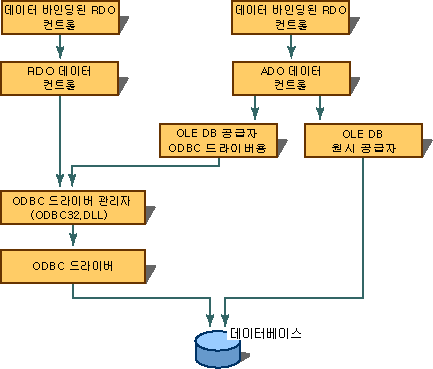

# 데이터베이스 연결 만들기
[!INCLUDE[vs2017banner](../../assembler/inline/includes/vs2017banner.md)]

데이터 바인딩을 사용하려면 데이터 소스를 구성해야 합니다.  ADO 데이터 컨트롤을 사용할 경우에는 OLE DB 연결을 구성하고,  RDO RemoteData 컨트롤을 사용할 경우에는 ODBC\(Open Database Connectivity\) 연결을 만들어야 합니다.  Visual C\+\+에는 ODBC 데이터 소스용 OLE DB 공급자가 제공되므로 ADO 데이터 컨트롤은 ODBC 연결을 사용할 수도 있습니다.  
  
   
  
## 참고 항목  
 [데이터 바인딩된 컨트롤\(ADO 및 RDO\)](../../data/ado-rdo/data-bound-controls-ado-and-rdo.md)   
 [ODBC 연결](../../data/ado-rdo/odbc-connections.md)   
 [Oracle 연결](../../data/ado-rdo/oracle-connections.md)