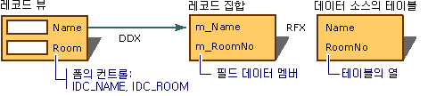

# 레코드 뷰의 데이터 교환   (MFC Data Access)
사용 하는 경우 [클래스 추가](../mfc/reference/adding-an-mfc-odbc-consumer.md) 레코드 집합의 필드에 레코드 뷰 대화 상자 템플릿 리소스에서 컨트롤을 매핑하려면 프레임 워크는 양방향에서 데이터 교환을 관리-컨트롤 및 컨트롤에 대 한 레코드 집합에서. DDX 메커니즘을 사용하면 데이터를 전송하는 코드를 직접 작성할 필요가 없습니다.  
  
 와 함께에서 작동 하는 레코드 뷰의 DDX [RFX](../data/odbc/record-field-exchange-rfx.md) 클래스의 레코드 집합 용 `CRecordset` (ODBC).  RFX는 데이터 소스의 현재 레코드와 레코드 집합 개체의 필드 데이터 멤버 간에 데이터를 이동합니다. DDX는 필드 데이터 멤버에서 폼의 컨트롤로 데이터를 이동합니다. 이 조합은 먼저 폼 컨트롤을 채운 다음 사용자가 레코드 간을 이동할 때 계속해서 컨트롤을 채웁니다. 또한 업데이트된 데이터를 레코드 집합으로 다시 이동했다가 데이터 소스로 이동할 수도 있습니다.  
  
 다음 그림 레코드 뷰에 대 한 DDX와 RFX 간의 관계를 보여 줍니다.  
  
   
DDE(Dialog Data Exchange) 및 레코드 필드 교환  
  
 DDX에 대 한 자세한 내용은 참조 [대화 상자 데이터 교환 및 유효성 검사](../mfc/dialog-data-exchange-and-validation.md)합니다. RFX에 대 한 자세한 내용은 참조 [Exchange RFX (레코드 필드)](../data/odbc/record-field-exchange-rfx.md)합니다.  
  
## 참고 항목  
 [레코드 뷰 (데이터 액세스)](../data/record-views-mfc-data-access.md)   
 [ODBC 드라이버 목록](../data/odbc/odbc-driver-list.md)