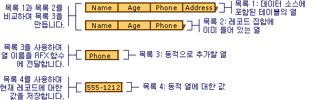

# <a name="recordset-dynamically-binding-data-columns-odbc"></a>레코드 집합: 데이터 열 동적 바인딩(ODBC)
이 항목에서는 MFC ODBC 클래스에 적용 됩니다.  
  
 레코드 집합은 디자인 타임에 지정 된 테이블 열의 바인딩을 관리 하지만 경우가 디자인 타임에 알 수 없는 열을 바인딩하는 것이 좋습니다. 이 항목에 설명 합니다.  
  
-   [레코드 집합에 열을 동적으로 바인딩할 하려는 경우](#_core_when_you_might_bind_columns_dynamically)합니다.  
  
-   [런타임에 동적으로 열을 바인딩하는 방법](#_core_how_to_bind_columns_dynamically)합니다.  
  
> [!NOTE]
>  이 항목에서 파생 된 개체에 적용 됩니다 `CRecordset` 의 대량 행 페치 구현 되지 않았습니다. 대량 행 페치 사용 중인 경우에 일반적으로 설명 하는 기술은 권장 되지 않습니다. 대량 행 페치에 대 한 자세한 내용은 참조 하십시오 [레코드 집합: 레코드 페치 대량 (ODBC)](../../data/odbc/recordset-fetching-records-in-bulk-odbc.md)합니다.  
  
##  <a name="_core_when_you_might_bind_columns_dynamically"></a> 동적으로 열을 바인딩할 수는 경우  
 디자인 타임에 MFC 응용 프로그램 마법사 또는 [MFC ODBC 소비자 마법사](../../mfc/reference/adding-an-mfc-odbc-consumer.md) (에서 **클래스 추가**) 알려진된 테이블 및 데이터 원본에 따라 열을 기반으로 하는 레코드 집합 클래스를 만듭니다. 데이터베이스를 디자인할 때 응용 프로그램 실행 시 해당 테이블과 열을 사용 하는 경우 이상 하 달라질 수 있습니다. 사용자 또는 다른 사용자 수 추가 또는 삭제 테이블 또는 추가 하거나 응용 프로그램의 레코드 집합에서 사용 하는 테이블에서 열을 삭제 합니다. 아마도 모든 데이터 액세스 응용 프로그램의 경우 문제가 없지만 여러분 에게도 경우 수 있습니다에 대처 방법을 다시 컴파일 및 다시 디자인 하는 대신 데이터베이스 스키마의 변경 내용으로? 이 항목의 목적은 질문에 대답 하는 것입니다.  
  
 이 항목에서는 동적으로 열 바인딩 수는 가장 일반적인 사례를 설명 합니다.-런타임에 추가 열을 처리 하려는 알려진된 데이터베이스 스키마를 기반으로 레코드 집합을 시작한, 합니다. 추가 항목에서는 추가 열을 매핑할 가정 `CString` 제안 다른 데이터 형식을 관리 하는 데 매핑된다고 필드 데이터 멤버에는 가장 일반적인 경우입니다.  
  
 약간의 추가 코드를 사용 하 여 다음을 수행할 수 있습니다.  
  
-   [런타임 시 사용 가능한 열을 확인](#_core_how_to_bind_columns_dynamically)합니다.  
  
-   [런타임에 동적으로 추가 열 레코드 집합에 바인딩할](#_core_adding_the_columns)합니다.  
  
 레코드 집합에는 디자인 타임에 사용한 열에 대 한 데이터 멤버가 포함 됩니다. 또한 약간의 동적으로 새 열을 대상 테이블에 추가한 여부를 결정 하는 추가 코드를 포함 하 고, 그렇다면 동적으로 할당 된 저장소 (아닌 데이터 멤버 레코드 집합)이 새 열을 바인딩합니다.  
  
 이 항목에서는 삭제 된 테이블 또는 열 같은 동적 바인딩 경우도 다루지 않습니다. 이러한 경우 더 직접 ODBC API 호출을 사용 해야 합니다. 내용은 ODBC SDK를 참조 하세요 *프로그래머 참고 자료* MSDN 라이브러리 cd 합니다.  
  
##  <a name="_core_how_to_bind_columns_dynamically"></a> 열을 동적으로 바인딩하는 방법  
 열을 동적으로 바인딩하려면 사용자 해야 알고 (또는 확인할 수) 추가 열 이름. 또한 추가 필드 데이터 멤버에 대 한 저장소 할당, 해당 이름과 해당 형식을 지정 하며 추가 하는 열의 수를 지정 합니다.  
  
 아래에서는 두 개의 레코드 집합을 언급 합니다. 첫 번째는 기본 레코드 집합 대상 테이블에서 레코드를 선택 합니다. 두 번째는 대상 테이블의 열에 대 한 정보를 가져오는 데 특별 한 열 레코드 집합입니다.  
  
###  <a name="_core_the_general_process"></a> 일반 프로세스  
 가장 일반적인 수준에서 다음이 단계를 수행 합니다.  
  
1.  기본 레코드 집합 개체를 생성 합니다.  
  
     필요에 따라 개방적이 고에 대 한 포인터를 전달 `CDatabase` 개체 또는 다른 방법으로 열 레코드 집합에 대 한 연결 정보를 제공할 수 있습니다.  
  
2.  열을 동적으로 추가 하는 단계를 수행 합니다.  
  
     추가 열 아래에서 설명한 프로세스를 참조 하세요.  
  
3.  기본 레코드 집합을 엽니다.  
  
     레코드 집합 레코드를 선택 하 고 (해당 되는 레코드 집합 필드 데이터 멤버에 매핑된) 정적 열과 동적 열 (할당 하는 추가 저장소에 매핑됨)를 모두 바인딩할 레코드 필드 교환 (RFX)를 사용 합니다.  
  
###  <a name="_core_adding_the_columns"></a> 열 추가  
 동적 바인딩 추가 런타임에 열에는 다음 단계를 수행 합니다.  
  
1.  대상 테이블의 열은 런타임에 결정 합니다. 레코드 집합 클래스 디자인 된 이후 테이블에 추가 된 열 목록을 해당 정보를 추출 합니다.  
  
     (예: 열 이름과 데이터 형식) 대상 테이블에 대 한 열 정보에 대 한 데이터 원본을 쿼리하려면 설계 열 레코드 집합 클래스를 사용 하는 것이 좋습니다.  
  
2.  새 필드 데이터 멤버에 대 한 저장소를 제공 합니다. 기본 레코드 집합 클래스는 알 수 없는 열에 대 한 필드 데이터 멤버 없으므로 (열 데이터 형식이 다른 경우) 이름, 결과 값 및 가능한 경우 데이터 형식 정보를 저장할 위치를 제공 해야 합니다.  
  
     한 가지 방법은 빌드용 하나 이상의 동적 목록, 새 열의 이름, 다른 해당 결과 값과 해당 데이터 형식에 대 한 세 번째 (필요한 경우). 이러한 목록, 특히 값 목록에 있는 정보 및 바인딩에 대 한 필요한 저장소를 제공합니다. 다음 그림은 목록 만들기를 보여 줍니다.  
       
동적으로 바인딩할 열 목록 만들기  
  
3.  RFX 함수 호출에서 기본 레코드 집합의 추가 `DoFieldExchange` 되는 각 열에 대해 작동 합니다. 이러한 RFX 호출 레코드를 인출 하 고 추가 열을 포함 하 여에 동적으로 제공 된 저장소 또는 데이터 멤버 레코드 집합에 열을 바인딩 작업을 수행 합니다.  
  
     기본 레코드 집합의 루프를 추가 하는 한 가지 방법은 `DoFieldExchange` 목록의 각 열에 대 한 적절 한 RFX 함수를 호출 하는 새 열 목록을 반복 하는 함수입니다. 각 RFX 호출의 결과 값은 해당 멤버의 저장소 위치 및 열 이름 목록에서 열 이름을 전달 합니다.  
  
###  <a name="_core_lists_of_columns"></a> 열 목록  
 사용 해야 합니다. 네 개의 목록은 다음 표에 표시 됩니다.  
  
 **현재 테이블 열 (그림과에서 목록 1)** 현재 데이터 원본에 테이블의에서 열 목록입니다. 이 목록에는 현재 레코드 집합의 바인딩된 열 목록과 일치 될 수 있습니다.  
  
 **바인딩된 레코드 집합 열 (그림과에서 목록 2)**  
 레코드 집합의 열 목록이 바인딩됩니다. 이러한 열 RFX 문을에 이미 있는 프로그램 `DoFieldExchange` 함수입니다.  
  
 **열-에-바인딩-동적 (그림과에서 목록 3)**  
 테이블에에서만 있는 레코드 집합에 없는 열 목록이 있습니다. 이 동적으로 바인딩할 열.  
  
 **동적 열 값 (그림에서 4 목록)**  
 동적 바인딩 열에서 값에 대 한 저장소를 포함 하는 목록을 검색 합니다. 이 목록의 요소에 열-에-바인딩-동적으로 한 일에 해당합니다.  
  
###  <a name="_core_building_your_lists"></a> 목록 만들기  
 유의 해야 하는 일반적인 전략을 사용 하 여 세부 정보를 설정할 수 있습니다. 이 항목의 나머지 부분에 나오는 절차에 표시 된 목록을 작성 하는 방법을 보여 줍니다. [열 목록](#_core_lists_of_columns)합니다. 절차 과정을 안내 합니다.  
  
-   [레코드 집합에 없는 열 이름 확인](#_core_determining_which_table_columns_are_not_in_your_recordset)합니다.  
  
-   [테이블에 새로 추가 된 열에 대 한 동적 저장소 제공](#_core_providing_storage_for_the_new_columns)합니다.  
  
-   [새 열에 대 한 호출 RFX를 동적으로 추가](#_core_adding_rfx_calls_to_bind_the_columns)합니다.  
  
###  <a name="_core_determining_which_table_columns_are_not_in_your_recordset"></a> 테이블 열은 레코드 집합에 없는 결정  
 기본 레코드 집합에 이미 바인딩된 열의 목록을 포함 하는 (바인딩-레코드 집합-열, 그림과에서 목록 2와 같이) 목록을 작성 합니다. 그런 다음 목록 (열-에-바인딩-동적으로 현재-테이블-열 및 바인딩된 레코드 집합 열에서 파생) 있지만 기본 레코드 집합에 없는 데이터 원본에 테이블에는 열 이름이 포함 된를 빌드하십시오.  
  
##### <a name="to-determine-the-names-of-columns-not-in-the-recordset-columns-to-bind-dynamically"></a>레코드 집합 (열-에-바인딩-동적으로)에 없는 열 이름을 확인 하려면  
  
1.  기본 레코드 집합에 이미 바인딩된 열의 목록을 (바인딩된 레코드 집합 열)을 빌드하십시오.  
  
     한 가지 방법은 디자인 타임에 바인딩된 레코드 집합 열을 만드는 것입니다. 레코드 집합의 RFX 함수 호출을 시각적으로 검사할 수 있습니다 `DoFieldExchange` 함수 이러한 이름을 가져올 수 있습니다. 다음 목록 이름을 사용 하 여 초기화 된 배열로 설정 합니다.  
  
     예를 들어, 그림은 세 가지 요소를 사용 하 여 바인딩된 레코드 집합 열 (목록 2)를 보여줍니다. 바인딩된 레코드 집합 열에는 현재 테이블 열 (목록 1)에 표시 된 Phone 열을 누락 되었습니다.  
  
2.  아직 바인딩되어 있지 않은 기본 레코드 집합의 열 목록 (열-에-바인딩-동적으로) 만들 수는 현재-테이블-열 및 바인딩된 레코드 집합 열 비교 합니다.  
  
     한 가지 방법은 런타임 (현재-테이블-열) 및 동시에 (바인딩된 레코드 집합 열) 레코드 집합에 이미 바인딩된 열의 목록에서 테이블의 열 목록을 반복 하는 것입니다. 열-에-바인딩-동적으로 배치 모든 이름을 현재-테이블-열에 바인딩된 레코드 집합 열에 표시 되지 않습니다.  
  
     예를 들어 그림과 열-에-바인딩-동적 (목록 3) 하나의 요소가 표시 된: 현재 테이블 열 (목록 1) 찾았지만 바인딩된 레코드 집합 열 (목록 2)에 없는 Phone 열입니다.  
  
3.  각 열 이름에 동적으로 바인딩할 열 목록에 저장 (열-에-바인딩-동적으로) 해당 데이터 값을 저장 하는 동적 열-값 (예: 그림과에서 목록 4) 목록을 작성 합니다.  
  
     이 목록의 요소 역할을 새 레코드 집합의 필드 데이터 멤버입니다. 이들은 동적 열을 바인딩할 저장소 위치입니다. 목록의 설명은 참조 하십시오 [열 목록](#_core_lists_of_columns)합니다.  
  
###  <a name="_core_providing_storage_for_the_new_columns"></a> 새 열에 대 한 저장소를 제공합니다.  
 다음으로, 동적으로 바인딩할 열에 대 한 저장소 위치를 설정 합니다. 각 열의 값을 저장 하는 목록 요소를 제공 하는 개념이입니다. 일반적으로 바인딩된 열을 저장 하는 레코드 집합 멤버 변수를 이러한 저장소 위치와 유사 합니다.  
  
##### <a name="to-provide-dynamic-storage-for-new-columns-dynamic-column-values"></a>새 열 (동적 열 값)에 대 한 동적 저장소를 제공 합니다.  
  
1.  동적 열-값, 열-에-바인딩-동적으로 각 열에 있는 데이터의 값을 포함 하는 병렬 빌드.  
  
     그림은 하나의 요소를 사용 하 여 동적 열 값 (목록 4)을 표시 하는 예를 들어:는 `CString` 현재 레코드에 대 한 실제 전화 번호를 포함 하는 개체: "555-1212"입니다.  
  
     가장 일반적인 경우 동적 열 값에 형식 요소의 `CString`합니다. 다양 한 데이터 형식의 열을 처리 하는 다양 한 종류의 요소를 포함할 수 있는 목록이 필요 합니다.  
  
 이전 절차의 결과 두 개의 주 목록: 열-에-바인딩-동적으로 열 및 열-Dynamic-values 현재 레코드의 열에 값이 포함 된 이름을 포함 합니다.  
  
> [!TIP]
>  새 열 모두 동일한 데이터 형식이 아닌 경우는 추가 병렬 목록 열 목록에서 각 해당 요소의 형식을 정의 하는 항목을 포함 하는 것이 좋습니다. (값, AFX_RFX_BOOL AFX_RFX_BYTE를 사용할 수 있습니다 및 등이 경우 원하는 합니다. 이러한 상수는 AFXDB에 정의 됩니다. 8.) 열 데이터 형식을 표시 하는 방법에 따라 목록 형식을 선택 합니다.  
  
###  <a name="_core_adding_rfx_calls_to_bind_the_columns"></a> 열에 바인딩할 RFX 호출 추가  
 RFX에 새 열에 대 한 호출을 배치 하 여 발생 하는 동적 바인딩에 대 한 마지막으로 정렬 하면 `DoFieldExchange` 함수입니다.  
  
##### <a name="to-dynamically-add-rfx-calls-for-new-columns"></a>RFX를 동적으로 추가할 새 열에 대 한 호출  
  
1.  기본 레코드 집합의에서 `DoFieldExchange` 멤버 함수 (열-에-바인딩-동적으로)에 새 열 목록을 반복 하는 코드를 추가 합니다. 각 루프를 열 이름 열-에-바인딩-동적으로 및 동적 열 값의 열에 대 한 결과 값을 추출 합니다. 열의 데이터 형식에 적합 한 RFX 함수 호출에 이러한 항목을 전달 합니다. 목록의 설명은 참조 하십시오 [열 목록](#_core_lists_of_columns)합니다.  
  
 일반적인 경우에 프로그램 `RFX_Text` 함수 호출 수를 추출 `CString` 인 열-에-바인딩-동적으로 코드의 다음 줄에서와 같이 목록에서 개체를 `CStringList` 호출 `m_listName` 동적 열 값을 이며`CStringList` 호출 `m_listValue`:  
  
```cpp  
RFX_Text( pFX,   
            m_listName.GetNext( posName ),   
            m_listValue.GetNext( posValue ));  
```  
  
 RFX 함수에 대 한 자세한 내용은 참조 하세요. [매크로 및 전역](../../mfc/reference/mfc-macros-and-globals.md) 에 *클래스 라이브러리 참조*합니다.  
  
> [!TIP]
>  새 열 데이터 형식이 다른 경우 각 형식에 대 한 적절 한 RFX 함수를 호출 하는 switch 문 루프에서 사용 합니다.  
  
 프레임 워크를 호출 하면 `DoFieldExchange` 중는 `Open` 정적 열 바인딩 해당 열에 대해 RFX 호출 하 여 레코드 집합에 열을 바인딩하는 프로세스입니다. 다음 루프 동적 열에 대해 RFX 함수를 반복적으로 호출합니다.  
  
## <a name="see-also"></a>참고 항목  
 [레코드 집합 (ODBC)](../../data/odbc/recordset-odbc.md)   
 [레코드 집합: 대형 데이터 항목 작업(ODBC)](../../data/odbc/recordset-working-with-large-data-items-odbc.md)