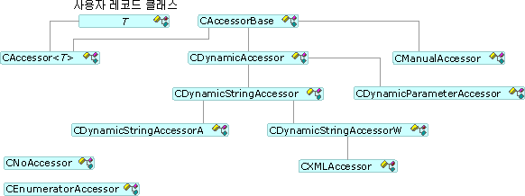

# 접근자 및 행 집합
[!INCLUDE[vs2017banner](../../assembler/inline/includes/vs2017banner.md)]

데이터를 설정하고 검색하기 위해 OLE DB 템플릿에서는 [CAccessorRowset](../../data/oledb/caccessorrowset-class.md) 클래스를 통해 접근자와 행 집합을 사용합니다.  이 클래스는 서로 다른 형식의 여러 접근자를 처리할 수 있습니다.  
  
## 접근자 형식  
 모든 접근자는 [CAccessorBase](../../data/oledb/caccessorbase-class.md)에서 파생됩니다.  `CAccessorBase`는 매개 변수와 열 바인딩을 모두 제공합니다.  
  
 다음 그림은 접근자 형식에 대한 것입니다.  
  
   
접근자 클래스  
  
-   [CAccessor](../../data/oledb/caccessor-class.md) 이 접근자는 디자인 타임에 데이터베이스 소스의 구조를 알고 있는 경우에 사용합니다.  `CAccessor`는 버퍼가 포함된 데이터베이스 레코드를 데이터 소스에 정적으로 바인딩합니다.  
  
-   [CDynamicAccessor](../../data/oledb/cdynamicaccessor-class.md) 이 접근자는 디자인 타임에 데이터베이스의 구조를 알지 못하는 경우에 사용합니다.  `CDynamicAccessor`는 `IColumnsInfo::GetColumnInfo`를 호출하여 데이터베이스 열 정보를 가져옵니다.  이 접근자는 접근자와 버퍼를 만들고 관리합니다.  
  
-   [CDynamicParameterAccessor](../../data/oledb/cdynamicparameteraccessor-class.md) 알 수 없는 명령 형식을 처리하려면 이 접근자를 사용합니다.  명령을 준비할 때, 공급자가 `ICommandWithParameters`를 지원하는 경우 `CDynamicParameterAccessor`는 `ICommandWithParameters` 인터페이스에서 매개 변수 정보를 가져올 수 있습니다.  
  
-   [CDynamicStringAccessor](../../data/oledb/cdynamicstringaccessor-class.md), [CDynamicStringAccessorA](../../data/oledb/cdynamicstringaccessora-class.md), and [CDynamicStringAccessorW](../../data/oledb/cdynamicstringaccessorw-class.md) 이 클래스는 데이터베이스 스키마에 대해 알지 못하는 경우에 사용합니다.  `CDynamicStringAccessorA`는 데이터를 ANSI 문자열로 검색하고 `CDynamicStringAccessorW`는 데이터를 유니코드 문자열로 검색합니다.  
  
-   [CManualAccessor](../../data/oledb/cmanualaccessor-class.md) 이 클래스를 사용하면 공급자가 형식을 변환할 수 있는 경우 모든 데이터 형식을 사용할 수 있습니다.  이 클래스는 결과 열과 명령 매개 변수 모두를 처리합니다.  
  
 다음 표에는 OLE DB 템플릿 접근자 형식에서 지원되는 내용이 요약되어 있습니다.  
  
|접근자 형식|Dynamic|매개 변수 처리|버퍼|여러 접근자|  
|------------|-------------|--------------|--------|------------|  
|`CAccessor`|아니요|예|사용자|예|  
|`CDynamicAccessor`|예|아니요|OLE DB 템플릿|아니요|  
|`CDynamicParameterAccessor`|예|예|OLE DB 템플릿|아니요|  
|`CDynamicStringAccessor[A,W]`|예|아니요|OLE DB 템플릿|아니요|  
|`CManualAccessor`|예|예|사용자|예|  
  
## 행 집합 형식  
 OLE DB 템플릿은 단일 행 집합\([CRowset](../../data/oledb/crowset-class.md)에 의해 구현\), 대량 행 집합\([CBulkRowset](../../data/oledb/cbulkrowset-class.md)에 의해 구현\) 및 배열 행 집합\([CArrayRowset](../../data/oledb/carrayrowset-class.md)에 의해 구현\)이라는 세 가지 종류의 행 집합을 지원합니다\(이전 그림 참조\).  단일 행 집합은 `MoveNext`가 호출될 때 단일 행 핸들을 페치합니다.  대량 행 집합은 여러 행 핸들을 페치할 수 있습니다.  배열 행 집합은 배열 구문을 사용하여 액세스할 수 있는 행 집합입니다.  
  
 다음 그림은 행 집합 형식을 보여 줍니다.  
  
   
행 집합 클래스  
  
 [스키마 행 집합](../../data/oledb/obtaining-metadata-with-schema-rowsets.md)은 데이터 저장소의 데이터에 액세스하지 않지만, 대신 데이터 저장소에 대한 정보\(메타데이터\)에 액세스합니다.  스키마 행 집합은 일반적으로 컴파일 타임에 데이터베이스 구조를 알 수 없지만 런타임에 이를 가져와야 하는 경우에 사용됩니다.  
  
## 참고 항목  
 [OLE DB 소비자 템플릿](../../data/oledb/ole-db-consumer-templates-cpp.md)