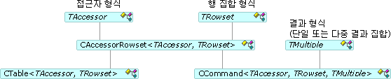

# 명령 및 테이블
명령 및 테이블에 액세스할 수 있습니다; 행 집합 즉, 행 집합을 열고, 명령을 실행 및 열을 바인딩하십시오. 합니다 [CCommand](../../data/oledb/ccommand-class.md) 하 고 [CTable](../../data/oledb/ctable-class.md) 클래스 각각 명령 및 테이블 개체를 인스턴스화합니다. 이러한 클래스에서 파생 [CAccessorRowset](../../data/oledb/caccessorrowset-class.md) 다음 그림과 같습니다.  
  
   
명령 및 테이블 클래스  
  
 이전 표에 `TAccessor` 나열할 수 있습니다 접근자 형식일 [접근자 형식](../../data/oledb/accessors-and-rowsets.md)합니다. *TRowset* 모든 행 집합 형식에 나열할 수 있습니다 [행 집합 형식](../../data/oledb/accessors-and-rowsets.md)합니다. *TMultiple* 결과 유형을 지정 합니다 (단일 또는 여러 결과 집합).  
  
 합니다 [ATL OLE DB 소비자 마법사](../../atl/reference/atl-ole-db-consumer-wizard.md) 명령 또는 테이블 개체를 사용할지를 지정할 수 있습니다.  
  
-   명령이 없는 데이터 원본에 대해 사용할 수는 `CTable` 클래스입니다. 일반적으로 사용할이 없는 매개 변수를 지정 하 고 여러 결과 요구 하는 단순 행 집합에 대 한 합니다. 이 간단한 클래스 지정 하는 테이블 이름을 사용 하 여 데이터 원본에서 테이블을 엽니다.  
  
-   명령을 지 원하는 데이터 소스를 사용할 수 있습니다는 `CCommand` 클래스를 대신 합니다. 명령을 실행 하려면 호출 [열려](../../data/oledb/ccommand-open.md) 이 클래스에 있습니다. 호출할 수 있습니다 `Prepare` 를 두 번 이상 실행 하려는 명령을 준비를 합니다.  
  
     `CCommand` 세 개의 템플릿 인수가:는 접근자 형식, 행 집합 형식 및 결과 형식 (`CNoMultipleResults`, 기본적으로 또는 `CMultipleResults`). 지정 하는 경우 `CMultipleResults`의 `CCommand` 지 원하는 클래스를 `IMultipleResults` 인터페이스 및 여러 행 집합을 처리 합니다. 합니다 [DBVIEWER](http://msdn.microsoft.com/07620f99-c347-4d09-9ebc-2459e8049832) 샘플에서는 여러 결과 처리 하는 방법을 보여 줍니다.  
  
## 참고 항목  
 [OLE DB 소비자 템플릿](../../data/oledb/ole-db-consumer-templates-cpp.md)