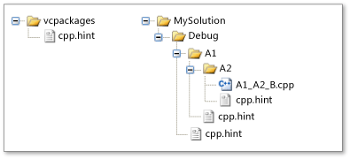

# <a name="hint-files"></a>힌트 파일
*힌트 파일*을 사용하면 Visual Studio IDE(통합 개발 환경)에서 함수 및 매크로의 이름과 같은 Visual C++ 식별자를 해석할 수 있습니다. Visual C++ 프로젝트를 열면 IDE의 *구문 분석 시스템*에서 프로젝트의 각 소스 파일에 있는 코드를 분석하고 모든 식별자에 대한 정보를 수집합니다. 그런 다음, IDE는 해당 정보를 사용하여 **클래스 뷰** 브라우저 및 **탐색 모음**과 같은 기능을 지원합니다.  
  
 Visual C++ 2010에 도입된 구문 분석 시스템에서는 C/C++ 구문을 인식하지만 매크로가 포함된 명령문을 잘못 해석할 수 있습니다. 작성된 소스 코드가 매크로로 인해 구문적으로 올바르지 않은 경우 명령문을 잘못 해석할 수 있습니다. 소스 코드가 컴파일되고 전처리기에서 [매크로 식별자](../preprocessor/hash-define-directive-c-cpp.md)를 해당 정의로 바꾸면 명령문이 구문적으로 올바를 수 있습니다. 구문 분석 시스템은 힌트 파일을 사용하여 매크로를 해석하므로 프로젝트를 빌드하지 않고도 작동합니다. 따라서 **클래스 뷰**와 같은 검색 기능을 즉시 사용할 수 있습니다.  
  
 힌트 파일에는 C/C++ 매크로 정의와 동일한 구문이 있는 사용자 지정 가능 *힌트*가 포함되어 있습니다. Visual C++에는 대부분의 프로젝트에 충분한 기본 제공 힌트 파일이 있지만, Visual Studio에서 식별자를 처리하는 방식을 개선하기 위해 사용자 고유의 힌트 파일을 만들 수 있습니다.  
  
> [!IMPORTANT]
>  힌트 파일을 수정하거나 추가하는 경우 변경 내용을 적용하려면 솔루션에서 .sdf 파일 및/또는 VC.db 파일을 삭제해야 합니다.  
  
## <a name="scenario"></a>시나리오  
 다음 코드는 **클래스 뷰** 브라우저로 검사하는 소스 파일에 있다고 가정합니다. `STDMETHOD` 매크로는 `myMethod`라는 메서드를 선언합니다. 이 메서드는 하나의 매개 변수를 사용하고 **HRESULT**에 대한 포인터를 반환합니다.  
  
```  
// Source code file.  
STDMETHOD(myMethod)(int parameter1);  
```  
  
 다음 매크로 정의는 별도의 헤더 파일에 있습니다.  
  
```  
// Header file.  
#define STDMETHOD(method) HRESULT (STDMETHODCALLTYPE * method)  
#define STDMETHODCALLTYPE __stdcall  
#define HRESULT void*  
```  
  
 STDMETHOD라는 함수가 선언된 것처럼 보이고 이 선언은 포함된 두 개의 매개 변수 목록으로 인해 구문적으로 올바르지 않기 때문에 구문 분석 시스템에서 이 소스 코드를 해석할 수 없습니다. 구문 분석 시스템은 `STDMETHOD`, `STDMETHODCALLTYPE` 및 `HRESULT` 매크로에 대한 정의를 찾기 위해 헤더 파일을 열지 않습니다. 이에 따라 구문 분석 시스템에서 `STDMETHOD` 매크로를 해석할 수 없으므로 전체 구문을 무시한 다음, 구문 분석을 계속합니다.  
  
 프로젝트에서 하나 이상의 중요한 헤더 파일을 사용할 수 있기 때문에 구문 분석 시스템은 헤더 파일을 사용하지 않습니다. 헤더 파일이 변경되면 구문 분석 시스템에서 프로젝트의 모든 헤더 파일을 다시 검사해야 할 수도 있으므로 IDE 성능이 느려집니다. 대신 구문 분석 시스템에서는 `STDMETHOD`, `STDMETHODCALLTYPE` 및 `HRESULT` 매크로를 처리하는 방법을 지정하는 힌트를 사용합니다.  
  
 힌트가 필요하다는 것을 어떻게 알 수 있을까요? 그리고 힌트가 필요한 경우 어떤 종류의 힌트를 만들어야 할까요? 힌트가 필요하다는 한 가지 표시는 **클래스 뷰**의 식별자 뷰가 **편집기**의 뷰와 일치하지 않는 경우입니다. 예를 들어 **클래스 뷰**에 존재하는 클래스 멤버가 표시되지 않거나 멤버 이름이 올바르지 않을 수 있습니다. 일반적인 문제를 해결하는 힌트 형식에 대한 자세한 내용은 이 문서의 뒷부분에 나오는 "힌트가 필요한 매크로는 무엇인가요?" 섹션을 참조하세요.  
  
## <a name="architecture"></a>아키텍처  
 힌트 파일은 **솔루션 탐색기**에 표시된 논리 디렉터리가 아니라 실제 디렉터리와 관련됩니다. 힌트 파일을 적용하기 위해 프로젝트에 힌트 파일을 추가할 필요가 없습니다. 구문 분석 시스템은 소스 파일을 구문 분석할 때만 힌트 파일을 사용합니다.  
  
 모든 힌트 파일의 이름은 **cpp.hint**입니다. 따라서 많은 디렉터리에 힌트 파일이 포함될 수 있지만, 특정 디렉터리에는 하나의 힌트 파일만 있을 수 있습니다.  
  
 프로젝트는 0개 이상의 힌트 파일의 영향을 받을 수 있습니다. 힌트 파일이 없으면 구문 분석 시스템에서 오류 복구 기술을 사용하여 해독할 수 없는 소스 코드를 무시합니다. 그렇지 않으면 구문 분석 시스템에서 다음 전략을 사용하여 힌트를 찾고 수집합니다.  
  
### <a name="search-order"></a>검색 순서  
 구문 분석 시스템에서 다음 순서로 디렉터리를 검색하여 힌트 파일을 찾습니다.  
  
-   Visual C++용 설치 패키지(**vcpackages**)가 있는 디렉터리입니다. 이 디렉터리에는 자주 사용되는 시스템 파일의 기호를 설명하는 기본 제공 힌트 파일(예: **windows.h**)이 포함되어 있습니다. 따라서 프로젝트에서 필요한 대부분의 힌트를 자동으로 상속받습니다.  
  
-   소스 파일의 루트 디렉터리에서 소스 파일 자체가 포함된 디렉터리로의 경로입니다. 일반적인 Visual C++ 프로젝트의 경우 루트 디렉터리에 솔루션 또는 프로젝트 파일이 포함되어 있습니다.  
  
     이 규칙의 예외는 *중지 파일*이 소스 파일의 경로에 있는 경우입니다. 중지 파일은 검색 순서에 대한 추가 제어를 제공하며 **cpp.stop**으로 명명된 모든 파일입니다. 구문 분석 시스템은 루트 디렉터리에서 시작하는 대신 중지 파일이 포함된 디렉터리에서 소스 파일이 있는 디렉터리로 검색합니다. 일반적인 프로젝트에서는 중지 파일이 필요하지 않습니다.  
  
### <a name="hint-gathering"></a>힌트 수집  
 힌트 파일에는 0개 이상의 *힌트*가 포함되어 있습니다. 힌트는 C/C++ 매크로와 동일하게 정의되거나 삭제됩니다. 즉 `#define` 전처리기 지시문에서 힌트를 만들거나 다시 정의하고, `#undef` 지시문에서 힌트를 삭제합니다.  
  
 구문 분석 시스템은 앞에서 설명한 검색 순서에 따라 각 힌트 파일을 열고, *효과적인 힌트* 집합에 각 파일의 힌트를 누적한 다음, 효과적인 힌트를 사용하여 코드의 식별자를 해석합니다.  
  
 구문 분석 시스템에서 힌트를 누적하기 위해 사용하는 규칙은 다음과 같습니다.  
  
-   새 힌트에서 아직 정의되지 않은 이름을 지정하는 경우 새 힌트에서 효과적인 힌트에 해당 이름을 추가합니다.  
  
-   새 힌트에서 이미 정의된 이름을 지정하는 경우 새 힌트에서 기존 힌트를 다시 정의합니다.  
  
-   새 힌트가 기존의 효과적인 힌트를 지정하는 `#undef` 지시문인 경우 새 힌트에서 기존 힌트를 삭제합니다.  
  
 첫 번째 규칙은 이전에 열었던 힌트 파일에서 효과적인 힌트가 상속된다는 것을 의미합니다. 마지막 두 규칙은 검색 순서에서 나중에 발생하는 힌트가 이전에 발생한 힌트를 재정의할 수 있다는 것을 의미합니다. 예를 들어 소스 파일이 포함된 디렉터리에 힌트 파일을 만들면 모든 이전 힌트를 재정의할 수 있습니다.  
  
 힌트가 수집되는 방법을 알아보려면 이 문서의 뒷부분에 나오는 `Example` 섹션을 참조하세요.  
  
### <a name="syntax"></a>구문  
 힌트는 매크로를 만들고 삭제하는 전처리기 지시문과 동일한 구문으로 만들어지고 삭제됩니다. 실제로 구문 분석 시스템은 C/C++ 전처리기를 사용하여 힌트를 평가합니다. 전처리기 지시문에 대한 자세한 내용은 [#define 지시문(C/C++)](../preprocessor/hash-define-directive-c-cpp.md) 및 [#undef 지시문(C/C++)](../preprocessor/hash-undef-directive-c-cpp.md)을 참조하세요.  
  
 유일하게 특이한 구문 요소는 `@<`, `@=` 및 `@>` 대체 문자열입니다. 이러한 문자열은 *맵* 매크로에만 사용되는 힌트 파일 특정 대체 문자열입니다. 맵은 데이터, 함수 또는 이벤트를 다른 데이터, 함수 또는 이벤트 처리기와 관련시키는 일단의 매크로입니다. 예를 들어 `MFC`는 맵을 사용하여 [메시지 맵](../mfc/reference/message-maps-mfc.md)을 만들고, `ATL`은 맵을 사용하여 [개체 맵](../atl/reference/object-map-macros.md)을 만듭니다. 힌트 파일 특정 대체 문자열은 맵의 시작, 중간 및 끝 요소를 나타냅니다. 맵 매크로의 이름만 중요합니다. 따라서 각 대체 문자열은 의도적으로 매크로의 구현을 숨깁니다.  
  
 힌트에서 사용하는 구문은 다음과 같습니다.  
  
|구문|의미|  
|------------|-------------|  
|`#define` *hint-name* *replacement-string*<br /><br /> `#define` *hint-name* `(` *parameter*, ...`)`*replacement-string*|새 힌트를 정의하거나 기존 힌트를 다시 정의하는 전처리기 지시문입니다. 지시문 뒤에 나오는 전처리기에서 소스 코드에 있는 *hint-name*의 각 항목을 *replacement-string*으로 바꿉니다.<br /><br /> 두 번째 구문 형식은 함수와 비슷한 힌트를 정의합니다. 소스 코드에서 함수와 비슷한 힌트가 발생하면 전처리기에서 *replacement-string*의 각 *parameter*를 소스 코드의 해당 인수로 바꾼 다음, *hint-name*을 *replacement-string*으로 바꿉니다.|  
|`@<`|맵 요소 집합의 시작을 나타내는 힌트 파일 특정 *replacement-string*입니다.|  
|`@=`|중간 맵 요소를 나타내는 힌트 파일 특정 *replacement-string*입니다. 맵에는 여러 개의 맵 요소가 있을 수 있습니다.|  
|`@>`|맵 요소 집합의 끝을 나타내는 힌트 파일 특정 *replacement-string*입니다.|  
|`#undef` *hint-name*|기존 힌트를 삭제하는 전처리기 지시문입니다. 힌트의 이름은 *hint-name* 식별자로 제공됩니다.|  
|`//` *comment*|한 줄 주석입니다.|  
|`/*` *comment* `*/`|여러 줄 주석입니다.|  
  
## <a name="what-macros-require-a-hint"></a>힌트가 필요한 매크로는 무엇인가요?  
 특정 형식의 매크로는 구문 분석 시스템을 방해할 수 있습니다. 이 섹션에서는 문제를 일으킬 수 있는 매크로의 형식과 해당 문제를 해결하기 위해 만들 수 있는 힌트 형식에 대해 설명합니다.  
  
### <a name="disruptive-macros"></a>방해가 되는 매크로  
 일부 매크로로 인해 구문 분석 시스템에서 소스 코드를 잘못 해석할 수 있지만 검색 환경이 손상되지 않으면 무시할 수 있습니다. 예를 들어 [SAL](../c-runtime-library/sal-annotations.md)(소스 코드 주석 언어) 매크로는 프로그래밍 버그를 찾는 데 도움이 되는 C++ 특성을 확인합니다. 코드를 탐색할 때 SAL 주석을 무시하려면 주석을 숨기는 힌트 파일을 만드는 것이 좋습니다.  
  
 다음 소스 코드에서 `FormatWindowClassName()` 함수의 매개 변수 형식은 `PXSTR`이고, 매개 변수 이름은 `szBuffer`입니다. 그러나 구문 분석 시스템은 매개 변수 형식 또는 매개 변수 이름에 대한 `_Pre_notnull_` 및 `_Post_z_` SAL 주석을 잘못 사용합니다.  
  
 **소스 코드:**  
  
```  
static void FormatWindowClassName(_Pre_notnull__Post_z_ PXSTR szBuffer)  
```  
  
 **전략:** Null 정의  
  
 이 상황의 전략은 SAL 주석을 존재하지 않는 것처럼 처리하는 것입니다. 이렇게 하려면 대체 문자열이 null인 힌트를 지정합니다. 이에 따라 구문 분석 시스템에서 주석을 무시하고 **클래스 뷰** 브라우저에 해당 주석이 표시되지 않습니다. (Visual C++에는 SAL 주석을 숨기는 기본 제공 힌트 파일이 포함되어 있습니다.)  
  
 **힌트 파일:**  
  
```  
#define _Pre_notnull_  
```  
  
### <a name="concealed-cc-language-elements"></a>숨겨진 C/C++ 언어 요소  
 구문 분석 시스템에서 소스 코드를 잘못 해석하는 일반적인 이유는 매크로가 C/C++ [문장 부호](../cpp/punctuators-cpp.md) 또는 [키워드](../cpp/keywords-cpp.md) 토큰을 숨기는 경우에 있습니다. 즉 매크로에는 `<>`, `[]`, `{}` 및 `()`와 같은 문장 부호 쌍의 절반이 포함될 수 있습니다.  
  
 다음 소스 코드에서 `START_NAMESPACE` 매크로는 쌍을 이루지 않는 왼쪽 중괄호(`{`)를 숨깁니다.  
  
 **소스 코드:**  
  
```  
#define START_NAMESPACE namespace MyProject {  
```  
  
 **전략:** 직접 복사  
  
 매크로의 의미 체계가 검색 환경에 중요한 경우 매크로와 동일한 힌트를 만듭니다. 구문 분석 시스템에서 매크로를 힌트 파일의 정의로 해석합니다.  
  
 소스 파일의 매크로에 다른 매크로가 포함되어 있으면 해당 매크로는 효과적인 힌트 집합에 이미 있는 경우에만 해석됩니다.  
  
 **힌트 파일:**  
  
```  
#define START_NAMESPACE namespace MyProject {  
```  
  
### <a name="maps"></a>맵  
 맵은 시작 요소, 끝 요소 및 0개 이상의 중간 요소를 지정하는 매크로로 구성됩니다. 각 맵 매크로에서 C/C++ 언어 요소를 숨기고 전체 C/C++ 문의 구문이 별도의 많은 매크로에 분산되어 있기 때문에 구문 분석 시스템에서 맵을 잘못 해석합니다.  
  
 다음 소스 코드는 `BEGIN_CATEGORY_MAP`, `IMPLEMENTED_CATEGORY` 및 `END_CATEGORY_MAP` 매크로를 정의합니다.  
  
 **소스 코드:**  
  
```  
#define BEGIN_CATEGORY_MAP(x)\  
static const struct ATL::_ATL_CATMAP_ENTRY* GetCategoryMap() throw() {\  
static const struct ATL::_ATL_CATMAP_ENTRY pMap[] = {  
#define IMPLEMENTED_CATEGORY( catid ) { _ATL_CATMAP_ENTRY_IMPLEMENTED, &catid },  
#define END_CATEGORY_MAP()\  
   { _ATL_CATMAP_ENTRY_END, NULL } };\  
   return( pMap ); }  
```  
  
 **전략:** 맵 요소 식별  
  
 맵의 시작, 중간(있는 경우) 및 끝 요소에 대한 힌트를 지정합니다. `@<`, `@=` 및 `@>` 특수 맵 대체 문자열을 사용합니다. 자세한 내용은 이 문서의 `Syntax` 섹션을 참조하세요.  
  
 **힌트 파일:**  
  
```  
// Start of the map.  
#define BEGIN_CATEGORY_MAP(x) @<  
// Intermediate map element.  
#define IMPLEMENTED_CATEGORY( catid ) @=  
// Intermediate map element.  
#define REQUIRED_CATEGORY( catid ) @=  
// End of the map.  
#define END_CATEGORY_MAP() @>  
```  
  
### <a name="composite-macros"></a>복합 매크로  
 복합 매크로에는 구문 분석 시스템을 혼란스럽게 하는 매크로 형식이 하나 이상 포함되어 있습니다.  
  
 다음 소스 코드에는 네임스페이스 범위의 시작을 지정하는 `START_NAMESPACE` 매크로 및 맵의 시작을 지정하는 `BEGIN_CATEGORY_MAP` 매크로가 포함되어 있습니다.  
  
 **소스 코드:**  
  
```  
#define NSandMAP START_NAMESPACE BEGIN_CATEGORY_MAP  
```  
  
 **전략:** 직접 복사  
  
 `START_NAMESPACE` 및 `BEGIN_CATEGORY_MAP` 매크로에 대한 힌트를 만든 다음, 소스 코드에 대해 이전에 표시한 것과 동일한 `NSandMAP` 매크로에 대한 힌트를 만듭니다. 또는 복합 매크로가 방해가 되는 매크로와 공백으로만 구성되는 경우 대체 문자열이 null 정의인 힌트를 정의할 수 있습니다.  
  
 이 예제에서는 `Concealed C/C++ Language Elements` 부제목의 이 항목에서 설명한 대로 힌트가 이미 `START_NAMESPACE`에 있다고 가정합니다. 그리고 `Maps`의 앞부분에서 설명한 대로 힌트가 `BEGIN_CATEGORY_MAP`에 있다고 가정합니다.  
  
 **힌트 파일:**  
  
```  
#define NSandMAP START_NAMESPACE BEGIN_CATEGORY_MAP  
```  
  
### <a name="inconvenient-macros"></a>불편한 매크로  
 일부 매크로는 구문 분석 시스템에서 해석할 수 있지만 매크로가 길거나 복잡하기 때문에 소스 코드를 읽기가 어렵습니다. 가독성을 높이기 위해 매크로 표시를 단순화하는 힌트를 제공할 수 있습니다.  
  
 **소스 코드:**  
  
```  
#define STDMETHOD(methodName) HRESULT (STDMETHODCALLTYPE * methodName)  
```  
  
 **전략:** 단순화  
  
 더 간단한 매크로 정의를 표시하는 힌트를 만듭니다.  
  
 **힌트 파일:**  
  
```  
#define STDMETHOD(methodName) void* methodName  
```  
  
## <a name="example"></a>예  
 다음 예제에서는 힌트 파일에서 힌트가 누적되는 방법을 보여 줍니다. 중지 파일은 이 예제에서 사용되지 않습니다.  
  
 다음 그림에서는 Visual C++ 프로젝트의 실제 디렉터리 중 일부를 보여 줍니다. 힌트 파일은 `vcpackages`, `Debug`, `A1` 및 `A2` 디렉터리에 있습니다.  
  
### <a name="hint-file-directories"></a>힌트 파일 디렉터리  
   
  
### <a name="directories-and-hint-file-contents"></a>디렉터리 및 힌트 파일 내용  
 다음 목록에서는 이 프로젝트에서 힌트 파일이 포함된 디렉터리와 해당 힌트 파일의 내용을 보여 줍니다. `vcpackages` 디렉터리 힌트 파일의 많은 힌트 중 일부만 나열됩니다.  
  
-   vcpackages  
  
    ```  
    // vcpackages (partial list)  
    #define _In_  
    #define _In_opt_  
    #define _In_z_  
    #define _In_opt_z_  
    #define _In_count_(size)  
    ```  
  
-   디버그  
  
    ```  
    // Debug  
    #undef _In_  
    #define OBRACE {  
    #define CBRACE }  
    #define RAISE_EXCEPTION(x) throw (x)  
    #define START_NAMESPACE namespace MyProject {  
    #define END_NAMESPACE }  
    ```  
  
-   A1  
  
    ```  
    // A1  
    #define START_NAMESPACE namespace A1Namespace {  
    ```  
  
-   A2  
  
    ```  
    // A2  
    #undef OBRACE  
    #undef CBRACE  
    ```  
  
### <a name="effective-hints"></a>효과적인 힌트  
 다음 표에는 이 프로젝트의 소스 파일에 대한 효과적인 힌트가 나와 있습니다.  
  
-   소스 파일: A1_A2_B.cpp  
  
-   효과적인 힌트:  
  
    ```  
    // vcpackages (partial list)  
    #define _In_opt_  
    #define _In_z_  
    #define _In_opt_z_  
    #define _In_count_(size)  
    // Debug...  
    #define RAISE_EXCEPTION(x) throw (x)  
    // A1  
    #define START_NAMESPACE namespace A1Namespace {   
    // ...Debug  
    #define END_NAMESPACE }  
    ```  
  
 위의 목록에 적용되는 참고 사항은 다음과 같습니다.  
  
-   효과적인 힌트는 `vcpackages`, `Debug`, `A1` 및 `A2` 디렉터리에 있습니다.  
  
-   `Debug` 힌트 파일의 **#undef** 지시문은 `vcpackages` 디렉터리 힌트 파일에서 `#define _In_` 힌트를 제거했습니다.  
  
-   `A1` 디렉터리의 힌트 파일은 `START_NAMESPACE`를 다시 정의합니다.  
  
-   `A2` 디렉터리의 `#undef` 힌트에서 `Debug` 디렉터리 힌트 파일의 `OBRACE` 및 `CBRACE`에 대한 힌트를 제거했습니다.  
  
## <a name="see-also"></a>참고 항목  
 [Visual C++ 프로젝트용 파일 형식](../ide/file-types-created-for-visual-cpp-projects.md)    
 [#define 지시문(C/C++)](../preprocessor/hash-define-directive-c-cpp.md)   
 [#undef 지시문(C/C++)](../preprocessor/hash-undef-directive-c-cpp.md)   
 [SAL 주석](../c-runtime-library/sal-annotations.md)   
 [메시지 맵](../mfc/reference/message-maps-mfc.md)   
 [메시지 맵 매크로](../atl/reference/message-map-macros-atl.md)   
 [개체 맵 매크로](../atl/reference/object-map-macros.md)