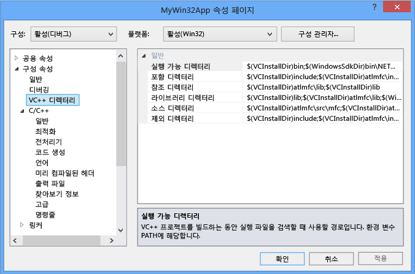
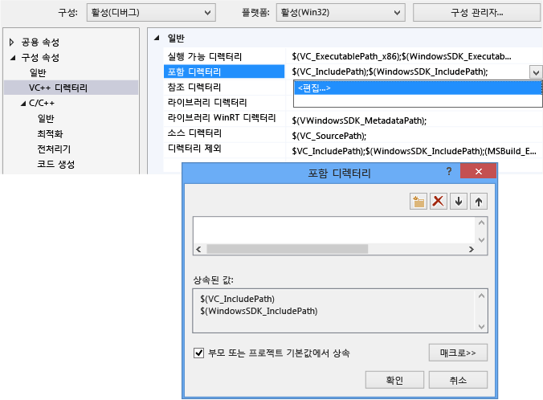
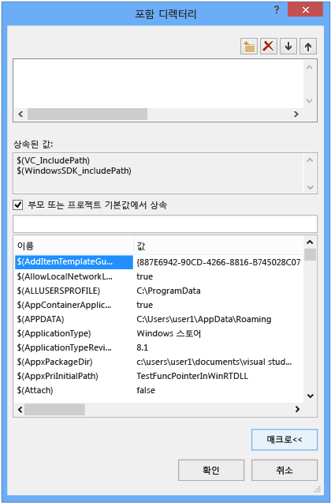
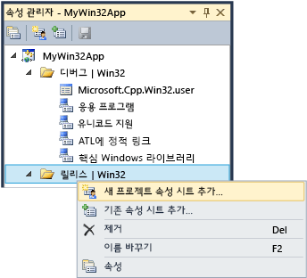

# <a name="working-with-project-properties"></a>프로젝트 속성 사용
IDE, 프로젝트를 빌드하는 데 필요한 모든 정보로 노출 됩니다 *속성*합니다. 이 정보에는 응용 프로그램 이름, 확장명 (예: DLL, LIB, EXE), 컴파일러 옵션, 링커 옵션, 디버거 설정, 사용자 지정 빌드 단계 및 다른 많은 항목이 포함 됩니다. 일반적으로 사용 *속성 페이지* ( **프로젝트 &#124; 속성**)를 보고 하 여 이러한 속성을 수정 합니다. 
  
 프로젝트를 만들 때 다양 한 속성의 값을 지정 합니다. 종류에 따라 다소 다를 기본값 옵션을 및 프로젝트의 응용 프로그램 마법사의 선택 합니다. 예를 들어, ATL 프로젝트에 MIDL 파일과 관련 된 속성이 있지만 absent 이들은 기본적인 콘솔 응용 프로그램에서입니다. 기본 속성은 속성 페이지의 일반 창에 표시 됩니다.  
  
   
  
 응용 프로그램 이름, 같은 일부 속성의 대상 플랫폼 또는 디버그 또는 릴리스 빌드 인지에 관계 없이 모든 빌드 변형에 적용 됩니다. 하지만 대부분의 속성은 구성에 따라 다릅니다. 컴파일러에서 프로그램이 실행 되는 특정 플랫폼을 올바른 코드를 생성 하기 위해 사용 하는 특정 컴파일러 옵션을 알고 있으면 때문입니다. 따라서 속성을 설정 하는 경우 반드시는 구성 및 플랫폼에 적용 해야 새 값에 주의를 기울여야 합니다. Win32 디버그 빌드에만 적용 해야 하거나 해야 것에 적용 디버그 ARM 및 x64 디버그? 예를 들어는 **최적화** , 기본적으로 속성 **속도 최대화 (/ o 2)** 릴리스 구성에서 있지만 디버그 구성에서 사용할 수 없습니다.  
  
 속성 페이지는 구성 및 플랫폼 속성 값을 필요한 경우 수정 하는 경우에 적용 해야 하 고 항상 볼 수 있도록 설계 됩니다. 다음 그림에는 맨 위에 있는 목록 상자에서 속성 페이지 구성 및 플랫폼 정보를 보여 줍니다. 경우는 **최적화** 속성을 설정, 것에 적용 됩니다 Win32 디버그 빌드에는 빨간색 화살표로 표시 된 것 처럼 되는 활성 구성으로 수행 됨.  
  
   
  
 다음 그림은 같은 프로젝트 속성 페이지를 보여 줍니다. 하지만 릴리스 구성이 변경 되었습니다. Note 최적화 속성에 대해 다른 값입니다. 활성 구성이 여전히 디버그 참고도 합니다. 여기; 모든 구성에 대 한 속성을 설정할 수 있습니다. 활성 필요는 없습니다.  
  
   
  
 프로젝트 시스템 자체 MSBuild 파일 형식 및 모든 종류의 프로젝트를 빌드하기 위한 규칙을 정의 하는 기반으로 합니다. MSBuild을 복잡 한 여러 구성 및 플랫폼에 대 한 빌드 관리 하지만 약간 작동 방법에 대 한 이해 하 고 있어야 합니다. 이 다시 사용할 수 있는 공유 하 고 여러 프로젝트로 가져올 수 있는 속성 집합을 만들거나 사용자 지정 구성을 정의 하려는 경우에 특히 중요 합니다.  
  
 프로젝트 속성은 프로젝트 파일 (*.vcxproj)에서 직접 또는 다른 프로젝트 파일 가져오기 및 있는는 기본값을 제공.xml 또는.props 파일에 저장 됩니다. 에서 설명한 것 처럼 동일한 구성에 대 한 동일한 속성 서로 다른 파일에서 다른 값을 할당할 수 있습니다. 프로젝트를 빌드하면 MSBuild 엔진 프로젝트 파일 및 잘 정의 된 순서 (아래 설명 참조)에서 가져온된 모든 파일을 평가 합니다. 각 파일을 평가 하는 대로 모든 속성 값을 해당 파일에 정의 된 기존 값을 재정의 합니다. 지정 되지 않은 모든 값은 이전에 평가 된 파일에서 상속 됩니다. 따라서 속성 페이지를 사용 하 여 속성을 설정 하면 것도 중요 설정 하면에 주의를 기울여야 합니다. .Props 파일에서 "X"로 속성을 설정 하는 경우 프로젝트 파일에서 속성 "Y"로 설정 된 프로젝트 속성을 "Y"로 설정 하 여 작성 합니다. 프로젝트 항목에서 "z".cpp 파일 처럼 동일한 속성을 설정 하는 경우 MSBuild 엔진 "Z" 값을 사용 합니다. 자세한 내용은 참조 [속성 상속](#bkmkPropertyInheritance) 이 문서의 뒷부분에 나오는 합니다.  
  
## <a name="build-configurations"></a>빌드 구성  
 구성을 방금는 임의의 그룹 이름을 지정 하는 속성입니다. Visual Studio 디버그 및 릴리스 구성 이며 각 디버그 빌드 또는 릴리스 빌드에 대해 적절 하 게 다양 한 속성으로 설정 합니다. 사용할 수는 **Configuration Manager** 빌드의 특정 버전에 대 한 그룹 속성을 편리 하 게 사용자 지정 구성을 정의할 수 있습니다. 속성 관리자는 속성을 가진 고급 작업에 사용 하지만 유도 것 여기 속성 구성 시각화는 도움이 되기 때문입니다. 액세스할 **보기 &#124; 속성 관리자** 또는 **보기 &#124; 다른 창 &#124; 속성 관리자** 설정에 따라 합니다. 프로젝트에 각 구성/플랫폼 쌍에 대 한 노드를에 있습니다. 이러한 각 노드에서 해당 구성에 대 한 몇 가지 특정 속성을 설정 하는 속성 시트 (.props 파일)에 대 한 노드입니다.  
  
   
  
 문자 집합 속성 설정 안 함 "" 대신 "유니코드 사용"을 설정 하 고를 클릭 (위 그림 참조) 속성 페이지의 일반 창으로 이동 하는 경우 **확인**, 속성 관리자에 표시 되는 없는 **유니코드지원** 하지만 현재 구성에 대 한 속성 시트 다른 구성에 대 있을 수 있습니다.  
  
 속성 관리자 및 속성 시트에 대 한 자세한 내용은 참조 [재사용 가능 속성 구성을 만드는](#bkmkPropertySheets) 이 문서의 뒷부분에 나오는 합니다.  
  
> [!TIP]
>  .User 파일은 레거시 기능 및 속성을 올바르게 구성/플랫폼에 따라 그룹화 된 상태로 유지 하기 위해 삭제 하는 것이 좋습니다.  
  
## <a name="target-platforms"></a>대상 플랫폼  
 *대상 플랫폼* 장치 및/또는 실행 파일에서 실행 되는 운영 체제의 종류를 참조 합니다. 둘 이상의 플랫폼에 대 한 프로젝트를 빌드할 수 있습니다. C + + 프로젝트에 대 한 사용 가능한 대상 플랫폼 프로젝트;의 종류에 따라 다릅니다. 포함 되지만 간략 Win32, x64, ARM, Android 및 iOS입니다.     **x86** 에 표시 될 수 있는 대상 플랫폼 **Configuration Manager** 동일 **Win32** 네이티브 c + + 프로젝트에서. Win32 32 비트 Windows를 의미 하 고 **x64** 64 비트 Windows를 의미 합니다. 이 두 플랫폼에 대 한 자세한 내용은 참조 [실행 중인 32 비트 응용 프로그램](https://msdn.microsoft.com/library/windows/desktop/aa384249\(v=vs.85\).aspx)합니다.  
  
 **Any CPU** 대상 플랫폼 값에 표시 될 수 있는 **Configuration Manager** ; 네이티브 c + + 프로젝트에 영향을 주지 관련이 C + + /CLI 및 다른.NET 프로젝트 형식입니다. 자세한 내용은 [/CLRIMAGETYPE(CLR 이미지 형식 지정)](../build/reference/clrimagetype-specify-type-of-clr-image.md)을 참조하세요.  
  
## <a name="property-pages"></a>속성 페이지  
 Visual c + + 프로젝트 시스템은 기반 앞서 설명한 것 처럼 [MSBuild](/visualstudio/msbuild/msbuild-properties) 값을 저장 하 고 XML 프로젝트 파일에 기본.props 및.targets 파일입니다. Visual Studio 2015에 대 한 이러한 파일은 %programfiles%\microsoft **\Program Files (x86)\MSBuild\Microsoft.Cpp\v4.0\V140**합니다. Visual Studio 2017 년에 대 한 이러한 파일은 %programfiles%\microsoft  **\\Program Files (x86)\\Microsoft Visual Studio\\2017\\_edition_\\Common7\\ IDE\\VC\\VCTargets**여기서 _edition_ 은 Visual Studio 버전을 설치 합니다. 속성은 고유한 프로젝트에 추가할 수 있는 모든 사용자 지정.props 파일에도 저장 됩니다. 하지 해당 파일을 수동으로 편집 하는 대신 특히 MSBuild의 매우 양호 이해 하지 못하는 경우 상속에 참여 하는 모든 속성을 수정 하려면 IDE에서 속성 페이지를 사용 하는 것이 좋습니다.  
  
 다음 그림에는 Visual C++ 프로젝트에 대한 속성 페이지가 나와 있습니다. 왼쪽된 창에서는 **VC + + 디렉터리 * * * 규칙* 을 선택 하 고 오른쪽 창에 해당 규칙과 연결 된 모든 속성이 나열 합니다. `$(...)` 값 이라고 하지만 *매크로*합니다. 이들은 *하지* C/c + + 매크로 하지만 단순히 컴파일 시간 상수입니다. 매크로에 대해서는 설명의 [속성 페이지 매크로](#bkmkPropertiesVersusMacros) 이 문서의 뒷부분에 나오는 섹션.)  
  
   
  
> [!WARNING]
>  **공용 속성** 이전 버전의 Visual Studio에 있던 제거 되었습니다. 이제 사용할 프로젝트에 대 한 참조를 추가 하려면는 **참조 추가** 대화 상자에 관리 되는 언어의 경우와 동일 합니다. 참조 [프로젝트의 참조 관리](/visualstudio/ide/managing-references-in-a-project)합니다.  
  
#### <a name="to-set-a-property-for-a-project"></a>프로젝트 속성을 설정하려면  
  
1.  대부분의 시나리오에 대 한 사용자 지정 속성 시트를 만들지 않고 프로젝트 수준에서 속성을 설정할 수 있습니다. 주 메뉴에서 선택 **프로젝트 &#124; 속성**에서 프로젝트 노드를 마우스 오른쪽 단추로 클릭 하거나 **솔루션 탐색기** 선택 **속성**합니다.  
  
2.  사용 하 여는 **구성** 및 **플랫폼** 변경 내용을 적용 해야 속성 그룹을 지정 하려면 대화 상자 맨 위에 있는 상자를 나열 합니다. 대부분의 경우에서 **모든 플랫폼** 및 **모든 구성** 선택 하면 됩니다. 다중 선택 일부 구성에 대 한 속성을 설정 하려면에서 해당 **속성 관리자**, 한 다음 바로 가기 메뉴를 열고 선택 **속성**합니다.  
  
 **속성 페이지** 대화 상자에 현재 프로젝트에 적용 되는 속성 페이지만 표시 합니다. 예를 들어, 프로젝트에 .idl 파일이 없는 경우 MIDL 속성 페이지가 표시되지 않습니다.  
  
 속성 페이지에서 속성을 강조 표시 하는 경우 누르면 **F1** 해당 컴파일러 또는 링커 스위치에 대 한 자세한 내용은 참조 항목으로 이동 합니다.  
  
 이 항목의 각 속성 페이지에 대 한 자세한 정보를 찾을 수 있습니다.  
  
-   [일반 속성 페이지(프로젝트)](../ide/general-property-page-project.md)  
  
-   [일반 속성 페이지(파일)](../ide/general-property-page-file.md)  
  
-   [명령줄 속성 페이지](../ide/command-line-property-pages.md)  
  
-   [C++ 디버그 구성에 대한 프로젝트 설정](/visualstudio/debugger/project-settings-for-a-cpp-debug-configuration)  
  
-   [NMake 속성 페이지](../ide/nmake-property-page.md)  
  
-   [링커 속성 페이지](../ide/linker-property-pages.md)  
  
-   [리소스 속성 페이지](../ide/resources-property-pages.md)  
  
-   [MIDL 속성 페이지](../ide/midl-property-pages.md)  
  
-   [웹 참조 속성 페이지](../ide/web-references-property-page.md)  
  
-   [XML 데이터 생성기 도구 속성 페이지](../ide/xml-data-generator-tool-property-page.md)  
  
## <a name="to-quickly-browse-and-search-all-properties"></a>신속 하 게 찾아 검색 모든 속성  
 **모든 옵션** 속성 페이지 (아래에서 **구성 속성 &#124; C/c + +** 에서 노드는 **속성 페이지** 대화 상자) 찾아보고 검색 하는 빠른 방법을 제공 현재 컨텍스트에서 사용할 수 있는 속성입니다. 이 페이지에는 특수 검색 상자 및 결과를 필터링할 수 있는 간단한 구문이 있습니다.  
  
 접두사 없음:  
 속성 이름에서만 검색합니다(부분 문자열 대/소문자 구분 안 함).  
  
 '/' 또는 '-':  
 컴파일러 스위치에서만 검색합니다(접두사 대/소문자 구분 안 함).  
  
 v:  
 값에서만 검색합니다(부분 문자열 대/소문자 구분 안 함).  
  
##  <a name="bkmkPropertiesVersusMacros"></a> 속성 페이지 매크로  
 A *매크로* Visual Studio 또는 MSBuild 시스템에서 정의 된 값 또는 사용자 정의 값을 참조할 수 있는 컴파일 타임 상수입니다. 디렉터리 경로와 같이 하드 코딩된 값 대신에 매크로를 사용하여 컴퓨터 간 속성 설정과 Visual Studio 버전 간의 속성 설정을 좀 더 쉽게 공유할 수 있고 프로젝트 설정이 제대로 속성 상속에 참여할 수 있도록 확인합니다. 모든 사용 가능한 매크로의 값을 보려면 속성 편집기를 사용할 수 있습니다.  
  
### <a name="predefined-macros"></a>미리 정의된 매크로  
 전역 매크로  
 프로젝트 구성의 모든 항목에 적용됩니다. `$(name)` 구문이 있습니다. 전역 매크로의 예제는 `$(VCInstallDir)`이며, Visual Studio 설치의 루트 디렉터리에 저장됩니다. 전역 매크로는 MSBuild의 `PropertyGroup`에 해당합니다.  
  
 항목 매크로  
 `%(name)` 구문이 있습니다. 파일에 대한 항목 매크로는 해당 파일에만 적용됩니다. 예를 들어, `%(AdditionalIncludeDirectories)`를 사용하여 특정 파일에만 적용되는 포함 디렉터리를 지정하고 포함할 수 있습니다. 이러한 종류의 항목 매크로는 MSBuild의 `ItemGroup` 메타데이터에 해당합니다. 프로젝트 구성의 컨텍스트에서 사용되면 항목 매크로는 특정 형식의 모든 파일에 적용됩니다. 예를 들어, C/c + + **전처리기 정의** 구성 속성은 사용할 수는 `%(PreprocessorDefinitions)` 프로젝트의 모든.cpp 파일에 적용 되는 항목 매크로입니다. 이러한 종류의 항목 매크로는 MSBuild의 `ItemDefinitionGroup` 메타데이터에 해당합니다. 자세한 내용은 [항목 정의](/visualstudio/msbuild/item-definitions)를 참조하세요.  
  
### <a name="user-defined-macros"></a>사용자 정의 매크로  
 만들 수 있습니다 *사용자 정의 매크로* 프로젝트 빌드에서 변수로 사용 하도록 합니다. 예를 들어, 사용자 지정 빌드 단계 또는 사용자 지정 빌드 도구에 가치를 제공하는 사용자 정의 매크로를 만들 수 있습니다. 사용자 정의 매크로는 이름/값 쌍입니다. 프로젝트 파일에서 사용 하 여는 **$(***이름***)** 값에 액세스 하는 표기법입니다.  
  
 사용자 정의 매크로는 속성 시트에 저장됩니다. 프로젝트에 포함 되어 있지 않은 속성 시트를 아래 단계에 따라 하나를 만들 수 있습니다 [재사용 가능 속성 구성을 만드는](#bkmkPropertySheets)합니다.  
  
##### <a name="to-create-a-user-defined-macro"></a>사용자 정의 매크로를 만들려면  
  
1.  에 **속성 관리자** 창 (메뉴 모음에서 **보기**, **속성 관리자**)을 속성 시트 (이름 끝에.user)에 대 한 바로 가기 메뉴를 열고 다음을 선택 속성입니다. **속성 페이지** 해당 속성 시트에 대 한 대화 상자가 열립니다.  
  
2.  대화 상자의 왼쪽된 창에서 선택 **사용자 매크로**합니다. 오른쪽 창에서 선택 된 **매크로 추가** 버튼을 클릭은 **사용자 매크로 추가** 대화 상자.  
  
3.  대화 상자에서 매크로에 대한 이름 및 값을 지정합니다. 필요에 따라 선택 된 **이 매크로 빌드 환경의 환경 변수로 설정** 확인란 합니다.  
  
## <a name="property-editor"></a>속성 편집기  
 속성 편집기를 사용하여 특정 문자열 속성을 수정하고 값으로 매크로를 선택할 수 있습니다. 속성 편집기에 액세스하려면 속성 페이지에서 속성을 선택한 후 오른쪽에 있는 아래쪽 화살표 단추를 선택합니다. 드롭다운 목록에 포함 되어 있으면  **\<편집 >**, 해당 속성에 대 한 속성 편집기를 표시 하도록 선택할 수 있습니다.  
  
   
  
 속성 편집기에서 수 있습니다는 **매크로** 단추를 사용할 수 있는 매크로 및 현재 값입니다. 다음 그림에 대 한 속성 편집기를 보여 줍니다.는 **추가 포함 디렉터리** 후의 **매크로** 단추 선택 합니다. 경우는 **부모 또는 프로젝트 기본값에서 상속** 확인란을 선택 하 고 새 값을 추가 하 고, 현재 상속 되는 모든 값에 추가 됩니다. 확인란의 선택을 취소하면 새 값이 상속된 값을 대체합니다. 대부분의 경우 확인란을 선택한 상태로 둡니다.  
  
   
  
##  <a name="bkmkPropertySheets"></a> 다시 사용할 수 있는 속성 구성 만들기  
 "전역" 속성을 사용자별, 컴퓨터별로 설정할 수 있지만 이는 권장되지 않습니다. 사용 하는 권장 대신 **속성 관리자** 만들려는 *속성 시트* 각 재사용 하거나 다른 사용자와 공유할 수 있게 되기를 원하는 프로젝트 종류에 대 한 설정을 저장 합니다. 또한 속성 시트를 사용하면 기타 프로젝트 형식에 대한 속성 설정이 실수로 변경될 가능성이 줄어듭니다. 속성 시트에서 자세히 설명 되어 [재사용 가능 속성 구성을 만드는](#bkmkPropertySheets)합니다.  
  
> [!IMPORTANT]
>  **.user 파일 및 문제가 되는 이유**  
>   
>  .User 파일 이름 확장명을 가지 며에 있는 전역 속성 시트를 사용 하는 이전 버전의 Visual Studio는 \<userprofile > \AppData\Local\Microsoft\MSBuild\v4.0\ 폴더입니다. 이러한 파일은 사용자 단위 및 컴퓨터 단위로 프로젝트 구성에 대한 속성을 설정하므로 더 이상 사용하지 않는 것이 좋습니다. 이러한 "전역" 설정은 특히 빌드 컴퓨터에서 두 개 이상의 플랫폼을 대상으로 할 때 빌드를 방해할 수 있습니다. 예를 들어, MFC 프로젝트와 Windows Phone 프로젝트를 둘 다 가지고 있을 경우 둘 중 하나에 대해 .user 속성이 잘못 지정됩니다. 다시 사용할 수 있는 속성 시트는 보다 유연하고 보다 강력합니다.  
>   
>  .user 파일은 Visual Studio에 의해 설치되고 속성 상속성에 참가하지만 기본적으로 비어 있습니다. 자신에 대 한 참조를 삭제 하는 것이 좋습니다 **속성 관리자** 프로젝트 당 사용자와 독립적으로 작동 하는지, 컴퓨터별 설정 것은 SCC (소스 코드에서에서 올바른 동작을 보장 하 제어) 환경입니다.  
  
 표시 하려면 **속성 관리자**, 메뉴 모음에서 **보기**, **다른 창**, **속성 관리자**합니다.  
  
 사용할 수 있는 여러 프로젝트에 적용 하려는 속성의 집합을 일반적으로 자주 사용 되는 경우 **속성 관리자** 재사용에 모아 두면를 *속성 시트* 파일 규칙 .props 파일 이름 확장명입니다. 해당 속성을 처음부터 설정하지 않아도 되도록 시트를 새 프로젝트에 적용할 수 있습니다. 에 액세스 하려면 **속성 관리자**, 메뉴 모음에서 **보기**, **속성 관리자**합니다.  
  
   
  
 각 구성 노드를 해당 구성에 적용 되는 각 속성 시트에 대 한 노드가 표시 됩니다. 프로젝트를 만들 때 응용 프로그램 마법사에서 선택한 옵션에 따라 값을 설정 하는 속성 시트 추가 됩니다. 임의의 노드를 마우스 오른쪽 단추로 클릭 하 고 해당 노드에 적용 되는 속성을 보려면 속성을 선택 합니다. 모든 속성 시트 자동으로 프로젝트의 "마스터" 속성 시트 (ms.cpp.props)으로 가져오며 속성 관리자에서 나타나는 순서 대로 평가 됩니다. 평가 순서를 변경 하려면를 이동할 수 있습니다. 나중에 계산 되는 속성 시트는 이전에 평가 시트에 있는 값을 재정의 합니다.  
  
 선택 하면 **새 프로젝트 속성 시트 추가** 다음 select 예를 들어, MyProps.props 속성 시트 속성 페이지 대화 상자가 나타납니다. MyProps 속성 시트에 적용됩니다. 모든 변경 사항은 프로젝트 파일(.vcxproj)이 아닌 시트에 기록됩니다.  
  
 .Vcxproj 파일에서 직접 동일한 속성을 설정하는 경우 속성 시트에서 속성은 무시됩니다.  
  
 필요할 때마다 속성 시트를 가져올 수 있습니다. 솔루션의 여러 프로젝트가 동일한 속성 시트에서 설정을 상속할 수 있으며 프로젝트가 여러 시트를 가질 수 있습니다. 속성 시트 자체는 다른 속성 시트에서 설정을 상속할 수 있습니다.  
  
 또한 여러 구성에 대한 속성 시트를 만들 수도 있습니다. 이 수행 하려면 각 구성에 대 한 속성 시트 만들기, 그 중 하나에 대 한 바로 가기 메뉴를 열고, 선택 **기존 속성 시트 추가**를 선택한 후 다른 시트를 추가 합니다. 그러나 하나의 공통 속성 시트를 사용하는 경우 속성을 설정하면 시트가 적용되는 모든 구성에 속성이 설정되며 IDE는 지정된 속성 시트에서 어느 프로젝트나 기타 속성 시트가 상속되는지 보여 주지 않습니다.  
  
 프로젝트가 많은 큰 솔루션에서는 솔루션 수준에 속성 시트를 만드는 것이 유용할 수 있습니다. 솔루션에 프로젝트를 추가할 때 사용 **속성 관리자** 프로젝트에 해당 속성 시트를 추가할 수 있습니다. 프로젝트 수준에서 필요한 경우 새 프로젝트에 특정 값을 설정하기 위해 새 속성 시트를 추가할 수 있습니다.  
  
> [!IMPORTANT]
>  기본적으로 .props 파일은 프로젝트 항목으로 만들어지지 않았기 때문에 소스 제어에 참가하지 않습니다. 파일을 소스 제어에 포함하려는 경우 솔루션 항목으로 수동으로 추가할 수 있습니다.  
  
#### <a name="to-create-a-property-sheet"></a>속성 시트를 만들려면  
  
1.  메뉴 모음에서 **보기**, **속성 관리자**합니다. **속성 관리자** 열립니다.  
  
2.  속성 시트의 범위를 정의하려면 적용되는 항목을 선택합니다. 이는 특정 구성 또는 다른 속성 시트일 수 있습니다. 이 항목에 대 한 바로 가기 메뉴를 연 다음 선택 **새 프로젝트 속성 시트 추가**합니다. 이름과 위치를 지정합니다.  
  
3.  **속성 관리자**을 새 속성 시트를 열고 포함할 속성을 설정 합니다.  
  
##  <a name="bkmkPropertyInheritance"></a> 속성 상속  
 프로젝트 속성이 계층화됩니다. 각 레이어는 이전 레이어의 값을 상속하지만, 속성을 명시적으로 설정하여 이 값을 재정의할 수 있습니다. 다음은 기본 상속 트리입니다.  
  
1.  MSBuild CPP 도구 집합의 기본 설정(.vcxproj 파일에서 가져온 ..\Program Files\MSBuild\Microsoft.Cpp\v4.0\Microsoft.Cpp.Default.props)  
  
2.  속성 시트  
  
3.  .vcxproj 파일. 기본 및 속성 시트 설정을 재정의할 수 있습니다.  
  
4.  항목 메타데이터  
  
> [!TIP]
>  속성 페이지에서 속성 `bold` 현재 컨텍스트에서 정의 됩니다. 일반 글꼴의 속성이 상속됩니다.  
  
 프로젝트 파일(.vcxproj)은 빌드 시 다른 속성 시트를 가져옵니다. 모든 속성 시트를 가져온 후 프로젝트 파일이 평가되고 속성 값의 마지막 정의가 사용됩니다. 확장된 파일을 보고 지정된 속성 값의 상속 방법을 결정하는 것이 유용한 경우도 있습니다. 확장 버전을 보려면 Visual Studio 명령 프롬프트에서 다음 명령을 입력합니다. 자리 표시자 파일 이름을 사용할 이름으로 변경합니다.  
  
 **msbuild /pp:** *temp* **.txt** *myapp* **.vcxproj**  
  
 확장된 프로젝트 파일은 클 수 있으며 MSBuild를 잘 알고 있지 않은 한 이해하기 어렵습니다. 프로젝트 파일의 기본 구조는 다음과 같음:  
  
1.  IDE에 노출되지 않는 기본 프로젝트 속성입니다.  
  
2.  일부 기본 toolset-independent 속성을 정의하는 Microsoft.cpp.default.props의 가져오기.  
  
3.  전역 구성 속성 (으로 노출 **PlatformToolset** 및 **프로젝트** 기본 속성에는 **구성 일반** 페이지. 이러한 속성은 다음 단계에서 어떤 도구 집합 및 내장 속성 시트를 Microsoft.cpp.props로 가져오게 하는지를 결정합니다.  
  
4.  대부분의 프로젝트 기본값을 설정하는 Microsoft.cpp.props의 가져오기.  
  
5.  .user 파일을 포함하여 모든 속성 시트를 가져옵니다. 이 속성 시트를 제외한 모든 항목을 재정의할 수는 **PlatformToolset** 및 **프로젝트** 기본 속성입니다.  
  
6.  프로젝트 구성 속성의 나머지입니다. 이러한 값은 속성 시트에서 설정된 것을 재정의할 수 있습니다.  
  
7.  메타데이터와 함께 있는 항목(파일)입니다. 이러한 값이 다른 속성과 가져오기보다 앞에 있더라도 항상 MSBuild 실행 규칙의 마지막 단어입니다.  
  
 자세한 내용은 [MSBuild 속성](/visualstudio/msbuild/msbuild-properties)을 참조하세요.  
  
## <a name="adding-an-include-directory-to-the-set-of-default-directories"></a>기본 디렉터리 집합에 포함 디렉터리 추가  
 포함 디렉터리를 프로젝트에 추가할 때 모든 기본 디렉터리를 재정의하지 않는 것이 중요합니다. 디렉터리를 추가 하는 올바른 방법은 예를 들어 새 경로 추가 하는 "C:\MyNewIncludeDir\", 한 다음 추가 **$ (includepath)** 매크로에 속성 값입니다.  
  
## <a name="setting-environment-variables-for-a-build"></a>빌드에 대한 환경 변수 설정  
 Visual C++ 컴파일러(cl.exe)는 특정 환경 변수, 특히 LIB, LIBPATH, PATH 및 INCLUDE를 인식합니다. 속성에 설정 된 IDE로 빌드하면는 [VC + + 디렉터리 속성 페이지](../ide/vcpp-directories-property-page.md) 속성 페이지는 환경 변수를 설정 하는 데 사용 됩니다. 개발자 명령 프롬프트가 LIB, LIBPATH 및 INCLUDE 값을 설정하는 경우 해당 값을 MSBuild 속성 값으로 대체합니다. 그러면 빌드에서 VC++ 디렉터리 실행 가능 디렉터리 속성 값을 PATH에 추가합니다. 사용자 정의 매크로 한다는 확인란을 선택 하 여 사용자 정의 환경 변수를 설정할 수 있습니다 **이 매크로 빌드 환경의 환경 변수로 설정**합니다.  
  
## <a name="setting-environment-variables-for-a-debugging-session"></a>디버깅 세션에 대한 환경 변수 설정  
 프로젝트의 왼쪽된 창에서 **속성 페이지** 대화 상자에서 **구성 속성** 선택한 후 **디버깅**합니다. 
  
 오른쪽 창에서 수정 된 **환경** 또는 **환경 병합** 프로젝트 설정을 선택한 후는 **확인** 단추입니다.  

## <a name="modifying-properties-and-targets-without-changing-the-project-file"></a>프로젝트 파일을 변경 하지 않고 속성 및 대상 수정
프로젝트 속성 및 MSBuild 명령 프롬프트에서 대상 프로젝트 파일을 변경 하지 않고 재정의할 수 있습니다. 일시적으로 또는 경우에 따라 일부 속성을 적용 하려는 경우에 유용 합니다. MSBuild에 대 한 지식을 가정합니다. 자세한 내용은 참조 [MSBUild](https://docs.microsoft.com/en-us/visualstudio/msbuild/msbuild)합니다.

> [!IMPORTANT]
> .Props 또는.targets 파일을 만들려면 Visual Studio 또는 임의의 텍스트 편집기에서 XML 편집기를 사용할 수 있습니다. 사용 하지 마십시오는 **속성 관리자** 이 시나리오에서는 프로젝트 파일에 속성을 추가 하 여 합니다.

*프로젝트 속성을 재정의 합니다.*
- 재정의 속성을 지정 하는.props 파일을 만듭니다. 
- 명령 프롬프트에서: ForceImportBeforeCppTargets="C:\sources\my_props.props 설정"
 
*프로젝트의 대상 재정의 하려면:*
1) 구현 또는 특정 대상으로.targets 파일 만들기
2) 명령 프롬프트에서: ForceImportAfterCppTargets 설정 "C:\sources\my_target.targets" =
 
/P: 옵션을 사용 하 여 msbuild 명령줄에서 두 옵션 중 하나를 설정할 수도 있습니다.

```cmd
> msbuild myproject.sln /p:ForceImportBeforeCppTargets="C:\sources\my_props.props" 
> msbuild myproject.sln /p:ForceImportAfterCppTargets="C:\sources\my_target.targets" 
```  

속성 및 이러한 방식으로 대상 재정의 솔루션의 모든.vcxproj 파일에 다음 가져오기를 추가 하는 것과 결과가 같습니다.

```cmd 
<Import Project=="C:\sources\my_props.props" />
<Import Project="$(VCTargetsPath)\Microsoft.Cpp.targets" />
<Import Project==" C:\sources\my_target.targets"" />
```  

## <a name="see-also"></a>참고 항목  
 [Visual c + + 프로젝트 만들기 및 관리](../ide/creating-and-managing-visual-cpp-projects.md) [.vcxproj 및.props 파일 구조](vcxproj-file-structure.md) [속성 페이지 XML 파일](property-page-xml-files.md)