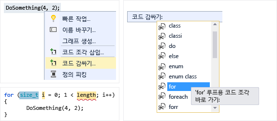
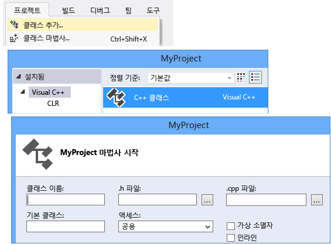
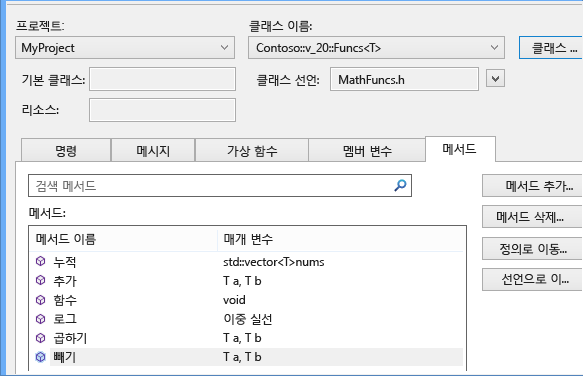
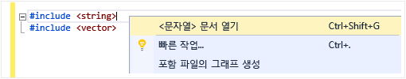
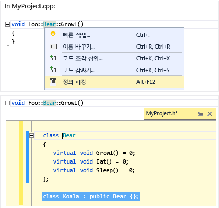
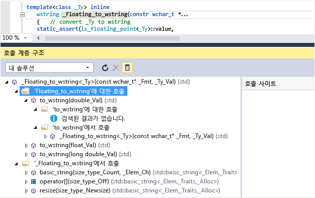
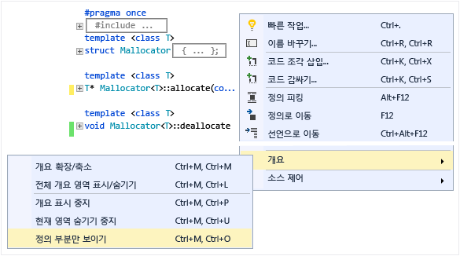
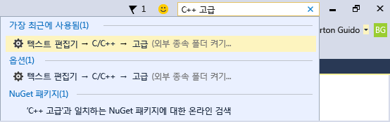

# 코드 작성 및 리팩터링(C++)

Visual C++ 코드 편집기 및 IDE에서는 많은 코딩 보조 기능을 제공합니다. 일부는 C++에 고유하고, 일부는 기본적으로 모든 Visual Studio 언어에서 동일합니다. 공유 기능에 대 한 자세한 내용은 참조 [코드 및 텍스트 편집기에서 코드 작성](/visualstudio/ide/writing-code-in-the-code-and-text-editor)합니다. 사용 하도록 설정 하 고 c + +와 관련 된 기능을 구성 하기 위한 옵션에는 [텍스트 편집기 c + + 고급](/visualstudio/ide/reference/options-text-editor-c-cpp-advanced) 대화 (**도구 &#124; 옵션 &#124; 텍스트 편집기 &#124; C/c + + &#124; 고급** "c + + 고급" 입력 또는 **빠른 실행**). 설정 하려는 옵션을 선택한 후 키를 눌러 자세한 도움말을 볼 수 있습니다 **F1** 대화 상자에 초점이 맞춰져 때. 일반적인 코드 서식 옵션에 대 한 입력 `Editor C++` 에 **빠른 실행**합니다.

실험적 기능 수도 이후 버전의 Visual Studio에 포함 되지 않을 수 있습니다 있습니다에서 발견 되는 [텍스트 편집기 c + + 실험적](/visualstudio/ide/reference/options-text-editor-c-cpp-experimental) 대화 상자. Visual Studio 2017에서 활성화할 수 **예측 Intellisense** 이 대화 상자.

## 새 코드 추가

프로젝트를 만든 후에 생성된 파일에 대한 코드를 시작할 수 있습니다. 새 파일을 추가 하려면 솔루션 탐색기에서 프로젝트 노드를 마우스 오른쪽 단추로 클릭 하 고 선택 **추가 &#124; 새로**합니다.

들여쓰기, 중괄호 완성 및 색 지정 같은 서식 옵션을 설정 하려면 입력 `C++ Formatting` 에 **빠른 실행** 창.

### IntelliSense

IntelliSense는 멤버, 형식 및 함수 오버로드에 대한 인라인 정보를 제공하는 기능 집합의 이름입니다. 다음 그림에서는 입력할 때 표시되는 멤버 목록 드롭다운을 보여 줍니다. tab 키를 눌러 선택한 항목 텍스트를 코드 파일에 입력할 수 있습니다.

완전 한 정보를 참조 하십시오. [Visual c + + Intellisense](/visualstudio/ide/visual-cpp-intellisense)합니다.

### 코드 조각 삽입

코드 조각은 소스 코드의 미리 정의된 조각입니다. 단일 지점이나 선택한 텍스트를 마우스 오른쪽 단추로 클릭하여 코드 조각을 삽입하거나 선택한 텍스트를 코드 조각으로 둘러쌉니다. 다음 그림에서는 선택한 문을 for 루프로 둘러싸는 세 단계를 보여 줍니다. 최종 이미지의 노란색 강조 표시는 tab 키를 사용하여 액세스하는 편집 가능한 필드입니다. 자세한 내용은 [코드 조각](/visualstudio/ide/code-snippets)을 참조하세요.

### 클래스 추가

새 클래스 추가 **프로젝트** 클래스 마법사를 사용 하 여 메뉴.

### 클래스 마법사

클래스 마법사를 사용하여 기존 클래스를 수정 또는 검사하거나 새 클래스를 추가합니다. 자세한 내용은 참조 [기능 추가와 코드 마법사 (c + +)](../ide/adding-functionality-with-code-wizards-cpp.md)합니다.

## 리팩터링

리팩터링 빠른 작업 상황에 맞는 메뉴에서 또는 클릭 하 여 사용할 수 있는 한 [전구](/visualstudio/ide/perform-quick-actions-with-light-bulbs) 편집기에서.  발견 되 일부는 **편집 > 리팩터링** 메뉴.  이러한 기능에는 다음이 포함됩니다.

* [이름 바꾸기](refactoring/rename.md)
* [함수 추출](refactoring/extract-function.md)
* [순수 가상 구현](refactoring/implement-pure-virtuals.md)
* [선언/정의 만들기](refactoring/create-declaration-definition.md)
* [함수 정의 이동](refactoring/move-definition-location.md)
* [원시 문자열 리터럴로 변환](refactoring/convert-to-raw-string-literal.md)
* [시그니처 변경](refactoring/change-signature.md)

## 탐색 및 이해

Visual c + +는 다른 언어와 많은 코드 탐색 기능을 공유합니다. 자세한 내용은 참조 [코드 탐색](/visualstudio/ide/navigating-code) 및 [코드 구조 보기](/visualstudio/ide/viewing-the-structure-of-code)합니다.

### QuickInfo

변수를 마우스로 가리켜 형식 정보를 확인합니다.

### 문서 열기(헤더로 이동)

`#include` 지시문에서 헤더 이름을 마우스 오른쪽 단추로 클릭하고 헤더 파일을 엽니다.

### 정의 피킹(Peeking)

변수 또는 함수 선언을 마우스로 마우스 오른쪽 단추로 클릭 한 다음 선택 **정의 피킹** 해당 정의의 인라인 뷰를 볼 수 있습니다. 자세한 내용은 참조 [정의 피킹 (Alt + F12)](/visualstudio/ide/how-to-view-and-edit-code-by-using-peek-definition-alt-plus-f12)합니다.

### 정의로 이동

변수 또는 함수 선언을 마우스로 마우스 오른쪽 단추로 클릭 한 다음 선택 **정의로 이동** 개체가 정의 된 문서를 엽니다.

### 호출 계층 구조 보기

함수 호출을 마우스 오른쪽 단추로 클릭하고 함수가 호출하는 모든 함수와 함수를 호출하는 모든 함수의 재귀적 목록을 표시합니다. 목록의 각 함수를 동일한 방식으로 확장할 수 있습니다. 자세한 내용은 참조 [호출 계층 구조](/visualstudio/ide/reference/call-hierarchy)합니다.

### 헤더/코드 파일 전환

마우스 오른쪽 단추로 클릭 하 고 선택 **토글 헤더 / 코드 파일** 를 헤더 파일 및 관련 된 코드 파일 간에 전환 하려면.

### 개요

소스 코드 파일에서 아무 곳 이나 마우스 오른쪽 단추로 클릭 하 고 선택 **개요** 정의 및/또는 찾아보기에 관심 있는 부분만 쉽게 사용자 지정 영역을 확장 하거나 축소 합니다. 자세한 내용은 [개요](/visualstudio/ide/outlining)를 참조하세요.

### 스크롤 막대 맵 모드

스크롤 막대 맵 모드를 사용하면 실제로 현재 위치를 벗어나지 않고 코드 파일을 신속하게 스크롤하여 찾아볼 수 있습니다. 또는 코드 맵의 아무 곳이나 클릭하여 해당 위치로 직접 이동합니다.

### 포함 파일의 그래프 생성

프로젝트에서 코드 파일을 마우스 오른쪽 단추로 클릭 하 고 선택 **포함 파일의 그래프 생성** 다른 파일에서 포함 된 파일의 그래프를 볼 수 있습니다.

### F1 도움말

형식, 키워드 또는 함수 위나 바로 뒤에 커서를 놓고 F1 키를 눌러 관련된 MSDN 참조 항목으로 바로 이동합니다. F1 키는 많은 대화 상자와 오류 목록의 항목에서도 작동합니다.

### 빠른 실행

Visual Studio에서 임의 창이나 도구로 쉽게 이동하려면 UI의 오른쪽 위에 있는 빠른 실행 창에 해당 이름을 입력합니다. 입력에 따라 자동 완성 목록이 필터링됩니다.

