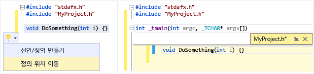
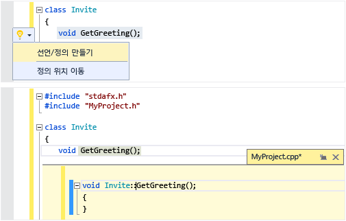
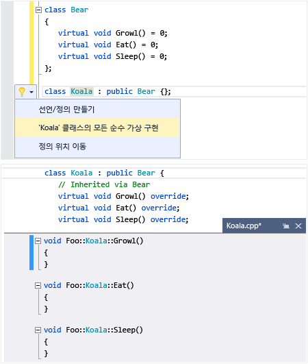
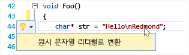
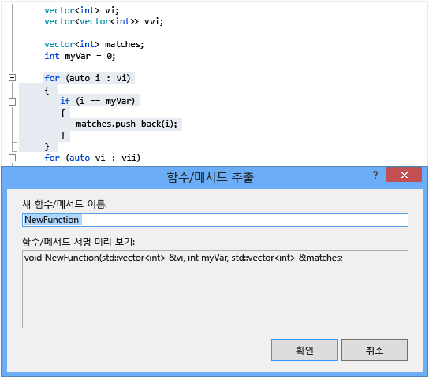

# 코드 작성 및 리팩터링(C++)
[!INCLUDE[vs2017banner](../assembler/inline/includes/vs2017banner.md)]

Visual C\+\+ 코드 편집기 및 IDE에서는 많은 코딩 보조 기능을 제공합니다.  일부는 C\+\+에 고유하고, 일부는 기본적으로 모든 Visual Studio 언어에서 동일합니다.  이러한 기능을 사용하도록 설정하고 구성하는 옵션은 텍스트 편집기 C\+\+ 고급 대화 상자\(**도구 &#124; 옵션 &#124; 텍스트 편집기 &#124; C\/C\+\+ &#124; 고급** 또는 **빠른 실행**에서 "C\+\+ 고급" 입력\)에 있습니다.  설정하려는 옵션을 선택한 후 대화 상자에 초점이 맞춰져 있을 때 **F1**을 누르면 추가 도움말을 확인할 수 있습니다.  일반적인 코드 서식 지정 옵션의 경우 **빠른 실행**에 `Editor C++`을 입력합니다.  
  
## 새 코드 추가  
 프로젝트를 만든 후에 생성된 파일에 대한 코드를 시작할 수 있습니다.  새 파일을 추가하려면 솔루션 탐색기에서 프로젝트 노드를 마우스 오른쪽 단추로 클릭하고 **추가 &#124; 새로 만들기**를 선택합니다.  
  
 들여쓰기, 중괄호 완성 및 색 지정과 같은 서식 지정 옵션을 설정하려면 **빠른 실행** 창에 `C++ Formatting`을 입력합니다.  
  
### IntelliSense  
 IntelliSense는 멤버, 형식 및 함수 오버로드에 대한 인라인 정보를 제공하는 기능 집합의 이름입니다.  다음 그림에서는 입력할 때 표시되는 멤버 목록 드롭다운을 보여 줍니다.  tab 키를 눌러 선택한 항목 텍스트를 코드 파일에 입력할 수 있습니다.  
  
   
  
 자세한 내용은 [Visual C\+\+ IntelliSense](../Topic/Visual%20C++%20Intellisense.md)를 참조하세요.  
  
### 코드 조각 삽입  
 코드 조각은 소스 코드의 미리 정의된 조각입니다.  단일 지점이나 선택한 텍스트를 마우스 오른쪽 단추로 클릭하여 코드 조각을 삽입하거나 선택한 텍스트를 코드 조각으로 둘러쌉니다.  다음 그림에서는 선택한 문을 for 루프로 둘러싸는 세 단계를 보여 줍니다.  최종 이미지의 노란색 강조 표시는 tab 키를 사용하여 액세스하는 편집 가능한 필드입니다.  자세한 내용은 [코드 조각](../Topic/Code%20Snippets.md)을 참조하세요.  
  
   
  
### 클래스 추가  
 클래스 마법사를 사용하여 **프로젝트** 메뉴에서 새 클래스를 추가합니다.  
  
   
  
### 클래스 마법사  
 클래스 마법사를 사용하여 기존 클래스를 수정 또는 검사하거나 새 클래스를 추가합니다.  자세한 내용은 [코드 마법사로 기능 추가\(C\+\+\)](../ide/adding-functionality-with-code-wizards-cpp.md)를 참조하세요.  
  
   
  
## 리팩터링  
 리팩터링은 빠른 작업 상황에 맞는 메뉴 항목 아래에서 또는 편집기에서 [전구](../Topic/Perform%20quick%20actions%20with%20light%20bulbs.md)를 클릭하여 사용할 수 있습니다.  
  
### 이름 바꾸기  
 지정된 범위에서 사용되는 곳마다 형식, 함수 또는 변수의 이름을 바꿉니다.  다음 그림에서는 파생 클래스와 기본 클래스 둘 다에서 `Eat` 메서드의 이름이 `Devour`로 바뀝니다.  
  
   
  
### 빠른 작업: 정의 위치 이동  
 코드 파일과 이름이 같은 헤더 파일로 하나 이상의 함수 정의를 이동합니다.  아직 없으면 헤더가 새로 생성됩니다.  결과 정의가 피크\(Peek\) 창에 인라인으로 표시됩니다.  
  
   
  
### 빠른 작업: 선언\/정의 만들기  
 선택한 헤더 선언에 연결된 코드 파일에서 하나 이상의 정의를 만듭니다.  
  
   
  
### 빠른 작업: 클래스의 모든 순수 가상 구현  
 클래스에서 상속된 모든 가상 함수에 대해 빈 구현 스텁을 빠르게 생성합니다.  특정 기본 클래스의 가상 함수만 구현하려면 파생 클래스 선언에서 기본 클래스를 강조 표시하면 됩니다.  
  
   
  
### 원시 문자열 리터럴로 변환  
 문자열 리터럴 위에 커서를 놓을 경우 마우스 오른쪽 단추를 클릭하고 **빠른 작업 &#124; 원시 문자열 리터럴로 변환**을 선택하여 일반 문자열을 C\+\+ 11 원시 문자열 리터럴로 변환할 수 있습니다.  
  
   
  
### Extract 함수\(Visual Studio 확장\)  
 [Visual Studio 갤러리에서 확장](https://visualstudiogallery.msdn.microsoft.com/a081dc8c-c805-4589-9b8b-c2c309a05789)\(영문\)으로 제공되는 추출 함수 기능을 사용하여 코드의 한 섹션을 자체 함수로 이동하고 코드를 해당 함수의 호출로 바꿉니다.  
  
   
  
## 탐색 및 이해  
  
### QuickInfo  
 변수를 마우스로 가리켜 형식 정보를 확인합니다.  QuickInfo  
  
   
  
### 문서 열기\(헤더로 이동\)  
 `#include` 지시문에서 헤더 이름을 마우스 오른쪽 단추로 클릭하고 헤더 파일을 엽니다.  
  
   
  
### 정의 피킹  
 변수 또는 함수 선언을 마우스로 가리키고 마우스 오른쪽 단추를 클릭한 다음 **정의 피킹\(Peeking\)**을 선택하여 해당 정의의 인라인 뷰를 표시합니다.  자세한 내용은 [정의 피킹\(Peeking\) \(Alt\+F12\)](../Topic/How%20to:%20View%20and%20Edit%20Code%20by%20Using%20Peek%20Definition%20\(Alt+F12\).md)을 참조하세요.  
  
   
  
### 정의로 이동  
 변수 또는 함수 선언을 마우스로 가리키고 마우스 오른쪽 단추를 클릭한 다음 **정의로 이동**을 선택하여 개체가 정의된 문서를 엽니다.  
  
### 호출 계층 구조 보기  
 함수 호출을 마우스 오른쪽 단추로 클릭하고 함수가 호출하는 모든 함수와 함수를 호출하는 모든 함수의 재귀적 목록을 표시합니다.  목록의 각 함수를 동일한 방식으로 확장할 수 있습니다.  자세한 내용은 [호출 계층 구조](../Topic/Call%20Hierarchy.md)를 참조하세요.  
  
   
  
### 헤더\/코드 파일 전환  
 마우스 오른쪽 단추를 클릭하고 헤더\/코드 파일 전환을 선택하여 헤더 파일 및 연결된 코드 파일 간에 전환합니다.  
  
### 개요  
 소스 코드 파일의 아무 곳이나 마우스 오른쪽 단추로 클릭하고 **개요**를 선택하여 정의 및\/또는 사용자 지정 영역을 축소하거나 확장하면 관심 있는 부분만 쉽게 찾을 수 있습니다.  자세한 내용은 [개요](../Topic/Outlining.md)를 참조하세요.  
  
   
  
### 스크롤 막대 맵 모드  
 스크롤 막대 맵 모드를 사용하면 실제로 현재 위치를 벗어나지 않고 코드 파일을 신속하게 스크롤하여 찾아볼 수 있습니다.  또는 코드 맵의 아무 곳이나 클릭하여 해당 위치로 직접 이동합니다.  
  
   
  
### 포함 파일의 그래프 생성  
 프로젝트에서 코드 파일을 마우스 오른쪽 단추로 클릭하고 **포함 파일의 그래프 생성**을 선택하여 다른 파일에 포함된 파일의 그래프를 표시합니다.  
  
   
  
### F1 도움말  
 형식, 키워드 또는 함수 위나 바로 뒤에 커서를 놓고 F1 키를 눌러 관련된 MSDN 참조 항목으로 바로 이동합니다.  F1 키는 많은 대화 상자와 오류 목록의 항목에서도 작동합니다.  
  
### 빠른 실행  
 Visual Studio에서 임의 창이나 도구로 쉽게 이동하려면 UI의 오른쪽 위에 있는 빠른 실행 창에 해당 이름을 입력합니다.  입력에 따라 자동 완성 목록이 필터링됩니다.  
  
 