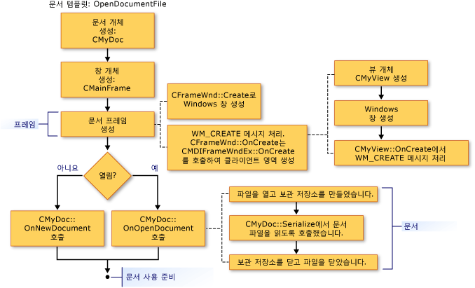

# 새 문서, 창 및 뷰 만들기
다음 그림에서는 문서, 뷰 및 프레임 창에 대 한 생성 프로세스의 개요를 제공합니다. 프로그램에 참여 하는 개체에 집중 하는 다른 문서는 추가 세부 정보를 제공 합니다.  
  
 이 프로세스를 완료 하면 협동 개체가 존재 하 고 서로에 대 한 포인터를 저장 합니다. 다음 그림은 개체가 생성 되는 순서를 보여 줍니다. 그림에는 순서를 따를 수 있습니다.  
  
   
문서를 만드는 순서  
  
   
프레임 창을 만드는 순서  
  
   
뷰를 만드는 순서  
  
 프레임 워크를 새 문서, 뷰 및 프레임 창 개체를 초기화 하는 방법에 대 한 정보에 대 한 클래스를 참조 하십시오. [CDocument](../mfc/reference/cdocument-class.md), [CView](../mfc/reference/cview-class.md), [CFrameWnd](../mfc/reference/cframewnd-class.md), [CMDIFrameWnd](../mfc/reference/cmdiframewnd-class.md), 및 [CMDIChildWnd](../mfc/reference/cmdichildwnd-class.md) MFC 라이브러리 참조에서. 또한 참조 [Technical Note 22](../mfc/tn022-standard-commands-implementation.md), 생성 및 초기화 프로세스에 대 한 프레임 워크의 표준 명령의 해당 토론에서 자세하게 설명 하는 **새로** 및 **열** 에 있는 항목의 **파일** 메뉴.  
  
##   이러한 클래스에 직접 추가 된 초기화  
 앞의 그림 또한 위치도을 응용 프로그램의 개체를 초기화 하는 멤버 함수를 재정의할 수 있습니다. 재정의 `OnInitialUpdate` 보기 클래스는 보기를 초기화 하는 것이 좋습니다. `OnInitialUpdate` 호출 프레임 창을 만들고 보기 프레임 창 내에서 해당 문서에 연결 된 직후에 발생 합니다. 예를 들어, 보기는 스크롤 보기 (에서 파생 된 `CScrollView` 대신 `CView`), 문서 크기에 따라 뷰 크기를 설정 해야 프로그램 `OnInitialUpdate` 재정의 합니다. (이 프로세스는 클래스의 설명에 설명 되어 [CScrollView](../mfc/reference/cscrollview-class.md).) 재정의할 수 있습니다는 `CDocument` 멤버 함수 `OnNewDocument` 및 `OnOpenDocument` 문서의 응용 프로그램 관련 초기화를 제공 하기. 일반적으로 두 가지 방법으로 문서를 만들 수 없으므로 둘 다 재정의 해야 있습니다.  
  
 대부분의 경우에서 재정의 기본 클래스 버전을 호출 해야 합니다. 자세한 내용은 클래스의 명명 된 멤버 함수를 참조 하십시오. [CDocument](../mfc/reference/cdocument-class.md), [CView](../mfc/reference/cview-class.md), [CFrameWnd](../mfc/reference/cframewnd-class.md), 및 [CWinApp](../mfc/reference/cwinapp-class.md) MFC에서 라이브러리 참조 합니다.  
  
## 참고 항목  
 [문서 템플릿 및 문서/뷰 만들기 프로세스](../mfc/document-templates-and-the-document-view-creation-process.md)   
 [문서 서식 파일 만들기](../mfc/document-template-creation.md)   
 [문서/뷰 만들기](../mfc/document-view-creation.md)   
 [MFC 개체 간 관계](../mfc/relationships-among-mfc-objects.md)

