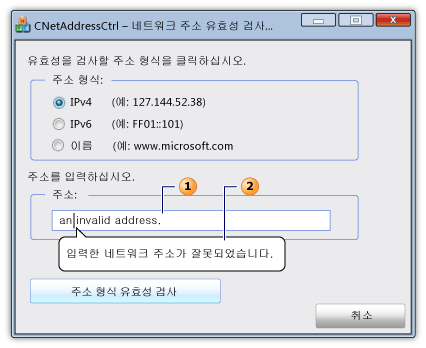

# CNetAddressCtrl 클래스
[!INCLUDE[vs2017banner](../../assembler/inline/includes/vs2017banner.md)]

`CNetAddressCtrl` 클래스는 네트워크 주소 입력 하 고 IPv4, IPv6 및 DNS 주소를 명명 된 형식의 유효성을 검사 하는 데 사용할 수 있는 컨트롤을 나타냅니다.  
  
## 구문  
  
```  
class CNetAddressCtrl : public CEdit  
```  
  
## 멤버  
  
### Public 생성자  
  
|Name|설명|  
|----------|--------|  
|[CNetAddressCtrl::CNetAddressCtrl](../Topic/CNetAddressCtrl::CNetAddressCtrl.md)|`CNetAddressCtrl` 개체를 생성합니다.|  
  
### Public 메서드  
  
|Name|설명|  
|----------|--------|  
|[CNetAddressCtrl::Create](../Topic/CNetAddressCtrl::Create.md)|지정 된 스타일으로 네트워크 주소 컨트롤을 만들고 해당 연결에 현재 `CNetAddressCtrl` 개체입니다.|  
|[CNetAddressCtrl::CreateEx](../Topic/CNetAddressCtrl::CreateEx.md)|네트워크 주소 컨트롤에 지정 된 확장된 스타일 만들고 현재를 첨부 `CNetAddressCtrl` 개체입니다.|  
|[CNetAddressCtrl::DisplayErrorTip](../Topic/CNetAddressCtrl::DisplayErrorTip.md)|네트워크 주소 컨트롤에 현재 지원 되지 않는 네트워크 주소를 입력할 때 오류 풍선 팁을 표시 합니다.|  
|[CNetAddressCtrl::GetAddress](../Topic/CNetAddressCtrl::GetAddress.md)|현재 네트워크 주소 컨트롤에 연결 된 네트워크 주소의 유효성을 검사 하 고 구문 분석 된 표현을 검색 합니다.|  
|[CNetAddressCtrl::GetAllowType](../Topic/CNetAddressCtrl::GetAllowType.md)|현재 네트워크 주소 컨트롤을 지원할 수 있는 네트워크 주소를 검색 합니다.|  
|[CNetAddressCtrl::SetAllowType](../Topic/CNetAddressCtrl::SetAllowType.md)|현재 네트워크 주소 컨트롤을 지원할 수 있는 네트워크 주소를 설정 합니다.|  
  
## 설명  
 네트워크 주소 컨트롤에 입력할 주소 형식이 올바른지 확인 합니다.  컨트롤은 실제로 네트워크 주소에 연결 되지 않습니다.  [CNetAddressCtrl::SetAllowType](../Topic/CNetAddressCtrl::SetAllowType.md) 메서드는 주소 유형을 하나 이상 지정 하는 [CNetAddressCtrl::GetAddress](../Topic/CNetAddressCtrl::GetAddress.md) 메서드 구문 분석 하 고 확인할 수 있습니다.  IPv4, IPv6, 서버, 네트워크, 호스트, 또는 브로드캐스트 메시지 대상에 대 한 명명 된 주소 형태로 주소를 수 있습니다.  주소 형식이 올바르지 않으면 수는 [CNetAddressCtrl::DisplayErrorTip](../Topic/CNetAddressCtrl::DisplayErrorTip.md) 메서드를 가리키는 네트워크 주소 컨트롤의 텍스트 상자에 그래픽으로 하는 미리 정의 된 오류 메시지를 표시 하는 정보 팁 메시지 상자를 표시 합니다.  
  
 `CNetAddressCtrl` 클래스에서 파생 되는  [CEdit](../../mfc/reference/cedit-class.md) 클래스입니다.  따라서 네트워크 주소 컨트롤 모든 Windows 편집 제어 메시지에 대 한 액세스를 제공합니다.  
  
 다음 그림 네트워크 주소 컨트롤을 포함 하는 대화 상자를 보여 줍니다.  텍스트 상자 \(1\) 네트워크 주소 컨트롤에 대 한 잘못 된 네트워크 주소를 포함합니다.  네트워크 주소는 유효 하지 않은 경우 \(2\) 정보 팁 메시지가 표시 됩니다.  
  
   
  
## 예제  
 다음 코드 예제에서는 네트워크 주소의 유효성을 검사 하는 대화의 일부입니다.  네트워크 주소 세 주소 유형 중 하나가 될 수 있습니다 세 개의 라디오 단추에 대 한 이벤트 처리기를 지정 합니다.  사용자 네트워크 컨트롤의 텍스트 상자에 있는 주소를 입력 한 다음 주소를 확인 하는 단추를 누를.  주소가 올바르지 않으면 성공 메시지가 표시 됩니다. 그렇지 않으면 미리 정의 된 정보 팁 오류 메시지가 표시 됩니다.  
  
 [!code-cpp[NVC_MFC_CNetAddressCtrl_s1#1](../../mfc/reference/codesnippet/CPP/cnetaddressctrl-class_1.cpp)]  
  
## 예제  
 다음 코드 예제에서는 대화 헤더 파일에서 정의 된  [NC\_ADDRESS](http://msdn.microsoft.com/library/windows/desktop/bb773345) 및  [NET\_ADDRESS\_INFO](http://msdn.microsoft.com/library/windows/desktop/bb773346) 필요한 변수는 [CNetAddressCtrl::GetAddress](../Topic/CNetAddressCtrl::GetAddress.md) 메서드.  
  
 [!code-cpp[NVC_MFC_CNetAddressCtrl_s1#2](../../mfc/reference/codesnippet/CPP/cnetaddressctrl-class_2.h)]  
  
## 상속 계층 구조  
 [CObject](../../mfc/reference/cobject-class.md)  
  
 [CCmdTarget](../../mfc/reference/ccmdtarget-class.md)  
  
 [CWnd](../../mfc/reference/cwnd-class.md)  
  
 [CEdit](../../mfc/reference/cedit-class.md)  
  
 `CNetAddressCtrl`  
  
## 요구 사항  
 **헤더:** afxcmn.h  
  
 이 클래스에서 지원 되지 [!INCLUDE[windowsver](../../build/reference/includes/windowsver_md.md)] 이상.  
  
 이 클래스에 대 한 추가 요구 사항에서 설명 [Windows Vista 공용 컨트롤의 빌드 요구 사항](../../mfc/build-requirements-for-windows-vista-common-controls.md).  
  
## 참고 항목  
 [CNetAddressCtrl Class](../../mfc/reference/cnetaddressctrl-class.md)   
 [계층 구조 차트](../../mfc/hierarchy-chart.md)   
 [CEdit Class](../../mfc/reference/cedit-class.md)