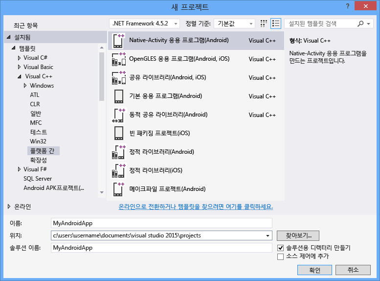

# Visual C++를 사용하여 플랫폼 간 앱 제작
플랫폼 간 모바일 개발용 Visual C\+\+를 사용하여 Android, iOS 및 Windows 장치용 플랫폼 간 코드를 빌드할 수 있습니다.  이는 Visual Studio 2015에서 사용할 수 있는 선택적 기능으로, Visual C\+\+를 사용하여 iOS, Android 및 Windows용 플랫폼 간 코드를 개발할 수 있게 해줍니다.  
  
 Visual Studio를 사용하여 클래식 Windows 응용 프로그램, 유니버설 Windows 앱, iOS 및 Android 플랫폼용 표준 C\+\+ 코드 공유 라이브러리를 빌드할 수 있습니다.  Visual C\+\+와 Visual Studio에 통합된 타사 도구만으로 Windows 및 Android 플랫폼용 네이티브 앱을 빌드할 수 있습니다.  Mac 컴퓨터를 사용하는 경우 Visual Studio를 사용하여 Mac에서 빌드 및 배포하는 iOS 앱용 C\+\+ 코드를 작성 및 디버깅할 수 있습니다.  
  
> [!NOTE]
>  기본적으로 Visual C\+\+ for Cross\-Platform Mobile Development는 Android 4.4 및 5.0을 대상으로 하는 API 수준 19 및 21을 지원합니다.  다른 API 수준은 SDK 관리자를 사용하여 설치할 수 있습니다.  Visual Studio C\+\+ Android 디버거를 사용하려면 대상 에뮬레이터 또는 장치에서 Android API 수준 17\(버전 4.2\) 이상이 실행되어야 합니다.  
  
 이 문서에서는 Visual Studio 2015에서 Visual C\+\+ for Cross\-Platform Mobile Development를 사용하여 플랫폼 간 앱 만들기를 시작하는 방법을 설명합니다.  
  
 [요구 사항](#req)   
 [도구 다운로드](#GetTools)  
 [새 Android Native Activity 프로젝트 만들기](#Create)  
 [Android Native Activity 앱 빌드 및 실행](#BuildHello)  
  
##   요구 사항  
  
-   설치 요구 사항은 [Visual Studio 2015 시스템 요구 사항](https://www.visualstudio.com/visual-studio-2015-system-requirements-vs)을 참조하세요.  
  
    > [!IMPORTANT]
    >  Windows 7 또는 Windows Server 2008 R2를 사용하는 경우 클래식 Windows 응용 프로그램용 코드, Android Native Activity 앱 및 코드 라이브러리, iOS용 앱 및 코드 라이브러리를 개발할 수 있지만 Windows 스토어 또는 유니버설 Windows 앱은 개발할 수 없습니다.  
  
 특정 장치 플랫폼용 앱을 빌드하려는 경우에는 다음의 몇 가지 요구 사항이 추가로 적용됩니다.  
  
-   Android용 Visual Studio 에뮬레이터와 Windows Phone 에뮬레이터를 사용하려면 Hyper\-V를 실행할 수 있는 컴퓨터가 필요합니다.  자세한 내용은 에뮬레이터의 [시스템 요구 사항](http://msdn.microsoft.com/ko-kr/4d5bb438-231a-4cd2-84b7-e9660b0e3baf)을 참조하세요.  
  
-   Android SDK와 함께 제공되는 x86 Android 에뮬레이터는 Intel HAXM 드라이버를 실행할 수 있는 컴퓨터에서 가장 잘 작동합니다.  이 드라이버를 사용하려면 VT\-x 및 XD 비트\(Execute Disable Bit\)를 지원하는 Intel x64 프로세서가 필요합니다.  자세한 내용은 [Intel ® Hardware Accelerated Execution Manager 설치 지침 \- Microsoft Windows](http://go.microsoft.com/fwlink/p/?LinkId=536385)\(영문\)을 참조하세요.  
  
-   iOS용 앱을 빌드하려면 iOS 개발자 프로그램 계정과 Xcode 6을 실행할 수 있는 Mac 컴퓨터가 필요합니다.  
  
##   도구 다운로드  
 플랫폼 간 모바일 개발용 Visual C\+\+는 Visual Studio 2015에 포함된 선택적 구성 요소입니다.  Visual Studio를 가져오려면 [Visual Studio 2015 다운로드](http://go.microsoft.com/fwlink/?linkid=517106) 페이지로 이동하여 Visual Studio 2015를 다운로드합니다.  
  
 Visual Studio 2015 설치 관리자에는 플랫폼 간 모바일 개발을 지원하는 옵션이 포함되어 있습니다.  Visual C\+\+ 모바일 개발과 다음과 같은 일반 도구 및 소프트웨어 개발 키트를 설치하는 옵션이 포함됩니다.  이러한 옵션은 대부분 Android 플랫폼 간 지원에 필요한 오픈 소스 소프트웨어입니다.  
  
-   Android 빌드 프로세스를 수행하려면 Android Native Development Kit\(R10E, 32비트\)가 필요합니다.  
  
-   Android 빌드 프로세스를 수행하려면 Android SDK, Apache Ant 및 Java SE 개발 키트가 필요합니다.  
  
-   Android용 Microsoft Visual Studio 에뮬레이터는 Android 개발을 위한 빠르고 강력한 에뮬레이터입니다.  
  
 자세한 설치 지침을 보려면 [플랫폼 간 모바일 개발용 Visual C\+\+ 설치](../Topic/Install%20Visual%20C++%20for%20Cross-Platform%20Mobile%20Development.md)\(영문\)를 참조하세요.  
  
 iOS용 코드를 빌드하려면 Mac에서 원격 빌드 에이전트를 설정 및 구성하고 Visual Studio에서 연결해야 합니다.  자세한 설치 및 구성 지침을 보려면 [iOS를 사용하여 빌드할 도구 설치 및 구성](../Topic/Install%20And%20Configure%20Tools%20to%20Build%20using%20iOS.md)을 참조하세요.  
  
##   새 Android Native Activity 프로젝트 만들기  
 플랫폼 간 모바일 개발용 Visual C\+\+을 사용하여 C\+\+을 사용하는 전체 Android 앱을 작성, 빌드, 실행 및 디버그할 수 있습니다.  Visual Studio를 시작하는 데 도움이 되는 Android Native Activity 프로젝트용 템플릿이 Visual Studio에 포함되어 있습니다.  
  
 이 자습서에서는 먼저 새 프로젝트를 만든 후 기본 앱을 제작하고 실행합니다.  
  
 새 프로젝트를 만들기 전에 모든 시스템 요구 사항이 충족되었으며 Visual Studio용 Visual C\+\+ for Cross\-Platform Mobile Development를 설치했는지 확인합니다.  자세한 내용은 [플랫폼 간 모바일 개발용 Visual C\+\+ 설치](../Topic/Install%20Visual%20C++%20for%20Cross-Platform%20Mobile%20Development.md)를 참조하세요.  
  
#### 새 프로젝트를 만들려면  
  
1.  Visual Studio를 엽니다.  메뉴 모음에서 **파일**, **새로 만들기**, **프로젝트**를 차례로 선택합니다.  
  
2.  **새 프로젝트** 대화 상자의 **템플릿**에서 **Visual C\+\+**, **플랫폼 간**을 차례로 선택한 후 **Native\-Activity 응용 프로그램\(Android\)** 템플릿을 선택합니다.  
  
3.  앱의 이름을 `MyAndroidApp`과 같이 지정하고 **확인**을 선택합니다.  
  
       
  
     새 솔루션이 만들어지고 솔루션 탐색기가 열립니다.  
  
 새 Android Native Activity 앱 솔루션에는 다음 두 프로젝트가 포함되어 있습니다.  
  
-   **MyAndroidApp.NativeActivity**에는 앱을 Android에서 Native Activity로 실행하기 위한 참조 및 붙이기 코드가 포함되어 있습니다.  붙이기 코드의 진입점 구현은 main.cpp에 있습니다.  미리 컴파일된 헤더는 pch.h에 있습니다.  앱 프로젝트는 공유 라이브러리\(.so\) 파일로 컴파일되며 패키징 프로젝트에서 이 라이브러리를 선택합니다.  
  
-   **MyAndroidApp.Packaging**은 Android 장치 또는 에뮬레이터에서 배포에 필요한 패키징\(.apk\) 파일을 만듭니다.  이 프로젝트에는 리소스와 매니페스트 속성을 설정하는 AndroidManifest.xml 파일이 포함되어 있습니다.  Ant 빌드 프로세스를 제어하는 build.xml 파일도 포함되어 있습니다.  이 프로젝트는 기본적으로 시작 프로젝트로 설정되므로 Visual Studio에서 직접 배포 및 실행할 수 있습니다.  
  
##   Android Native Activity 앱 빌드 및 실행  
 템플릿을 통해 생성된 앱을 제작 및 실행하여 설치 및 설정을 확인합니다.  기본적으로 템플릿은 솔루션 구성을 디버그로 설정하고 솔루션 플랫폼을 x86으로 설정하여 Android용 Microsoft Visual Studio 에뮬레이터에서 앱을 실행합니다.  다른 대상에서 앱을 테스트하려면 대상 에뮬레이터를 로드하거나 장치를 컴퓨터에 연결합니다.  
  
#### 기본 NativeActivity 앱을 빌드하고 실행하려면  
  
1.  메뉴 모음에서 **빌드**, **솔루션 빌드**를 선택합니다.  
  
     **출력** 창에 솔루션의 두 프로젝트에 대한 빌드 프로세스 출력이 표시됩니다.  
  
2.  배포 대상으로 VS 에뮬레이터 프로필 중 하나를 선택합니다.  
  
     다른 에뮬레이터를 설치했거나 Android 장치를 연결한 경우 개발 대상 드롭다운 목록에서 선택할 수 있습니다.  
  
3.  F5 키를 눌러 디버깅을 시작하거나 Shift\+F5를 눌러 디버깅하지 않고 시작합니다.  
  
     다음은 Android용 Visual Studio 에뮬레이터에서 기본 앱이 나타나는 모양입니다.  
  
       
  
    > [!TIP]
    >  에뮬레이터가 시작됩니다. 코드를 로드하고 배포하는 데 몇 초 정도 걸릴 수 있습니다.  앱이 시작되면 중단점을 설정하고 디버거를 사용하여 코드를 단계별로 실행하고 지역을 검토하고 값을 조사할 수 있습니다.  
  
4.  Shift\+F5를 눌러 디버깅을 중지합니다.  
  
     에뮬레이터는 별도의 프로세스로 계속 실행됩니다.  코드를 편집 및 컴파일하여 동일한 에뮬레이터에 여러 번 배포할 수 있습니다.  
  
## 참고 항목  
 [Visual Studio 2015 다운로드](http://go.microsoft.com/fwlink/?linkid=517106)