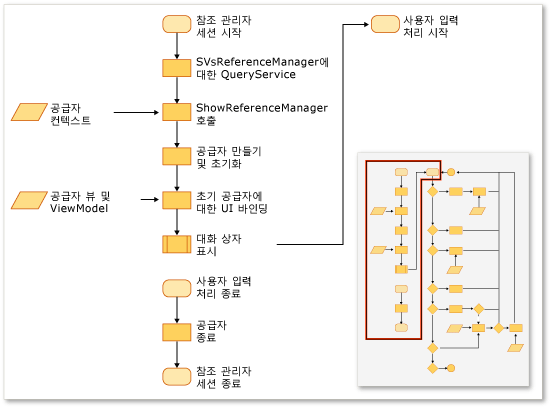
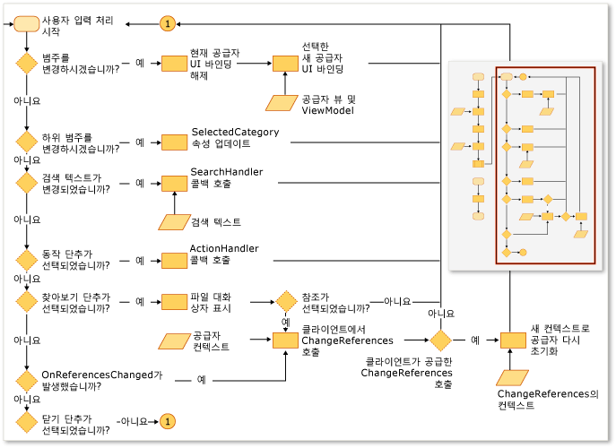

# 참조 관리자 확장
Visual Studio 확장에서 참조 관리자를 사용하여 프로젝트에 참조를 추가할 수 있습니다. 참조 관리자가 표시되기 전에 프로젝트에서 올바른 위치에 데이터가 보이도록 참조 관리자를 구성해야 합니다. 예를 들어 [!INCLUDE[net_v40_short](../misc/includes/net_v40_short_md.md)]을 대상으로 하는 프로젝트는 [!INCLUDE[net_v35_long](../misc/includes/net_v35_long_md.md)]를 대상으로 하는 프로젝트와 다른 폴더에서 어셈블리를 채워야 합니다.  
  
 일반적으로 다음 공급자에서 ProviderContexts 컬렉션을 사용하여 참조 관리자를 구성합니다.  
  
-   <xref:Microsoft.VisualStudio.Shell.Interop.IVsAssemblyReferenceProviderContext>  
  
-   <xref:Microsoft.VisualStudio.Shell.Interop.IVsComReferenceProviderContext>  
  
-   <xref:Microsoft.VisualStudio.Shell.Interop.IVsFileReferenceProviderContext>  
  
-   <xref:Microsoft.VisualStudio.Shell.Interop.IVsProjectReferenceProviderContext>  
  
-   <xref:Microsoft.VisualStudio.Shell.Interop.IVsPlatformReferenceProviderContext>  
  
 클라이언트 구성 요소는 SVsReferenceManager라는 Visual Studio 서비스의 ShowReferenceManager 메서드를 호출하여 참조 관리자를 표시합니다. IVsReferenceProviderContext 클래스 컬렉션이 이 메서드에 인수로 전달됩니다. 이 컨텍스트가 참조 관리자 대화 상자의 왼쪽을 따라 표시할 탭을 결정합니다. 각 공급자에는 대화 상자에 필요한 모든 정보가 포함되어 프로젝트에 참조를 추가하는 데 필요한 데이터를 채우고 표시할 수 있습니다.  
  
 다음 그림에서는 이 프로세스를 요약합니다.  
  
   
  
   
  
## 사용자 지정 탭 추가  
 사용자 지정 탭을 추가하려면 IReferenceProvider, IVsReference 및 IVsReferenceProviderContext를 구현해야 합니다.  
  
#### 사용자 지정 탭을 추가하려면  
  
1.  IReferenceProvider 인터페이스를 구현한 다음 참조 관리자가 사용할 수 있도록 MEF\(Managed Extensibility Framework\)를 통해 내보냅니다.  
  
     참조 관리자는 ReferenceProvider 개체를 사용하여 참조 관리자에서 나타나는 항목을 생성합니다. 해당 개체에 대한 인터페이스는 Microsoft.VisualStudio.ReferenceManager.Contracts.dll에 정의됩니다.  
  
2.  ProviderContext 개체를 구현합니다.  
  
     참조 관리자는 이 개체의 GUID 속성을 사용하여 공급자에 컨텍스트를 일치시킵니다. 참조 관리자가 초기화될 때 ShowReferenceManager 메서드를 통해 전달되는 ProviderContext를 공급자에게 전달합니다. ProviderContext에는 공급자가 IVsReferences를 열거할 필요가 있는 모든 정보가 포함되어 있어야 합니다.  
  
3.  StandardReferenceProviderContext 클래스를 확장합니다.  
  
     참조 관리자는 시작하는 데 사용할 수 있는 StandardReferenceProviderContext 클래스와 같은 일부 기본 클래스를 제공합니다. 공급자 클래스는 StandardReferenceProvider를 확장할 수 있으며 참조 항목은 StandardReferenceItem을 확장할 수 있습니다.  
  
 공급자 클래스는 다음 예제와 같이 사용될 수 있습니다.  
  
```  
[Export(typeof(IReferenceProvider))] [ExportMetadata("Name", "AssemblyReferenceProvider")] [ExportMetadata("Guid", VSConstants.AssemblyReferenceProvider_string)] internal class AssemblyReferenceProvider : StandardReferenceProvider { }  
```  
  
 컨텍스트 클래스는 다음 예제와 같이 사용될 수 있습니다.  
  
```  
  
[Export(typeof(IVsReferenceProviderContext))] [Export(typeof(IVsAssemblyReferenceProviderContext))] [Export("AssemblyReferenceProviderContext", typeof(IVsReferenceProviderContext))] [Export(VSConstants.AssemblyReferenceProvider_string, typeof(IVsReferenceProviderContext))] [PartCreationPolicy(System.ComponentModel.Composition.CreationPolicy.NonShared)] [ExportMetadata("Name", "AssemblyReferenceProviderContext")] [ExportMetadata("Guid", VSConstants.AssemblyReferenceProvider_string)] public class AssemblyReferenceProviderContext : StandardReferenceProviderContext<IVsAssemblyReference, AssemblyIdentity>, IVsAssemblyReferenceProviderContext { }  
```  
  
 참조 항목 클래스의 경우 IWatchableReference를 구현하여 클래스를 직렬화하는 것이 좋습니다. 이 방법에 따라 대화 상자의 다양한 탭 사이에서 항목 확인을 자동으로 동기화하는 ReferenceWatcher 서비스 외에 StandardReferenceProvider 클래스의 캐시 serialization 메서드를 활용할 수 있습니다.  
  
```  
[Serializable] public class StandardReferenceItem : IWatchableReference { }  
```  
  
 ReferenceProvider 클래스에는 두 가지 중요한 메서드가 포함됩니다. 첫 번째 메서드는 Initialize이며 공급자가 대화 상자에 처음 로드될 때 한 번만 호출됩니다. 두 번째 메서드는 SetContext이며 Initialize 후 즉시 호출되지만, 지정하여 커밋하려고 한 참조를 프로젝트 시스템이 추가하지 못했을 경우 다시 호출될 수 있습니다.  
  
> [!NOTE]
>  공급자가 프로그램의 지속 시간 중에는 유지되므로 세션 간의 상태를 저장할 수 있지만 사용자가 대화 상자를 닫은 다음 빨리 다시 여는 경우 경합 조건이 발생할 수 있습니다.  
  
## 탭 열거의 기존 소스 재정의  
 일부 공급자 컨텍스트에는 Tabs라는 uint 형식의 속성이 있습니다. 이 속성은 비트 마스크이며 해당 값은 공급자가 표시하는 탭을 제어합니다.  예를 들어 IVsAssemblyReferenceProviderContext 인터페이스는 다음 값으로 설정할 수 있는 Tabs 속성을 정의합니다.  
  
```  
namespace Microsoft.VisualStudio.Shell.Interop { public enum __VSASSEMBLYPROVIDERTAB { TAB_ASSEMBLY_FRAMEWORK = 1, TAB_ASSEMBLY_EXTENSIONS = 2, TAB_ASSEMBLY_ALL = 3, } }  
```  
  
 IVsPlatformReferenceProviderContext 클래스에 유사한 속성이 있습니다. 탭 이름을 변경할 수는 없지만 사용자가 탭을 선택할 때 나타나는 헤더 텍스트를 제어할 수 있습니다. IVsAssemblyProviderContext 클래스의 다음 메서드를 통해 이 값을 제어할 수 있습니다.  
  
```  
void SetTabTitle(uint etabId, string szTabTitle);  
```  
  
## 찾아보기 대화 상자에서 필터 재정의  
 IFileReferenceProviderContext 개체의 BrowseFilter 속성 값을 변경하여 참조 관리자의 찾아보기 대화 상자에 사용자 지정 형식 필터를 제공할 수 있습니다.  다음 예제에서는 네이티브 코드에서 이 기술을 보여 줍니다.  
  
```  
  
// Holds a list of provider contexts CComSafeArray<LPUNKNOWN> spProviderContexts; // Creates the file reference context for Browse vsReferenceManager->CreateProviderContext(GUID_FileReferenceProvider, &pFileRefProviderContext)); // Sets the Browse filter pFileRefProviderContext->put_BrowseFilter(wszFilter); spProviderContexts.Add(pFileRefProviderContext); // Show the reference manager hr = srpRefMgr->ShowReferenceManager( spVsRefMgrUser, spProviderContexts, strTitle, HELPKEYWORD_AddReference, GUID_AssemblyReferenceProvider, wszFilter, m_bstrStartBrowse);  
```  
  
## 참고 항목  
 [방법: 참조 관리자를 사용하여 참조 추가 또는 제거](../Topic/How%20to:%20Add%20or%20Remove%20References%20By%20Using%20the%20Reference%20Manager.md)