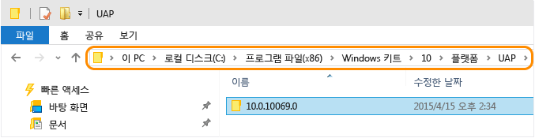
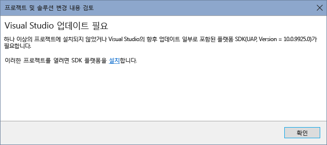

# UWP(유니버설 Windows 플랫폼)로 앱 마이그레이션
필요한 경우 Windows 스토어 8.1 앱, Windows Phone 8.1 앱 또는 Visual Studio 2015 RC로 만든 유니버설 Windows 앱에 대한 기존 프로젝트 파일을 수동으로 변경하면 Visual Studio 2015 RTM과 함께 사용할 수 있습니다. Windows 앱 프로젝트 및 Windows Phone 프로젝트를 둘 다 포함하는 Windows 8.1 유니버설 앱이 있는 경우 각 프로젝트를 마이그레이션하는 단계를 따라야 합니다.  
  
 이제 유니버설 Windows 플랫폼을 사용할 경우 하나 이상의 장치 제품군을 앱의 대상으로 지정합니다. 유니버설 Windows 앱에 대한 자세한 내용은 이 [플랫폼 가이드](https://msdn.microsoft.com/library/windows/apps/dn894631.aspx)\(영문\)를 참조하세요.  
  
-   유니버설 Windows 플랫폼을 사용하려면 [기존 C\#\/VB Windows 스토어 8.1 또는 Windows Phone 8.1 앱을 마이그레이션](#MigrateCSharp)합니다.  
  
-   유니버설 Windows 플랫폼을 사용하려면 [기존 C\+\+ Windows 스토어 8.1 또는 Windows Phone 8.1 앱을 마이그레이션](#MigrateCPlusPlus)합니다.  
  
-   [Visual Studio 2015 RC로 만든 기존 유니버설 Windows 앱에 필요한 변경 내용](#PreviousVersions)  
  
-   [Visual Studio 2015 RC로 만든 유니버설 Windows 앱의 기존 단위 테스트 프로젝트에 필요한 변경 내용](#MigrateUnitTest)  
  
 이러한 모든 변경 내용을 적용하지 않으려면 새 유니버설 Windows 프로젝트에 [기존 앱을 포팅](http://msdn.microsoft.com/library/windows/apps/xaml/mt238321.aspx)하는 방법을 알아보세요.  
  
##  <a name="MigrateCSharp"></a> 유니버설 Windows 플랫폼을 사용하려면 C\#\/VB Windows 스토어 8.1 또는 Windows Phone 8.1 앱을 마이그레이션합니다.  
  
#### C\#\/VB 프로젝트 파일 마이그레이션  
  
1.  설치한 유니버설 Windows 플랫폼을 찾으려면 **\\Program Files \(x86\)\\Windows Kits\\10\\Platforms\\UAP** 폴더를 엽니다. 이 폴더는 설치된 각 유니버설 Windows 플랫폼에 대한 폴더 목록을 포함합니다. 폴더 이름은 설치한 유니버설 Windows 플랫폼 버전입니다. 예를 들어 이 Windows 10 장치에는 버전 10.0.10240.0의 유니버설 Windows 플랫폼이 설치되어 있습니다.  
  
       
  
     유니버설 Windows 플랫폼 버전을 두 개 이상 설치할 수 있습니다. 최신 버전을 앱에 사용하는 것이 좋습니다.  
  
2.  파일 탐색기를 사용하여 UWP 프로젝트가 저장되어 있는 폴더로 이동합니다. 이 폴더에 .json 파일을 만듭니다. 파일의 이름을 project.json으로 지정하고 이 파일에 다음 콘텐츠를 추가합니다.  
  
    ```json  
    { "dependencies": { "Microsoft.ApplicationInsights": "1.0.0", "Microsoft.ApplicationInsights.PersistenceChannel": "1.0.0", "Microsoft.ApplicationInsights.WindowsApps": "1.0.0", "Microsoft.NETCore.UniversalWindowsPlatform": "5.0.0" }, "frameworks": { "uap10.0": {} }, "runtimes": { "win10-arm": {}, "win10-arm-aot": {}, "win10-x86": {}, "win10-x86-aot": {}, "win10-x64": {}, "win10-x64-aot": {} } }  
  
    ```  
  
3.  다음과 같은 내용으로 default.rd.xml이라는 파일을 만듭니다. VB 프로젝트가 있는 경우 프로젝트에 대한 My Project 디렉터리에 이 파일을 추가합니다. C\# 프로젝트가 있는 경우 프로젝트에 대한 Properties 디렉터리에 이 파일을 추가합니다.  
  
    ```xml  
    <?xml version="1.0"?> <!-- This file contains Runtime Directives used by .NET Native. The defaults here are suitable for most developers. However, you can modify these parameters to modify the behavior of the .NET Native optimizer. Runtime Directives are documented at http://go.microsoft.com/fwlink/?LinkID=391919 To fully enable reflection for App1.MyClass and all of its public/private members <Type Name="App1.MyClass" Dynamic="Required All"/> To enable dynamic creation of the specific instantiation of AppClass<T> over System.Int32 <TypeInstantiation Name="App1.AppClass" Arguments="System.Int32" Activate="Required Public" /> Using the Namespace directive to apply reflection policy to all the types in a particular namespace <Namespace Name="DataClasses.ViewModels" Seralize="All" /> --> <Directives xmlns="http://schemas.microsoft.com/netfx/2013/01/metadata"><Application> <!-- An Assembly element with Name="*Application*" applies to all assemblies in the application package. The asterisks are not wildcards. --> <Assembly Dynamic="Required All" Name="*Application*"/> <!-- Add your application specific runtime directives here. --> </Application></Directives>  
    ```  
  
4.  Visual Studio에서 기존 Windows 스토어 8.1 앱 또는 Windows Phone 8.1 앱을 포함하는 솔루션을 엽니다.  
  
5.  솔루션 탐색기에서 앱에 대한 기존 프로젝트를 마우스 오른쪽 단추로 클릭하고 **프로젝트 언로드**를 선택합니다. 프로젝트가 언로드된 후 프로젝트 파일을 다시 마우스 오른쪽 단추로 클릭하고 .csproj 또는 .vbproj 파일을 편집하도록 선택합니다.  
  
       
  
6.  값이 8.1인 \<TargetPlatformVersion\> 요소를 포함하는 \<PropertyGroup\> 요소를 찾습니다. 이 \<PropertyGroup\> 요소에 대해 다음 단계를 수행합니다.  
  
    1.  \<Platform\> 요소의 값을 **x86**으로 설정합니다.  
  
    2.  \<TargetPlatformIdentifier\> 요소를 추가하고 해당 값을 **UAP**로 설정합니다.  
  
    3.  \<TargetPlatformVersion\> 요소의 기존 값을 설치한 유니버설 Windows 플랫폼 버전 값으로 변경합니다. 또한 \<TargetPlatformMinVersion\> 요소를 추가하고 동일한 값을 지정합니다.  
  
    4.  \<MinimumVisualStudioVersion\> 요소의 값을 **14**로 변경합니다.  
  
    5.  아래와 같이 \<ProjectTypeGuids\> 요소를 바꿉니다.  
  
         C\#의 경우:  
  
        ```xml  
        <ProjectTypeGuids>{A5A43C5B-DE2A-4C0C-9213-0A381AF9435A};{FAE04EC0-301F-11D3-BF4B-00C04F79EFBC}</ProjectTypeGuids>  
        ```  
  
         VB의 경우:  
  
        ```xml  
        <ProjectTypeGuids>{A5A43C5B-DE2A-4C0C-9213-0A381AF9435A};{F184B08F-C81C-45F6-A57F-5ABD9991F28F}</ProjectTypeGuids>  
        ```  
  
    6.  \<EnableDotNetNativeCompatibleProfile\> 요소를 추가하고 해당 값을 **true**로 설정합니다.  
  
    7.  유니버설 Windows 앱의 기본 자산 배율은 200입니다. 프로젝트에 배율이 200이 아닌 자산이 포함되어 있는 경우 이 PropertyGroup에 해당 자산의 배율 값을 사용하는 \<UapDefaultAssetScale\> 요소를 추가해야 합니다.[자산 및 배율](http://msdn.microsoft.com/library/jj679352.aspx)에 대해 자세히 알아보세요.  
  
         이제 \<PropertyGroup\> 요소가 다음 예와 비슷하게 표시됩니다.  
  
        ```xml  
        <PropertyGroup> … <Platform Condition=" '$(Platform)' == '' ">x86</Platform> <TargetPlatformVersion>10.0.10240.0</TargetPlatformVersion> <TargetPlatformMinVersion>10.0.10240.0</TargetPlatformMinVersion> <TargetPlatformIdentifier>UAP</TargetPlatformIdentifier> <MinimumVisualStudioVersion>14</MinimumVisualStudioVersion> <ProjectTypeGuids>{A5A43C5B-DE2A-4C0C-9213-0A381AF9435A};{FAE04EC0-301F-11D3-BF4B-00C04F79EFBC}</ProjectTypeGuids> <EnableDotNetNativeCompatibleProfile>true</EnableDotNetNativeCompatibleProfile> <UapDefaultAssetScale>100</UapDefaultAssetScale> … </PropertyGroup>  
        ```  
  
7.  현재 사용 중인 Visual Studio 버전을 반영하도록 12.0의 모든 인스턴스를 14.0으로 바꿉니다. 다음 인스턴스와 같습니다.  
  
    ```xml  
    <Project Tools Version="14.0" DefaultTargets="Build" xmlns="http://schemas.microsoft.com/developer/msbuild/2003">  
    ```  
  
    ```  
    <PropertyGroup Condition=" '$(VisualStudioVersion)' == '' or '$(VisualStudioVersion)' < '14.0' "> <VisualStudioVersion>14.0</VisualStudioVersion>  
    ```  
  
8.  Condition 특성의 일부로 AnyCPU 플랫폼에 대해 구성된 \<PropertyGroup\> 요소를 찾습니다. 이러한 요소와 해당 자식을 모두 제거합니다. Visual Studio 2015에서는 Windows 10 앱에 대해 AnyCPU가 지원되지 않습니다. 예를 들어 다음과 같은 \<PropertyGroup\> 요소를 제거해야 합니다.  
  
    ```xml  
    <PropertyGroup Condition=" '$(Configuration)|$(Platform)' == 'Debug|AnyCPU' "> <PlatformTarget>AnyCPU</PlatformTarget> <DebugSymbols>true</DebugSymbols> <DebugType>full</DebugType> <Optimize>false</Optimize> <OutputPath>bin\Debug\</OutputPath> <DefineConstants>DEBUG;TRACE;NETFX_CORE;WINDOWS_UAP</DefineConstants> <ErrorReport>prompt</ErrorReport> <WarningLevel>4</WarningLevel> </PropertyGroup> <PropertyGroup Condition=" '$(Configuration)|$(Platform)' == 'Release|AnyCPU' "> <PlatformTarget>AnyCPU</PlatformTarget> <DebugType>pdbonly</DebugType> <Optimize>true</Optimize> <OutputPath>bin\Release\</OutputPath> <DefineConstants>TRACE;NETFX_CORE;WINDOWS_UAP</DefineConstants> <ErrorReport>prompt</ErrorReport> <WarningLevel>4</WarningLevel> </PropertyGroup>  
    ```  
  
9. 나머지 각 \<PropertyGroup\> 요소에 대해 요소가 릴리스 구성의 Condition 특성을 포함하는지 확인합니다. 이 특성을 포함하지만 \<UseDotNetNativeToolchain\> 요소를 포함하지 않는 경우 요소를 하나 추가합니다. 다음과 같이 \<UseDotNetNativeToolchain\> 요소의 값을 true로 설정합니다.  
  
    ```xml  
    <PropertyGroup Condition="'$(Configuration)|$(Platform)' == 'Release|x64'"> <OutputPath>bin\x64\Release\</OutputPath> <DefineConstants>TRACE;NETFX_CORE;WINDOWS_UAP</DefineConstants> <Optimize>true</Optimize> <NoWarn>;2008</NoWarn> <DebugType>pdbonly</DebugType> <PlatformTarget>x64</PlatformTarget> <UseVSHostingProcess>false</UseVSHostingProcess> <ErrorReport>prompt</ErrorReport> <Prefer32Bit>true</Prefer32Bit> <UseDotNetNativeToolchain>true</UseDotNetNativeToolchain> </PropertyGroup>  
    ```  
  
10. Windows Phone 프로젝트의 경우에만 값이 WindowsPhoneApp인 \<TargetPlatformIdentifier\> 요소를 포함하는 \<PropertyGroup\> 요소를 제거합니다. 또한 이 요소의 모든 자식을 제거합니다.  
  
    ```xml  
    <PropertyGroup Condition=" '$(TargetPlatformIdentifier)' == '' "> <TargetPlatformIdentifier>WindowsPhoneApp</TargetPlatformIdentifier> </PropertyGroup>  
    ```  
  
11. \<AppxManifest\> 요소를 포함하는 \<ItemGroup\> 요소를 찾습니다. 다음 \<None\> 요소를 \<ItemGroup\> 요소의 자식으로 추가합니다.  
  
    ```xml  
    <None Include="project.json" />  
    ```  
  
12. 로고 .png 파일\(\<Content Include\="Assets\\Logo.scale\-100.png" \/\>\)과 같은 프로젝트에 추가된 기타 자산을 포함하는 \<ItemGroup\> 요소를 찾습니다. 이 \<ItemGroup\> 요소에 다음 \<Content\> 자식 요소를 추가합니다.  
  
     **C\#의 경우**  
  
    ```xml  
    <Content Include="Properties\default.rd.xml" />  
    ```  
  
     **VB의 경우**  
  
    ```xml  
    <Content Include="My Project\default.rd.xml" />  
    ```  
  
13. NuGet 패키지에 대한 \<Reference\> 자식 요소를 포함하는 \<ItemGroup\> 요소를 찾습니다. 프로젝트를 다시 로드하면 NuGet 패키지 관리자를 사용하여 NuGet 패키지를 다운로드해야 하기 때문에 사용하고 있는 NuGet 패키지를 기록해 둡니다. 이 \<ItemGroup\>을 해당 자식과 함께 제거합니다. 예를 들어 UWP 프로젝트에서 다음과 같은 NuGet 패키지를 제거해야 할 수 있습니다.  
  
    ```xml  
    <ItemGroup> <Reference Include="Microsoft.ApplicationInsights, Version=0.14.3.177, Culture=neutral, PublicKeyToken=31bf3856ad364e35, processorArchitecture=MSIL"> <HintPath>..\packages\Microsoft.ApplicationInsights.0.14.3-build00177\lib\portable-win81+wpa81\Microsoft.ApplicationInsights.dll</HintPath> <Private>True</Private> </Reference> <Reference Include="Microsoft.ApplicationInsights.Extensibility.Windows, Version=0.14.3.177, Culture=neutral, PublicKeyToken=31bf3856ad364e35, processorArchitecture=MSIL"> <HintPath>..\packages\Microsoft.ApplicationInsights.WindowsApps.0.14.3-build00177\lib\win81\Microsoft.ApplicationInsights.Extensibility.Windows.dll</HintPath> <Private>True</Private> </Reference> <Reference Include="Microsoft.ApplicationInsights.PersistenceChannel, Version=0.14.3.186, Culture=neutral, PublicKeyToken=31bf3856ad364e35, processorArchitecture=MSIL"> <HintPath>..\packages\Microsoft.ApplicationInsights.PersistenceChannel.0.14.3-build00177\lib\portable-win81+wpa81\Microsoft.ApplicationInsights.PersistenceChannel.dll</HintPath> <Private>True</Private> </Reference> <Reference Include="System.Numerics.Vectors, Version=4.0.0.0, Culture=neutral, PublicKeyToken=b03f5f7f11d50a3a, processorArchitecture=MSIL"> <HintPath>..\packages\System.Numerics.Vectors.4.0.0\lib\win8\System.Numerics.Vectors.dll</HintPath> <Private>True</Private> </Reference> <Reference Include="System.Numerics.Vectors.WindowsRuntime, Version=4.0.0.0, Culture=neutral, PublicKeyToken=b03f5f7f11d50a3a, processorArchitecture=MSIL"> <HintPath>..\packages\System.Numerics.Vectors.4.0.0\lib\win8\System.Numerics.Vectors.WindowsRuntime.dll</HintPath> <Private>True</Private> </Reference> </ItemGroup>  
    ```  
  
14. 변경 내용을 저장합니다.  
  
15. .csproj 또는 .vbproj 파일을 닫습니다.  
  
16. 솔루션 탐색기에서 프로젝트를 마우스 오른쪽 단추로 클릭하고 상황에 맞는 메뉴에서 프로젝트 다시 로드를 선택합니다. 프로젝트의 모든 파일이 솔루션 탐색기에 표시됩니다.  
  
17. NuGet 관리자를 사용하여 이전 단계에서 삭제한 패키지를 다시 추가합니다.  
  
     이제 Windows 스토어 8.1 또는 Windows Phone 8.1 프로젝트에 대해 [패키지 매니페스트 파일을 업데이트](#PackageManifest)하는 단계를 수행해야 합니다.  
  
##  <a name="MigrateCPlusPlus"></a> 유니버설 Windows 플랫폼을 사용하려면 C\+\+ Windows 스토어 8.1 또는 Windows Phone 8.1 앱을 마이그레이션합니다.  
  
#### C\+\+ 프로젝트 파일 마이그레이션  
  
1.  설치한 유니버설 Windows 플랫폼을 찾으려면 **\\Program Files \(x86\)\\Windows Kits\\10\\Platforms\\UAP** 폴더를 엽니다. 이 폴더는 설치된 각 유니버설 Windows 플랫폼에 대한 폴더 목록을 포함합니다. 폴더 이름은 설치한 유니버설 Windows 플랫폼 버전입니다. 예를 들어 이 Windows 10 장치에는 버전 10.0.10240.0의 유니버설 Windows 플랫폼이 설치되어 있습니다.  
  
       
  
     유니버설 Windows 플랫폼 버전을 두 개 이상 설치할 수 있습니다. 최신 버전을 앱에 사용하는 것이 좋습니다.  
  
2.  Visual Studio에서 기존 C\+\+ Windows 스토어 8.1 앱 또는 Windows Phone 8.1 앱을 포함하는 솔루션을 엽니다.  
  
     솔루션 탐색기에서 기존 프로젝트를 마우스 오른쪽 단추로 클릭하고 **프로젝트 언로드**를 선택합니다. 프로젝트가 언로드된 후 프로젝트 파일을 다시 마우스 오른쪽 단추로 클릭하고 .vcxproj 파일을 편집하도록 선택합니다.  
  
       
  
3.  값이 8.1인 \<ApplicationTypeRevision\> 요소를 포함하는 \<PropertyGroup\> 요소를 찾습니다. 이 \<PropertyGroup\> 요소에 대해 다음 단계를 수행합니다.  
  
    1.  \<WindowsTargetPlatformVersion\> 요소와 \<WindowsTargetPlatformMinVersion\> 요소를 추가하고 설치한 유니버설 Windows 플랫폼 버전의 값을 이러한 요소에 지정합니다.  
  
    2.  ApplicationTypeRevision 요소의 값을 8.1에서 10.0으로 업데이트합니다.  
  
    3.  \<MinimumVisualStudioVersion\> 요소의 값을 14로 변경합니다.  
  
    4.  \<EnableDotNetNativeCompatibleProfile\> 요소를 추가하고 해당 값을 true로 설정합니다.  
  
    5.  유니버설 Windows 앱의 기본 자산 배율은 200입니다. 프로젝트에 배율이 200이 아닌 자산이 포함되어 있는 경우 이 PropertyGroup에 해당 자산의 배율 값을 사용하는 \<UapDefaultAssetScale\> 요소를 추가해야 합니다.[자산 및 배율](http://msdn.microsoft.com/library/jj679352.aspx)에 대해 자세히 알아보세요.  
  
    6.  Windows Phone 프로젝트의 경우에만 \<ApplicationType\> 값을 Windows Phone에서 Windows 스토어로 변경합니다.  
  
         이제 \<PropertyGroup\> 요소가 다음 예와 비슷하게 표시됩니다.  
  
        ```xml  
        <PropertyGroup> … <WindowsTargetPlatformVersion>10.0.10240.0</WindowsTargetPlatformVersion> <WindowsTargetPlatformMinVersion>10.0.10240.0</WindowsTargetPlatformMinVersion> <ApplicationType>Windows Store</ApplicationType> <ApplicationTypeRevision>10.0</ApplicationTypeRevision> <MinimumVisualStudioVersion>14</MinimumVisualStudioVersion> <EnableDotNetNativeCompatibleProfile>true</EnableDotNetNativeCompatibleProfile> <UapDefaultAssetScale>100</UapDefaultAssetScale> … </PropertyGroup>  
        ```  
  
4.  \<PlatformToolset\> 요소의 모든 인스턴스를 값 v140으로 변경합니다. 예를 들면 다음과 같습니다.  
  
    ```xml  
    <PropertyGroup Condition="'$(Configuration)|$(Platform)'=='Release|Win32'" Label="Configuration"> <ConfigurationType>Application</ConfigurationType> <UseDebugLibraries>false</UseDebugLibraries> <WholeProgramOptimization>true</WholeProgramOptimization> <PlatformToolset>v140</PlatformToolset> <UseDotNetNativeToolchain>true</UseDotNetNativeToolchain> </PropertyGroup>  
    ```  
  
5.  나머지 각 \<PropertyGroup\> 요소에 대해 요소가 릴리스 구성의 Condition 특성을 포함하는지 확인합니다. 이 특성을 포함하지만 \<UseDotNetNativeToolchain\> 요소를 포함하지 않는 경우 요소를 하나 추가합니다. 다음과 같이 \<UseDotNetNativeToolchain\> 요소의 값을 true로 설정합니다.  
  
    ```xml  
    <PropertyGroup Condition="'$(Configuration)|$(Platform)'=='Release|X64'" Label="Configuration"> <ConfigurationType>Application</ConfigurationType> <UseDebugLibraries>false</UseDebugLibraries> <WholeProgramOptimization>true</WholeProgramOptimization> <PlatformToolset>v140</PlatformToolset> <UseDotNetNativeToolchain>true</UseDotNetNativeToolchain> </PropertyGroup>  
  
    ```  
  
6.  변경 내용을 저장합니다. 프로젝트 파일을 닫습니다.  
  
7.  솔루션 탐색기에서 프로젝트 파일을 마우스 오른쪽 단추로 클릭하고 상황에 맞는 메뉴에서 프로젝트 다시 로드를 선택합니다. 프로젝트의 모든 파일이 솔루션 탐색기에 표시됩니다.  
  
     이제 Windows 스토어 8.1 또는 Windows Phone 8.1 프로젝트에 대해 [패키지 매니페스트 파일을 업데이트](#PackageManifest)하는 단계를 수행해야 합니다.  
  
##  <a name="PackageManifest"></a> 모든 Windows 스토어 8.1 또는 Windows Phone 8.1 프로젝트에 대한 패키지 매니페스트 파일 업데이트  
 솔루션의 각 프로젝트에 대한 패키지 매니페스트 파일을 업데이트해야 합니다.  
  
#### 패키지 매니페스트 파일 업데이트  
  
1.  프로젝트에서 Package.appxmanifest 파일을 엽니다. 각 Windows 스토어 및 Windows Phone 프로젝트에 대해 Package.AppxManifest 파일을 편집해야 합니다.  
  
2.  기존 프로젝트 형식에 따라 \<Package\> 요소를 새 스키마로 업데이트해야 합니다. 먼저 Windows 스토어 또는 Windows Phone 프로젝트가 있는지 여부에 따라 아래 스키마를 제거합니다.  
  
     **Windows 스토어 프로젝트의 경우 OLD:** \<Package\> 요소가 다음과 유사하게 표시됩니다.  
  
    ```xml  
    <Package xmlns="http://schemas.microsoft.com/appx/2010/manifest" xmlns:m2="http://schemas.microsoft.com/appx/2013/manifest">  
  
    ```  
  
     **Windows Phone 프로젝트의 경우 OLD:** \<Package\> 요소가 다음과 유사하게 표시됩니다.  
  
    ```xml  
    <Package xmlns="http://schemas.microsoft.com/appx/2010/manifest" xmlns:m2="http://schemas.microsoft.com/appx/2013/manifest" xmlns:m3="http://schemas.microsoft.com/appx/2014/manifest" xmlns:mp="http://schemas.microsoft.com/appx/2014/phone/manifest">  
    ```  
  
     **유니버설 Windows 플랫폼의 경우 NEW:** \<Package\> 요소에 아래 스키마를 추가합니다. 방금 제거한 스키마에 대한 요소에서 연결된 네임스페이스 식별자 접두사를 모두 제거합니다. IgnorableNamespaces 속성을 uap mp로 업데이트합니다. 새 \<Package\> 요소가 다음과 유사하게 표시됩니다.  
  
    ```xml  
    <Package xmlns="http://schemas.microsoft.com/appx/manifest/foundation/windows10" xmlns:uap="http://schemas.microsoft.com/appx/manifest/uap/windows10" xmlns:mp="http://schemas.microsoft.com/appx/2014/phone/manifest" IgnorableNamespaces= "uap mp">  
  
    ```  
  
3.  \<Package\> 요소에 \<Dependencies\> 자식 요소를 추가합니다. 그런 다음 이 \<Dependencies\> 요소에 Name, MinVersion 및 MaxVersionTested 특성을 가진 \<TargetDeviceFamily\> 자식 요소를 추가합니다. Name 특성에 Windows.Universal 값을 지정합니다. MinVersion 및 MaxVersionTested에 설치한 유니버설 Windows 플랫폼 버전 값을 지정합니다. 이 요소는 다음과 유사하게 표시됩니다.  
  
    ```xml  
    <Dependencies> <TargetDeviceFamily Name="Windows.Universal" MinVersion="10.0.10069.0" MaxVersionTested="10.0.10069.0" /> </Dependencies>  
    ```  
  
4.  **Windows 스토어만 해당:** \<Package\> 요소에 \<mp:PhoneIdentity\> 자식 요소를 추가해야 합니다. PhoneProductId 특성 및 PhonePublisherId 특성을 추가합니다. PhoneProductId를 \<Identity\> 요소의 Name 특성과 동일한 값으로 설정합니다. PhonePublishedId 값을 00000000\-0000\-0000\-0000\-000000000000으로 설정합니다. 다음과 같습니다.  
  
    ```xml  
    <Identity Name="aa3815a1-2d97-4c71-8c99-578135b28cd8" Publisher="CN=xxxxxxxx" Version="1.0.0.0" /> <mp:PhoneIdentity PhoneProductId="aa3815a1-2d97-4c71-8c99-578135b28cd8" PhonePublisherId="00000000-0000-0000-0000-000000000000"/>  
    ```  
  
5.  \<Prerequisites\> 요소를 찾아 이 요소와 요소에 포함된 자식 요소를 모두 삭제합니다.  
  
6.  다음 \<Resource\> 요소에 **uap** 네임스페이스를 추가합니다. Scale, DXFeatureLevel. 예:  
  
    ```xml  
    <Resources> <Resource Language="en-us"/> <Resource uap:Scale="180"/> <Resource uap:DXFeatureLevel="dx11"/> </Resources>  
  
    ```  
  
7.  다음 \<Capability\> 요소에 **uap** 네임스페이스를 추가합니다. documentsLibrary, picturesLibrary, videosLibrary, musicLibrary, enterpriseAuthentication, sharedUserCertificates, removableStorage, appointments 및 contacts. 예:  
  
    ```xml  
    <Capabilities> <uap:Capability Name="documentsLibrary"/> <uap:Capability Name="removableStorage"/> </Capabilities>  
  
    ```  
  
8.  \<VisualElements\> 요소와 모든 자식 요소에 **uap** 네임스페이스를 추가합니다. 예:  
  
    ```xml  
    <uap:VisualElements DisplayName="My WWA App" Square150x150Logo="images/150x150.png" Square44x44Logo="images/44x44.png" Description="My WWA App" BackgroundColor="#777777"> <uap:SplashScreen Image="images/splash.png"/> </uap:VisualElements>  
  
    ```  
  
     **Windows 스토어만 해당:** 타일 크기 이름이 변경되었습니다. 새로운 수렴형 타일 크기를 반영하도록 \<VisualElements\> 요소의 특성을 변경합니다. 70x70은 71x71이 되고, 30x30은 44x44가 됩니다.  
  
     **OLD:** 타일 크기 이름  
  
    ```xml  
    <m2:VisualElements … Square30x30Logo="Assets\SmallLogo.png" …> <m2:DefaultTile … Square70x70Logo="images/70x70.png"> </m2:VisualElements>  
  
    ```  
  
     **NEW:** 타일 크기 이름  
  
    ```xml  
    <uap:VisualElements … Square44x44Logo="Assets\SmallLogo.png" …> <uap:DefaultTile … Square71x71Logo="images/70x70.png"> </uap:VisualElements>  
  
    ```  
  
9. \<ApplicationContentUriRules\> 및 모든 자식 요소에 **uap** 네임스페이스를 추가합니다. 예:  
  
    ```xml  
    <uap:ApplicationContentUriRules> <uap:Rule Type="include" Match="https://www.microsoft.com/"/> <uap:Rule Type="exclude" Match="*.pdf"/> </uap:ApplicationContentUriRules>  
  
    ```  
  
10. 다음 \<Extension\> 요소 및 모든 자식 요소에 **uap** 네임스페이스를 추가합니다. windows.accountPictureProvide,  windows.alarm, windows.appointmentsProvider windows.autoPlayContent,  windows.autoPlayDevice, windows.cachedFileUpdate, windows.cameraSettings, windows.fileOpenPicker, windows.fileTypeAssociation, windows.fileSavePicke, windows.lockScreenCall, windows.printTaskSettings, windows.protocol, windows.search, windows.shareTarget. 예:  
  
    ```xml  
    <Extensions> <uap:Extension Category="windows.alarm"/> <uap:Extension Category="windows.search" EntryPoint="MyActivateableClassId.baz"/> <uap:Extension Category="windows.protocol"> <uap:Protocol Name="mailto" DesiredView="useHalf"> <uap:DisplayName>MailTo Protocol</uap:DisplayName> </uap:Protocol> </uap:Extension> </Extensions>  
  
    ```  
  
11. chatMessageNotification 형식의 백그라운드 작업에 **uap** 네임스페이스를 추가합니다. 예:  
  
    ```xml  
    <Extension Category="windows.backgroundTasks" EntryPoint="Fabrikam.BackgroundTask" Executable="MyBackground.exe"> <BackgroundTasks ServerName="MyBackgroundTasks"> <uap:Task Type="chatMessageNotification"/> </BackgroundTasks> </Extension>  
  
    ```  
  
12. 프레임워크 종속성을 변경합니다. 모든 \<PackageDependency\> 요소에 Publisher 이름을 추가하고, 지정되지 않은 경우 MinVersion을 지정합니다.  
  
     **OLD:** \<PackageDependency\> 요소  
  
    ```xml  
    <Dependencies> <PackageDependency Name="Microsoft.VCLibs.120.00" /> </Dependencies>  
  
    ```  
  
     **NEW:** \<PackageDependency\> 요소  
  
    ```xml  
    <Dependencies> <PackageDependency Name="Microsoft.VCLibs.120.00" Publisher="CN=Microsoft Corporation, O=Microsoft Corporation, L=Redmond, S=Washington, C=US" MinVersion="12.0.30113.0" /> </Dependencies>  
  
    ```  
  
     사용 중인 실제 프레임워크에 적합한 Publisher 및 MinVersion 값을 사용합니다. 이러한 이름은 Windows 10에서 변경될 수 있습니다.  
  
13. gattCharacteristicNotification 및 rfcommConnection 백그라운드 형식 작업을 Bluetooth 형식 작업으로 바꿉니다. 예를 들면 다음과 같습니다.  
  
     **OLD:**  
  
    ```xml  
    <Extension Category="windows.backgroundTasks" EntryPoint="Fabrikam.BackgroundTask" Executable="MyBackground.exe"> <BackgroundTasks ServerName="MyBackgroundTasks"> <Task Type="rfcommConnection"/> <Task Type="gattCharacteristicNotification"/> </BackgroundTasks> </Extension>  
    ```  
  
     **NEW:** Bluetooth 형식 작업을 포함합니다.  
  
    ```xml  
    <Extension Category="windows.backgroundTasks" EntryPoint="Fabrikam.BackgroundTask" Executable="MyBackground.exe"> <BackgroundTasks ServerName="MyBackgroundTasks"> <Task Type="bluetooth"/> </BackgroundTasks> </Extension>  
    ```  
  
14. Bluetooth 장치 기능 bluetooth.rfcomm 및 bluetooth.genericAttributeProfile을 제네릭 Bluetooth 기능으로 바꿉니다. 예를 들면 다음과 같습니다.  
  
     **OLD:**  
  
    ```xml  
    <Capabilities> <m2:DeviceCapability Name="bluetooth.rfcomm"> <m2:Device Id="any"> <m2:Function Type="serviceId:34B1CF4D-1069-4AD6-89B6-E161D79BE4D8"/> </m2:Device> </m2:DeviceCapability> <m2:DeviceCapability Name="bluetooth.genericAttributeProfile"> <m2:Device Id="any"> <m2:Function Type="name:heartRate"/> </m2:Device> </m2:DeviceCapability> </Capabilities>  
    ```  
  
     **NEW:** 제네릭 Bluetooth 기능으로 대체되었습니다.  
  
    ```xml  
    <Capabilities> <uap:DeviceCapability Name="bluetooth"/> </Capabilities>  
  
    ```  
  
15. 사용되지 않는 요소를 모두 제거합니다.  
  
    1.  \<VisualElements\>에 대한 이러한 특성은 사용되지 않으며 제거해야 합니다.  
  
        -   \<VisualElements\> 특성: ForegroundText, ToastCapable  
  
        -   \<DefaultTile\> 특성 DefaultSize  
  
        -   \<ApplicationView\> 요소  
  
         예:  
  
        ```xml  
        <m2:VisualElements … ForegroundText="dark" ToastCapable="true"> <m2:DefaultTile DefaultSize="square150x150Logo"/> <m2:ApplicationView MinWidth="width320"/> </m2:VisualElements>  
  
        ```  
  
    2.  Windows.contact 및 windows.contactPicker 확장과 이러한 확장 아래의 모든 요소를 제거합니다.  
  
16. Package.appxmanifest 파일을 저장합니다. Visual Studio를 닫습니다.  
  
17. 솔루션을 다시 열려면 먼저 일부 숨겨진 파일을 제거해야 합니다.  
  
    1.  파일 탐색기를 열고 도구 모음에서 **보기**를 클릭한 다음 **숨겨진 항목** 및 **파일 이름 확장명**을 선택합니다. 컴퓨터에서 \<솔루션 위치 경로\>\\.vs\\{Project Name}\\v14 폴더를 엽니다. 파일 확장명이 .suo인 파일이 있으면 삭제합니다.  
  
    2.  이제 솔루션이 있는 폴더로 돌아갑니다. 솔루션에 있는 프로젝트에 대한 폴더를 모두 엽니다. 이러한 프로젝트 폴더 내에서 . csproj.user 또는 . vbproj.user 확장명을 가진 파일을 삭제합니다.  
  
         이제 Visual Studio에서 솔루션을 다시 열 수 있습니다. 유니버설 Windows 플랫폼을 사용하여 앱을 코딩, 빌드 및 디버그할 준비가 되었습니다.  
  
         유니버설 Windows 플랫폼의 새로운 기능을 활용하기 위해 [코드를 조정](https://msdn.microsoft.com/library/windows/apps/dn954974.aspx)하는 방법을 알아보세요.  
  
##  <a name="PreviousVersions"></a> Visual Studio 2015 RC로 만든 기존 유니버설 Windows 앱에 필요한 변경 내용  
 Visual Studio 2015 RC로 Windows 10 유니버설 앱을 만든 경우 최신 Visual Studio 2015 릴리스와 함께 설치된 유니버설 Windows 플랫폼 버전을 사용하도록 프로젝트 대상을 다시 지정해야 합니다. 이전 버전은 모두 지원되지 않습니다. 필요한 변경 내용은 앱을 만드는 데 사용한 언어에 따라 달라집니다.  
  
-   [C\#\/VB 앱](#RCUpdate10CSharp)  
  
-   [C\+\+ 앱](#RCUpdate10CPlusPlus)  
  
###  <a name="RCUpdate10CSharp"></a> 최신 유니버설 Windows 플랫폼을 사용하도록 C\#\/VB 프로젝트 업데이트  
 기존 앱에 대한 솔루션을 열면 앱을 업데이트해야 한다고 표시됩니다.  
  
   
  
 솔루션 탐색기에서 이 프로젝트를 다시 로드하도록 선택한 경우 다음 대화 상자가 표시됩니다.  
  
   
  
 프로젝트에 대한 유니버설 Windows 플랫폼 SDK는 이제 지원되지 않으므로 설치할 수 없습니다. 확인을 클릭하고 아래 단계를 따르세요.  
  
##### 최신 유니버설 Windows 플랫폼을 사용하도록 C\#\/VB 프로젝트 업데이트  
  
1.  설치한 유니버설 Windows 플랫폼을 찾으려면 **\\Program Files \(x86\)\\Windows Kits\\10\\Platforms\\UAP** 폴더를 엽니다. 이 폴더는 설치된 각 유니버설 Windows 플랫폼에 대한 폴더 목록을 포함합니다. 폴더 이름은 설치한 유니버설 Windows 플랫폼 버전입니다. 예를 들어 이 Windows 10 장치에는 버전 10.0.10240.0의 유니버설 Windows 플랫폼이 설치되어 있습니다.  
  
       
  
     유니버설 Windows 플랫폼 버전을 두 개 이상 설치할 수 있습니다. 최신 버전을 앱에 사용하는 것이 좋습니다.  
  
2.  파일 탐색기를 사용하여 UWP 프로젝트가 저장되어 있는 폴더로 이동합니다. packages.config 파일을 삭제하고 이 폴더에 새 .json 파일을 만듭니다. 파일의 이름을 project.json으로 지정하고 이 파일에 다음 콘텐츠를 추가합니다.  
  
    ```json  
  
    { "dependencies": { "Microsoft.ApplicationInsights": "1.0.0", "Microsoft.ApplicationInsights.PersistenceChannel": "1.0.0", "Microsoft.ApplicationInsights.WindowsApps": "1.0.0", "Microsoft.NETCore.UniversalWindowsPlatform": "5.0.0" }, "frameworks": { "uap10.0": {} }, "runtimes": { "win10-arm": {}, "win10-arm-aot": {}, "win10-x86": {}, "win10-x86-aot": {}, "win10-x64": {}, "win10-x64-aot": {} } }  
  
    ```  
  
3.  Visual Studio에서 C\#\/VB 유니버설 Windows 앱을 포함하는 솔루션을 엽니다. 프로젝트 파일\(.csproj 또는 .vbproj 파일\)을 업데이트해야 한다고 표시됩니다. 프로젝트 파일을 마우스 오른쪽 단추로 클릭하고 이 파일을 편집하도록 선택합니다.  
  
       
  
4.  \<TargetPlatformVersion\> 및 \<TargetPlatformMinVersion\> 요소를 포함하는 \<PropertyGroup\> 요소를 찾습니다. \<TargetPlatformVersion\> 및 \<TargetPlatformMinVersion\> 요소의 기존 값을 설치한 유니버설 Windows 플랫폼과 동일한 버전으로 변경합니다.  
  
     유니버설 Windows 앱의 기본 자산 배율은 200입니다. Visual Studio 2015 RC로 만든 프로젝트에 배율이 100인 자산이 포함되어 있는 경우 이 PropertyGroup에 값이 100인 \<UapDefaultAssetScale\> 요소를 추가해야 합니다.[자산 및 배율](http://msdn.microsoft.com/library/jj679352.aspx)에 대해 자세히 알아보세요.  
  
5.  UWP 확장 SDK\(예: Windows Mobile SDK\)에 참조를 추가한 경우 SDK 버전을 업데이트해야 합니다. 다음은 \<SDKReference\> 요소의 예입니다.  
  
    ```xml  
    <SDKReference Include="WindowsMobile, Version=10.0.0.1"> <Name>Microsoft Mobile Extension SDK for Universal App Platform</Name> </SDKReference>  
  
    ```  
  
     다음과 같이 변경해야 합니다.  
  
    ```xml  
    <SDKReference Include="WindowsMobile, Version=10.0.10240.0"> <Name>Microsoft Mobile Extension SDK for Universal App Platform</Name> </SDKReference>  
  
    ```  
  
6.  name 특성 값이 EnsureNuGetPackageBuildImports인 \<Target\> 요소를 찾습니다. 이 요소와 이 요소의 모든 자식을 삭제합니다.  
  
    ```xml  
    <Target Name="EnsureNuGetPackageBuildImports" BeforeTargets="PrepareForBuild"> <PropertyGroup> <ErrorText>This project references NuGet package(s) that are missing on this computer. Use NuGet Package Restore to download them.  For more information, see http://go.microsoft.com/fwlink/?LinkID=322105. The missing file is {0}.</ErrorText> </PropertyGroup> <Error Condition="!Exists('..\packages\Microsoft.Diagnostics.Tracing.EventSource.Redist.1.1.16-beta\build\portable-net45+win8+wpa81\Microsoft.Diagnostics.Tracing.EventSource.Redist.targets')" Text="$([System.String]::Format('$(ErrorText)', '..\packages\Microsoft.Diagnostics.Tracing.EventSource.Redist.1.1.16-beta\build\portable-net45+win8+wpa81\Microsoft.Diagnostics.Tracing.EventSource.Redist.targets'))" /> <Error Condition="!Exists('..\packages\Microsoft.ApplicationInsights.0.14.3-build00177\build\portable-win81+wpa81\Microsoft.ApplicationInsights.targets')" Text="$([System.String]::Format('$(ErrorText)', '..\packages\Microsoft.ApplicationInsights.0.14.3-build00177\build\portable-win81+wpa81\Microsoft.ApplicationInsights.targets'))" /> </Target>  
    ```  
  
7.  다음과 같이 Microsoft.Diagnostics.Tracing.EventSource와 Microsoft.ApplicationInsights를 참조하는 Project와 Condition 특성이 있는 \<Import\> 요소를 찾아 삭제합니다.  
  
    ```xml  
    <Import Project="..\packages\Microsoft.Diagnostics.Tracing.EventSource.Redist.1.1.16-beta\build\portable-net45+win8+wpa81\Microsoft.Diagnostics.Tracing.EventSource.Redist.targets" Condition="Exists('..\packages\Microsoft.Diagnostics.Tracing.EventSource.Redist.1.1.16-beta\build\portable-net45+win8+wpa81\Microsoft.Diagnostics.Tracing.EventSource.Redist.targets')" /> <Import Project="..\packages\Microsoft.ApplicationInsights.0.14.3-build00177\build\portable-win81+wpa81\Microsoft.ApplicationInsights.targets" Condition="Exists('..\packages\Microsoft.ApplicationInsights.0.14.3-build00177\build\portable-win81+wpa81\Microsoft.ApplicationInsights.targets')" />  
  
    ```  
  
8.  NuGet 패키지에 대한 \<Reference\> 자식 요소가 있는 \<ItemGroup\>을 찾습니다. 이 정보는 향후 단계에 필요하므로 참조되는 NuGet 패키지를 기록해 둡니다. Visual Studio 2015 RC와 Visual Studio 2015 RTM에서 Windows 10 프로젝트 형식의 중요한 한 가지 차이점은 RTM 형식이 [NuGet](http://docs.nuget.org/) 버전 3을 사용한다는 것입니다.  
  
     \<ItemGroup\>과 \<ItemGroup\>의 모든 자식을 제거합니다. 예를 들어 Visual Studio RC로 만든 UWP 프로젝트에서 다음과 같은 NuGet 패키지를 제거해야 합니다.  
  
    ```xml  
    <ItemGroup> <Reference Include="Microsoft.ApplicationInsights, Version=0.14.3.177, Culture=neutral, PublicKeyToken=31bf3856ad364e35, processorArchitecture=MSIL"> <HintPath>..\packages\Microsoft.ApplicationInsights.0.14.3-build00177\lib\portable-win81+wpa81\Microsoft.ApplicationInsights.dll</HintPath> <Private>True</Private> </Reference> <Reference Include="Microsoft.ApplicationInsights.Extensibility.Windows, Version=0.14.3.177, Culture=neutral, PublicKeyToken=31bf3856ad364e35, processorArchitecture=MSIL"> <HintPath>..\packages\Microsoft.ApplicationInsights.WindowsApps.0.14.3-build00177\lib\win81\Microsoft.ApplicationInsights.Extensibility.Windows.dll</HintPath> <Private>True</Private> </Reference> <Reference Include="Microsoft.ApplicationInsights.PersistenceChannel, Version=0.14.3.186, Culture=neutral, PublicKeyToken=31bf3856ad364e35, processorArchitecture=MSIL"> <HintPath>..\packages\Microsoft.ApplicationInsights.PersistenceChannel.0.14.3-build00177\lib\portable-win81+wpa81\Microsoft.ApplicationInsights.PersistenceChannel.dll</HintPath> <Private>True</Private> </Reference> <Reference Include="System.Numerics.Vectors, Version=4.0.0.0, Culture=neutral, PublicKeyToken=b03f5f7f11d50a3a, processorArchitecture=MSIL"> <HintPath>..\packages\System.Numerics.Vectors.4.0.0\lib\win8\System.Numerics.Vectors.dll</HintPath> <Private>True</Private> </Reference> <Reference Include="System.Numerics.Vectors.WindowsRuntime, Version=4.0.0.0, Culture=neutral, PublicKeyToken=b03f5f7f11d50a3a, processorArchitecture=MSIL"> <HintPath>..\packages\System.Numerics.Vectors.4.0.0\lib\win8\System.Numerics.Vectors.WindowsRuntime.dll</HintPath> <Private>True</Private> </Reference> </ItemGroup>  
  
    ```  
  
9. \<AppxManifest\> 요소를 포함하는 \<ItemGroup\> 요소를 찾습니다. Include 특성이 packages.config로 설정된 \<None\> 요소가 있는 경우 이 요소를 삭제합니다. 또한 Include 특성이 있는 \<None\> 요소를 추가하고 이 요소 값을 project.json으로 설정합니다.  
  
10. 변경 내용을 저장합니다. 프로젝트 파일을 닫습니다.  
  
11. 솔루션 탐색기에서 프로젝트 파일을 마우스 오른쪽 단추로 클릭하고 상황에 맞는 메뉴에서 프로젝트 다시 로드를 선택합니다. 프로젝트의 모든 파일이 솔루션 탐색기에 표시됩니다.  
  
12. 솔루션 탐색기에서 ApplicationInsights.config 파일을 선택하고 해당 속성을 엽니다. 빌드 작업 속성을 “콘텐츠”로 변경하고 출력 디렉터리에 복사 속성을 “새 버전이면 복사”로 변경합니다.  
  
13. 프로젝트에서 Package.appxmanifest 파일을 엽니다.  
  
    1.  \<TargetDeviceFamily\> 요소를 찾습니다. MinVersion 및 MaxVersionTested 특성을 설치한 유니버설 Windows 플랫폼 버전에 맞도록 변경합니다. 다음과 같습니다.  
  
        ```xml  
        <TargetDeviceFamily Name="Windows.Universal" MinVersion="10.0.10240.0" MaxVersionTested="10.0.10240.0" />  
        ```  
  
    2.  변경 내용을 저장합니다.  
  
14. NuGet 관리자를 사용하여 이전 단계에서 삭제한 패키지를 추가합니다. Visual Studio 2015 RC와 Visual Studio 2015 RTM에서 Windows 10 프로젝트 형식의 중요한 한 가지 차이점은 RTM 형식이 [NuGet](http://docs.nuget.org/) 버전 3을 사용한다는 것입니다.  
  
 이제 앱을 코딩, 빌드 및 디버그할 수 있습니다.  
  
 유니버설 Windows 앱에 대한 단위 테스트 프로젝트가 있는 경우 [이 단계](#MigrateUnitTest)를 따라야 합니다.  
  
###  <a name="RCUpdate10CPlusPlus"></a> 최신 유니버설 Windows 플랫폼을 사용하도록 C\+\+ 프로젝트 업데이트  
  
1.  설치한 유니버설 Windows 플랫폼을 찾으려면 **\\Program Files \(x86\)\\Windows Kits\\10\\Platforms\\UAP** 폴더를 엽니다. 이 폴더는 설치된 각 유니버설 Windows 플랫폼에 대한 폴더 목록을 포함합니다. 폴더 이름은 설치한 유니버설 Windows 플랫폼 버전입니다. 예를 들어 이 Windows 10 장치에는 버전 10.0.10240.0의 유니버설 Windows 플랫폼이 설치되어 있습니다.  
  
       
  
     유니버설 Windows 플랫폼 버전을 두 개 이상 설치할 수 있습니다. 최신 버전을 앱에 사용하는 것이 좋습니다.  
  
2.  C\+\+ Windows 유니버설 앱을 포함하는 솔루션을 엽니다. 프로젝트 .vcxproj 파일을 마우스 오른쪽 단추로 클릭하고 프로젝트 파일을 언로드하도록 선택합니다. 프로젝트가 언로드된 후 프로젝트 파일을 다시 마우스 오른쪽 단추로 클릭하고 편집하도록 선택합니다.  
  
       
  
3.  Condition 특성을 포함하지만 \<ApplicationTypeRevision\> 요소를 포함하지 않는 \<PropertyGroup\> 요소를 찾습니다. ApplicationTypeRevision 값을 8.2에서 10.0으로 업데이트합니다. \<WindowsTargetPlatformVersion\> 및 \<WindowsTargetPlatformMinVersion\> 요소를 추가하고 해당 값을 설치한 유니버설 Windows 플랫폼 버전의 값으로 설정합니다.  
  
     \<EnableDotNetNativeCompatibleProfile\> 요소가 아직 없는 경우 이 요소를 추가하고 해당 값을 true로 설정합니다.  
  
     유니버설 Windows 앱의 기본 자산 배율은 200입니다. Visual Studio 2015 RC로 만든 프로젝트에 배율이 100인 자산이 포함되어 있는 경우 이 PropertyGroup에 값이 100인 \<UapDefaultAssetScale\> 요소를 추가해야 합니다.[자산 및 배율](http://msdn.microsoft.com/library/jj679352.aspx)에 대해 자세히 알아보세요.  
  
     이제 이 \<PropertyGroup\> 요소는 다음과 유사합니다.  
  
    ```xml  
    <PropertyGroup Label="Globals"> … <MinimumVisualStudioVersion>14.0</MinimumVisualStudioVersion> <ApplicationType>Windows Store</ApplicationType> <ApplicationTypeRevision>10.0</ApplicationTypeRevision> <WindowsTargetPlatformVersion>10.0.10240.0</WindowsTargetPlatformVersion> <WindowsTargetPlatformMinVersion>10.0.10240.0</WindowsTargetPlatformMinVersion> <EnableDotNetNativeCompatibleProfile>true</EnableDotNetNativeCompatibleProfile> <UapDefaultAssetScale>100</UapDefaultAssetScale> </PropertyGroup>  
  
    ```  
  
4.  나머지 각 \<PropertyGroup\> 요소에 대해 요소가 릴리스 구성의 Condition 특성을 포함하는지 확인합니다. 이 특성을 포함하지만 \<UseDotNetNativeToolchain\> 요소를 포함하지 않는 경우 요소를 하나 추가합니다. 다음과 같이 \<UseDotNetNativeToolchain\> 요소의 값을 true로 설정합니다.  
  
    ```xml  
    <PropertyGroup Condition="'$(Configuration)|$(Platform)'=='Release|Win32'" Label="Configuration"> <ConfigurationType>Application</ConfigurationType> <UseDebugLibraries>false</UseDebugLibraries> <WholeProgramOptimization>true</WholeProgramOptimization> <PlatformToolset>v140</PlatformToolset> <UseDotNetNativeToolchain>true</UseDotNetNativeToolchain> </PropertyGroup>  
  
    ```  
  
5.  .NET 네이티브를 사용할 수 있도록 \<EnableDotNetNativeCompatibleProfile\> 요소 및 \<UseDotNetNativeToolchain\> 요소를 업데이트해야 하지만 C\+\+ 템플릿에서 .NET 네이티브가 사용하도록 설정되지 않았습니다.  
  
     변경 내용을 저장합니다. 프로젝트 파일을 닫습니다.  
  
6.  솔루션 탐색기에서 프로젝트 파일을 마우스 오른쪽 단추로 클릭하고 상황에 맞는 메뉴에서 프로젝트 다시 로드를 선택합니다. 프로젝트의 모든 파일이 솔루션 탐색기에 표시됩니다.  
  
7.  프로젝트에서 Package.appxmanifest 파일을 엽니다.  
  
    1.  \<TargetDeviceFamily\> 요소를 찾습니다. MinVersion 및 MaxVersionTested 특성을 설치한 유니버설 Windows 플랫폼 버전에 맞도록 변경합니다. 다음과 같습니다.  
  
        ```xml  
        <TargetDeviceFamily Name="Windows.Universal" MinVersion="10.0.10240.0" MaxVersionTested="10.0.10240.0" />  
        ```  
  
    2.  변경 내용을 저장합니다.  
  
         이제 앱을 코딩, 빌드 및 디버그할 수 있습니다.  
  
         유니버설 Windows 앱에 대한 단위 테스트 프로젝트가 있는 경우 [이 단계](#MigrateUnitTest)를 따라야 합니다.  
  
##  <a name="MigrateUnitTest"></a> Visual Studio 2015 RC로 만든 유니버설 Windows 앱에 대한 기존 단위 테스트 프로젝트에 필요한 변경 내용  
 Visual Studio 2015 RC로 Windows 10 유니버설 앱에 대한 단위 테스트 프로젝트를 만든 경우 Visual Studio 2015의 최신 릴리스에서 이러한 테스트 프로젝트를 사용할 수 있도록 프로젝트 파일을 추가로 변경해야 합니다. 필요한 변경 내용은 앱을 만드는 데 사용한 언어에 따라 달라집니다.  
  
-   [C\#\/VB 앱](#UnitTestRCUpdate10CSharp)  
  
-   [C\+\+ 앱](#UnitTestRCUpdate10CPlusPlus)  
  
###  <a name="UnitTestRCUpdate10CSharp"></a> C\#\/VB 단위 테스트 프로젝트 업데이트  
  
1.  Visual Studio에서 C\#\/VB 단위 테스트 프로젝트를 포함하는 솔루션을 엽니다. \<OuttputType\> 요소의 값을 AppContainerExe로 변경합니다.  
  
    ```xml  
  
    <OutputType>AppContainerExe</OutputType>  
  
    ```  
  
2.  이 요소 \<EnableCoreRuntime\>false\<\/EnableCoreRuntime\>를 다음 요소로 바꿉니다.  
  
    ```xml  
  
    <EnableDotNetNativeCompatibleProfile>true</EnableDotNetNativeCompatibleProfile>  
  
    ```  
  
3.  다음 줄을 제거합니다.  
  
    ```xml  
  
    <PropertyGroup> <AppXPackage>True</AppXPackage> <AppxPackageIncludePrivateSymbols>true</AppxPackageIncludePrivateSymbols> </PropertyGroup> <PropertyGroup Condition=" '$(Configuration)|$(Platform)' == 'Debug|AnyCPU' "> <PlatformTarget>AnyCPU</PlatformTarget> <DebugSymbols>true</DebugSymbols> <DebugType>full</DebugType> <Optimize>false</Optimize> <OutputPath>bin\Debug\</OutputPath> <DefineConstants>DEBUG;TRACE;NETFX_CORE;WINDOWS_UAP</DefineConstants> <ErrorReport>prompt</ErrorReport> <WarningLevel>4</WarningLevel> </PropertyGroup> <PropertyGroup Condition=" '$(Configuration)|$(Platform)' == 'Release|AnyCPU' "> <PlatformTarget>AnyCPU</PlatformTarget> <DebugType>pdbonly</DebugType> <Optimize>true</Optimize> <OutputPath>bin\Release\</OutputPath> <DefineConstants>TRACE;NETFX_CORE;WINDOWS_UAP</DefineConstants> <ErrorReport>prompt</ErrorReport> <WarningLevel>4</WarningLevel> </PropertyGroup>  
  
    ```  
  
4.  다음 속성 그룹에 이 요소 \<UseDotNetNativeToolchain\>true\<\/UseDotNetNativeToolchain\>를 자식 요소로 추가합니다.  
  
    ```xml  
  
    <PropertyGroup Condition="'$(Configuration)|$(Platform)' == 'Release|ARM'"> <PropertyGroup Condition="'$(Configuration)|$(Platform)' == 'Release|X86'"> <PropertyGroup Condition="'$(Configuration)|$(Platform)' == 'Release|X64'">  
  
    ```  
  
5.  다음 \<ItemGroup\> 요소를 삭제합니다.  
  
    ```xml  
  
    <ItemGroup> <Compile Include="Properties\AssemblyInfo.cs" /> <Compile Include="UnitTest.cs" /> </ItemGroup> <ItemGroup> <AppxManifest Include="Package.appxmanifest"> <SubType>Designer</SubType> </AppxManifest> <None Include="packages.config" /> <None Include="UnitTestProject1_TemporaryKey.pfx" /> </ItemGroup> <ItemGroup> <Content Include="Properties\Default.rd.xml" /> <Content Include="Assets\Logo.scale-240.png" /> <Content Include="Assets\SmallLogo.scale-240.png" /> <Content Include="Assets\SplashScreen.scale-240.png" /> <Content Include="Assets\Square71x71Logo.scale-240.png" /> <Content Include="Assets\StoreLogo.scale-240.png" /> <Content Include="Assets\WideLogo.scale-240.png" /> </ItemGroup>  
  
    ```  
  
     삭제한 요소를 다음 요소로 바꿉니다.  
  
    ```xml  
  
    <ItemGroup> <Compile Include="Properties\AssemblyInfo.cs" /> <Compile Include="UnitTestApp.xaml.cs"> <DependentUpon>UnitTestApp.xaml</DependentUpon> </Compile> <Compile Include="UnitTest.cs" /> </ItemGroup> <ItemGroup> <ApplicationDefinition Include="UnitTestApp.xaml"> <Generator>MSBuild:Compile</Generator> <SubType>Designer</SubType> </ApplicationDefinition> </ItemGroup> <ItemGroup> <AppxManifest Include="Package.appxmanifest"> <SubType>Designer</SubType> </AppxManifest> <None Include="UnitTestProject1_TemporaryKey.pfx" /> </ItemGroup> <ItemGroup> <Content Include="Properties\UnitTestApp.rd.xml" /> <Content Include="Assets\LockScreenLogo.scale-200.png" /> <Content Include="Assets\SplashScreen.scale-200.png" /> <Content Include="Assets\Square150x150Logo.scale-200.png" /> <Content Include="Assets\Square44x44Logo.scale-200.png" /> <Content Include="Assets\Square44x44Logo.targetsize-24_altform-unplated.png" /> <Content Include="Assets\StoreLogo.png" /> <Content Include="Assets\Wide310x150Logo.scale-200.png" /> </ItemGroup>  
    ```  
  
6.  새 단위 테스트 프로젝트를 만들고 UnitTestApp.xaml 및 UnitTestApp.xaml.cs 파일을 새 프로젝트에서 업데이트하려는 기존 단위 테스트 프로젝트로 복사합니다.  
  
7.  UnitTestApp.rd.xml 파일을 새 단위 테스트 프로젝트의 Properties 폴더에서 업데이트하려는 기존 단위 테스트 프로젝트의 Properties 폴더로 복사합니다.  
  
8.  프로젝트에서 Package.appxmanifest 파일을 엽니다. 그런 다음 파일에서 다음 요소를 삭제합니다.  
  
    ```xml  
  
    <Applications> <Application Id="vstest.executionengine.universal.App" Executable="vstest.executionengine.appcontainer.uap.exe" EntryPoint="Microsoft.VisualStudio.TestPlatform.TestExecutor.AppContainer.App"> <uap:VisualElements DisplayName="UnitTestProject1" Square150x150Logo="Assets\Logo.png" Square44x44Logo="Assets\SmallLogo.png" Description="UnitTestProject1" BackgroundColor="#464646"> <uap:SplashScreen Image="Assets\SplashScreen.png" /> </uap:VisualElements> </Application> </Applications> <Capabilities> <Capability Name="internetClientServer" /> </Capabilities>  
    ```  
  
     삭제한 요소를 다음 요소로 바꿉니다. 아래 요소에서 UnitTestProject1 대신 프로젝트의 이름을 기반으로 ProjectName에 적절한 값을 사용합니다.  
  
    ```xml  
  
    <Applications> <Application Id="vstest.executionengine.universal.App" Executable="$targetnametoken$.exe" EntryPoint="UnitTestProject1.App"> <uap:VisualElements DisplayName="UnitTestProject1" Square150x150Logo="Assets\Square150x150Logo.png" Square44x44Logo="Assets\Square44x44Logo.png" Description="UnitTestProject1" BackgroundColor="transparent"> <uap:DefaultTile Wide310x150Logo="Assets\Wide310x150Logo.png"/> <uap:SplashScreen Image="Assets\SplashScreen.png" /> </uap:VisualElements> </Application> </Applications> <Capabilities> <Capability Name="internetClient" /> </Capabilities>  
    ```  
  
 이제 단위 테스트를 실행할 수 있습니다.  
  
###  <a name="UnitTestRCUpdate10CPlusPlus"></a> 최신 유니버설 Windows 플랫폼을 사용하도록 C\+\+ 프로젝트 업데이트  
  
1.  Visual Studio에서 C\+\+ 단위 테스트 프로젝트를 포함하는 솔루션을 엽니다. 다음 요소를 제거합니다.  
  
    ```xml  
  
    <TestApplication>true</TestApplication> <AppxPackage>True</AppxPackage> <CppWindowsStoreUnitTestLibraryType>true</CppWindowsStoreUnitTestLibraryType> <EnableCoreRuntime>false</EnableCoreRuntime>  
  
    ```  
  
2.  이 파일에 다음과 같은 \<ProjectConfiguration\> 요소가 아직 없는 경우 요소 \<ItemGroup Label\="ProjectConfigurations"\> 아래에 이 요소를 추가합니다.  
  
    ```xml  
  
    <ProjectConfiguration Include="Debug|x64"> <Configuration>Debug</Configuration> <Platform>x64</Platform> </ProjectConfiguration> <ProjectConfiguration Include="Release|x64"> <Configuration>Release</Configuration> <Platform>x64</Platform> </ProjectConfiguration>  
  
    ```  
  
3.  다음 요소가 발생할 때마다  
  
    ```xml  
  
    <ConfigurationType>DynamicLibrary</ConfigurationType>  
  
    ```  
  
     다음 코드로 바꿉니다.  
  
    ```xml  
  
    <ConfigurationType>Application</ConfigurationType>  
  
    ```  
  
4.  파일에 이 \<PropertyGroup\> 요소가 아직 없는 경우 이 요소를 추가합니다.  
  
    ```xml  
  
    <PropertyGroup Condition="'$(Configuration)|$(Platform)'=='Debug|x64'" Label="Configuration"> <ConfigurationType>Application</ConfigurationType> <UseDebugLibraries>true</UseDebugLibraries> <PlatformToolset>v140</PlatformToolset> </PropertyGroup> <PropertyGroup Condition="'$(Configuration)|$(Platform)'=='Release|x64'" Label="Configuration"> <ConfigurationType>Application</ConfigurationType> <UseDebugLibraries>false</UseDebugLibraries> <WholeProgramOptimization>true</WholeProgramOptimization> <PlatformToolset>v140</PlatformToolset> <UseDotNetNativeToolchain>true</UseDotNetNativeToolchain> </PropertyGroup>  
  
    ```  
  
5.  다음 요소가 발생할 때마다  
  
    ```xml  
  
    <AdditionalIncludeDirectories>$(VCInstallDir)UnitTest\include;$(ProjectDir);$(IntermediateOutputPath);%(AdditionalIncludeDirectories)</AdditionalIncludeDirectories>  
    ```  
  
     다음 코드로 바꿉니다.  
  
    ```xml  
  
    <AdditionalIncludeDirectories>$(VCInstallDir)UnitTest\include\UWP;$(ProjectDir);$(IntermediateOutputPath);%(AdditionalIncludeDirectories)</AdditionalIncludeDirectories>  
  
    ```  
  
6.  다음 요소가 발생할 때마다  
  
    ```xml  
  
    <AdditionalLibraryDirectories>$(VCInstallDir)UnitTest\Lib;%(AdditionalLibraryDirectories)</AdditionalLibraryDirectories>  
  
    ```  
  
     다음 코드로 바꿉니다.  
  
    ```xml  
  
    <AdditionalLibraryDirectories>$(VCInstallDir)UnitTest\lib\UWP;%(AdditionalLibraryDirectories)</AdditionalLibraryDirectories>  
  
    ```  
  
7.  이미 다른 \<ItemDefinitionGroup\> 요소를 포함한 섹션에서 다음 \<ItemDefinitionGroup\> 요소를 추가합니다.  
  
    ```xml  
  
    <ItemDefinitionGroup Condition="'$(Configuration)|$(Platform)'=='Debug|x64'"> <ClCompile> <AdditionalOptions>/bigobj %(AdditionalOptions)</AdditionalOptions> <DisableSpecificWarnings>4453;28204</DisableSpecificWarnings> <AdditionalIncludeDirectories>$(VCInstallDir)UnitTest\include\UWP;$(ProjectDir);$(IntermediateOutputPath);%     (AdditionalIncludeDirectories)</AdditionalIncludeDirectories> </ClCompile> <Link> <AdditionalLibraryDirectories>$(VCInstallDir)UnitTest\lib\UWP;%(AdditionalLibraryDirectories)</AdditionalLibraryDirectories> </Link> </ItemDefinitionGroup> <ItemDefinitionGroup Condition="'$(Configuration)|$(Platform)'=='Release|x64'"> <ClCompile> <AdditionalOptions>/bigobj %(AdditionalOptions)</AdditionalOptions> <DisableSpecificWarnings>4453;28204</DisableSpecificWarnings> <AdditionalIncludeDirectories>$(VCInstallDir)UnitTest\include\UWP;$(ProjectDir);$(IntermediateOutputPath);%(AdditionalIncludeDirectories)</AdditionalIncludeDirectories> </ClCompile> <Link> <AdditionalLibraryDirectories>$(VCInstallDir)UnitTest\lib\UWP;%(AdditionalLibraryDirectories)</AdditionalLibraryDirectories> </Link> </ItemDefinitionGroup>  
  
    ```  
  
8.  다음 \<ItemGroup\> 요소를 삭제합니다.  
  
    ```xml  
  
    <ItemGroup> <Image Include="Assets\Logo.scale-100.png" /> <Image Include="Assets\SmallLogo.scale-100.png" /> <Image Include="Assets\StoreLogo.scale-100.png" /> <Image Include="Assets\SplashScreen.scale-100.png" /> <Image Include="Assets\WideLogo.scale-100.png" /> </ItemGroup>  
  
    ```  
  
     삭제한 요소를 다음 \<ItemGroup\> 요소로 바꿉니다.  
  
    ```xml  
  
    <ItemGroup> <Image Include="Assets\LockScreenLogo.scale-200.png" /> <Image Include="Assets\SplashScreen.scale-200.png" /> <Image Include="Assets\Square44x44Logo.scale-200.png" /> <Image Include="Assets\Square44x44Logo.targetsize-24_altform-unplated.png" /> <Image Include="Assets\Square150x150Logo.scale-200.png" /> <Image Include="Assets\StoreLogo.png" /> <Image Include="Assets\Wide310x150Logo.scale-200.png" /> </ItemGroup>  
  
    ```  
  
9. 다음 \<ItemGroup\> 요소를 삭제합니다.  
  
    ```xml  
  
    <ItemGroup> <ClInclude Include="pch.h" /> </ItemGroup>  
    ```  
  
     삭제한 요소를 다음 \<ItemGroup\> 요소로 바꿉니다.  
  
    ```xml  
  
    <ItemGroup> <ClInclude Include="pch.h" /> <ClInclude Include="UnitTestApp.xaml.h"> <DependentUpon>UnitTestApp.xaml</DependentUpon> </ClInclude> </ItemGroup> <ItemGroup> <ApplicationDefinition Include="UnitTestApp.xaml"> <SubType>Designer</SubType> </ApplicationDefinition> </ItemGroup>  
  
    ```  
  
10. 다음 요소를 삭제합니다.  
  
    ```xml  
    <ClCompile Include="UnitTest.cpp"/>  
    ```  
  
     삭제한 요소를 다음 \<CICompile\> 요소로 바꿉니다.  
  
    ```xml  
  
    <ClCompile Include="UnitTestApp.xaml.cpp"> <DependentUpon>UnitTestApp.xaml</DependentUpon> </ClCompile> <ClCompile Include="UnitTest.cpp"/>  
  
    ```  
  
11. 다음 요소를  
  
    ```xml  
    <Import Project="$(VCTargetsPath)\Microsoft.Cpp.targets" />  
    ```  
  
     파일의 다음 요소 위에 추가합니다.  
  
    ```xml  
  
    <ItemGroup> <Xml Include="UnitTestApp.rd.xml" /> </ItemGroup>  
    ```  
  
12. 새 단위 테스트 C\+\+ 프로젝트를 만들고 UnitTestApp.xaml, UnitTestApp.xaml.cpp, UnitTestApp.xaml.h 및 UnitTestApp.rd.xml 파일을 해당 프로젝트에서 업데이트하려는 기존 프로젝트로 복사합니다.  
  
13. 프로젝트에서 Package.appxmanifest 파일을 엽니다. 그런 다음 파일에서 다음 요소를 삭제합니다.  
  
    ```xml  
  
    <Applications> <Application Id="vstest.executionengine.universal.App" Executable="vstest.executionengine.appcontainer.uap.exe" EntryPoint="Microsoft.VisualStudio.TestPlatform.TestExecutor.AppContainer.App"> <uap:VisualElements DisplayName="UnitTestProject1" Square150x150Logo="Assets\Logo.png" Square44x44Logo="Assets\SmallLogo.png" Description="UnitTestProject1" BackgroundColor="#464646"> <uap:SplashScreen Image="Assets\SplashScreen.png" /> </uap:VisualElements> </Application> </Applications> <Capabilities> <Capability Name="internetClientServer" /> </Capabilities>  
  
    ```  
  
     삭제한 요소를 다음 요소로 바꿉니다. 아래 요소에서 UnitTestProject1 대신 프로젝트의 이름을 기반으로 ProjectName에 적절한 값을 사용합니다.  
  
    ```xml  
  
    <Applications> <Application Id="vstest.executionengine.universal.App" Executable="$targetnametoken$.exe" EntryPoint="UnitTestProject1.App"> <uap:VisualElements DisplayName="UnitTestProject1" Square150x150Logo="Assets\Square150x150Logo.png" Square44x44Logo="Assets\Square44x44Logo.png" Description="UnitTestProject1" BackgroundColor="transparent"> <uap:DefaultTile Wide310x150Logo="Assets\Wide310x150Logo.png"/> <uap:SplashScreen Image="Assets\SplashScreen.png" /> </uap:VisualElements> </Application> </Applications> <Capabilities> <Capability Name="internetClient" /> </Capabilities>  
  
    ```