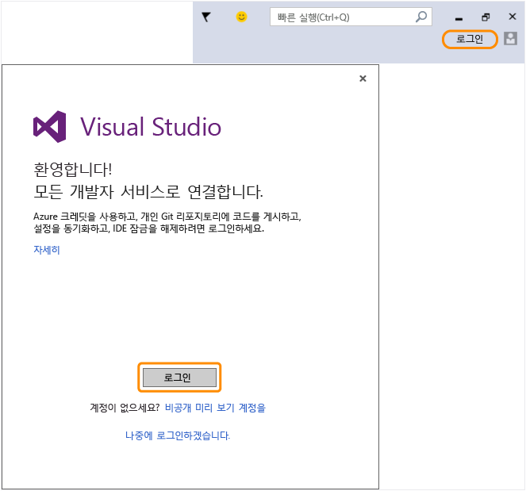

# Visual Studio로 돌아가서 새로운 Microsoft 계정을 사용하여 IDE에 로그인합니다.
Microsoft 계정을 성공적으로 만들었습니다. Visual Studio로 돌아가서 처음 시작하는 동안 시작 마법사에서 로그인하거나 언제든지 IDE의 오른쪽 위에서 로그인합니다.  
  
 IDE에 로그인하여 Azure 크레딧 사용을 시작하고, 개인 Git 리포지토리에 코드를 게시하고, 사용자 설정을 동기화하고, IDE 잠금을 해제합니다. 사용할 수 있는 모든 개발자 서비스에 대해 [자세히 알아보세요](../Topic/Signing%20in%20to%20Visual%20Studio.md).  
  
 