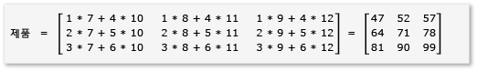
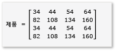

# 연습: 매트릭스 곱
[!INCLUDE[vs2017banner](../../assembler/inline/includes/vs2017banner.md)]

이 단계별 연습에서는 c\+\+ AMP를 사용하여 행렬 곱셈의 실행을 가속화 하는 방법을 보여줄 것입니다.  두 알고리즘이 표시되어 있는데, 바둑판식이 아닌것과 바둑판식인 것으로 나뉩니다.  
  
## 사전 요구 사항  
 시작하기 전에  
  
-   [C\+\+ AMP 개요](../../parallel/amp/cpp-amp-overview.md)를 읽는 경우  
  
-   [타일 사용](../../parallel/amp/using-tiles.md)를 읽는 경우  
  
-   컴퓨터에 [!INCLUDE[win7](../../build/includes/win7_md.md)], [!INCLUDE[win8](../../build/includes/win8_md.md)], [!INCLUDE[winsvr08_r2](../../parallel/amp/includes/winsvr08_r2_md.md)], 또는 [!INCLUDE[winserver8](../../build/includes/winserver8_md.md)] 가 설치되어 있는지 확인하시길 바랍니다.  
  
### 프로젝트를 만들려면  
  
1.  Visual Studio 메뉴 모음을 열고, **파일**에서 **새로 만들기**로 들어가서 **프로젝트**를 선택해 줍니다.  
  
2.  여기 **설치된** 템플릿 창에서 **Visual C\+\+** 을 선택해 줍니다.  
  
3.  **빈 프로젝트** 로 들어가서 `MatrixMultiply` 라고 **이름** 상자에 입력 한 다음 **확인** 단추를 눌러줍니다.  
  
4.  **다음** 단추를 선택합니다.  
  
5.  **솔루션 탐색기**에서, **소스 파일**에 대한 바로가기 메뉴로 들어가 준 후, **추가** 로 들어가 **새 항목** 을 선택해 줍니다..  
  
6.  그런 다음 **새 항목 추가** 대화 상자에서, **c\+\+ 파일 \(.cpp\)** 을 선택해 주시고 `MatrixMultiply.cpp` 라고 **이름** 상자에 입력한 다음 **추가** 단추를 눌러줍니다.  
  
## 비 바둑판식에서의 곱셈  
 이 섹션에서는 다음과 같이 정의 된 A와 B 두 행렬의 곱셈을 고려해야 합니다.  
  
   
  
   
  
 A 3\-2 행렬 이며 B는 2\-3 매트릭스입니다.  A와 B의 곱은 3\-3 매트릭스입니다.  이 곱셈은 A의 각 행의 요소와 B의 각 열의 요소를 곱하여 계산 됩니다.  
  
   
  
### C\+\+ AMP를 사용하지 않고 곱하려면  
  
1.  MatrixMultiply.cpp를 열어서 다음 코드를 사용해 기존 코드를 대체 합니다.  
  
    ```cpp  
  
    #include <iostream>  
  
    void MultiplyWithOutAMP() {  
  
        int aMatrix[3][2] = {{1, 4}, {2, 5}, {3, 6}};  
        int bMatrix[2][3] = {{7, 8, 9}, {10, 11, 12}};  
        int product[3][3] = {{0, 0, 0}, {0, 0, 0}, {0, 0, 0}};  
  
        for (int row = 0; row < 3; row++) {  
            for (int col = 0; col < 3; col++) {  
                // Multiply the row of A by the column of B to get the row, column of product.  
                for (int inner = 0; inner < 2; inner++) {  
                    product[row][col] += aMatrix[row][inner] * bMatrix[inner][col];  
                }  
                std::cout << product[row][col] << "  ";  
            }  
            std::cout << "\n";  
        }  
    }  
  
    void main() {  
        MultiplyWithOutAMP();  
        getchar();  
    }  
  
    ```  
  
     이 알고리즘은 행렬의 곱의 정의를 간단히 구현한 것입니다.  이것은 계산 시간을 줄이기 위해 어떠한 스레드 또는 병렬 알고리즘도 사용하지 않습니다.  
  
2.  메뉴 모음에서 **파일**, **모두 저장**을 차례로 선택합니다.  
  
3.  F5 바로 가기 키를 눌러서 디버깅을 시작 하고 출력이 올바른지 확인 합니다.  
  
4.  엔터를 입력해 응용 프로그램을 종료 합니다.  
  
### C\+\+ AMP를 사용하여 곱하려면  
  
1.  MatrixMultiply.cpp에서 다음 코드를 `main` 메서드 이전에 추가시켜 줍니다.  
  
    ```cpp  
  
    void MultiplyWithAMP() {  
        int aMatrix[] = { 1, 4, 2, 5, 3, 6 };  
        int bMatrix[] = { 7, 8, 9, 10, 11, 12 };  
        int productMatrix[] = { 0, 0, 0, 0, 0, 0, 0, 0, 0 };  
  
        array_view<int, 2> a(3, 2, aMatrix);  
        array_view<int, 2> b(2, 3, bMatrix);  
        array_view<int, 2> product(3, 3, productMatrix);  
  
        parallel_for_each(  
            product.extent,   
             [=](index<2> idx) restrict(amp) {  
                int row = idx[0];  
                int col = idx[1];  
                for (int inner = 0; inner < 2; inner++) {  
                    product[idx] += a(row, inner) * b(inner, col);  
                }  
            }  
        );  
  
        product.synchronize();  
  
        for (int row = 0; row < 3; row++) {  
            for (int col = 0; col < 3; col++) {  
                //std::cout << productMatrix[row*3 + col] << "  ";  
                std::cout << product(row, col) << "  ";  
            }  
            std::cout << "\n";  
        }  
    }  
  
    ```  
  
     AMP 코드는 AMP가 아닌 코드와 유사합니다.  그리고 `parallel_for_each` 에 대한 호출은 한개의 스레드를 각각 `product.extent` 요소에 대해 실행하고, 행과 열에 대한 `for` 루프로 대체해 줍니다.  행과 열에 있는 셀의 값은 `idx` 에 제공되어 있습니다.  사용자는 `array_view` 개체 요소에 `[]` 연산자 및 인덱스 변수, 또는 `()` 연산자 및 행과 열 변수를 사용해서 액세스할 수 있습니다.  이 예제에서는 두 메서드를 보여 줍니다.  `array_view::synchronize` 메서드는 `product` 변수의 값을 `productMatrix` 변수에다 복사해주는 메서드입니다.  
  
2.  다음의 `include` 문 및 `using` 문을 MatrixMultiply.cpp 의 맨 위에 추가해 줍니다.  
  
    ```cpp  
  
    #include <amp.h>  
    using namespace concurrency;  
  
    ```  
  
3.  그리고 `main` 메서드를 수정해서 `MultiplyWithAMP` 메서드를 호출하도록 합니다.  
  
    ```cpp  
  
    void main() {  
        MultiplyWithOutAMP();  
        MultiplyWithAMP();  
        getchar();  
    }  
  
    ```  
  
4.  F5 바로 가기 키를 눌러서 디버깅을 시작 하고 출력이 올바른지 확인 합니다.  
  
5.  스페이스 바를 눌러 응용 프로그램을 종료 합니다.  
  
## 바둑판식 배열에서 곱셈  
 바둑판식 배열은 데이터를 크기가 같은 하위 집합, 즉 tiles분할 해주는 기술입니다.  바둑판식 배열을 사용 하면 세 가지가 변경됩니다.  
  
-   사용자는 `tile_static` 변수를 만들 수 있습니다.  상대적으로 `tile_static` 공간의 데이터에 액세스 하는게 전역 공간의 데이터에 액세스 하는것 보다 훨씬 빠를 수 있습니다.  `tile_static` 변수의 인스턴스는 각 타일에 대해 만들어지며 타일의 모든 스레드는 변수에 액세스할 수 있습니다.  바둑판식 배열의 가장 큰 이점은 `tile_static` 액세스를 통해 얻는 성능 향상입니다.  
  
-   사용자는 [tile\_barrier::wait](../Topic/tile_barrier::wait%20Method.md) 메서드를 호출해서 특정 코드 줄의 하나의 타일에서의 모든 스레드를 중지할 수 있습니다.  사용자는 스레드가 실행되는 순서를 보장할 순 없지만, 하나의 타일에 있는 모든 스레드는 `tile_barrier::wait` 이 호출되면 중지 됩니다.  
  
-   사용자는 전체 `array_view` 개체와 관련되 있는 스레드의 인덱스에 액세스 및 타일과 관련된 인덱스에 액세스할 수 있습니다.  로컬 인덱스를 사용하면 코드를 더 쉽게 읽고 디버깅할 수 있습니다.  
  
 행렬의 곱셈에서 바둑판식 배열을 활용하려면, 알고리즘은 더 빠른 액세스를 위해 행렬을 타일로 분할한 후 타일 데이터를 `tile_static` 변수에 복사해야 합니다.  이 예제에서 행렬은 같은 크기의 부분행렬로 분할 됩니다.  결과물은 부분행렬들의 곱으로 얻을 수 있습니다.  이 예제에서 쓰일 두 매트릭스와 그들의 곱으로 나온 결과물은 다음과 같습니다.  
  
   
  
   
  
   
  
 매트릭스는 다음과 같이 정의된 4개의 2x2 행렬로 분할되 있습니다.  
  
   
  
   
  
 A와 B의 곱은 다음과 같이 계산될 수 있습니다.  
  
   
  
 매트릭스 `a` \- `h` 는 모두 2x2 매트릭스이기 때문에, 이것들의 모든 곱셈과 덧셈의 결과는 2x2 행렬이 나옵니다.  이것은 A\*B가 4x4 매트릭스가 나오는 경우에도 동일합니다.  알고리즘을 신속 하 게 확인 하려면, 곱셈시 첫 번째 행의 첫번째 열에 있는 요소의 값을 계산 합니다.  이 예제의 경우 그 값은 `ae + bg` 의 첫번째 행에서 첫번째 열의 요소의 값이 될 것입니다.  사용자는 각 용어에 대해 `ae` 와 `bg` 의 첫 번째 열의 첫 행을 계산 하기만 하면 됩니다.  이 경우 `ae` 의 값은 `1*1 + 2*5 = 11` 가 됩니다.  `bg`의 값이 `3*1 + 4*5 = 23`인 경우  최종 값은 `11 + 23 = 34`가 됩니다.  
  
 코드로 이 알고리즘을 구현하려면:  
  
-   사용자는 `parallel_for_each` 개체를 `extent` 개체 중 `tiled_extent` 호출에 존재하는 개체 대신에 사용합니다.  
  
-   사용자는 `parallel_for_each` 개체를 `index` 개체 중 `tiled_index` 호출에 존재하는 개체 대신에 사용합니다.  
  
-   사용자는 `tile_static` 변수를 생성해 부분행렬을 보유합니다.  
  
-   사용자는 `tile_barrier::wait` 메서드를 사용해 부분행렬들의 곱을 계산하는 스레드를 중지 할 수 있습니다.  
  
### 바둑판식 배열 및 AMP를 사용 하여 곱셈하려면  
  
1.  MatrixMultiply.cpp에서 다음 코드를 `main` 메서드 이전에 추가시켜 줍니다.  
  
    ```cpp  
  
    void MultiplyWithTiling()  
    {  
        // The tile size is 2.  
        static const int TS = 2;  
  
        // The raw data.  
        int aMatrix[] =       { 1, 2, 3, 4, 5, 6, 7, 8, 1, 2, 3, 4, 5, 6, 7, 8 };  
        int bMatrix[] =       { 1, 2, 3, 4, 5, 6, 7, 8, 1, 2, 3, 4, 5, 6, 7, 8 };  
        int productMatrix[] = { 0, 0, 0, 0, 0, 0, 0, 0, 0, 0, 0, 0, 0, 0, 0, 0 };  
  
        // Create the array_view objects.  
        array_view<int, 2> a(4, 4, aMatrix);  
        array_view<int, 2> b(4, 4, bMatrix);  
        array_view<int, 2> product(4, 4, productMatrix);  
  
        // Call parallel_for_each by using  2x2 tiles.  
        parallel_for_each(product.extent.tile< TS, TS >(),  
            [=] (tiled_index< TS, TS> t_idx) restrict(amp)   
            {  
                // Get the location of the thread relative to the tile (row, col) and the entire array_view (rowGlobal, colGlobal).  
                int row = t_idx.local[0];   
                int col = t_idx.local[1];  
                int rowGlobal = t_idx.global[0];  
                int colGlobal = t_idx.global[1];  
                int sum = 0;  
  
                // Given a 4x4 matrix and a 2x2 tile size, this loop executes twice for each thread.  
                // For the first tile and the first loop, it copies a into locA and e into locB.  
                // For the first tile and the second loop, it copies b into locA and g into locB.  
                for (int i = 0; i < 4; i += TS) {  
                    tile_static int locA[TS][TS];  
                    tile_static int locB[TS][TS];  
                    locA[row][col] = a(rowGlobal, col + i);  
                    locB[row][col] = b(row + i, colGlobal);  
                    // The threads in the tile all wait here until locA and locB are filled.  
                    t_idx.barrier.wait();  
  
                    // Return the product for the thread. The sum is retained across  
                    // both iterations of the loop, in effect adding the two products  
                    // together, for example, a*e.  
                    for (int k = 0; k < TS; k++) {  
                        sum += locA[row][k] * locB[k][col];  
                    }  
  
                    // All threads must wait until the sums are calculated. If any threads  
                    // moved ahead, the values in locA and locB would change.        
                    t_idx.barrier.wait();  
                    // Now go on to the next iteration of the loop.            
                }  
  
                // After both iterations of the loop, copy the sum to the product variable by using the global location.  
                product[t_idx.global] = sum;  
        });  
  
            // Copy the contents of product back to the productMatrix variable.  
            product.synchronize();  
  
            for (int row = 0; row < 4; row++) {  
            for (int col = 0; col < 4; col++) {  
                // The results are available from both the product and productMatrix variables.  
                //std::cout << productMatrix[row*3 + col] << "  ";  
                std::cout << product(row, col) << "  ";  
            }  
            std::cout << "\n";  
        }  
  
    }  
  
    ```  
  
     이 예제는 바둑판식 배열이 아닌 예제와는 현저하게 다릅니다.  코드는 이와 같은 개념적인 단계를 사용합니다.  
  
    1.  먼저 `a` 에 \[0, 0\]타일에 있는 요소를 `locA` 에 복사합니다.  그리고 `b` 에 \[0, 0\]타일에 있는 요소를 `locB` 에 복사합니다.  해당 `product` 는 바둑판식이고 `a` 및 `b` 을 기억하시길 바랍니다.  따라서 사용자는 글로벌 인덱스를 사용해서 `a, b`, 그리고 `product` 에 액세스 할 수 있습니다.  꼭 `tile_barrier::wait` 는 호출해줘야 합니다.  이것은 `locA` 와 `locB` 가 채워질 때 까지 타일에 있는 모든 스레드를 중지 시킵니다.  
  
    2.  그 후 `locA` 와 `locB` 에 곱셈을 해주고, 나온 결과를 `product` 에 넣어줍니다.  
  
    3.  그리고 `a` 에 \[0, 0\]타일에 있는 요소를 `locA` 에 복사합니다.  또 `b` 에 \[0, 0\]타일에 있는 요소를 `locB` 에 복사합니다.  
  
    4.  그런 다음 `locA` 와 `locB` 에 대해 곱셈을 해준 후, 나온 결과를 `product` 에 있는 결과에다가 더해줍니다.  
  
    5.  \[0, 0\]타일의 곱셈을 완료 했습니다.  
  
    6.  이것을 다른 4개의 타일에 대해서도 수행 합니다.  그곳에는, 특히 타일에는 어떠한 인덱싱도 되있지 않으므로, 스레드는 순서에 상관없이 실행할 수 있습니다.  각 스레드가 실행되면서 `tile_static` 변수가 각각 적절한 타일에 대해 생성이 되고 `tile_barrier::wait` 콜은 프로그램 흐름을 제어해 줍니다.  
  
    7.  알고리즘을 자세히 살펴보면, 각 부분행렬은 `tile_static` 메모리에 두번 로드 됩니다.  해당 데이터 전송은 시간이 얼마 걸리지 않습니다.  그러나, 데이터가 `tile_static` 메모리에 들어가게 되고 나면, 데이터 액세스는 훨씬 빨라집니다.  곱셈의 계산은 부분행렬의 값에 대한 반복적인 액세스를 필요로 하기 때문에, 데이터 액세스의 향상으로 인해서 전반적인 성능의 향상을 얻을 수 있습니다.  각 알고리즘에 대해서, 실험은 최적의 알고리즘과 최적의 타일 크기를 찾는데 필요 합니다.  
  
         비 AMP와 비 타일 예제에서 A와 B의 각 요소는 곱셈을 하기 위해 전역 메모리로부터 4번 액세스 되었습니다.  타일 예제에서는, 각 요소는 전역 메모리로부터 두번 액세스되고 `tile_static` 메모리로부터 4번 액세스 되었습니다.  이것이 상당한 성능 향상은 아닙니다.  하지만, 만약 A와 B가 1024x1024 행렬이고 타일 크기가 16이었다면, 엄청난 성능 향상을 얻을 수 있었을 것입니다.  이 경우, 각 요소는 `tile_static` 메모리에 16번 복사되고 `tile_static` 메모리로부터 1024번 액세스 될 것입니다.  
  
2.  보시는 것처럼 main 메서드를 수정해서 `MultiplyWithTiling` 메서드를 호출하도록 합니다.  
  
    ```cpp  
  
    void main() {  
        MultiplyWithOutAMP();  
        MultiplyWithAMP();  
        MultiplyWithTiling();  
        getchar();  
    }  
  
    ```  
  
3.  F5 바로 가기 키를 눌러서 디버깅을 시작 하고 출력이 올바른지 확인 합니다.  
  
4.  스페이스 바를 눌러 응용 프로그램을 종료 합니다.  
  
## 참고 항목  
 [C\+\+ AMP\(C\+\+ Accelerated Massive Parallelism\)](../../parallel/amp/cpp-amp-cpp-accelerated-massive-parallelism.md)   
 [연습: C\+\+ AMP 응용 프로그램 디버깅](../../parallel/amp/walkthrough-debugging-a-cpp-amp-application.md)