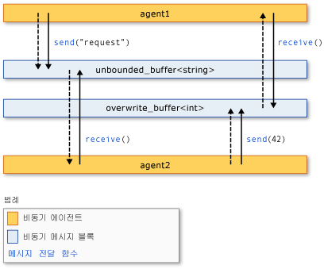

# <a name="asynchronous-agents-library"></a>비동기 에이전트 라이브러리
비동기 에이전트 라이브러리 (또는 그냥 *에이전트 라이브러리*) 동시성 사용 응용 프로그램 개발의 견고성을 향상 시킬 수 있는 프로그래밍 모델을 제공 합니다. 에이전트 라이브러리는 c + + 템플릿 라이브러리는 행위자 기반 프로그래밍 모델 및 정교 하지 않은 데이터 흐름에 대 한 전달 및 파이프라인 작업을 위해 in-process 메시지입니다. 에이전트 라이브러리는 동시성 런타임의 예약 및 리소스 관리 구성 요소 기반으로 합니다.  
  
## <a name="programming-model"></a>프로그래밍 모델  
 에이전트 라이브러리에서는 제어 흐름의 데이터 흐름에 따라 비동기 통신 모델을 통해 독립 된 구성 요소를 연결할 수 있도록 하 여 공유 상태에 대 한 대안을 제공 합니다. *데이터 흐름* 는 프로그래밍 참조 데이터를 필요한 모든 계산이 수행 되는 모델은 사용할 수 있습니다. *제어 흐름* 계산 미리 결정 된 순서로 수행 되는 프로그래밍 모델을 가리킵니다.  
  
 데이터 흐름 프로그래밍 모델은 프로그램의 개별 구성 요소가 메시지를 전달하여 서로 통신하는 *메시지 전달* 개념과 관련됩니다.  
  
 에이전트 라이브러리는 세 가지 구성 요소를 이루어져: *비동기 에이전트*, *비동기 메시지 블록*, 및 *메시지 전달 함수*합니다. 에이전트 상태를 유지 하 고 서로 및 외부 구성 요소와 통신에 메시지 블록 및 메시지 전달 함수를 사용 합니다. 메시지 전달 함수는 외부 구성 요소에서 메시지를 받거나 보내기 위해 에이전트를 설정 합니다. 비동기 메시지 블록 메시지를 보관 하 고 동기화 된 방식으로 통신 하도록 에이전트를 사용 하도록 설정 합니다.  
  
 다음 그림에서는 사용 하 여 메시지 블록 및 통신 하는 메시지 전달 함수 두 에이전트를 보여 줍니다. 이 그림에서 `agent1` 메시지를 보내는 `agent2` 를 사용 하 여는 [concurrency:: send](reference/concurrency-namespace-functions.md#send) 함수 및 [concurrency:: unbounded_buffer](reference/unbounded-buffer-class.md) 개체입니다. `agent2` 사용 하 여는 [concurrency:: receive](reference/concurrency-namespace-functions.md#receive) 메시지를 읽는 함수입니다. `agent2` 동일한 방법을 사용 하 여 메시지를 보낼 `agent1`합니다. 점선으로 된 화살표 에이전트 간 데이터 흐름을 나타냅니다. 단색 화살표에서 읽기 또는 쓰기에 있는 메시지 블록에 에이전트를 연결 합니다.  
  
   
  
 이 그림을 구현 하는 코드 예제를 보려면이이 항목의 뒷부분에 표시 됩니다.  
  
 에이전트 프로그래밍 모델에는 다른 동시성 및 동기화 메커니즘, 예를 들어 이벤트를 통해 여러 이점이 있습니다. 이점은 개체 간의 상태 변경 내용을 전송할 메시지 전달을 사용 하 여 공유 리소스에 대 한 액세스를 격리 하 고 수 있는 확장성을 향상 시키는입니다. 메시지 전달은 장점은 외부 동기화 개체에 연결 하는 대신 데이터에 대 한 동기화와 연결 한다는 점입니다. 이 구성 요소 간의 데이터 전송 기능을 하 고 응용 프로그램에서 프로그래밍 오류를 제거할 수 있습니다.  
  
## <a name="when-to-use-the-agents-library"></a>에이전트 라이브러리를 사용 하는 경우  
 비동기적으로 서로 통신 해야 하는 여러 작업이 있는 경우 에이전트 라이브러리를 사용 합니다. 메시지 블록 및 메시지 전달 함수 잠금과 같은 동기화 메커니즘을 요구 하지 않고 병렬 응용 프로그램을 작성할 수 있습니다. 이렇게 하면 응용 프로그램 논리에 집중할 수 있습니다.  
  
 에이전트 프로그래밍 모델은 만들 데 자주 사용 *데이터 파이프라인* 또는 *네트워크*합니다. 데이터 파이프라인은 각각 보다 큰 목표에 영향을 주는 특정 작업을 수행 하는 일련의 구성 요소입니다. 데이터 흐름 파이프라인의 모든 구성 요소는 다른 구성 요소에서 메시지를 받을 때 작업을 수행 합니다. 해당 작업의 결과 파이프라인 또는 네트워크의 다른 구성 요소에 전달 됩니다. 구성 요소 예를 들어 더 세분화 된 동시성 기능 다른 라이브러리에서 사용할 수 있습니다, [라이브러리 PPL (병렬 패턴)](../../parallel/concrt/parallel-patterns-library-ppl.md)합니다.  
  
## <a name="example"></a>예제  
 다음 예제에서는이 항목의 앞부분에 표시 된 그림을 구현 합니다.  
  
 [!code-cpp[concrt-basic-agents#1](../../parallel/concrt/codesnippet/cpp/asynchronous-agents-library_1.cpp)]  
  
 이 예제는 다음과 같은 출력을 생성합니다.  
  
```Output  
agent1: sending request...  
agent2: received 'request'.  
agent2: sending response...  
agent1: received '42'.  
```  
  
 다음 항목에서는이 예제에서 사용 하는 기능입니다.  
  
## <a name="related-topics"></a>관련 항목  
 [비동기 에이전트](../../parallel/concrt/asynchronous-agents.md)  
 큰 계산 작업을 해결 하기 위해 비동기 에이전트의 역할에 설명 합니다.  
  
 [비동기 메시지 블록](../../parallel/concrt/asynchronous-message-blocks.md)  
 에이전트 라이브러리에서 제공 되는 다양 한 메시지 블록 형식에 설명 합니다.  
  
 [메시지 전달 함수](../../parallel/concrt/message-passing-functions.md)  
 에이전트 라이브러리에서 제공 되는 다양 한 메시지 전달 루틴에 설명 합니다.  
  
 [방법: 다양한 공급자-소비자 패턴 구현](../../parallel/concrt/how-to-implement-various-producer-consumer-patterns.md)  
 응용 프로그램에서 공급자-소비자 패턴을 구현 하는 방법에 설명 합니다.  
  
 [방법: call 및 transformer 클래스에 작업 함수 제공](../../parallel/concrt/how-to-provide-work-functions-to-the-call-and-transformer-classes.md)  
 작업 함수를 제공 하는 여러 방법을 보여 줍니다.는 [concurrency:: call](../../parallel/concrt/reference/call-class.md) 및 [concurrency:: transformer](../../parallel/concrt/reference/transformer-class.md) 클래스입니다.  
  
 [방법: 데이터 파이프라인에서 transformer 사용](../../parallel/concrt/how-to-use-transformer-in-a-data-pipeline.md)  
 사용 하는 방법을 보여 줍니다.는 [concurrency:: transformer](../../parallel/concrt/reference/transformer-class.md) 데이터 파이프라인에서 클래스입니다.  
  
 [방법: 완료된 작업 간 선택](../../parallel/concrt/how-to-select-among-completed-tasks.md)  
 사용 하는 방법을 보여 줍니다.는 [concurrency:: choice](../../parallel/concrt/reference/choice-class.md) 및 [concurrency:: join](../../parallel/concrt/reference/join-class.md) 검색 알고리즘을 완료 하려면 첫 번째 작업을 선택 하는 클래스입니다.  
  
 [방법: 정기적으로 메시지 보내기](../../parallel/concrt/how-to-send-a-message-at-a-regular-interval.md)  
 사용 하는 방법을 보여 줍니다.는 [concurrency:: timer](../../parallel/concrt/reference/timer-class.md) 클래스 정기적으로 메시지를 보내려고 합니다.  
  
 [방법: 메시지 블록 필터 사용](../../parallel/concrt/how-to-use-a-message-block-filter.md)  
 수락 하거나 거부 하 여 비동기 메시지 블록을 사용 하도록 설정 하려면 필터를 사용 하는 방법을 보여 줍니다.  
  
 [PPL(병렬 패턴 라이브러리)](../../parallel/concrt/parallel-patterns-library-ppl.md)  
 응용 프로그램에서 병렬 알고리즘과 같은 다양 한 병렬 패턴을 사용 하는 방법에 설명 합니다.  
  
 [동시성 런타임](../../parallel/concrt/concurrency-runtime.md)  
 병렬 프로그래밍을 간소화하는 동시성 런타임에 대해 설명하고 관련 항목의 링크를 제공합니다.

