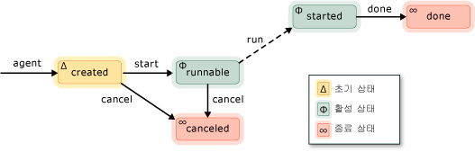

# 비동기 에이전트
*비동기 에이전트* (또는 그냥 *에이전트*)는 더 큰 계산 작업을 해결 하기 위해 다른 에이전트와 함께 비동기적으로 동작 하는 응용 프로그램 구성 요소입니다. 에이전트 작업의 수명 주기가 설정된 라고 생각 됩니다. 예를 들어 한 에이전트를 사용할 수 있도록 입/출력 장치 (예: 키보드, 디스크에 파일 또는 네트워크에 연결) 및 다른 에이전트의 데이터를 해당 데이터에 대해 작업 수행할 수는 읽을 수 있습니다. 첫 번째 에이전트인 메시지 전달을 사용 하 여 두 번째 에이전트에 게 더 많은 데이터를 사용할 수 있는지 알립니다. 동시성 런타임 작업 스케줄러를 차단 하 고 협조적으로 양보 에이전트를 사용 하는 효율적인 메커니즘을 제공 효율성이 떨어지는 선점 하지 않고도 합니다.  
  

 에이전트 라이브러리는 정의 [concurrency:: agent](../../parallel/concrt/reference/agent-class.md) 를 비동기 에이전트를 나타내는 클래스입니다. `agent` 가상 메서드를 선언 하는 추상 클래스 [concurrency::agent::run](reference/agent-class.md#run)합니다. `run` 메서드는 에이전트에서 수행 하 고 작업을 실행 합니다. 때문에 `run` 는 추상이 메서드를 구현 해야이에서 파생 되는 모든 클래스에 `agent`합니다.  
  
## 에이전트 수명 주기  
 에이전트에서 수명 주기가 설정된 했습니다. [concurrency:: agent_status](reference/concurrency-namespace-enums.md#agent_status) 열거형 에이전트의 다양 한 상태를 정의 합니다. 다음 그림은 다른 에이전트의 상태가 진행 하는 방법을 보여 주는 상태 다이어그램입니다. 이 그림에서는 실선; 응용 프로그램에서 호출할 메서드를 나타냅니다. 점선은 런타임에 호출 메서드를 나타냅니다.  
  
   
  
 다음 표에서 각 상태에는 `agent_status` 열거형입니다.  
  
|에이전트 상태|설명|  
|-----------------|-----------------|  
|`agent_created`|에이전트 실행을 위해 예약 되었습니다 되지 않습니다.|  
|`agent_runnable`|런타임 실행에 대 한 에이전트를 예약 합니다.|  
|`agent_started`|에이전트에서 시작 하 고 실행 합니다.|  
|`agent_done`|에이전트 작업을 완료 했습니다.|  
|`agent_canceled`|에이전트는 시작 하기 전에 취소 된는 `started` 상태입니다.|  
  
 `agent_created` 에이전트의 초기 상태입니다 `agent_runnable` 및 `agent_started` 는 활성 상태 및 `agent_done` 및 `agent_canceled` 는 종료 상태입니다.  
  
 사용 하 여는 [concurrency::agent::status](reference/agent-class.md#status) 의 현재 상태를 검색 하는 메서드는 `agent` 개체입니다. 하지만 `status` 메서드는 동시성 으로부터 안전한, 시간 에이전트의 상태를 변경할 수는 `status` 메서드 반환 합니다. 에 에이전트를 예로 들 수는 `agent_started` 호출 하는 경우 상태는 `status` 이동 하지만 메서드를는 `agent_done` 직후 상태는 `status` 메서드 반환 합니다.  

  
## 메서드 및 기능  
 다음 표에 나와에 속해 있는 중요 한 메서드 중 일부는 `agent` 클래스입니다. 모든에 대 한 자세한 내용은 `agent` 클래스 메서드를 참조 하십시오. [에이전트 클래스](../../parallel/concrt/reference/agent-class.md)합니다.  
  
|메서드|설명|  
|------------|-----------------|  
|[start](reference/agent-class.md#start)|일정은 `agent` 실행에 대 한 개체를 설정 하 고는 `agent_runnable` 상태입니다.|  
|[run](reference/agent-class.md#run)|수행 해야 하는 작업을 실행는 `agent` 개체입니다.|  
|[작업 수행](reference/agent-class.md#done)|에이전트를 이동 하 고 `agent_done` 상태입니다.|  
|[cancel](../../parallel/concrt/cancellation-in-the-ppl.md#cancel)|에이전트가 시작 되지 않은 경우이 메서드는 에이전트의 실행을 취소 하 고로 설정 된 `agent_canceled` 상태입니다.|  
|[status](reference/agent-class.md#status)|검색의 현재 상태는 `agent` 개체입니다.|  
|[wait](reference/agent-class.md#wait)|에 대 한 대기는 `agent` 를 입력 하는 개체는 `agent_done` 또는 `agent_canceled` 상태입니다.|  
|[wait_for_all](reference/agent-class.md#wait_for_all)|제공 된 모든 될 때까지 대기 `agent` 개체를 입력 하 고 `agent_done` 또는 `agent_canceled` 상태입니다.|  
|[wait_for_one](reference/agent-class.md#wait_for_one)|제공 된 중 하나 이상이 될 때까지 대기 `agent` 개체를 입력 하 고 `agent_done` 또는 `agent_canceled` 상태입니다.|  
  
 에이전트 개체를 만든 후 호출 된 [concurrency::agent::start](reference/agent-class.md#start) 메서드 실행을 예약 합니다. 런타임 호출은 `run` 에이전트를 예약 하 고로 설정 하는 메서드는 `agent_runnable` 상태입니다.  
  
 런타임에 비동기 에이전트에서 throw 된 예외를 관리 하지 않습니다. 예외 처리 및 에이전트에 대 한 자세한 내용은 참조 [예외 처리](../../parallel/concrt/exception-handling-in-the-concurrency-runtime.md)합니다.  
  
## 예제  
 기본 에이전트 기반 응용 프로그램을 만드는 방법을 보여 주는 예제를 보려면 [연습: 에이전트 기반 응용 프로그램을 만드는](../../parallel/concrt/walkthrough-creating-an-agent-based-application.md)합니다.  
  
## 참고 항목  
 [비동기 에이전트 라이브러리](../../parallel/concrt/asynchronous-agents-library.md)

