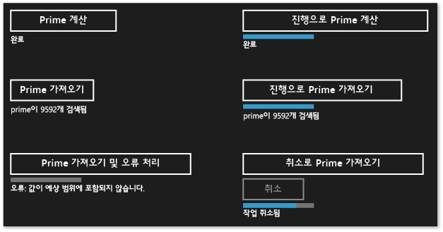

# C++로 Windows 스토어 앱용 비동기 작업 만들기
[!INCLUDE[vs2017banner](../../assembler/inline/includes/vs2017banner.md)]

이 문서에서는 [!INCLUDE[win8_appname_long](../../build/includes/win8_appname_long_md.md)] 앱에서 작업 클래스를 사용하여 Windows ThreadPool 기반 비동기 작업을 생성하는 경우 주의해야 할 몇 가지 주요 사항을 설명합니다.  
  
 비동기 프로그래밍을 통해 사용자 입력에 대한 앱의 응답 성능을 유지할 수 있기 때문에 비동기 프로그래밍의 사용은 [!INCLUDE[win8_appname_long](../../build/includes/win8_appname_long_md.md)] 앱 모델의 핵심 구성 요소입니다. UI 스레드를 차단하지 않고 장기 실행 작업을 시작할 수 있으며 해당 작업의 결과를 나중에 받을 수 있습니다. 또한 작업을 취소하고 작업이 백그라운드에서 실행될 때 진행률 알림을 받을 수도 있습니다.[C\+\+의 비동기 프로그래밍](http://msdn.microsoft.com/library/windows/apps/Hh780559.aspx) 문서는 Visual C\+\+에서 [!INCLUDE[win8_appname_long](../../build/includes/win8_appname_long_md.md)] 앱을 만들기 위해 사용할 수 있는 비동기 패턴의 개요를 제공합니다. 이 문서에서는 비동기 [!INCLUDE[wrt](../../atl/reference/includes/wrt_md.md)] 작업의 체인을 사용하고 만드는 방법을 안내합니다. 이 섹션에서는 ppltasks.h의 형식을 사용하여 다른 [!INCLUDE[wrt](../../atl/reference/includes/wrt_md.md)] 구성 요소에서 사용할 수 있는 비동기 작업을 생성하는 방법과 비동기 작업이 실행되는 방식을 제어하는 방법에 대해 설명합니다. 또한 [Hilo의 비동기 프로그래밍 패턴 및 팁\(C\+\+ 및 XAML을 사용하는 Windows 스토어 앱\)](http://msdn.microsoft.com/library/windows/apps/jj160321.aspx)을 읽고 C\+\+ 및 XAML을 사용하는 [!INCLUDE[win8_appname_long](../../build/includes/win8_appname_long_md.md)] 앱인 Hilo에서 어떻게 작업 클래스를 사용하여 비동기 작업을 구현했는지 살펴보세요.  
  
> [!NOTE]
>  [!INCLUDE[win8_appname_long](../../build/includes/win8_appname_long_md.md)] 앱에서 [PPL\(병렬 패턴 라이브러리\)](../../parallel/concrt/parallel-patterns-library-ppl.md) 및 [비동기 에이전트 라이브러리](../../parallel/concrt/asynchronous-agents-library.md)를 사용할 수 있습니다. 그러나 작업 스케줄러 또는 리소스 관리자는 사용할 수 없습니다. 이 문서에서는 데스크톱 앱에는 사용할 수 없고 [!INCLUDE[win8_appname_long](../../build/includes/win8_appname_long_md.md)] 앱에만 사용할 수 있는, PPL에서 제공하는 추가 기능에 대해 설명합니다.  
  
## 주요 사항  
  
-   [concurrency::create\_async](../Topic/create_async%20Function.md)를 사용하여 다른 구성 요소\(C\+\+ 이외의 언어로 작성될 수도 있음\)에서 사용할 수 있는 비동기 작업을 만듭니다.  
  
-   [concurrency::progress\_reporter](../../parallel/concrt/reference/progress-reporter-class.md)를 사용하여 비동기 작업을 호출하는 구성 요소에 진행률 알림을 보고합니다.  
  
-   취소 토큰을 사용하여 내부 비동기 작업이 취소될 수 있도록 합니다.  
  
-   `create_async` 함수의 동작은 이 함수에 전달된 작업 함수의 반환 형식에 따라 달라집니다. 작업\(`task<T>` 또는 `task<void>`\)을 반환하는 작업 함수는 `create_async`를 호출한 컨텍스트에서 동기적으로 실행됩니다.`T` 또는 `void`를 반환하는 작업 함수는 임의의 컨텍스트에서 실행됩니다.  
  
-   [concurrency::task::then](../Topic/task::then%20Method.md) 메서드를 사용하여 차례로 실행되는 작업의 체인을 만들 수 있습니다.[!INCLUDE[win8_appname_long](../../build/includes/win8_appname_long_md.md)] 앱에서 작업의 연속에 대한 기본 컨텍스트는 해당 작업이 생성된 방식에 따라 달라집니다. 비동기 동작을 작업 생성자에 전달하거나 비동기 동작을 반환하는 람다 식을 전달하여 작업을 만든 경우 해당 작업의 모든 연속에 대한 기본 컨텍스트는 현재 컨텍스트입니다. 비동기 동작에서 작업을 생성하지 않은 경우에는 임의의 컨텍스트가 작업의 연속에 기본적으로 사용됩니다. 기본 컨텍스트는 [concurrency::task\_continuation\_context](../../parallel/concrt/reference/task-continuation-context-class.md) 클래스를 사용하여 재정의할 수 있습니다.  
  
## 이 문서에서 다루는 내용  
  
-   [비동기 작업 만들기](#create-async)  
  
-   [예: C\+\+ Windows 런타임 구성 요소를 만들기](#example-component)  
  
-   [실행 스레드 제어](#exethread)  
  
-   [예: C\+\+ 및 XAML을 사용하여 Windows 스토어 앱에서 실행 제어](#example-app)  
  
##   비동기 작업 만들기  
 PPL\(병렬 패턴 라이브러리\)에서 작업 및 연속 모델을 사용하여 백그라운드 작업과 이전 작업이 완료될 때 실행되는 추가 작업을 정의할 수 있습니다. 이 기능은 [concurrency:: task](../../parallel/concrt/reference/task-class-concurrency-runtime.md) 클래스를 통해 제공됩니다. 이 모델과 `task` 클래스에 대한 자세한 내용은 [작업 병렬 처리](../../parallel/concrt/task-parallelism-concurrency-runtime.md)을 참조하세요.  
  
 [!INCLUDE[wrt](../../atl/reference/includes/wrt_md.md)]은 특수한 운영 체제 환경에서만 실행되는 [!INCLUDE[win8_appname_long](../../build/includes/win8_appname_long_md.md)] 앱을 만드는 데 사용할 수 있는 프로그래밍 인터페이스입니다. 이러한 앱은 승인된 함수, 데이터 형식 및 장치를 사용하며 [!INCLUDE[win8_appstore_long](../../build/reference/includes/win8_appstore_long_md.md)]에서 배포됩니다.[!INCLUDE[wrt](../../atl/reference/includes/wrt_md.md)]은 *ABI\(응용 프로그램 이진 인터페이스\)*를 통해 표현됩니다. ABI는 [!INCLUDE[wrt](../../atl/reference/includes/wrt_md.md)] API를 Visual C\+\+와 같은 프로그래밍 언어에 사용할 수 있도록 하는 기본 이진 계약입니다.  
  
 [!INCLUDE[wrt](../../atl/reference/includes/wrt_md.md)]을 사용하여 다양한 프로그래밍 언어의 가장 유용한 기능을 사용하고 하나의 앱에 결합할 수 있습니다. 예를 들어 JavaScript에서 UI를 만들고 C\+\+ 구성 요소에서 계산이 많은 앱 논리를 수행할 수 있습니다. 이러한 계산이 많은 작업을 백그라운드에서 수행하는 기능은 UI 응답 성능을 유지하는 데 핵심적인 요소입니다.`task` 클래스가 C\+\+에 고유하기 때문에 다른 구성 요소\(C\+\+ 이외의 언어로 작성될 수도 있음\)와 비동기 작업의 통신을 수행하려면 [!INCLUDE[wrt](../../atl/reference/includes/wrt_md.md)] 인터페이스를 사용해야 합니다.[!INCLUDE[wrt](../../atl/reference/includes/wrt_md.md)]에서는 비동기 작업을 나타내는 데 사용할 수 있는 다음 네 가지 인터페이스를 제공합니다.  
  
 [Windows::Foundation::IAsyncAction](http://msdn.microsoft.com/library/windows/apps/windows.foundation.iasyncaction.aspx)  
 비동기 동작을 나타냅니다.  
  
 [Windows::Foundation::IAsyncActionWithProgress\<TProgress\>](http://msdn.microsoft.com/library/windows/apps/br206581.aspx)  
 진행률을 보고하는 비동기 동작을 나타냅니다.  
  
 [Windows::Foundation::IAsyncOperation\<TResult\>](http://msdn.microsoft.com/library/windows/apps/br206598.aspx)  
 결과를 반환하는 비동기 작업을 나타냅니다.  
  
 [Windows::Foundation::IAsyncOperationWithProgress\<TResult, TProgress\>](http://msdn.microsoft.com/library/windows/apps/br206594.aspx)  
 결과를 반환하고 진행률을 보고하는 비동기 작업을 나타냅니다.  
  
 여기서 *동작\(action\)*은 비동기 작업에서 값을 생성하지 않음을 의미하고\(`void`를 반환하는 함수와 유사함\),*작업\(operation\)*은 비동기 작업에서 값을 생성함을 의미합니다.*진행률\(progress\)*은 작업에서 진행률 메시지를 호출자에게 보고할 수 있음을 의미합니다. JavaScript, .NET Framework 및 Visual C\+\+에서는 ABI 경계를 넘어 사용할 수 있도록 이러한 인터페이스의 인스턴스를 만드는 방법을 자체적으로 제공합니다. Visual C\+\+의 경우 PPL에서 [concurrency:: create\_async](../Topic/create_async%20Function.md) 함수를 제공합니다. 이 함수는 작업의 완료를 나타내는 [!INCLUDE[wrt](../../atl/reference/includes/wrt_md.md)] 비동기 동작 또는 작업을 만듭니다.`create_async` 함수는 작업 함수\(일반적으로 람다 식\)를 사용하고 `task` 개체를 내부적으로 만들며 네 가지 비동기 [!INCLUDE[wrt](../../atl/reference/includes/wrt_md.md)] 인터페이스 중 하나에 해당 작업을 래핑합니다.  
  
> [!NOTE]
>  다른 언어 또는 다른 [!INCLUDE[wrt](../../atl/reference/includes/wrt_md.md)] 구성 요소에서 액세스할 수 있는 기능을 만들어야 하는 경우에만 `create_async`를 사용하세요. 작업이 동일한 구성 요소에서 C\+\+ 코드를 통해 생성되고 사용되는 것을 알고 있는 경우에는 `task` 클래스를 직접 사용합니다.  
  
 `create_async`의 반환 형식은 해당 인수의 형식에 따라 결정됩니다. 예를 들어 작업 함수에서 값을 반환하지 않고 진행률을 보고하지 않는 경우 `create_async`는 `IAsyncAction`을 반환합니다. 작업 함수에서 값을 반환하지 않고 진행률을 보고하는 경우 `create_async`는 `IAsyncActionWithProgress`를 반환합니다. 진행률을 보고하려면 [concurrency::progress\_reporter](../../parallel/concrt/reference/progress-reporter-class.md) 개체를 작업 함수에 매개 변수로 제공합니다. 진행률을 보고하는 기능을 사용하면 수행된 작업량과 남아 있는 작업량을 백분율 등으로 보고할 수 있습니다. 또한 결과가 사용 가능해지면 결과도 보고할 수 있습니다.  
  
 `IAsyncAction`, `IAsyncActionWithProgress<TProgress>`, `IAsyncOperation<TResult>` 및 `IAsyncActionOperationWithProgress<TProgress, TProgress>` 인터페이스는 비동기 작업을 취소하는 데 사용할 수 있는 `Cancel` 메서드를 각기 제공합니다.`task` 클래스는 취소 토큰과 함께 작동합니다. 취소 토큰을 사용하여 작업을 취소하면 런타임에서 해당 토큰을 구독하는 새 작업을 시작하지 않습니다. 이미 활성화된 작업은 취소 토큰을 모니터링하고 가능한 경우 중지할 수 있습니다. 이 메커니즘에 대해서는 [취소](../../parallel/concrt/cancellation-in-the-ppl.md) 문서에 자세히 설명되어 있습니다. 두 가지 방식으로 작업 취소를 [!INCLUDE[wrt](../../atl/reference/includes/wrt_md.md)]`Cancel` 메서드와 연결할 수 있습니다. 첫째, [concurrency::cancellation\_token](cancellation_token) 개체를 사용하도록 `create_async`에 전달하는 작업 함수를 정의할 수 있습니다.`Cancel` 메서드가 호출되면 이 취소 토큰이 취소되고 일반적인 취소 규칙이 `create_async` 호출을 지원하는 내부 `task` 개체에 적용됩니다.`cancellation_token` 개체를 제공하지 않는 경우 내부 `task` 개체는 암시적으로 이 개체를 정의합니다. 작업 함수에서 취소에 협조적으로 응답해야 하는 경우에는 `cancellation_token` 개체를 정의해야 합니다.[예: C\+\+ 및 XAML을 사용하여 Windows 스토어 앱에서 실행 제어](#example-app) 섹션에서는 사용자 지정 [!INCLUDE[wrt](../../atl/reference/includes/wrt_md.md)] C\+\+ 구성 요소와 C\# 및 XAML을 사용하는 [!INCLUDE[win8_appname_long](../../build/includes/win8_appname_long_md.md)] 앱에서 취소를 수행하는 방법의 예를 보여 줍니다.  
  
> [!WARNING]
>  작업 연속의 체인에서는 취소 토큰이 취소될 때 항상 상태를 정리한 다음 [concurrency::cancel\_current\_task](../Topic/cancel_current_task%20Function.md)를 호출해야 합니다.`cancel_current_task`를 호출하지 않고 조기에 반환하는 경우 작업이 취소된 상태가 아니라 완료된 상태로 전환됩니다.  
  
 다음 표에는 앱에서 비동기 작업을 정의하는 데 사용할 수 있는 조합이 요약되어 있습니다.  
  
|만들려는 [!INCLUDE[wrt](../../atl/reference/includes/wrt_md.md)] 인터페이스|`create_async`의 반환 형식|암시적 취소 토큰을 사용하기 위해 작업 함수에 전달할 매개 변수 형식|명시적 취소 토큰을 사용하기 위해 작업 함수에 전달할 매개 변수 형식|  
|--------------------------------------------------------------------|---------------------------|--------------------------------------------|--------------------------------------------|  
|`IAsyncAction`|`void` 또는 `task<void>`|\(없음\)|\(`cancellation_token`\)|  
|`IAsyncActionWithProgress<TProgress>`|`void` 또는 `task<void>`|\(`progress_reporter`\)|\(`progress_reporter`, `cancellation_token`\)|  
|`IAsyncOperation<TResult>`|`T` 또는 `task<T>`|\(없음\)|\(`cancellation_token`\)|  
|`IAsyncActionOperationWithProgress<TProgress, TProgress>`|`T` 또는 `task<T>`|\(`progress_reporter`\)|\(`progress_reporter`, `cancellation_token`\)|  
  
 `create_async` 함수에 전달하는 작업 함수에서 `task` 개체를 반환하거나 값을 반환할 수 있습니다. 이러한 변형은 각기 다른 동작을 생성합니다. 값을 반환하는 경우 작업 함수는 백그라운드 스레드에서 실행될 수 있도록 `task`에 래핑됩니다. 또한 내부 `task`는 암시적 취소 토큰을 사용합니다. 반대로 `task` 개체를 반환하는 경우 작업 함수는 동기적으로 실행됩니다. 따라서 `task` 개체를 반환하는 경우에는 앱이 응답 성능을 유지할 수 있도록 작업 함수에서 시간이 많이 걸리는 모든 작업이 작업으로 실행되어야 합니다. 또한 내부 `task`는 암시적 취소 토큰을 사용하지 않습니다. 따라서 `create_async`에서 `task` 개체를 반환할 때 취소에 대한 지원이 필요한 경우 `cancellation_token` 개체를 사용하도록 작업 함수를 정의해야 합니다.  
  
 다음 예에서는 다른 [!INCLUDE[wrt](../../atl/reference/includes/wrt_md.md)] 구성 요소에서 사용할 수 있는 `IAsyncAction` 개체를 만드는 다양한 방법을 보여 줍니다.  
  
 [!code-cpp[concrt-windowsstore-primes#100](../../parallel/concrt/codesnippet/CPP/creating-asynchronous-operations-in-cpp-for-windows-store-apps_1.cpp)]  
  
##   예: C\+\+ Windows 런타임 구성 요소를 만들어 C\#에서 이를 사용  
 XAML 및 C\#을 사용하여 UI를 정의하고 C\+\+ [!INCLUDE[wrt](../../atl/reference/includes/wrt_md.md)] 구성 요소를 사용하여 계산이 많은 작업을 수행하는 앱을 살펴보겠습니다. 이 예에서 C\+\+ 구성 요소는 지정된 범위에서 소수인 수를 계산합니다. 네 가지 [!INCLUDE[wrt](../../atl/reference/includes/wrt_md.md)] 비동기 작업 인터페이스의 차이점을 보여 주기 위해 Visual Studio에서 **빈 솔루션**을 만들고 이름을 `Primes`로 지정하여 시작합니다. 그런 다음 솔루션에 **Windows 런타임 구성 요소** 프로젝트를 추가하고 이름을 `PrimesLibrary`로 지정합니다. 생성된 C\+\+ 헤더 파일에 다음 코드를 추가합니다\(이 예에서는 Class1.h의 이름을 Primes.h로 변경\). 각 `public` 메서드는 네 가지 비동기 인터페이스 중 하나를 정의합니다. 값을 반환하는 메서드는 [Windows::Foundation::Collections::IVector\<int\>](http://msdn.microsoft.com/library/windows/apps/br206631.aspx) 개체를 반환합니다. 진행률을 보고하는 메서드는 완료된 전체 작업의 백분율을 정의하는 `double` 값을 생성합니다.  
  
 [!code-cpp[concrt-windowsstore-primes#1](../../parallel/concrt/codesnippet/CPP/creating-asynchronous-operations-in-cpp-for-windows-store-apps_2.h)]  
  
> [!NOTE]
>  규칙에 따라 [!INCLUDE[wrt](../../atl/reference/includes/wrt_md.md)]의 비동기 메서드 이름은 일반적으로 "Async"로 끝납니다.  
  
 생성된 C\+\+ 소스 파일에 다음 코드를 추가합니다\(이 예에서는 Class1.cpp의 이름을 Primes.cpp로 변경\).`is_prime` 함수는 입력이 소수인지 여부를 확인합니다. 나머지 메서드는 `Primes` 클래스를 구현합니다.`create_async`를 호출할 때마다 이 함수가 호출된 메서드와 호환되는 서명이 사용됩니다. 예를 들어 `Primes::ComputePrimesAsync`는 `IAsyncAction`을 반환하기 때문에 `create_async`에 제공되는 작업 함수는 값을 반환하지 않으며 `progress_reporter` 개체를 매개 변수로 사용하지 않습니다.  
  
 [!code-cpp[concrt-windowsstore-primes#2](../../parallel/concrt/codesnippet/CPP/creating-asynchronous-operations-in-cpp-for-windows-store-apps_3.cpp)]  
  
 각 메서드는 먼저 유효성 검사를 수행하여 입력 매개 변수가 음수가 아닌지 확인합니다. 입력 값이 음수이면 메서드에서 [Platform::InvalidArgumentException](http://msdn.microsoft.com/library/windows/apps/hh755794\(v=vs.110\).aspx)을 throw합니다. 오류 처리에 대해서는 이 섹션의 뒷부분에서 설명합니다.  
  
 [!INCLUDE[win8_appname_long](../../build/includes/win8_appname_long_md.md)] 앱에서 이러한 메서드를 사용하려면 Visual C\# **새 응용 프로그램\(XAML\)** 템플릿을 사용하여 두 번째 프로젝트를 Visual Studio 솔루션에 추가합니다. 이 예에서는 프로젝트 이름을 `Primes`로 지정합니다. 그런 다음 `Primes` 프로젝트에서 `PrimesLibrary` 프로젝트에 대한 참조를 추가합니다.  
  
 MainPage.xaml에 다음 코드를 추가합니다. 이 코드에서는 C\+\+ 구성 요소를 호출하고 결과를 표시할 수 있도록 UI를 정의합니다.  
  
 [!code-xml[concrt-windowsstore-primes#3](../../parallel/concrt/codesnippet/Xaml/creating-asynchronous-operations-in-cpp-for-windows-store-apps_4.xaml)]  
  
 MainPage.xaml의 `MainPage` 클래스에 다음 코드를 추가합니다. 이 코드에서는 `Primes` 개체와 단추 이벤트 처리기를 정의합니다.  
  
 [!code-cs[concrt-windowsstore-primes#4](../../parallel/concrt/codesnippet/CSharp/creating-asynchronous-operations-in-cpp-for-windows-store-apps_5.cs)]  
  
 이러한 메서드는 `async` 및 `await` 키워드를 사용하여 비동기 작업이 완료된 후 UI를 업데이트합니다. C\# 및 Visual Basic에 사용할 수 있는 비동기 패턴에 대한 자세한 내용은 [C\#으로 작성된 Windows 스토어 앱의 비동기 패턴](http://msdn.microsoft.com/library/windows/apps/hh464924.aspx) 및 [VB로 작성된 Windows 스토어 앱의 비동기 패턴](http://msdn.microsoft.com/library/windows/apps/hh464924.aspx)을 참조하세요.  
  
 `getPrimesCancellation` 및 `cancelGetPrimes` 메서드는 함께 작동하여 사용자가 작업을 취소할 수 있도록 합니다. 사용자가 **취소** 단추를 선택하면 `cancelGetPrimes` 메서드는 [IAsyncOperationWithProgress\<TResult, TProgress\>::Cancel](http://msdn.microsoft.com/library/windows/apps/windows.foundation.iasyncinfo.cancel.aspx)을 호출하여 작업을 취소합니다. 기본 비동기 작업을 관리하는 동시성 런타임은 [!INCLUDE[wrt](../../atl/reference/includes/wrt_md.md)]에서 catch한 내부 예외 형식을 throw하여 취소가 완료되었다고 전달합니다. 취소 모델에 대한 자세한 내용은 [취소](../../parallel/concrt/cancellation-in-the-ppl.md)을 참조하세요.  
  
> [!IMPORTANT]
>  PPL에서 작업을 취소했음을 [!INCLUDE[wrt](../../atl/reference/includes/wrt_md.md)]에 올바르게 보고할 수 있도록 하려면 이 내부 예외 형식을 catch하지 않아야 합니다. 즉, 모든 예외도 catch하지 않아야 합니다\(`catch (...)`\). 모든 예외를 catch해야 하는 경우 예외를 다시 throw하여 [!INCLUDE[wrt](../../atl/reference/includes/wrt_md.md)]에서 취소 작업을 완료할 수 있도록 합니다.  
  
 다음 그림에서는 각 옵션을 선택한 후의 `Primes` 앱을 보여 줍니다.  
  
   
  
 `create_async`를 사용하여 다른 언어에서 사용할 수 있는 비동기 작업을 만드는 예는 [Bing 지도 여정 최적화 프로그램 샘플에서 C\+\+ 사용](http://msdn.microsoft.com/library/windows/apps/hh699891\(v=vs.110\).aspx) 및 [PPL을 사용하는 C\+\+의 Windows 8 비동기 작업](http://code.msdn.microsoft.com/windowsapps/Windows-8-Asynchronous-08009a0d)을 참조하세요.  
  
##   실행 스레드 제어  
 [!INCLUDE[wrt](../../atl/reference/includes/wrt_md.md)]에서는 COM 스레딩 모델을 사용합니다. 이 모델에서 개체는 동기화를 처리하는 방식에 따라 서로 다른 아파트에 호스트됩니다. 스레드로부터 안전한 개체는 MTA\(다중 스레드 아파트\)에서 호스트됩니다. 단일 스레드에서 액세스해야 하는 개체는 STA\(단일 스레드 아파트\)에서 호스트됩니다.  
  
 UI가 있는 앱에서 ASTA\(응용 프로그램 STA\) 스레드는 창 메시지를 펌프하는 작업을 담당하며 STA에서 호스트된 UI 컨트롤을 업데이트할 수 있는 프로세스의 유일한 스레드입니다. 이에 따라 두 가지 결과가 발생합니다. 첫째, 앱의 응답 성능을 유지하기 위해 CPU를 많이 사용하는 모든 I\/O 작업은 ASTA 스레드에서 실행되지 않아야 합니다. 둘째, 백그라운드 스레드에서 제공되는 결과는 UI를 업데이트하기 위해 ASTA에 다시 마샬링되어야 합니다. C\+\+ [!INCLUDE[win8_appname_long](../../build/includes/win8_appname_long_md.md)] 앱에서 `MainPage` 및 다른 XAML 페이지는 모두 ATSA에서 실행됩니다. 따라서 ASTA에서 선언된 작업 연속은 기본적으로 그곳에서 실행되므로 연속 본문에서 직접 컨트롤을 업데이트할 수 있습니다. 그러나 작업을 다른 작업에 중첩하는 경우 중첩된 작업의 모든 연속은 MTA에서 실행됩니다. 따라서 이러한 연속이 실행되는 컨텍스트를 명시적으로 지정할지 여부를 고려해야 합니다.  
  
 `IAsyncOperation<TResult>`과 같은 비동기 작업에서 만든 작업은 스레딩 세부 사항을 무시하는 데 도움이 될 수 있는 특수한 의미 체계를 사용합니다. 작업이 백그라운드 스레드에서 실행되거나 스레드를 통해 전혀 지원되지 않을 수 있지만 작업의 연속은 연속 작업을 시작한 아파트\(즉, `task::then`을 호출한 아파트\)에서 실행되도록 기본적으로 보장됩니다.[concurrency::task\_continuation\_context](../../parallel/concrt/reference/task-continuation-context-class.md) 클래스를 사용하여 연속의 실행 컨텍스트를 제어할 수 있습니다.`task_continuation_context` 개체를 만들려면 다음과 같은 정적 도우미 메서드를 사용합니다.  
  
-   연속이 백그라운드 스레드에서 실행되도록 지정하려면 [concurrency::task\_continuation\_context::use\_arbitrary](../Topic/task_continuation_context::use_arbitrary%20Method.md)를 사용합니다.  
  
-   연속이 `task::then`을 호출한 스레드에서 실행되도록 지정하려면 [concurrency::task\_continuation\_context::use\_current](../Topic/task_continuation_context::use_current%20Method.md)를 사용합니다.  
  
 `task_continuation_context` 개체를 [task:: then](../Topic/task::then%20Method.md) 메서드에 전달하여 연속의 실행 컨텍스트를 명시적으로 제어하거나, 작업을 다른 아파트에 전달한 다음 `task::then` 메서드를 호출하여 실행 컨텍스트를 암시적으로 제어할 수 있습니다.  
  
> [!IMPORTANT]
>  [!INCLUDE[win8_appname_long](../../build/includes/win8_appname_long_md.md)] 앱의 주 UI 스레드가 STA에서 실행되기 때문에 해당 STA에서 만드는 연속은 기본적으로 STA에서 실행됩니다. 따라서 MTA에서 만드는 연속은 MTA에서 실행됩니다.  
  
 다음 섹션에서는 디스크에서 파일을 읽고 해당 파일에서 가장 일반적인 단어를 찾은 다음 UI에 결과를 표시하는 앱을 보여 줍니다. UI를 업데이트하는 최종 작업은 UI 스레드에서 발생합니다.  
  
> [!IMPORTANT]
>  이 동작은 [!INCLUDE[win8_appname_long](../../build/includes/win8_appname_long_md.md)] 앱에 고유합니다. 데스크톱 앱의 경우 연속이 실행되는 위치를 제어하지 않습니다. 대신 스케줄러가 각 연속을 실행할 작업자 스레드를 선택합니다.  
  
> [!IMPORTANT]
>  STA에서 실행되는 연속의 본문에서 [concurrency::task::wait](../Topic/task::wait%20Method.md)를 호출하지 마세요. 호출하는 경우 이 메서드가 현재 스레드를 차단하고 앱이 응답하지 않게 만들 수 있기 때문에 런타임에서 [concurrency::invalid\_operation](../../parallel/concrt/reference/invalid-operation-class.md)을 throw합니다. 그러나 [concurrency::task::get](../Topic/task::get%20Method.md) 메서드를 호출하여 작업 기반 연속에서 선행 작업의 결과를 받을 수 있습니다.  
  
##   예: C\+\+ 및 XAML을 사용하여 [!INCLUDE[win8_appname_long](../../build/includes/win8_appname_long_md.md)] 응용 프로그램에서 실행 제어  
 디스크에서 파일을 읽고 해당 파일에서 가장 일반적인 단어를 찾은 다음 UI에 결과를 표시하는 C\+\+ XAML 앱을 살펴보겠습니다. 이 앱을 만들려면 Visual Studio에서 [!INCLUDE[win8_appname_long](../../build/includes/win8_appname_long_md.md)]**새 응용 프로그램\(XAML\)** 프로젝트를 만들고 이름을 `CommonWords`로 지정하여 시작합니다. 앱 매니페스트에서 **문서 라이브러리** 접근 권한을 지정하여 앱이 문서 폴더에 액세스할 수 있도록 합니다. 또한 텍스트\(.txt\) 파일 형식을 앱 매니페스트의 선언 섹션에 추가합니다. 앱 기능 및 선언에 대한 자세한 내용은 [앱 패키지 및 배포](http://msdn.microsoft.com/library/windows/apps/hh464929.aspx)를 참조하세요.  
  
 MainPage.xaml에서 `Grid` 요소를 업데이트하여 `ProgressRing` 요소와 `TextBlock` 요소를 포함합니다.`ProgressRing`은 작업이 진행 중임을 나타내고, `TextBlock`은 계산의 결과를 보여 줍니다.  
  
 [!code-xml[concrt-windowsstore-commonwords#1](../../parallel/concrt/codesnippet/Xaml/creating-asynchronous-operations-in-cpp-for-windows-store-apps_6.xaml)]  
  
 pch.h에 다음 `#include` 문을 추가합니다.  
  
 [!code-cpp[concrt-windowsstore-commonwords#2](../../parallel/concrt/codesnippet/CPP/creating-asynchronous-operations-in-cpp-for-windows-store-apps_7.h)]  
  
 `MainPage` 클래스에 다음 메서드 선언을 추가합니다\(MainPage.h\).  
  
 [!code-cpp[concrt-windowsstore-commonwords#3](../../parallel/concrt/codesnippet/CPP/creating-asynchronous-operations-in-cpp-for-windows-store-apps_8.h)]  
  
 MainPage.cpp에 다음 `using` 문을 추가합니다.  
  
 [!code-cpp[concrt-windowsstore-commonwords#4](../../parallel/concrt/codesnippet/CPP/creating-asynchronous-operations-in-cpp-for-windows-store-apps_9.cpp)]  
  
 MainPage.cpp에서 `MainPage::MakeWordList`, `MainPage::FindCommonWords` 및 `MainPage::ShowResults` 메서드를 구현합니다.`MainPage::MakeWordList` 및 `MainPage::FindCommonWords`는 계산이 많은 작업을 수행합니다.`MainPage::ShowResults` 메서드는 UI에 계산의 결과를 표시합니다.  
  
 [!code-cpp[concrt-windowsstore-commonwords#5](../../parallel/concrt/codesnippet/CPP/creating-asynchronous-operations-in-cpp-for-windows-store-apps_10.cpp)]  
  
 `MainPage` 생성자를 수정하여 Homer의 *The Iliad*라는 책에 있는 일반적인 단어를 UI에 표시하는 연속 작업의 체인을 만듭니다. 텍스트를 개별 단어로 분할하고 일반적인 단어를 찾는 처음 두 연속 작업은 시간이 걸릴 수 있으므로 백그라운드에서 실행되도록 명시적으로 설정됩니다. UI를 업데이트하는 최종 연속 작업은 연속 컨텍스트를 지정하지 않으므로 아파트 스레딩 규칙을 따릅니다.  
  
 [!code-cpp[concrt-windowsstore-commonwords#6](../../parallel/concrt/codesnippet/CPP/creating-asynchronous-operations-in-cpp-for-windows-store-apps_11.cpp)]  
  
> [!NOTE]
>  이 예에서는 실행 컨텍스트를 지정하는 방법과 연속의 체인을 구성하는 방법을 보여 줍니다. 앞에서 설명했듯이 기본적으로 비동기 작업에서 만든 작업은 `task::then`을 호출한 아파트에서 연속을 실행합니다. 따라서 이 예에서는 `task_continuation_context::use_arbitrary`를 사용하여 UI와 관련이 없는 작업이 백그라운드 스레드에서 수행되도록 지정합니다.  
  
 다음 그림에서는 `CommonWords` 앱의 결과를 보여 줍니다.  
  
   
  
 이 예에서는 `create_async`를 지원하는 `task` 개체가 암시적 취소 토큰을 사용하기 때문에 취소를 지원할 수 있습니다. 작업이 협조적으로 취소에 응답해야 하는 경우 `cancellation_token` 개체를 사용하도록 작업 함수를 정의합니다. PPL에서의 취소에 대한 자세한 내용은 [취소](../../parallel/concrt/cancellation-in-the-ppl.md)을 참조하세요.  
  
## 참고 항목  
 [동시성 런타임](../../parallel/concrt/concurrency-runtime.md)