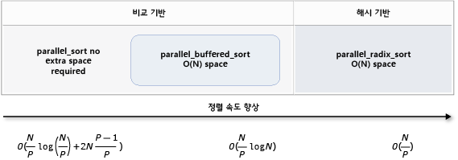

# <a name="parallel-algorithms"></a>병렬 알고리즘
병렬 패턴 라이브러리 (PPL) 동시에 데이터 컬렉션에 대 한 작업을 수행 하는 알고리즘을 제공 합니다. 이러한 알고리즘 비슷한 c + + 표준 라이브러리에서 제공 합니다.  
  

 병렬 알고리즘은 동시성 런타임의 기존 기능으로 구성 됩니다. 예를 들어는 [concurrency:: parallel_for](reference/concurrency-namespace-functions.md#parallel_for) 알고리즘에서 사용 하는 [concurrency:: structured_task_group](../../parallel/concrt/reference/structured-task-group-class.md) 병렬 루프 반복을 수행 하는 개체입니다. `parallel_for` 알고리즘 파티션을 사용할 수 있는 컴퓨팅 리소스 수가 지정 된 최적의 방식으로 작동 합니다.  

  
##  <a name="top"></a> 섹션  
  
- [Parallel_for 알고리즘](#parallel_for)  
  
- [Parallel_for_each 알고리즘](#parallel_for_each)  
  
- [Parallel_invoke 알고리즘](#parallel_invoke)  
  
- [Parallel_transform 및 parallel_reduce 알고리즘](#parallel_transform_reduce)  
  
    - [Parallel_transform 알고리즘](#parallel_transform)  
  
    - [Parallel_reduce 알고리즘](#parallel_reduce)  
  
    - [예: 매핑 및 줄이기 병렬로 수행](#map_reduce_example)  
  
- [분할 작업](#partitions)  
  
- [병렬 정렬](#parallel_sorting)  
  
    - [정렬 알고리즘 선택](#choose_sort)  
  
##  <a name="parallel_for"></a> Parallel_for 알고리즘  

 [concurrency:: parallel_for](reference/concurrency-namespace-functions.md#parallel_for) 알고리즘 반복 해 서 동시에 같은 작업을 수행 합니다. 이러한 각 태스크는 반복 값에 의해 매개 변수화 됩니다. 이 알고리즘은 해당 루프의 반복 간에 리소스를 공유 하지 않는 루프 본문이 있는 경우에 유용 합니다.  
  
 `parallel_for` 알고리즘 병렬 실행을 위한 최적의 방법으로 작업을 분할 합니다. 작업 부하가 분산되지 않은 경우 작업 가로채기 알고리즘과 범위 도용을 사용하여 이러한 파티션을 분산시킵니다. 하나의 루프 반복이 협조적으로 차단 런타임에서 현재 스레드를 다른 스레드 또는 프로세서에 할당 된 반복 범위를 재배포 합니다. 마찬가지로, 스레드 반복 범위 완료 되 면 런타임에서 스레드 간에 작업을 재배포 합니다. `parallel_for` 알고리즘에서는 *병렬 중첩*합니다. 다른 병렬 루프를 포함 하는 하나의 병렬 루프를 런타임에서 처리 리소스를 효율적인 방식으로 병렬 실행에 대 한 루프 본문 사이 조정 합니다.  
  
 `parallel_for` 알고리즘에는 여러 개의 오버로드된 버전이 있습니다. 첫 번째 버전에서는 시작 값, 끝 값 및 작업 함수 (람다 식, 함수 개체 또는 함수 포인터). 두 번째 버전 단계 및 작업 함수를 여는 시작 값, 끝 값, 값을 가져옵니다. 이 함수의 버전은 첫 번째 단계 값으로 1을 사용합니다. 나머지 버전은 `parallel_for`가 여러 스레드 간에 범위를 분할하는 방법을 지정하는 파티셔너 개체를 사용합니다. 파티 셔 너 섹션에서 자세히 설명 되어 [분할 작업](#partitions) 이 문서에 있습니다.  
  
 많은 변환할 수 있습니다 `for` 루프를 사용 하 여 `parallel_for`합니다. 그러나는 `parallel_for` 알고리즘에서 다른는 `for` 다음과 같은 방법으로 문:  
  
-   `parallel_for` 알고리즘 `parallel_for` 미리 결정된 된 순서에 작업을 실행 하지 않습니다.  
  
-   `parallel_for` 알고리즘이 임의의 종료 조건을 지원 하지 않습니다. `parallel_for` 알고리즘이 중지 반복 변수의 현재 값이 하나 보다 작은 `last`합니다.  
  
-   `_Index_type` 형식 매개 변수는 정수 계열 형식 이어야 합니다. 이 정수 계열 형식은 서명 또는 서명 되지 않은 수 있습니다.  
  
-   루프 반복 전달 해야 합니다. `parallel_for` 형식의 예외를 throw 하는 알고리즘 [std::invalid_argument](../../standard-library/invalid-argument-class.md) 경우는 `_Step` 매개 변수는 1 보다 작습니다.  
  
-   에 대 한 예외 처리 메커니즘은 `parallel_for` 알고리즘의 다른는 `for` 루프입니다. 병렬 루프 본문에 동시에 여러 예외가 발생 하는 경우 런타임에서 호출 하는 스레드에 대 한 예외 중 하나만 전파 `parallel_for`합니다. 또한, 하나의 루프 반복에서 예외를 throw 하는 경우 런타임에서 중지 되지 않습니다 즉시 전체 루프. 대신, 루프 취소 된 상태로 배치 됩니다 하 고 런타임이 아직 시작 되지 않은 모든 작업을 무시 합니다. 예외 처리 및 병렬 알고리즘에 대 한 자세한 내용은 참조 [예외 처리](../../parallel/concrt/exception-handling-in-the-concurrency-runtime.md)합니다.  
  
 하지만 `parallel_for` 알고리즘이 임의의 종료 조건을 지원 하지 않습니다, 취소를 사용 하 여 모든 작업을 중지할 수 있습니다. 취소에 대 한 자세한 내용은 참조 [PPL에서의 취소](cancellation-in-the-ppl.md)합니다.  
  
> [!NOTE]
>  부하 분산와 취소와 같은 기능에 대 한 지원의 결과 병렬로 루프 본문이 실행의 이점 크지 않을 수 있습니다 일정 비용, 특히 루프 본문 경우 상대적으로 작은. 병렬 루프에 파티셔너를 사용하여 이러한 오버헤드를 최소화할 수 있습니다. 자세한 내용은 참조 [분할 작업](#partitions) 이 문서의 뒷부분에 나오는 합니다.  
  
### <a name="example"></a>예제  
 다음 예제에서는의 기본 구조는 `parallel_for` 알고리즘입니다. 이 예에서는 각 값이 동시에 [1, 5] 범위에 콘솔에 출력 합니다.  
  
 [!code-cpp[concrt-parallel-for-structure#1](../../parallel/concrt/codesnippet/cpp/parallel-algorithms_1.cpp)]  
  
 이 예제는 다음과 같은 샘플 출력을 생성합니다.  
  
```Output  
1 2 4 3 5  
```  
  
 때문에 `parallel_for` 알고리즘에서 병렬로 각 항목에 작업을 수행 하, 콘솔에 값이 출력 되는 순서 달라 집니다.  
  
 사용 하는 전체 예제는 `parallel_for` 알고리즘 참조 [하는 방법: parallel_for 루프 작성](../../parallel/concrt/how-to-write-a-parallel-for-loop.md)합니다.  
  
 [[맨 위로 이동](#top)]  
  
##  <a name="parallel_for_each"></a> Parallel_for_each 알고리즘  

 [concurrency:: parallel_for_each](reference/concurrency-namespace-functions.md#parallel_for_each) 알고리즘에서 병렬로 c + + 표준 라이브러리에서 제공 하는 반복 컨테이너에 작업을 수행 합니다. 동일한 분할 논리를 사용 하는 `parallel_for` 알고리즘에서 사용 합니다.  
  
 `parallel_for_each` 알고리즘에는 c + + 표준 라이브러리와 유사 [for_each](../../standard-library/algorithm-functions.md#for_each) 점을 제외 하 고 알고리즘에서 `parallel_for_each` 알고리즘의 작업을 동시에 실행 합니다. 다른 병렬 알고리즘과 마찬가지로 `parallel_for_each` 는 특정 순서로 작업을 실행 하지 않습니다.  
  
 하지만 `parallel_for_each` 정방향 반복기와 임의 액세스 반복기를 둘 다에서 작동 하는 알고리즘, 성능이 더 빠른 임의 액세스 반복기입니다.  
  
### <a name="example"></a>예제  
 다음 예제에서는의 기본 구조는 `parallel_for_each` 알고리즘입니다. 이 예제에서는 콘솔에 출력의 각 값을 [std:: array](../../standard-library/array-class-stl.md) 병렬로 개체입니다.  
  
 [!code-cpp[concrt-parallel-for-each-structure#1](../../parallel/concrt/codesnippet/cpp/parallel-algorithms_2.cpp)]  
  
 이 예제는 다음과 같은 샘플 출력을 생성합니다.  
  
```Output  
4 5 1 2 3  
```  
  
 때문에 `parallel_for_each` 알고리즘에서 병렬로 각 항목에 작업을 수행 하, 콘솔에 값이 출력 되는 순서 달라 집니다.  
  
 사용 하는 전체 예제는 `parallel_for_each` 알고리즘 참조 [하는 방법: parallel_for_each 루프 작성](../../parallel/concrt/how-to-write-a-parallel-for-each-loop.md)합니다.  
  
 [[맨 위로 이동](#top)]  
  
##  <a name="parallel_invoke"></a> Parallel_invoke 알고리즘  

 [concurrency:: parallel_invoke](reference/concurrency-namespace-functions.md#parallel_invoke) 알고리즘 일련의 작업을 병렬로 실행 합니다. 각 작업이 완료 될 때까지 반환 하지 않습니다. 이 알고리즘은 동시에 실행 하려는 여러 독립 된 작업이 있는 경우에 유용 합니다.  
  
 `parallel_invoke` 알고리즘은 일련의 작업 함수 (람다 함수, 함수 개체 또는 함수 포인터)를 매개 변수로 사용 합니다. `parallel_invoke` 알고리즘은 두 개의 및 10 개의 매개 변수 사이의 사용 하도록 오버 로드 합니다. 모든 함수에 전달 하는 `parallel_invoke` 0 매개 변수를 사용 해야 합니다.  
  
 다른 병렬 알고리즘과 마찬가지로 `parallel_invoke` 는 특정 순서로 작업을 실행 하지 않습니다. 항목 [작업 병렬 처리](../../parallel/concrt/task-parallelism-concurrency-runtime.md) 설명 방법을 `parallel_invoke` 알고리즘 작업 및 작업 그룹을 연결 합니다.  
  
### <a name="example"></a>예제  
 다음 예제에서는의 기본 구조는 `parallel_invoke` 알고리즘입니다. 이 예제에서는 동시에 호출 된 `twice` 함수 세 지역 변수를 하 고 결과를 콘솔에 출력 합니다.  
  
 [!code-cpp[concrt-parallel-invoke-structure#1](../../parallel/concrt/codesnippet/cpp/parallel-algorithms_3.cpp)]  
  
 이 예제는 다음과 같은 출력을 생성합니다.  
  
```Output  
108 11.2 HelloHello  
```  
  
 사용 하는 전체 예제는 `parallel_invoke` 알고리즘 참조 [하는 방법: parallel_invoke를 사용 하 여 병렬 정렬 루틴 작성](../../parallel/concrt/how-to-use-parallel-invoke-to-write-a-parallel-sort-routine.md) 및 [하는 방법: parallel_invoke 병렬 작업 실행을 사용 하 여](../../parallel/concrt/how-to-use-parallel-invoke-to-execute-parallel-operations.md)합니다.  
  
 [[맨 위로 이동](#top)]  
  
##  <a name="parallel_transform_reduce"></a> Parallel_transform 및 parallel_reduce 알고리즘  

 [concurrency:: parallel_transform](reference/concurrency-namespace-functions.md#parallel_transform) 및 [concurrency:: parallel_reduce](reference/concurrency-namespace-functions.md#parallel_reduce) 알고리즘은 c + + 표준 라이브러리 알고리즘의 병렬 버전 [std:: transform](../../standard-library/algorithm-functions.md#transform)및 [std:: accumulate](../../standard-library/numeric-functions.md#accumulate)각각. 동시성 런타임 버전은 제외 하 고 동시에 실행 되기 때문에 작업 순서가 정해져 있지는 c + + 표준 라이브러리 버전 처럼 작동 합니다. 병렬 처리에 따른 성능 및 확장성 효과를 볼만큼 큰 집합으로 작업할 때 이 알고리즘을 사용합니다.  
  
> [!IMPORTANT]
>  `parallel_transform` 및 `parallel_reduce` 알고리즘은 임의 액세스, 양방향 및 정방향 반복기만 지원합니다. 이들 반복기는 안정적인 메모리 주소를 생성하기 때문입니다. 또한 이들 반복기는 비`const` l-value를 생성해야 합니다.  
  
###  <a name="parallel_transform"></a> Parallel_transform 알고리즘  
 `parallel transform` 알고리즘을 사용하여 많은 데이터 병렬화 작업을 수행할 수 있습니다. 예를 들어 다음 작업을 할 수 있습니다.  
  
-   이미지 밝기를 조정하고 기타 이미지 처리 작업을 수행합니다.  
  
-   두 벡터의 내적을 계산하거나 합을 구하고 벡터에 대한 다른 숫자 계산을 수행합니다.  
  
-   각 반복이 렌더링해야 하는 하나의 픽셀을 참조하는 3차원 레이 추적을 수행합니다.  
  
 다음 예제에서는 `parallel_transform` 알고리즘을 호출하는데 사용되는 기본 구조를 보여줍니다. 이 예제에서는 부정 각 요소에는 std::[벡터](../../standard-library/vector-class.md) 두 가지 방법으로 개체입니다. 첫 번째 방법은 람다 식을 사용합니다. 두 번째 방법은 사용 하 여 [std::negate](../../standard-library/negate-struct.md)에서 파생 되는 [std::unary_function](../../standard-library/unary-function-struct.md)합니다.  
  
 [!code-cpp[concrt-basic-parallel-transform#1](../../parallel/concrt/codesnippet/cpp/parallel-algorithms_4.cpp)]  
  
> [!WARNING]
>  이 예제에서는 `parallel_transform`의 기본적인 사용 방법을 설명합니다. 작업 함수가 상당한 양의 작업을 수행하지 않으므로 이 예제에서 큰 성능 향상이 필요하지는 않습니다.  
  
 `parallel_transform` 알고리즘에는 두 개의 오버로드가 있습니다. 첫 번째 오버로드는 하나의 입력 범위와 하나의 단항 함수를 사용합니다. 단항 함수는 하나의 인수, 함수 개체 또는 `unary_function`에서 파생되는 형식을 사용하는 람다 식일 수 있습니다. 두 번째 오버로드는 두 개의 입력 범위와 하나의 이진 함수를 사용합니다. 이진 함수는 두 개의 인수, 함수 개체 또는에서 파생 되는 형식을 사용 하는 람다 식일 수 [std:: binary_function](../../standard-library/binary-function-struct.md)합니다. 다음 예제에서는 이러한 차이를 보여줍니다.  
  
 [!code-cpp[concrt-parallel-transform-vectors#2](../../parallel/concrt/codesnippet/cpp/parallel-algorithms_5.cpp)]  
  
> [!IMPORTANT]
>  `parallel_transform`의 출력에 제공하는 반복기는 입력 반복기와 완전히 겹치거나 아예 겹치지 않아야 합니다. 입력 및 출력 반복기가 부분적으로 겹치는 경우 이 알고리즘의 동작은 지정되지 않습니다.  
  
###  <a name="parallel_reduce"></a> Parallel_reduce 알고리즘  
 `parallel_reduce` 알고리즘은 결합형 속성을 만족하는 작업 시퀀스가 있을 경우 유용합니다. 이 알고리즘에는 가환적 속성이 필요하지 않습니다. 다음은 `parallel_reduce`로 수행할 수 있는 작업 중 일부입니다.  
  
-   매트릭스 시퀀스를 곱하여 매트릭스를 구합니다.  
  
-   벡터에 매트릭스 시퀀스를 곱하여 벡터를 구합니다.  
  
-   문자열 시퀀스의 길이를 계산합니다.  
  
-   한 요소에 문자열과 같은 요소의 목록을 결합합니다.  
  
 다음 기본 예제에서는 `parallel_reduce` 알고리즘을 사용하여 문자열 시퀀스를 한 문자열로 결합하는 방법을 보여줍니다. `parallel_transform`에 대한 예제와 같이 이 기본 예제에서는 성능 향상이 필요하지 않습니다.  
  
 [!code-cpp[concrt-basic-parallel-reduce#1](../../parallel/concrt/codesnippet/cpp/parallel-algorithms_6.cpp)]  
  
 대부분의 경우에서 생각할 수 있습니다 `parallel_reduce` 약어가 사용에 대 한는 `parallel_for_each` 와 함께 알고리즘의 [concurrency:: combinable](../../parallel/concrt/reference/combinable-class.md) 클래스입니다.  
  
###  <a name="map_reduce_example"></a> 예: 매핑 및 줄이기 병렬로 수행  

 A *지도* 작업 시퀀스의 각 값에 함수를 적용 합니다. A *줄일* 작업 하나의 값으로 시퀀스의 요소를 결합 합니다. C + + 표준 라이브러리를 사용할 수 [std:: transform](../../standard-library/algorithm-functions.md#transform) 및 [std:: accumulate](../../standard-library/numeric-functions.md#accumulate) 매핑 수행 및 줄이기 작업을 하는 함수입니다. 그러나 많은 문제에 대해 `parallel_transform` 알고리즘을 사용하여 매핑 작업을 병렬로 수행하고, `parallel_reduce` 알고리즘을 사용하여 줄이기 작업을 병렬로 수행할 수 있습니다.  

  
 다음 예제에서는 연속 및 병렬 방식으로 소수의 합을 계산하는데 걸리는 시간을 비교합니다. 매핑 단계에서 소수가 아닌 값을 0으로 변형하고, 줄이기 단계에서 값의 합을 구합니다.  
  
 [!code-cpp[concrt-parallel-map-reduce-sum-of-primes#1](../../parallel/concrt/codesnippet/cpp/parallel-algorithms_7.cpp)]  
  
 지도 수행 하 고 줄이기 병렬로 작업 하는 또 다른 예로, 참조 [하는 방법: 지도 수행 및 병렬 작업 줄이기](../../parallel/concrt/how-to-perform-map-and-reduce-operations-in-parallel.md)합니다.  
  
 [[맨 위로 이동](#top)]  
  
##  <a name="partitions"></a> 분할 작업  
 데이터 원본에 대 한 작업을 병렬화 하는 필수 단계는 *파티션* 소스 여러 스레드에서 동시에 액세스할 수 있는 여러 구간으로 분할 합니다. 파티셔너는 병렬 알고리즘이 여러 스레드로 범위를 분할하는 방법을 지정합니다. 이 문서의 앞부분에서 설명한 바와 같이 PPL은 초기 작업 부하를 만든 다음 작업 부하가 분산되지 않은 경우 작업 가로채기 알고리즘과 범위 도용을 사용하여 이러한 파티션을 분산시키는 기본 분할 메커니즘을 사용합니다. 예를 들어, 하나의 루프 반복이 반복 범위를 마치면 런타임에서 스레드 간에 작업을 재배포합니다. 그러나 시나리오에 따라 문제에 더 적합한 다른 분할 메커니즘을 지정할 수 있습니다.  
  
 `parallel_for`, `parallel_for_each` 및 `parallel_transform` 알고리즘은 추가 매개 변수인 `_Partitioner`를 사용하는 오버로드된 버전을 제공합니다. 이 매개 변수는 작업을 나누는 파티셔너 형식을 정의합니다. 다음은 PPL이 정의하는 파티셔너 종류입니다.  
  
 [concurrency::affinity_partitioner](../../parallel/concrt/reference/affinity-partitioner-class.md)  
 작업을 고정된 범위 수(대개 루프 작업에 사용 가능한 작업자 스레드 수)로 나눕니다. 이 파티셔너 형식은 `static_partitioner`와 유사하지만 작업자 스레드에 범위를 매핑하는 방식으로 캐시 선호도를 향상시킵니다. 이 파티셔너 형식은 같은 데이터 집합에 대해 루프가 여러 번 실행되고(예: 루프 내 루프) 데이터가 캐시에 맞을 때 성능을 향상시킬 수 있습니다. 이 파티셔너는 취소에 완전히 참여하지 않습니다. 또한 협조적 차단 기능을 사용하지 않으므로 정방향 종속성을 가진 병렬 루프와 함께 사용할 수 없습니다.  
  
 [concurrency::auto_partitioner](../../parallel/concrt/reference/auto-partitioner-class.md)  
 작업을 초기 범위 수(대개 루프 작업에 사용 가능한 작업자 스레드 수)로 나눕니다. `_Partitioner` 매개 변수를 사용하는 오버로드된 병렬 알고리즘을 호출하지 않는 경우 런타임에서 기본적으로 이 형식을 사용합니다. 각 범위를 하위 범위로 나눌 수 있어 부하 분산이 가능합니다. 작업 범위가 완료되면 런타임에서 스레드 간에 작업의 하위 범위를 재배포합니다. 작업 부하가 다른 범주 중 하나에 속하지 않거나 취소 또는 협조적 차단을 위한 모든 지원이 필요할 경우 이 파티셔너를 사용하십시오.  
  
 [concurrency::simple_partitioner](../../parallel/concrt/reference/simple-partitioner-class.md)  
 각 반복에 주어진 청크 크기로 지정되는 반복 수 이상이 있도록 작업을 여러 범위로 나눕니다. 이 파티셔너 형식은 부하 분산에 참여하지만 런타임에서 범위를 하위 범위로 나누지 않습니다. 각 작업자에 대해 런타임에서 취소를 확인하고 `_Chunk_size` 반복 완료 후 부하 분산을 수행합니다.  
  
 [concurrency::static_partitioner](../../parallel/concrt/reference/static-partitioner-class.md)  
 작업을 고정된 범위 수(대개 루프 작업에 사용 가능한 작업자 스레드 수)로 나눕니다. 이 파티셔너 형식은 작업 가로채기를 사용하지 않아 오버헤드가 적기 때문에 성능을 향상시킬 수 있습니다. 병렬 루프의 각 반복이 고정되고 균일한 양의 작업을 수행하며, 취소 또는 정방향 협조적 차단에 대한 지원이 필요 없는 경우 이 파티셔너 형식을 사용합니다.  
  
> [!WARNING]
>  `parallel_for_each` 및 `parallel_transform` 알고리즘은 임의 액세스 반복기를 사용 하는 컨테이너만 지원 (같은 std::[벡터](../../standard-library/vector-class.md)) 정적, 단순 및 선호도 파티 셔 너에 대 한 합니다. 양방향 및 정방향 반복기를 사용하는 컨테이너는 컴파일 시간 오류를 발생시킵니다. 기본 파티셔너인 `auto_partitioner`는 이러한 세 가지 반복기 형식을 모두 지원합니다.  
  
 일반적으로 이러한 파티셔너는 `affinity_partitioner`를 제외하고 동일한 방식으로 사용됩니다. 대부분의 파티셔너 형식은 상태를 유지하지 않고 런타임에 의해 수정되지 않습니다. 따라서 다음 예제와 같이 호출 지점에 이러한 파티셔너 개체를 만들 수 있습니다.  
  
 [!code-cpp[concrt-static-partitioner#1](../../parallel/concrt/codesnippet/cpp/parallel-algorithms_8.cpp)]  
  
 하지만 알고리즘에서 이후 루프에 다시 사용할 상태를 저장할 수 있게 l-value 참조인 비`affinity_partitioner`로 `const` 개체를 전달해야 합니다. 다음 예제에서는 데이터 집합에 대해 동일한 작업을 여러 번 병렬로 수행하는 기본 응용 프로그램을 보여줍니다. `affinity_partitioner`를 사용하면 배열이 캐시에 맞을 가능성이 높기 때문에 성능이 향상될 수 있습니다.  
  
 [!code-cpp[concrt-affinity-partitioner#1](../../parallel/concrt/codesnippet/cpp/parallel-algorithms_9.cpp)]  
  
> [!CAUTION]
>  협조적 차단 기능으로 `static_partitioner` 또는 `affinity_partitioner`를 사용하는 기존 코드를 수정할 때 주의하십시오. 이러한 파티셔너 형식은 부하 분산이나 범위 도용을 사용하지 않으므로 응용 프로그램 동작을 변경할 수 있습니다.  
  
 해당 시나리오에서 파티셔너를 사용할지 여부를 결정하려면 대표적인 부하 및 컴퓨터 구성에서 작업 완료에 걸리는 시간을 실제로 측정하는 것이 가장 좋습니다. 예를 들어 정적 분할은 몇 개의 코어만 있는 멀티 코어 컴퓨터에서 상당한 속도 향상을 제공할 수 있지만, 비교적 많은 코어가 있는 컴퓨터에서는 속도 저하가 발생할 수 있습니다.  
  
 [[맨 위로 이동](#top)]  
  
##  <a name="parallel_sorting"></a> 병렬 정렬  

 PPL은 세 가지 정렬 알고리즘을 제공: [concurrency:: parallel_sort](reference/concurrency-namespace-functions.md#parallel_sort), [concurrency:: parallel_buffered_sort](reference/concurrency-namespace-functions.md#parallel_buffered_sort), 및 [concurrency:: parallel_radixsort](reference/concurrency-namespace-functions.md#parallel_radixsort)합니다. 이러한 정렬 알고리즘은 병렬로 정렬의 효과를 볼 수 있는 데이터 집합이 있는 경우 유용합니다. 특히 병렬로 정렬은 큰 데이터 집합이 있거나 많은 계산이 필요한 비교 작업을 사용하여 데이터를 정렬할 때 유용합니다. 각 알고리즘은 요소를 정렬합니다.  

  
 `parallel_sort` 및 `parallel_buffered_sort` 알고리즘은 모두 비교 기반 알고리즘입니다. 즉, 값으로 요소를 비교합니다. `parallel_sort` 알고리즘은 추가 메모리 요구 사항이 없으며 범용 정렬에 적합합니다. `parallel_buffered_sort` 알고리즘을 수행할 수 보다 더 나은 `parallel_sort`, o (n) 공간이 필요 하지만 합니다.  
  
 `parallel_radixsort` 알고리즘은 해시 기반입니다. 즉, 정수 키를 사용하여 요소를 정렬합니다. 이 알고리즘은 비교를 사용하지 않고 키를 사용하여 요소의 대상을 직접 계산합니다. 마찬가지로 `parallel_buffered_sort`,이 알고리즘에는 o (n) 공간이 필요 합니다.  
  
 다음 표에는 세 가지 병렬 정렬 알고리즘의 중요 속성이 요약되어 있습니다.  
  
|알고리즘|설명|정렬 메커니즘|정렬 안정성|메모리 요구 사항|시간 복잡도|반복기 액세스|  
|---------------|-----------------|-----------------------|--------------------|-------------------------|---------------------|---------------------|  
|`parallel_sort`|범용 비교 기반 정렬입니다.|비교 기반(오름차순)|불안정|없음|O((N/P)log(N/P) + 2N((P-1)/P))|임의|  
|`parallel_buffered_sort`|O(N) 공간이 필요한 보다 빠른 범용 비교 기반 정렬입니다.|비교 기반(오름차순)|불안정|O (n) 공간이 추가로 필요|O((N/P)log(N))|임의|  
|`parallel_radixsort`|O(N) 공간이 필요한 정수 키 기반 정렬입니다.|해시 기반|안정|O (n) 공간이 추가로 필요|O(N/P)|임의|  
  
 다음 그림은 세 가지 병렬 정렬 알고리즘의 중요 속성을 그래픽으로 보여줍니다.  
  
   
  
 이러한 병렬 정렬 알고리즘은 취소 및 예외 처리의 규칙을 따릅니다. 취소 및 동시성 런타임에서 예외 처리에 대 한 자세한 내용은 참조 [병렬 알고리즘 취소](../../parallel/concrt/cancellation-in-the-ppl.md#algorithms) 및 [예외 처리](../../parallel/concrt/exception-handling-in-the-concurrency-runtime.md)합니다.  
  
> [!TIP]
>  병렬 정렬 알고리즘은 이동 의미 체계를 지원합니다. 보다 효율적인 스왑 작업을 위해 이동 할당 연산자를 정의할 수 있습니다. 이동 의미 체계 및 이동 할당 연산자에 대 한 자세한 내용은 참조 [Rvalue 참조 선언 자: & &](../../cpp/rvalue-reference-declarator-amp-amp.md), 및 [이동 생성자 및 이동 할당 연산자 (c + +)](../../cpp/move-constructors-and-move-assignment-operators-cpp.md)합니다. 이동 할당 연산자나 스왑 함수를 제공하지 않으면 정렬 알고리즘에서 복사 생성자를 사용합니다.  
  
 다음 기본 예제에서는 `parallel_sort`를 사용하여 `vector` 값의 `int`를 정렬하는 방법을 보여줍니다. 기본적으로 `parallel_sort` 사용 하 여 [std::less](../../standard-library/less-struct.md) 값을 비교 합니다.  
  
 [!code-cpp[concrt-basic-parallel-sort#1](../../parallel/concrt/codesnippet/cpp/parallel-algorithms_10.cpp)]  
  
 이 예제에서는 사용자 지정 비교 함수를 제공하는 방법을 보여줍니다. 사용 하 여는 [std::complex::real](../../standard-library/complex-class.md#real) 정렬 메서드 [std:: complex\<double >](../../standard-library/complex-double.md) 오름차순 값입니다.  
  
 [!code-cpp[concrt-basic-parallel-sort#2](../../parallel/concrt/codesnippet/cpp/parallel-algorithms_11.cpp)]  
  
 이 예제에서는 `parallel_radixsort` 알고리즘에 해시 함수를 제공하는 방법을 보여줍니다. 이 예제는 3차원 점을 정렬합니다. 점은 참조 위치와의 거리를 기준으로 정렬됩니다.  
  
 [!code-cpp[concrt-parallel-sort-points#1](../../parallel/concrt/codesnippet/cpp/parallel-algorithms_12.cpp)]  
  
 설명을 위해 이 예제에서는 비교적 작은 데이터 집합을 사용합니다. 벡터의 초기 크기를 늘려 큰 데이터 집합에 대한 성능 향상을 실험해 볼 수 있습니다.  
  
 이 예제에서는 해시 함수로 람다 식을 사용합니다. Std의 기본 구현 중 하나를 사용할 수도 수::[hash 클래스](../../standard-library/hash-class.md) 하거나 고유한 특수화를 정의 합니다. 이 예제에서와 같이 사용자 지정 해시 함수 개체를 사용할 수도 있습니다.  
  
 [!code-cpp[concrt-parallel-sort-points#2](../../parallel/concrt/codesnippet/cpp/parallel-algorithms_13.cpp)]  
  
 [!code-cpp[concrt-parallel-sort-points#3](../../parallel/concrt/codesnippet/cpp/parallel-algorithms_14.cpp)]  
  
 해시 함수는 정수 계열 형식을 반환 해야 합니다 ([is_integral](../../standard-library/is-integral-class.md) 해야 `true`). 이 정수 계열 형식을 `size_t` 형식으로 변환할 수 있어야 합니다.  
  
###  <a name="choose_sort"></a> 정렬 알고리즘 선택  
 대부분의 경우 `parallel_sort`는 적절한 속도와 메모리 성능을 제공합니다. 그러나 데이터 집합 크기, 사용 가능한 프로세서 수 또는 비교 함수의 복잡성을 늘리면 `parallel_buffered_sort` 또는 `parallel_radixsort` 성능이 향상될 수 있습니다. 주어진 시나리오에서 정렬 알고리즘을 사용할지 여부를 결정하려면 대표적인 컴퓨터 구성에서 일반적인 데이터를 정렬하는데 걸리는 시간을 실제로 측정하는 것이 가장 좋습니다. 정렬 전략을 선택할 때 다음 지침을 염두에 두십시오.  
  
-   데이터 집합의 크기 이 문서에는 *작은* 1000 개 이상의 요소를 포함 하는 데이터 집합은 *중간* 10000에서 100000 요소 간의 데이터 집합에는 및 *큰* 데이터 집합에 포함 100, 000 개 이상의 요소입니다.  
  
-   비교 함수 또는 해시 함수가 수행하는 작업의 양  
  
-   사용 가능한 컴퓨팅 리소스의 양  
  
-   데이터 집합의 특징입니다. 예를 들어, 한 알고리즘이 이미 거의 정렬된 데이터에는 잘 작동하지만, 완전히 정렬되지 않은 데이터에는 잘 작동하지 않을 수 있습니다.  
  
-   청크 크기 선택적 `_Chunk_size` 인수는 전체 정렬을 보다 작은 작업 단위로 나눌 때 병렬에서 연속 정렬로 알고리즘이 전환되는 시기를 지정합니다. 예를 들어, 512를 제공하는 경우 작업 단위가 512개 이하의 요소를 포함하는 경우 알고리즘이 연속 구현으로 전환됩니다. 연속 구현은 데이터를 병렬로 처리하는 데 필요한 오버헤드를 제거하기 때문에 전체 성능을 향상시킬 수 있습니다.  
  
 사용 가능한 컴퓨팅 리소스가 많거나 비교 함수나 해시 함수가 비교적 많은 양의 작업을 수행할 때도 작은 데이터 집합을 병렬로 정렬하는 것은 가치가 없습니다. 사용할 수 있습니다 [std:: sort](../../standard-library/algorithm-functions.md#sort) 작은 데이터 집합을 정렬 하는 함수입니다. 그러나 (`parallel_sort` 및 `parallel_buffered_sort` 호출 `sort` 데이터 집합 보다 큰 청크 크기를 지정 하는 경우 `parallel_buffered_sort` 잠금 경합이 나 메모리 할당으로 인해 시간이 더 소요 될 수 있습니다는 o (n) 공간을 할당 해야 합니다.)  
  
 메모리를 보존해야 하거나 메모리 할당자가 잠금 경합을 따르는 경우 `parallel_sort`를 사용하여 중간 크기의 데이터 집합을 정렬하십시오. `parallel_sort` 공간이 필요 하지 않으며 추가 합니다. 다른 알고리즘에는 o (n) 공간이 필요합니다.  
  
 사용 하 여 `parallel_buffered_sort` 중간 규모의 데이터 집합 및 응용 프로그램에서 추가 o (n) 공간이 요구를 충족 하는 경우를 정렬 합니다. `parallel_buffered_sort`는 많은 계산이 필요한 비교 함수 또는 해시 함수나 많은 컴퓨팅 리소스가 있을 경우 특히 유용합니다.  
  
 사용 하 여 `parallel_radixsort` 큰 데이터 집합을 응용 프로그램에서 추가 o (n) 공간이 요구를 충족 하는 경우를 정렬 합니다. `parallel_radixsort`는 해당하는 비교 작업에 더 많은 계산이 필요하거나 두 작업 모두에 많은 계산이 필요할 경우 특히 유용합니다.  
  
> [!CAUTION]
>  좋은 해시 함수를 구현하려면 데이터 집합 범위와 데이터 집합의 각 요소가 해당하는 부호 없는 값으로 변환되는 방법을 알아야 합니다. 해시 연산은 부호 없는 값에 대해 작동하기 때문에 부호 없는 해시 값을 생성할 수 없는 경우 다른 정렬 전략을 고려해야 합니다.  
  
 다음 예제에서는 같은 큰 임의의 데이터 집합에 대한 `sort`, `parallel_sort`, `parallel_buffered_sort` 및 `parallel_radixsort`의 성능을 비교합니다.  
  
 [!code-cpp[concrt-choosing-parallel-sort#1](../../parallel/concrt/codesnippet/cpp/parallel-algorithms_15.cpp)]  
  
 O (n) 공간을 정렬 하는 동안 할당에 사용할 수 있다고 가정,이 예제에서는 `parallel_radixsort` 이 컴퓨터 구성에서이 데이터 집합에서 가장을 수행 합니다.  
  
 [[맨 위로 이동](#top)]  
  
## <a name="related-topics"></a>관련 항목  
  
|제목|설명|  
|-----------|-----------------|  
|[방법: parallel_for 루프 작성](../../parallel/concrt/how-to-write-a-parallel-for-loop.md)|사용 하는 방법을 보여 줍니다.는 `parallel_for` 행렬 곱하기를 수행 하는 알고리즘입니다.|  
|[방법: parallel_for_each 루프 작성](../../parallel/concrt/how-to-write-a-parallel-for-each-loop.md)|사용 하는 방법을 보여 줍니다.는 `parallel_for_each` 알고리즘에서 소수의 수를 계산 하는 [std:: array](../../standard-library/array-class-stl.md) 병렬로 개체입니다.|  
|[방법: parallel_invoke를 사용하여 병렬 정렬 루틴 작성](../../parallel/concrt/how-to-use-parallel-invoke-to-write-a-parallel-sort-routine.md)|`parallel_invoke` 알고리즘을 사용하여 바이토닉 정렬 알고리즘의 성능을 향상시키는 방법을 보여 줍니다.|  
|[방법: parallel_invoke를 사용하여 병렬 작업 실행](../../parallel/concrt/how-to-use-parallel-invoke-to-execute-parallel-operations.md)|`parallel_invoke` 알고리즘을 사용하여 공유 데이터 소스에서 여러 작업을 수행하는 프로그램의 성능을 향상시키는 방법을 보여 줍니다.|  
|[방법: 매핑 수행 및 병렬 작업 줄이기](../../parallel/concrt/how-to-perform-map-and-reduce-operations-in-parallel.md)|`parallel_transform` 및 `parallel_reduce` 알고리즘을 사용하여 파일의 단어 수를 세는 매핑 및 줄이기 작업을 수행하는 방법을 보여줍니다.|  
|[PPL(병렬 패턴 라이브러리)](../../parallel/concrt/parallel-patterns-library-ppl.md)|동시 응용 프로그램을 개발 하기 위한 사용 편의성과 확장성을 하는 명령적 프로그래밍 모델을 제공 하는 PPL에 설명 합니다.|  
|[PPL에서의 취소](cancellation-in-the-ppl.md)|PPL, 병렬 작업을 취소 하는 방법 및 작업 그룹이 취소 되는 시기를 결정 하는 방법에 대 한 취소의 역할에 설명 합니다.|  
|[예외 처리](../../parallel/concrt/exception-handling-in-the-concurrency-runtime.md)|동시성 런타임에서 예외 처리의 역할에 설명 합니다.|  
  
## <a name="reference"></a>참조  

 [parallel_for 함수](reference/concurrency-namespace-functions.md#parallel_for)
  
 [parallel_for_each 함수](reference/concurrency-namespace-functions.md#parallel_for_each)  
  
 [parallel_invoke 함수](reference/concurrency-namespace-functions.md#parallel_invoke)  

  
 [affinity_partitioner 클래스](../../parallel/concrt/reference/affinity-partitioner-class.md)  
  
 [auto_partitioner 클래스](../../parallel/concrt/reference/auto-partitioner-class.md)  
  
 [simple_partitioner 클래스](../../parallel/concrt/reference/simple-partitioner-class.md)  
  
 [static_partitioner 클래스](../../parallel/concrt/reference/static-partitioner-class.md)  
  

 [parallel_sort 함수](reference/concurrency-namespace-functions.md#parallel_sort)  
  
 [parallel_buffered_sort 함수](reference/concurrency-namespace-functions.md#parallel_buffered_sort)  
  
 [parallel_radixsort 함수](reference/concurrency-namespace-functions.md#parallel_radixsort)


