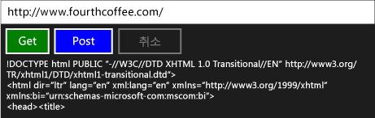

# 연습: 작업 및 XML HTTP 요청을 사용하여 연결
[!INCLUDE[vs2017banner](../../assembler/inline/includes/vs2017banner.md)]

이 예제는 [IXMLHTTPRequest2](http://msdn.microsoft.com/ko-kr/bbc11c4a-aecf-4d6d-8275-3e852e309908) 및 [IXMLHTTPRequest2Callback](http://msdn.microsoft.com/ko-kr/aa4b3f4c-6e28-458b-be25-6cce8865fc71) 인터페이스를 작업과 함께 사용하여 HTTP GET 및 POST 요청을 [!INCLUDE[win8_appname_long](../../build/includes/win8_appname_long_md.md)] 응용 프로그램의 웹 서비스에 보내는 방법을 살펴봅니다.  `IXMLHTTPRequest2` 을 함께 작업과 조합하여 다른 작업을 작성하는 코드를 작성할 수 있습니다.  예를 들어, 일련의 작업의 일환으로 다운로드 작업을 사용할 수 있습니다.  다운로드 작업은 작업이 취소 되는 경우에 응답할 수 있습니다.  
  
> [!TIP]
>  데스크톱 C\+\+앱에서 또는 C\+\+앱을 사용하는 [!INCLUDE[win8_appname_long](../../build/includes/win8_appname_long_md.md)] 로 부터 C\+\+ REST SDK를 사용하여 HTTP 요청을 수행할 수 있습니다.  자세한 내용은 [C\+\+ REST SDK\(코드명 "Casablanca"\)](../../top/cpp-rest-sdk-codename-casablanca.md)을 참조하십시오.  
  
 작업에 대한 자세한 내용은 [작업 병렬 처리](../../parallel/concrt/task-parallelism-concurrency-runtime.md)을 참조하십시오.  [!INCLUDE[win8_appname_long](../../build/includes/win8_appname_long_md.md)] 에서 미디어 파일을 사용하는 방법에 대한 자세한 내용은 [Asynchronous programming in C\+\+](http://msdn.microsoft.com/ko-kr/512700b7-7863-44cc-93a2-366938052f31) 및 [C\+\+로 Windows 스토어 앱용 비동기 작업 만들기](../../parallel/concrt/creating-asynchronous-operations-in-cpp-for-windows-store-apps.md)을 참조하십시오.  
  
 이 문서는 먼저 `HttpRequest` 및 해당 지원 클래스를 생성하는 방법을 보여줍니다.  C\+\+ 및 XAML을 사용하는 [!INCLUDE[win8_appname_long](../../build/includes/win8_appname_long_md.md)] 앱으로 부터 이 클래스를 사용하는 방법을 보여줍니다.  
  
 이 문서에 설명된 `HttpReader` 클래스를 사용하는 완성된 예제에 대한 설명은 [JavaScript 및 C\+\+로 Windows 스토어 앱, Bing Maps Trip Optimizer 개발](../Topic/Developing%20Bing%20Maps%20Trip%20Optimizer,%20a%20Windows%20Store%20app%20in%20JavaScript%20and%20C++.md)을 참고하십시오.  `IXMLHTTPRequest2` 를 사용하지만 작업을 사용하지 않는 다른 예제는 [Quickstart: Connecting using XML HTTP Request \(IXMLHTTPRequest2\)](http://msdn.microsoft.com/ko-kr/cc7aed53-b2c5-4d83-b85d-cff2f5ba7b35)에서 참조하십시오.  
  
> [!TIP]
>  `IXMLHTTPRequest2`및 `IXMLHTTPRequest2Callback` 는 [!INCLUDE[win8_appname_long](../../build/includes/win8_appname_long_md.md)] 앱에서 사용하기 위한 인터페이스입니다.  데스크톱 앱에서 사용하기 위해 이 예제를 적용할 수도 있습니다.  
  
## 사전 요구 사항  
  
## HttpRequest, HttpRequestBuffersCallback 및 HttpRequestStringCallback 클래스 정의  
 `IXMLHTTPRequest2` 인터페이스를 HTTP를 통해 웹 요청을 만들기 위해 사용하는 경우, 서버 응답을 수신하고 다른 이벤트에 반응하기 위해 `IXMLHTTPRequest2Callback` 인터페이스를 구현합니다.  이 예제는 웬 요청을 만들기 위해 `HttpRequest` 를 정의하고 응답을 처리하기 위해 `HttpRequestBuffersCallback` 및 `HttpRequestStringCallback` 클래스를 정의합니다.  `HttpRequestBuffersCallback` 및 `HttpRequestStringCallback` 클래스는 `HttpRequest` 클래스를 지원합니다; 응용 프로그램 코드에서 `HttpRequest` 클래스만으로 작업할 수 있습니다.  
  
 `GetAsync`, `HttpRequest` 클래스의 `PostAsync` 메서드는 각각 HTTP GET 및 POST 작업을 시작하도록 합니다.  이러한 메서드는 `HttpRequestStringCallback` 클래스를 사용하여 문자열로 서버의 응답을 읽을 수 있습니다.  `SendAsync` 및 `ReadAsync` 메서드는 청크에서 큰 콘텐츠를 스트리밍하도록 합니다.  이 메서드는 각각 작업을 나타내기 위해 [concurrency::task](../../parallel/concrt/reference/task-class-concurrency-runtime.md) 를 반환합니다.  `GetAsync` 및 `PostAsync` 메서드는 `wstring` 일부가 서버의 응답을 나타내는 곳에서 `task<std::wstring>` 값을 생성합니다.  `SendAsync` 및 `ReadAsync` 메서드는 `task<void>` 값을 생성합니다; 이 과정은 작업 완료를 보내고 읽을 때 완료됩니다.  
  
 `IXMLHTTPRequest2` 인터페이스는 비동기적으로 작동하기 때문에,이 예제에서는 [concurrency::task\_completion\_event](../../parallel/concrt/reference/task-completion-event-class.md) 를 사용하여 콜백 개체가 완료 또는 다운로드 작업을 취소 한 후 완료 되는 작업을 만듭니다.  `HttpRequest` 클래스는 최종 결과를 설정하기 위한 이 작업으로 부터 작업 기반 연속 작업을 만듭니다.  `HttpRequest` 클래스는 이전 작업에서 오류가 발생 되거나 취소 되는 경우에 연속 작업이 실행되는지를 확인하기 위해 작업 기반 연속 작업을 사용합니다.  작업 기반 연속에 대한 자세한 내용은 [작업 병렬 처리](../../parallel/concrt/task-parallelism-concurrency-runtime.md)를 참조하십시오.  
  
 취소를 지원하기 위해, `HttpRequest`, `HttpRequestBuffersCallback`, 및 `HttpRequestStringCallback` 클래스는 취소 토큰을 사용합니다.  `HttpRequestBuffersCallback` 및 `HttpRequestStringCallback` 클래스는 [concurrency::cancellation\_token::register\_callback](../Topic/cancellation_token::register_callback%20Method.md) 메서드를 사용하여 작업 완료 이벤트 취소에 응답할 수 있도록 합니다.  취소 콜백은 다운로드를 중단합니다.  취소에 대한 자세한 내용은 [취소](../../parallel/concrt/cancellation-in-the-ppl.md)를 참조하십시오.  
  
#### HttpRequest 클래스를 정의하려면  
  
1.  Visual C\+\+ **빈 응용 프로그램 \(XAML\)** 템플릿을 사용하여 빈 XAML 앱 프로젝트를 만듭니다.  이 예제에서는 프로젝트의 이름을 `UsingIXMLHTTPRequest2`로 합니다.  
  
2.  HttpRequest.h 라는 헤더 파일 및 HttpRequest.cpp 라는 소스 파일을 프로젝트에 추가합니다.  
  
3.  Pch.h에서, 이 코드를 추가합니다.  
  
     [!CODE [concrt-using-IXMLHTTPRequest2#1](concrt-using-IXMLHTTPRequest2#1)]  
  
4.  HttpRequest.h에서, 이 코드를 추가 합니다.  
  
     [!CODE [concrt-using-IXMLHTTPRequest2#2](concrt-using-IXMLHTTPRequest2#2)]  
  
5.  HttpRequest.h에서, 이 코드를 추가 합니다.  
  
     [!CODE [concrt-using-IXMLHTTPRequest2#3](concrt-using-IXMLHTTPRequest2#3)]  
  
## [!INCLUDE[win8_appname_long](../../build/includes/win8_appname_long_md.md)] 응용 프로그램에서 HttpRequest 클래스 사용  
 이 섹션은 [!INCLUDE[win8_appname_long](../../build/includes/win8_appname_long_md.md)] 앱에서 `HttpRequest` 클래스를 사용하는 방법을 증명합니다.  앱은 URL 리소스를 정의하는 입력 상자 및 GET 과 POST 작업을 수행하는 단추 명령 및 현재 작업을 취소 하는 단추 명령을 제공합니다.  
  
#### HttpRequest 클래스를 사용하려면  
  
1.  MainPage.xaml에서 다음과 같이 [StackPanel](http://msdn.microsoft.com/library/windows/apps/xaml/windows.ui.xaml.controls.stackpanel.aspx) 을 정의합니다.  
  
     [!CODE [concrt-using-IXMLHTTPRequest2#A1](concrt-using-IXMLHTTPRequest2#A1)]  
  
2.  MainPage.xaml.h에, 이 `#include` 지시문을 추가합니다:  
  
     [!CODE [concrt-using-IXMLHTTPRequest2#A2](concrt-using-IXMLHTTPRequest2#A2)]  
  
3.  MainPage.xaml.h에서, `MainPage` 클레스에 `private` 멤버 변수를 추가합니다.  
  
     [!CODE [concrt-using-IXMLHTTPRequest2#A3](concrt-using-IXMLHTTPRequest2#A3)]  
  
4.  MainPage.xaml.h에서, `private` 메서드 `ProcessHttpRequest`를 선언합니다.  
  
     [!CODE [concrt-using-IXMLHTTPRequest2#A4](concrt-using-IXMLHTTPRequest2#A4)]  
  
5.  MainPage.xaml.cpp에서, 이러한 `using` 문을 추가합니다.  
  
     [!CODE [concrt-using-IXMLHTTPRequest2#A5](concrt-using-IXMLHTTPRequest2#A5)]  
  
6.  MainPage.xaml.cpp에서, `GetButton_Click`, `PostButton_Click`, 및 `MainPage` 클래스의 `CancelButton_Click` 메서드를 실행합니다.  
  
     [!CODE [concrt-using-IXMLHTTPRequest2#A6](concrt-using-IXMLHTTPRequest2#A6)]  
  
    > [!TIP]
    >  앱이 취소에 대한 지원이 칠효하지 않으면, [concurrency::cancellation\_token::없음](../Topic/cancellation_token::none%20Method.md) 을 `HttpRequest::GetAsync` 및 `HttpRequest::PostAsync` 메서드에 전달합니다.  
  
7.  MainPage.xaml.cpp에서, `MainPage::ProcessHttpRequest` 메서드를 구현합니다.  
  
     [!CODE [concrt-using-IXMLHTTPRequest2#A7](concrt-using-IXMLHTTPRequest2#A7)]  
  
8.  프로젝트 속성에서, **링커**, **입력**에서, `shcore.lib` 및 `msxml6.lib`을 지정합니다.  
  
 다음은 실행 중인 앱입니다.  
  
   
  
## 다음 단계  
 [동시성 런타임 연습](../../parallel/concrt/concurrency-runtime-walkthroughs.md)  
  
## 참고 항목  
 [작업 병렬 처리](../../parallel/concrt/task-parallelism-concurrency-runtime.md)   
 [취소](../../parallel/concrt/cancellation-in-the-ppl.md)   
 [Asynchronous programming in C\+\+](http://msdn.microsoft.com/ko-kr/512700b7-7863-44cc-93a2-366938052f31)   
 [C\+\+로 Windows 스토어 앱용 비동기 작업 만들기](../../parallel/concrt/creating-asynchronous-operations-in-cpp-for-windows-store-apps.md)   
 [Quickstart: Connecting using XML HTTP Request \(IXMLHTTPRequest2\)](http://msdn.microsoft.com/ko-kr/cc7aed53-b2c5-4d83-b85d-cff2f5ba7b35)   
 [작업 클래스\(동시성 런타임\)](../../parallel/concrt/reference/task-class-concurrency-runtime.md)   
 [task\_completion\_event 클래스](../../parallel/concrt/reference/task-completion-event-class.md)   
 [IXMLHTTPRequest2](http://msdn.microsoft.com/ko-kr/bbc11c4a-aecf-4d6d-8275-3e852e309908)   
 [IXMLHTTPRequest2Callback](http://msdn.microsoft.com/ko-kr/aa4b3f4c-6e28-458b-be25-6cce8865fc71)