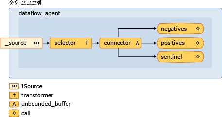

# 연습: 데이터 흐름 에이전트 만들기
[!INCLUDE[vs2017banner](../../assembler/inline/includes/vs2017banner.md)]

이 문서에서는 제어 흐름 때신 데이터 흐름을 기반으로 하는 에이전트 기반 응용 프로그램을 만드는 방법을 보여 줍니다.  
  
 *제어 흐름*은 프로그램에서 작업의 실행 순서를 말합니다.  제어 흐름은 조건문, 루프 등의 제어 구조를 사용하여 조정됩니다.  그리고 *데이터 흐름*은 필요한 모든 데이터를 사용할 수 있는 경우에만 계산이 수행되는 프로그래밍 모델을 말합니다.  데이터 흐름 프로그래밍 모델은 프로그램의 개별 구성 요소가 메시지를 보내 다른 구성 요소와 통신하는 메시지 전달 개념과 관련되어 있습니다.  
  
 비동기 에이전트는 제어 흐름 및 데이터 흐름 프로그래밍 모델을 지원합니다.  대부분의 경우 제어 흐름 모델이 적합하지만 에이전트가 데이터를 받고 해당 데이터의 페이로드를 기반으로 하는 작업을 수행하는 경우와 같이 데이터 흐름 모델이 적합한 경우도 있습니다.  
  
## 사전 요구 사항  
 이 연습을 시작하기 전에 다음 문서를 읽어 보십시오.  
  
-   [비동기 에이전트](../../parallel/concrt/asynchronous-agents.md)  
  
-   [비동기 메시지 블록](../../parallel/concrt/asynchronous-message-blocks.md)  
  
-   [방법: 메시지 블록 필터 사용](../../parallel/concrt/how-to-use-a-message-block-filter.md)  
  
##   단원  
 이 연습에는 다음 단원이 포함되어 있습니다.  
  
-   [기본 제어 흐름 에이전트 만들기](#control-flow)  
  
-   [기본 데이터 흐름 에이전트 만들기](#dataflow)  
  
-   [메시지 로깅 에이전트 만들기](#logging)  
  
##   기본 제어 흐름 에이전트 만들기  
 `control_flow_agent` 클래스를 정의하는 다음 예제를 살펴봅니다.  `control_flow_agent` 클래스는 세 개의 메시지 버퍼\(입력 버퍼 하나와 출력 버퍼 두 개\)에서 동작합니다.  `run` 메서드는 루프에서 소스 메시지 버퍼를 읽고 조건문을 사용하여 프로그램 실행 흐름을 지시합니다.  에이전트는 0이 아닌 음수에 대한 하나의 카운터를 증가시키고 0이 아닌 양수에 대한 다른 카운터를 증가시킵니다.  에이전트가 센티널 값 0을 받은 후 카운터 값을 출력 메시지 버퍼로 보냅니다.  `negatives` 및 `positives` 메서드를 사용하면 응용 프로그램이 에이전트에서 음수 및 양수 값 카운터를 읽을 수 있습니다.  
  
 [!code-cpp[concrt-dataflow-agent#1](../../parallel/concrt/codesnippet/CPP/walkthrough-creating-a-dataflow-agent_1.cpp)]  
  
 이 예제에서는 에이전트에서 제어 흐름을 기본적으로 사용하지만 제어 흐름 기반 프로그래밍의 연속 특성을 보여 줍니다.  입력 메시지 버퍼에서 여러 메시지를 사용할 수 있는 경우에도 각 메시지는 순차적으로 처리되어야 합니다.  데이터 흐름 모델을 사용하면 조건문의 두 분기를 사용하여 동시에 평가할 수 있습니다.  그리고 데이터 흐름 모델을 사용하게 될 경우 데이터에 대해 동작하는 더 복잡한 메시징 네트워크를 만들 수도 있습니다.  
  
 \[[맨 위](#top)\]  
  
##   기본 데이터 흐름 에이전트 만들기  
 이 단원에서는 데이터 흐름 모델을 사용하여 동일한 작업을 수행하도록 `control_flow_agent` 클래스를 변환하는 방법을 보여 줍니다.  
  
 데이터 흐름 에이전트는 각각 특정 용도로 사용되는 메시지 버퍼 네트워크를 만들어 작동합니다.  특정 메시지 블록은 필터 함수를 사용하여 해당 페이로드를 기준으로 메시지를 수락하거나 거부합니다.  필터 함수를 사용하면 메시지 블록이 특정 값만 받도록 할 수 있습니다.  
  
#### 제어 흐름 에이전트를 데이터 흐름 에이전트로 변환하려면  
  
1.  `control_flow_agent` 클래스의 본문을 `dataflow_agent`와 같은 다른 클래스로 복사합니다.  또는 `control_flow_agent` 클래스의 이름을 바꿀 수 있습니다.  
  
2.  `run` 메서드에서 `receive`를 호출하는 루프의 본문을 제거합니다.  
  
     [!code-cpp[concrt-dataflow-agent#2](../../parallel/concrt/codesnippet/CPP/walkthrough-creating-a-dataflow-agent_2.cpp)]  
  
3.  `run` 메서드에서 `negative_count` 및 `positive_count` 변수의 초기화 후 활성 작업 수를 추적하는 `countdown_event` 개체를 추가합니다.  
  
     [!code-cpp[concrt-dataflow-agent#6](../../parallel/concrt/codesnippet/CPP/walkthrough-creating-a-dataflow-agent_3.cpp)]  
  
     `countdown_event` 클래스는 이 항목의 뒷부분에 나옵니다.  
  
4.  데이터 흐름 네트워크에 참여할 메시지 버퍼 개체를 만듭니다.  
  
     [!code-cpp[concrt-dataflow-agent#3](../../parallel/concrt/codesnippet/CPP/walkthrough-creating-a-dataflow-agent_4.cpp)]  
  
5.  메시지 버퍼를 연결하여 네트워크를 구성합니다.  
  
     [!code-cpp[concrt-dataflow-agent#4](../../parallel/concrt/codesnippet/CPP/walkthrough-creating-a-dataflow-agent_5.cpp)]  
  
6.  `event` 및 `countdown event` 개체가 설정될 때까지 기다립니다.  이 이벤트는 에이전트가 센티널 값을 받았고 모든 작업이 완료되었음을 알립니다.  
  
     [!code-cpp[concrt-dataflow-agent#5](../../parallel/concrt/codesnippet/CPP/walkthrough-creating-a-dataflow-agent_6.cpp)]  
  
 다음 다이어그램에서는 `dataflow_agent` 클래스의 전체 데이터 흐름 네트워크를 보여 줍니다.  
  
   
  
 다음 표에서는 네트워크 멤버에 대해 설명합니다.  
  
|멤버|설명|  
|--------|--------|  
|`increment_active`|활성 이벤트 카운터를 증가시키고 입력 값을 나머지 네트워크에 전달하는 [concurrency::transformer](../../parallel/concrt/reference/transformer-class.md) 개체입니다.|  
|`negatives`, `positives`|숫자 개수를 증가시키고 활성 이벤트 카운터를 감소시키는 [concurrency::call](../../parallel/concrt/reference/call-class.md) 개체입니다.  이 개체는 각각 필터를 사용하여 음수 또는 양수를 수락합니다.|  
|`sentinel`|센티널 수 0만 수락하고 활성 이벤트 카운터를 감소시키는 [concurrency::call](../../parallel/concrt/reference/call-class.md) 개체입니다.|  
|`connector`|소스 메시지 버퍼를 내부 네트워크에 연결하는 [concurrency::unbounded\_buffer](../Topic/unbounded_buffer%20Class.md) 개체입니다.|  
  
 `run` 메서드는 별도의 스레드에서 호출되므로 네트워크가 완전히 연결되기 전에 다른 스레드에서 메시지를 네트워크로 보낼 수 있습니다.  `_source` 데이터 멤버는 응용 프로그램에서 에이전트로 보내는 모든 입력을 버퍼링하는 `unbounded_buffer` 개체입니다.  네트워크에서 모든 입력 메시지를 처리하는지 확인하기 위해 에이전트는 먼저 네트워크의 내부 노드를 연결한 다음 해당 네트워크의 시작 부분인 `connector`를 `_source` 데이터 멤버에 연결합니다.  그러면 네트워크가 구성 중일 때 메시지가 처리되지 않습니다.  
  
 이 예제에서 네트워크는 제어 흐름이 아닌 데이터 흐름을 기반으로 하기 때문에 네트워크는 각 입력 값 처리를 마치고 센티널 노드에서 해당 값을 받은 에이전트와 통신해야 합니다.  이 예제에서는 `countdown_event` 개체를 사용하여 모든 입력 값이 처리되었음을 알리고 [concurrency::event](../../parallel/concrt/reference/event-class.md) 개체를 사용하여 센티널 노드에서 해당 값을 받았음을 나타냅니다.  `countdown_event` 클래스는 카운터 값이 0이 되면 `event` 개체를 사용하여 신호를 보낼 수 있습니다.  데이터 흐름 네트워크의 헤드는 값을 받을 때마다 카운터를 증가시킵니다.  네트워크의 모든 터미널 노드는 입력 값을 처리된 후 카운터를 감소시킵니다.  에이전트는 데이터 흐름 네트워크를 구성한 후 센티널 노드에서 `event` 개체를 설정하고 `countdown_event` 개체에서 카운터가 0에 도달했음을 알릴 때까지 기다립니다.  
  
 다음 예제에서는 `control_flow_agent`, `dataflow_agent` 및 `countdown_event` 클래스를 보여 줍니다.  `wmain` 함수는 `control_flow_agent` 및 `dataflow_agent` 개체를 만들고 `send_values` 함수를 사용하여 일련의 임의 값을 에이전트로 보냅니다.  
  
 [!code-cpp[concrt-dataflow-agent#7](../../parallel/concrt/codesnippet/CPP/walkthrough-creating-a-dataflow-agent_7.cpp)]  
  
 이 예제를 실행하면 다음과 같은 샘플 결과가 출력됩니다.  
  
  **제어 흐름 에이전트:**  
**500523 음수 있습니다.**  
**499477 양수 있습니다.**  
**데이터 흐름 에이전트**  
**500523 음수 있습니다.**  
**499477 양수 있습니다.**   
### 코드 컴파일  
 예제 코드를 복사하여 Visual Studio 프로젝트 또는 `dataflow-agent.cpp` 파일에 붙여 넣고 Visual Studio 명령 프롬프트 창에서 다음 명령을 실행합니다.  
  
 **cl.exe \/EHsc dataflow\-agent.cpp**  
  
 \[[맨 위](#top)\]  
  
##   메시지 로깅 에이전트 만들기  
 다음 예제에서는 `dataflow_agent` 클래스와 유사한 `log_agent` 클래스를 보여 줍니다.  `log_agent` 클래스는 로그 메시지를 파일 및 콘솔에 쓰는 비동기 로깅 에이전트를 구현합니다.  `log_agent` 클래스를 사용하면 응용 프로그램에서 메시지를 정보, 경고 또는 오류로 분류하도록 할 수 있습니다.  그리고 이 클래스를 사용하면 응용 프로그램에서 각 로그 범주를 파일에 쓸지 콘솔에 쓸지 파일과 콘솔 둘 다에 쓸지 지정하도록 할 수 있습니다.  이 예제에서는 모든 로그 파일을 파일에 쓰고 오류 메시지만 콘솔에 씁니다.  
  
 [!code-cpp[concrt-log-filter#1](../../parallel/concrt/codesnippet/CPP/walkthrough-creating-a-dataflow-agent_8.cpp)]  
  
 이 예제에서는 다음 출력을 콘솔에 씁니다.  
  
  **오류: 샘플 오류 메시지입니다.** 이 예제에서는 다음 텍스트가 포함된 log.txt 파일도 생성합니다.  
  
  **정보: \=\=\= 로깅을 시작 합니다. \=\=\=**  
**경고: 샘플 경고 메시지입니다.**  
**오류: 샘플 오류 메시지입니다.**  
**정보: \=\=\= 로깅 완료. \=\=\=**   
### 코드 컴파일  
 예제 코드를 복사하여 Visual Studio 프로젝트 또는 `log-filter.cpp` 파일에 붙여 넣고 Visual Studio 명령 프롬프트 창에서 다음 명령을 실행합니다.  
  
 **cl.exe \/EHsc log\-filter.cpp**  
  
 \[[맨 위](#top)\]  
  
## 참고 항목  
 [동시성 런타임 연습](../../parallel/concrt/concurrency-runtime-walkthroughs.md)