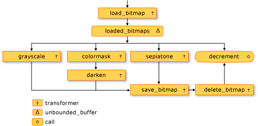
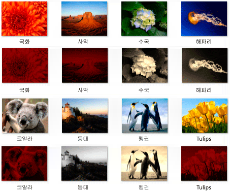

# 연습: 이미지 처리 네트워크 만들기
이 문서에는 이미지 처리를 수행 하는 비동기 메시지 블록의 네트워크를 만드는 방법을 보여 줍니다.  
  
 네트워크의 특성을 기준으로 이미지에서 수행할 작업을 결정 합니다. 사용 하 여이 예제는 *데이터 흐름* 모델을 네트워크를 통해 이미지 경로입니다. 데이터 흐름 모델에서는, 프로그램의 개별 구성 요소가 메시지를 전달하여 서로 통신합니다. 구성 요소는 메시지를 받을 때 수 일부 작업을 수행 하 고 다른 구성 요소를 해당 작업의 결과 전달 합니다. 이 비교는 *제어 흐름* 는 응용 프로그램 사용 하는 제어 구조 예를 들어 모델, 조건문, 루프 및 제어 프로그램에서 작업 순서를 합니다.  
  
 데이터 흐름에 따라 네트워크를 만듭니다는 *파이프라인* 작업 합니다. 파이프라인의 각 단계는 동시에 전체 작업의 일부를 수행합니다. 이는 자동차 제조 조립 라인에 비유될 수 있습니다. 각 자동차가 조립 라인을 통과할 때 한 스테이션은 프레임을 조립 다른 엔진 및 등을 설치 합니다. 여러 대의 자동차를 동시에 조립할 수를 사용 하 여 조립 라인 한 번에 자동차 전체를 조립 보다 처리량이 향상을 제공 합니다.  
  
## 전제 조건  
 이 연습을 시작 하기 전에 다음 문서를 읽어 보십시오.  
  
-   [비동기 메시지 블록](../../parallel/concrt/asynchronous-message-blocks.md)  
  
-   [방법: 메시지 블록 필터 사용](../../parallel/concrt/how-to-use-a-message-block-filter.md)  
  
-   [연습: 데이터 흐름 에이전트 만들기](../../parallel/concrt/walkthrough-creating-a-dataflow-agent.md)  
  
 기본 사항을 이해 하는 것이 좋습니다 [!INCLUDE[ndptecgdiplus](../../parallel/concrt/includes/ndptecgdiplus_md.md)] 이 연습을 시작 하기 전에.  
  
##   섹션  
 이 연습에는 다음과 같은 섹션이 있습니다.  
  
-   [이미지 처리 기능을 정의 합니다.](#functionality)  
  
-   [이미지 처리 네트워크 만들기](#network)  
  
-   [전체 예제](#complete)  
  
##   이미지 처리 기능을 정의 합니다.  
 이 섹션에서는 이미지 처리 네트워크를 사용 하 여 디스크에서 읽은 이미지 작업 지원 기능을 보여 줍니다.  
  
 다음 함수를 `GetRGB` 및 `MakeColor`를 추출 하 고 지정된 된 색의 개별 구성 요소를 각각 결합 합니다.  
  
 [!code-cpp[concrt-image-processing-filter#2](../../parallel/concrt/codesnippet/cpp/walkthrough-creating-an-image-processing-network_1.cpp)]  
  

 다음 함수를 `ProcessImage`, 호출의 주어진 [std:: function](../../standard-library/function-class.md) 개체의 각 픽셀의 색상 값을 변환 하는 [!INCLUDE[ndptecgdiplus](../../parallel/concrt/includes/ndptecgdiplus_md.md)] [비트맵](https://msdn.microsoft.com/library/ms534420.aspx) 개체입니다. `ProcessImage` 함수는 [concurrency:: parallel_for](reference/concurrency-namespace-functions.md#parallel_for) 병렬로 비트맵의 각 행을 처리 하는 알고리즘입니다.  

  
 [!code-cpp[concrt-image-processing-filter#3](../../parallel/concrt/codesnippet/cpp/walkthrough-creating-an-image-processing-network_2.cpp)]  
  
 다음 함수를 `Grayscale`, `Sepiatone`, `ColorMask`, 및 `Darken`, 호출의 `ProcessImage` 의 각 픽셀의 색상 값을 변환 하는 함수는 `Bitmap` 개체입니다. 이러한 각 함수는 람다 식을 사용 하 여 하나의 픽셀의 색 변환을 정의 합니다.  
  
 [!code-cpp[concrt-image-processing-filter#4](../../parallel/concrt/codesnippet/cpp/walkthrough-creating-an-image-processing-network_3.cpp)]  
  
 다음 함수를 `GetColorDominance`, 호출 또한는 `ProcessImage` 함수입니다. 그러나 각 색의 값을 변경 하는 대신이 함수는 사용 [concurrency:: combinable](../../parallel/concrt/reference/combinable-class.md) 는 색을 빨간색, 녹색 또는 파란색 구성 요소가 이미지 보다 우위를 차지 하는지 여부를 계산 하는 개체입니다.  
  
 [!code-cpp[concrt-image-processing-filter#5](../../parallel/concrt/codesnippet/cpp/walkthrough-creating-an-image-processing-network_4.cpp)]  
  
 다음 함수를 `GetEncoderClsid`, 인코더의 지정된 된 MIME 형식에 대 한 클래스 식별자를 검색 합니다. 응용 프로그램이이 함수를 사용 하 여 비트맵에 대 한 인코더를 검색 합니다.  
  
 [!code-cpp[concrt-image-processing-filter#6](../../parallel/concrt/codesnippet/cpp/walkthrough-creating-an-image-processing-network_5.cpp)]  
  
 [[맨 위로 이동](#top)]  
  
##   이미지 처리 네트워크 만들기  
 이 섹션에서 이미지 처리를 수행 하는 비동기 메시지 블록의 네트워크를 만드는 방법에 설명 모든 [!INCLUDE[TLA#tla_jpeg](../../parallel/concrt/includes/tlasharptla_jpeg_md.md)] 주어진된 디렉터리에서 (.jpg) 이미지입니다. 네트워크는 다음 이미지 처리 작업을 수행합니다.  
  
1.  Tom 제작 이미지를 회색조를 변환 합니다.  
  
2.  주요 색으로 빨강 있는 모든 이미지에 대 한 녹색 및 파랑 구성 요소를 제거 하 고 어둡게 만듭니다.  
  
3.  다른 모든 이미지 세피아 톤를 적용 합니다.  
  
 네트워크만 첫 번째 이미지 처리 작업에서 이러한 조건 중 하 나와 일치를 적용 합니다. 예를 들어 이미지 tom 작성 되 고이 주요 색 빨간색인, 이미지를 회색조로 변환만 됩니다.  
  
 네트워크에서 각 이미지 처리 작업을 수행한 후 그 이미지를 디스크는 비트맵 (.bmp) 파일로 저장 합니다.  
  
 다음 단계에서는이 이미지 처리 네트워크를 구현 하 고 해당 네트워크를 적용 하는 함수를 만드는 방법을 보여를 매 [!INCLUDE[TLA#tla_jpeg](../../parallel/concrt/includes/tlasharptla_jpeg_md.md)] 지정된 된 디렉터리의 이미지입니다.  
  
#### 이미지 처리 네트워크를 만들려면  
  
1.  함수를 만들 `ProcessImages`, 디스크에는 디렉터리의 이름을 사용 합니다.  
  
     [!code-cpp[concrt-image-processing-filter#7](../../parallel/concrt/codesnippet/cpp/walkthrough-creating-an-image-processing-network_6.cpp)]  
  
2.  에 `ProcessImages` 함수를 만들기는 `countdown_event` 변수입니다. `countdown_event` 클래스는이 연습의 뒷부분에서 나옵니다.  
  
     [!code-cpp[concrt-image-processing-filter#8](../../parallel/concrt/codesnippet/cpp/walkthrough-creating-an-image-processing-network_7.cpp)]  
  
3.  만들기는 [std:: map](../../standard-library/map-class.md) 연결 하는 개체는 `Bitmap` 원래 파일 이름으로는 개체입니다.  
  
     [!code-cpp[concrt-image-processing-filter#9](../../parallel/concrt/codesnippet/cpp/walkthrough-creating-an-image-processing-network_8.cpp)]  
  
4.  이미지 처리 네트워크의 멤버를 정의 하는 다음 코드를 추가 합니다.  
  
     [!code-cpp[concrt-image-processing-filter#10](../../parallel/concrt/codesnippet/cpp/walkthrough-creating-an-image-processing-network_9.cpp)]  
  
5.  네트워크에 연결 하는 다음 코드를 추가 합니다.  
  
     [!code-cpp[concrt-image-processing-filter#11](../../parallel/concrt/codesnippet/cpp/walkthrough-creating-an-image-processing-network_10.cpp)]  
  
6.  다음 코드를 각각의 전체 경로 네트워크의 머리에 보낼 추가 [!INCLUDE[TLA#tla_jpeg](../../parallel/concrt/includes/tlasharptla_jpeg_md.md)] 디렉터리의 파일입니다.  
  
     [!code-cpp[concrt-image-processing-filter#12](../../parallel/concrt/codesnippet/cpp/walkthrough-creating-an-image-processing-network_11.cpp)]  
  
7.  에 대 한 대기는 `countdown_event` 변수를 0에 도달 합니다.  
  
     [!code-cpp[concrt-image-processing-filter#13](../../parallel/concrt/codesnippet/cpp/walkthrough-creating-an-image-processing-network_12.cpp)]  
  
 다음 표에서는 네트워크의 멤버를 설명합니다.  
  
|멤버|설명|  
|------------|-----------------|  
|`load_bitmap`|A [concurrency:: transformer](../../parallel/concrt/reference/transformer-class.md) 개체를 로드 하는 `Bitmap` 항목을 추가 하 고 디스크에서 개체는 `map` 원래 파일 이름으로 이미지를 연결 하는 개체입니다.|  
|`loaded_bitmaps`|A [concurrency:: unbounded_buffer](reference/unbounded-buffer-class.md) 로드 된 이미지를 이미지 처리 필터에 전송 하는 개체입니다.|  
|`grayscale`|A `transformer` 회색조 tom 작성 한 이미지를 변환 하는 개체입니다. 이미지의 메타 데이터를 사용 하 여 작성자를 확인 합니다.|  
|`colormask`|A `transformer` 주요 색으로 빨강을 포함 하는 이미지에서 녹색 및 파란색 구성 요소를 제거 하는 개체입니다.|  
|`darken`|A `transformer` 개체 어둡게 주요 색으로 빨강을 포함 하는 이미지입니다.|  
|`sepiatone`|A `transformer` 세피아 톤 Tom 작성 하지 않고 없고 주로 빨간색 되지 않은 이미지에 적용 되는 개체입니다.|  
|`save_bitmap`|A `transformer` 저장 하는 처리 된 개체 `image` 비트맵으로 디스크에 있습니다. `save_bitmap` 원래 파일 이름을 검색 하는 `map` 개체,.bmp 파일 이름 확장명 코드 변경 내용입니다.|  
|`delete_bitmap`|A `transformer` 이미지에 대해서만 메모리를 해제 하는 개체입니다.|  
|`decrement`|A [concurrency:: call](../../parallel/concrt/reference/call-class.md) 네트워크의 터미널 노드 역할을 하는 개체입니다. 그 감소는 `countdown_event` 신호를 보내 주 응용 프로그램 이미지 처리 된 개체입니다.|  
  
 `loaded_bitmaps` 메시지 버퍼는 것이 중요 하기 때문에로 `unbounded_buffer` 개체를 제공 `Bitmap` 개체를 여러 수신자입니다. 대상 블록 허용 하는 경우는 `Bitmap` 개체는 `unbounded_buffer` 개체를 제공 하지 않습니다 `Bitmap` 다른 대상 개체입니다. 개체를 연결 하는 순서 이므로 `unbounded_buffer` 개체는 중요 합니다. `grayscale`, `colormask`, 및 `sepiatone` 각 블록을 수락 하도록 필터를 사용 하는 메시지가 특정 `Bitmap` 개체입니다. `decrement` 메시지 버퍼의 중요 한 대상은는 `loaded_bitmaps` 메시지 모두를 수락 하기 때문에 버퍼 `Bitmap` 개체를 다른 메시지 버퍼에서 거부 됩니다. `unbounded_buffer` 개체는 순서 대로 메시지를 전파 해야 합니다. 따라서 프로그램 `unbounded_buffer` 개체는 새 대상 블록에 연결 되 고 해당 메시지를 수락 하는 현재 대상 블록이 없는 경우 메시지를 수락 될 때까지 차단 합니다.  
  
 와 같은 다른 메시지 블록 형식 들 응용 프로그램에 필요한 여러 메시지 차단 하는 대신 먼저 메시지를 수락 하는 하나의 메시지 블록 바로 메시지를 처리 하는 경우 사용할 수 있습니다 `overwrite_buffer`합니다. `overwrite_buffer` 클래스는 한 번에 하나의 메시지를 포함 하지만 해당 메시지를 각 대상 전파 합니다.  
  
 다음 그림 이미지 처리 네트워크를 보여 줍니다.  
  
   
  
 `countdown_event` 개체에서이 예에서는 모든 이미지 처리 되 면 주 응용 프로그램에 알리기 위해 이미지 처리 네트워크를 사용 하도록 설정 합니다. `countdown_event` 클래스에서 사용 하는 [concurrency:: event](../../parallel/concrt/reference/event-class.md) 카운터 값을 0에 도달할 때 신호를 보내 개체입니다. 주 응용 프로그램 네트워크에 파일 이름을 보낼 때마다 카운터를 증가 시킵니다. 네트워크 감소의 터미널 노드 각 이미지 처리 된 후 카운터입니다. 지정된 된 디렉터리를 이동 하는 기본 응용 프로그램, 후 때까지 대기는 `countdown_event` 개체를 해당 카운터 0에 도달 했습니다.  
  
 다음 예제와 `countdown_event` 클래스:  
  
 [!code-cpp[concrt-image-processing-filter#14](../../parallel/concrt/codesnippet/cpp/walkthrough-creating-an-image-processing-network_13.cpp)]  
  
 [[맨 위로 이동](#top)]  
  
##   전체 예제  
 다음 코드에서는 전체 예제를 보여 줍니다. `wmain` 함수를 관리 하는 [!INCLUDE[ndptecgdiplus](../../parallel/concrt/includes/ndptecgdiplus_md.md)] 라이브러리 및 호출은 `ProcessImages` 함수 프로세스를는 [!INCLUDE[TLA#tla_jpeg](../../parallel/concrt/includes/tlasharptla_jpeg_md.md)] 파일에 `Sample Pictures` 디렉터리입니다.  
  
 [!code-cpp[concrt-image-processing-filter#15](../../parallel/concrt/codesnippet/cpp/walkthrough-creating-an-image-processing-network_14.cpp)]  
  
 다음은 샘플 출력입니다. 각 원본 이미지는 해당 수정 된 이미지 위에 있습니다.  
  
   
  
 `Lighthouse` Tom Alphin이 작성 하 고 따라서 회색조로 변환 됩니다. `Chrysanthemum``Desert`, `Koala`, 및 `Tulips` 주요 색으로 빨강이 따라서 녹색 및 파란색 색상 구성 요소를 제거 및 어 두 됩니다. `Hydrangeas``Jellyfish`, 및 `Penguins` 기본 기준과 일치 하 고 toned 세피아 않기 때문입니다.  
  
 [[맨 위로 이동](#top)]  
  
### 코드 컴파일  
 예제 코드를 복사 하 고 Visual Studio 프로젝트에 붙여 넣거나 라는 파일에 붙여 `image-processing-network.cpp` 후 Visual Studio 명령 프롬프트 창에서 다음 명령을 실행 합니다.  
  
 **cl.exe /DUNICODE /EHsc 이미지-처리-network.cpp /link gdiplus.lib**  
  
## 참고 항목  
 [동시성 런타임 연습](../../parallel/concrt/concurrency-runtime-walkthroughs.md)
