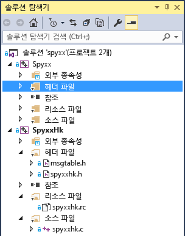

# 포팅 가이드: Spy++
[!INCLUDE[vs2017banner](../assembler/inline/includes/vs2017banner.md)]

이 포팅 사례 연구는 일반적인 포팅 프로젝트, 발생할 수 있는 문제 유형 및 포팅 문제를 다루기 위한 몇 가지 일반적인 팁과 트릭에 대한 아이디어를 제공하도록 설계되었습니다.  프로젝트 포팅 경험은 코드의 세부 사항에 따라 달라지므로 결정적인 포팅 가이드는 아닙니다.  
  
## Spy\+\+  
 Spy\+\+는 Windows 데스크톱의 사용자 인터페이스 요소에 대해 모든 종류의 정보를 제공하는 널리 사용되는 Windows 데스크톱용 GUI 진단 도구입니다.  창의 전체 계층 구조를 표시하고 각 창과 컨트롤에 대한 메타데이터에 액세스할 수 있게 합니다.  이 유용한 응용 프로그램은 수년 동안 Visual Studio와 함께 제공되었습니다.  Visual C\+\+ 6.0에서 마지막으로 컴파일된 이전 버전을 찾아 [!INCLUDE[vs_dev14](../ide/includes/vs_dev14_md.md)]로 포팅했습니다.  
  
 이 사례가 특히 Visual C\+\+ 6.0 이후 Visual C\+\+의 각 릴리스로 업데이트되지 않은 오래된 프로젝트에 대해 MFC 및 Win32 API를 사용하는 Windows 데스크톱 응용 프로그램을 포팅하는 일반적인 경우라고 간주했습니다.  
  
### 1단계:프로젝트 파일 변환  
 프로젝트 파일인 Visual C\+\+ 6.0의 이전 .dsw 파일 두 개는 추가로 주의가 필요한 문제없이 쉽게 변환되었습니다.  한 프로젝트는 Spy\+\+ 응용 프로그램입니다.  다른 프로젝트는 지원 DLL인 C로 작성된 SpyHk입니다.  보다 복잡한 프로젝트는 [여기](../porting/visual-cpp-porting-and-upgrading-guide.md)서 설명한 것처럼 쉽게 업그레이드되지 않을 수도 있습니다.  대규모 프로젝트의 경우 한 번에 한 버전씩 Visual Studio를 업그레이드하는 것이 유용할 수 있습니다.  
  
 두 프로젝트를 업그레이드한 후 솔루션은 다음과 같았습니다.  
  
   
  
 하나는 많은 C\+\+ 파일을 포함하고 다른 하나는 C로 작성된 DLL을 포함하는 두 개의 프로젝트가 있습니다.  
  
### 2단계.헤더 파일 문제  
 새로 변환된 프로젝트를 빌드할 때 첫 번째로 발견하는 사항 중 하나는 대체로 프로젝트에서 사용하는 헤더 파일이 없다는 것입니다.  
  
 Spy\+\+에서 찾을 수 없는 파일 중 하나는 verstamp.h였습니다.  인터넷 검색을 통해 이 파일이 오래된 데이터 기술인 DAO SDK에서 제공된 것을 확인했습니다.  해당 헤더 파일에서 사용된 기호를 찾아 파일이 정말 필요한지 또는 해당 기호가 다른 곳에서 정의되었는지 확인하고 싶었으므로 헤더 파일 선언을 주석으로 처리하고 다시 컴파일했습니다.  필요한 기호는 VER\_FILEFLAGSMASK 하나뿐이었습니다.  
  
```  
1>C:\Program Files (x86)\Windows Kits\8.1\Include\shared\common.ver(212): error RC2104: undefined keyword or key name: VER_FILEFLAGSMASK  
```  
  
 사용 가능한 포함 파일에서 기호를 찾는 가장 쉬운 방법은 파일에서 찾기\(Ctrl\+Shift\+F\)를 사용하고 **Visual C\+\+ 포함 디렉터리**를 지정하는 것입니다.  ntverp.h에서 해당 기호를 찾았습니다.  verstamp.h 포함 파일을 ntverp.h로 바꾼 후 이 오류가 사라졌습니다.  
  
### 3단계.링커 OutputFile 설정  
 이전 프로젝트는 업그레이드한 후 문제가 발생할 수 있는 위치에 파일이 배치된 경우가 있습니다.  이 경우 Visual Studio에서 프로젝트 폴더 중 하나가 아니라 여기에 배치된 일부 헤더 파일을 찾을 수 있도록 프로젝트 속성의 포함 경로에 $\(SolutionDir\)을 추가해야 합니다.  
  
 MSBuild에서 Link.OutputFile 속성이 TargetPath 및 TargetName 값과 일치하지 않는다고 보고하고 MSB8012를 실행합니다.  
  
  **경고 MSB8012: TargetPath\(...  \\spyxx\\spyxxhk\\.  \\..  \\Debug\\SpyxxHk.dll\)가 링커의 OutputFile 속성 값\(...  \\spyxx\\Debug\\SpyHk55.dll\)과 일치하지 않습니다.  이 경우 프로젝트가 잘못 빌드될 수 있습니다.  이 문제를 해결하려면 $\(OutDir\), $\(TargetName\) 및 $\(TargetExt\) 속성 값이 %\(Link.OutputFile\)에 지정된 값과 일치하는지 확인하세요.  경고 MSB8012: TargetName\(SpyxxHk\)이 링커의 OutputFile 속성 값\(SpyHk55\)과 일치하지 않습니다.  이 경우 프로젝트가 잘못 빌드될 수 있습니다.  이 문제를 해결하려면 $\(OutDir\), $\(TargetName\) 및 $\(TargetExt\) 속성 값이 %\(Link.OutputFile\)에 지정된 값과 일치하는지 확인하세요.**  **Link.OutputFile**은 빌드 출력\(예: EXE, DLL\)이며, 일반적으로 $\(TargetDir\)$\(TargetName\)$\(TargetExt\)에서 생성되고 경로, 파일 이름 및 확장명을 제공합니다.  이는 이전 Visual C\+\+ 빌드 도구\(vcbuild.exe\)에서 새 빌드 도구\(MSBuild.exe\)로 프로젝트를 마이그레이션하는 경우의 일반적인 오류입니다.  Visual Studio 2010에서 빌드 도구가 변경되었으므로 2010 이전 프로젝트를 2010 이상 버전으로 마이그레이션할 때마다 이 문제가 발생할 수 있습니다.  기본적인 문제는 해당 값이 다른 프로젝트 설정을 기반으로 해야 하는지 확인할 수 없는 경우가 있기 때문에 프로젝트 마이그레이션 마법사가 **Link.OutputFile**을 업데이트하지 않는 것입니다.  따라서 일반적으로 수동으로 설정해야 합니다.  자세한 내용은 Visual C\+\+ 블로그에서 이 [게시물](http://blogs.msdn.com/b/vcblog/archive/2010/03/02/visual-studio-2010-c-project-upgrade-guide.aspx)\(영문\)을 참조하세요.  
  
 이 경우 Spy\+\+ 프로젝트에 대해 변환된 프로젝트의 **Link.OutputFile** 속성이 구성에 따라 .  \\Debug\\Spyxx.exe 및 .  \\Release\\Spyxx.exe로 설정되었습니다.  모든 구성에 대해 이러한 하드 코딩된 값을 $\(TargetDir\)$\(TargetName\)$\(TargetExt\)로 바꾸는 것이 가장 좋습니다.  이 방법이 효과가 없을 경우 여기서 사용자 지정하거나, 해당 값이 설정된 일반 섹션의 속성을 변경할 수 있습니다\(속성은 **출력 디렉터리**, **대상 이름** 및 **대상 확장**임\).  보려는 속성이 매크로를 사용하는 경우 드롭다운 목록에서 **편집**을 선택하여 매크로 대체가 수행된 최종 문자열을 보여 주는 대화 상자를 표시할 수 있습니다.  **매크로** 단추를 선택하여 사용 가능한 모든 매크로 및 현재 값을 볼 수 있습니다.  
  
### 4단계.대상 Windows 버전 업데이트  
 다음 오류는 WINVER 버전이 MFC에서 더 이상 지원되지 않음을 나타냅니다.  Windows XP에 대한 WINVER은 0x0501입니다.  
  
  **C:\\Program Files \(x86\)\\Microsoft Visual Studio 14.0\\VC\\atlmfc\\include\\afxv\_w32.h\(40\): 오류 C1189: \#error:  MFC는 0x0501보다 작은 WINVER을 지원하지 않습니다.  프로젝트 속성 또는 미리 컴파일된 헤더에서 WINVER의 정의를 변경하세요.**  Windows XP는 Microsoft에서 더 이상 지원되지 않으므로 [!INCLUDE[vs_dev14](../ide/includes/vs_dev14_md.md)]에서 대상으로 지정할 수는 있지만 응용 프로그램에서 지원을 단계적으로 중단하고 사용자가 새 버전의 Windows를 채택하도록 장려해야 합니다.  
  
 오류를 제거하려면 **프로젝트 속성** 설정을 현재 대상으로 지정하려는 가장 낮은 Windows 버전으로 업데이트하여 WINVER을 정의합니다.  [여기](http://msdn.microsoft.com/library/windows/desktop/aa383745.aspx)\(영문\)서 다양한 Windows 버전에 대한 값 테이블을 확인할 수 있습니다.  
  
 stdafx.h 파일에 이러한 매크로 정의 중 일부가 포함되어 있었습니다.  
  
```  
#define WINVER       0x0500  // these defines are set so that we get the  
#define _WIN32_WINNT 0x0500  // maximum set of message/flag definitions,  
#define _WIN32_IE    0x0400  // from both winuser.h and commctrl.h.  
```  
  
 WINVER을 Windows 7으로 설정하겠습니다.  값 자체\(0x0601\)보다 Windows 7\(\_WIN32\_WINNT\_WIN7\)에 대한 매크로를 사용하면 나중에 코드를 읽기가 더 쉽습니다.  
  
```  
#define WINVER _WINNT_WIN32_WIN7 // Minimum targeted Windows version is Windows 7  
```  
  
### 5단계.링커 오류  
 이렇게 변경하면 SpyHk\(DLL\) 프로젝트가 빌드되지만 링커 오류가 발생합니다.  
  
```  
LINK : warning LNK4216: Exported entry point _DLLEntryPoint@12  
```  
  
 DLL에 대한 진입점을 내보내면 안 됩니다.  진입점은 DLL을 메모리에 처음 로드할 때 로더에서 호출되는 용도로만 사용되므로 다른 호출자를 위한 내보내기 테이블에 포함되면 안 됩니다.  `__declspec(dllexport)` 지시문이 연결되어 있지 않은지 확인하기만 하면 됩니다.  spyxxhk.c의 두 위치, 즉 DLLEntryPoint의 선언과 정의에서 제거해야 합니다.  이전에도 이 지시문을 사용하는 것은 타당하지 않았지만 이전 버전의 링커 및 컴파일러에서 문제로 플래그를 지정하지 않았습니다.  최신 버전의 링커에서는 경고를 제공합니다.  
  
```  
// deleted __declspec(dllexport)  
BOOL WINAPI DLLEntryPoint(HINSTANCE hinstDLL,DWORD fdwReason, LPVOID lpvReserved);  
  
```  
  
 C DLL 프로젝트인 SpyHK.dll이 이제 오류 없이 빌드되고 연결됩니다.  
  
### 6단계.더 오래된 헤더 파일  
 이 시점에서 기본 실행 파일 프로젝트인 Spyxx에서 작업을 시작합니다.  
  
 몇 개의 다른 포함 파일\(ctl3d.h 및 penwin.h\)을 찾을 수 없습니다.  인터넷을 검색하여 헤더에 포함된 항목을 식별하는 것이 유용할 수도 있지만 정보가 유용하지 않은 경우도 있습니다.  ctl3d.h는 Exchange Development Kit의 일부이고 Windows 95에서 특정 스타일의 컨트롤에 대한 지원을 제공했으며, penwin.h는 사용되지 않는 API인 창 펜 컴퓨팅과 관련이 있는 것을 확인했습니다.  이 경우 \#include 줄을 주석으로 처리하고, verstamp.h와 동일한 방식으로 정의되지 않은 기호를 처리합니다.  3D 컨트롤 또는 펜 컴퓨팅과 관련된 모든 항목이 프로젝트에서 제거되었습니다.  
  
 단계적으로 제거 중인 많은 컴파일 오류가 있는 프로젝트의 경우 \#include 지시문을 제거할 때 바로 오래된 API의 모든 사용을 찾는 것은 비현실적입니다.  즉시 감지하지 못하고 나중에 WM\_DLGBORDER이 정의되지 않았다는 오류가 발생했습니다.  이는 실제로 ctl3d.h에서 제공되는, 정의되지 않은 많은 기호 중 하나일 뿐입니다.  오래된 API와 관련이 있음을 확인한 후 코드에서 해당 참조를 모두 제거했습니다.  
  
### 7단계.이전 iostreams 코드 업데이트  
 다음 오류는 iostreams를 사용하는 이전 C\+\+ 코드에서 일반적으로 발생합니다.  
  
 mstream.h\(40\): 오류 C1083: 포함 파일을 열 수 없습니다 'iostream.h': 해당 파일 또는 디렉터리가 없습니다.  
  
 문제는 이전 iostreams 라이브러리가 제거 및 대체된 것입니다.  이전 iostreams를 최신 표준으로 바꾸어야 합니다.  
  
```  
#include <iostream.h>  
#include <strstrea.h>  
#include <iomanip.h>  
```  
  
 다음은 업데이트된 포함 파일입니다.  
  
```  
#include <iostream>  
#include <sstream>  
#include <iomanip>  
```  
  
 이렇게 변경하면 더 이상 사용되는 ostrstream에서 문제가 발생합니다.  적절한 대체 항목은 ostringstream입니다.  최소한 시작하면서 코드를 너무 많이 수정하지 않도록 ostrstream의 typedef를 추가하려고 합니다.  
  
```  
typedef std::basic_ostringstream<TCHAR> ostrstream;  
  
```  
  
 현재 프로젝트는 MBCS\(멀티바이트 문자 집합\)를 사용하여 빌드되므로 char가 적절한 문자 데이터 형식입니다.  그러나 코드를 UTF\-16 유니코드로 업데이트하기 쉽도록 프로젝트 설정의 **문자 집합** 속성이 MBCS 또는 유니코드로 설정되었는지에 따라 char 또는 wchar\_t로 확인되는 TCHAR로 업데이트합니다.  
  
 다른 몇 가지 코드 부분도 업데이트해야 합니다.  기본 클래스 ios를 ios\_base로 바꾸고 ostream을 basic\_ostream\<T\>로 바꾸었습니다.  두 개의 추가 typedef를 추가하면 이 섹션이 컴파일됩니다.  
  
```  
typedef std::basic_ostream<TCHAR> ostream;  
typedef ios_base ios;  
```  
  
 이러한 typedef를 사용하는 것은 임시 솔루션일 뿐입니다.  더 영구적인 솔루션을 위해 이름이 바뀌었거나 오래된 API에 대한 각 참조를 업데이트할 수 있습니다.  
  
 그다음 오류는 다음과 같습니다.  
  
  **오류 C2039: 'freeze': 'std::basic\_stringbuf\<char,std::char\_traits\<char\>,std::allocator\<char\>\>'의 멤버가 아닙니다.** 다음 문제는 basic\_stringbuf에 freeze 메서드가 없는 것입니다.  freeze 메서드는 이전 ostream에서 메모리 누수를 방지하는 데 사용됩니다.  이제 새 ostringstream을 사용하므로 이 메서드는 필요하지 않습니다.  freeze 호출을 삭제할 수 있습니다.  
  
```  
//rdbuf()->freeze(0);  
```  
  
 인접한 줄에서 다음 두 오류가 발생했습니다.  첫 번째 오류는 문자열에 null 종결자를 추가하는 이전 iostream 라이브러리의 IO 조작자인 끝 사용에 대한 것입니다.  두 번째 오류는 str 메서드의 출력을 const 이외의 포인터에 할당할 수 없음을 설명합니다.  
  
```  
// Null terminate the string in the buffer and  
// get a pointer to it.  
//  
*this << ends;  
LPSTR psz = str();  
```  
  
  **2\>mstream.cpp\(167\): 오류 C2065: 'ends': 선언되지 않은 식별자입니다.**  
**2\>mstream.cpp\(168\): 오류 C2440: 'initializing': 'std::basic\_string\<char,std::char\_traits\<char\>,std::allocator\<char\>\>'에서 'LPSTR'로 변환할 수 없습니다.** 새 스트림 라이브러리를 사용할 경우 문자열이 항상 null로 종료되기 때문에 끝이 필요하지 않으므로 해당 줄을 제거할 수 있습니다.  두 번째 문제의 경우 이제 str\(\)이 문자열의 문자 배열에 대한 포인터를 반환하지 않는 것입니다. std::string 형식을 반환합니다.  두 번째 문제에 대한 솔루션은 형식을 LPCSTR로 변경하고 c\_str\(\) 메서드를 사용하여 포인터를 요청하는 것입니다.  
  
```  
//*this << ends;  
LPCTSTR psz = str().c_str();  
```  
  
 오랫동안 해결되지 않은 오류가 이 코드에서 발생했습니다.  
  
```  
MOUT << _T(" chUser:'") << chUser  
<< _T("' (") << (INT)(UCHAR)chUser << _T(')');  
```  
  
 `MOUT` 매크로는 `mstream` 형식의 개체인 \*g\_pmout으로 확인됩니다.  mstream 클래스는 표준 출력 문자열 클래스인 `std::basic_ostream<TCHAR>.`에서 파생됩니다. 그러나 유니코드로 변환하기 위해 삽입한 문자열 리터럴 앞뒤의 \_T로 인해 \<\< 연산자에 대한 오버로드 확인이 실패하고 다음 오류 메시지가 표시됩니다.  
  
 **1\>winmsgs.cpp\(4612\): 오류 C2666: 'mstream::operator \<\<': 2개 오버로드에 유사한 변환이 있습니다. 1\> c:\\source\\spyxx\\spyxx\\mstream.h\(120\): note: could be 'mstream &mstream::operator \<\<\(ios &\(\_\_cdecl \*\)\(ios &\)\)' 1\> c:\\source\\spyxx\\spyxx\\mstream.h\(118\): note: or 'mstream &mstream::operator \<\<\(ostream &\(\_\_cdecl \*\)\(ostream &\)\)' 1\> c:\\source\\spyxx\\spyxx\\mstream.h\(116\): note: or 'mstream &mstream::operator \<\<\(ostrstream &\(\_\_cdecl \*\)\(ostrstream &\)\)' 1\> c:\\source\\spyxx\\spyxx\\mstream.h\(114\): note: or 'mstream &mstream::operator \<\<\(mstream &\(\_\_cdecl \*\)\(mstream &\)\)' 1\> c:\\source\\spyxx\\spyxx\\mstream.h\(109\): note: or 'mstream &mstream::operator \<\<\(LPTSTR\)' 1\> c:\\source\\spyxx\\spyxx\\mstream.h\(104\): note: or 'mstream &mstream::operator \<\<\(TCHAR\)' 1\> c:\\source\\spyxx\\spyxx\\mstream.h\(102\): note: or 'mstream &mstream::operator \<\<\(DWORD\)' 1\> c:\\source\\spyxx\\spyxx\\mstream.h\(101\): note: or 'mstream &mstream::operator \<\<\(WORD\)' 1\> c:\\source\\spyxx\\spyxx\\mstream.h\(100\): note: or 'mstream &mstream::operator \<\<\(BYTE\)' 1\> c:\\source\\spyxx\\spyxx\\mstream.h\(95\): note: or 'mstream &mstream::operator \<\<\(long\)' 1\> c:\\source\\spyxx\\spyxx\\mstream.h\(90\): note: or 'mstream &mstream::operator \<\<\(unsigned int\)' 1\> c:\\source\\spyxx\\spyxx\\mstream.h\(85\): note: or 'mstream &mstream::operator \<\<\(int\)' 1\> c:\\source\\spyxx\\spyxx\\mstream.h\(83\): note: or 'mstream &mstream::operator \<\<\(HWND\)' 1\> C:\\Program Files \(x86\)\\Microsoft Visual Studio 14.0\\VC\\atlmfc\\include\\afxdisp.h\(1132\): note: or 'CDumpContext &operator \<\<\(CDumpContext &,COleSafeArray &\)' 1\> C:\\Program Files \(x86\)\\Microsoft Visual Studio 14.0\\VC\\atlmfc\\include\\afxdisp.h\(1044\): note: or 'CArchive &operator \<\<\(CArchive &,ATL::COleDateTimeSpan\)' 1\> C:\\Program Files \(x86\)\\Microsoft Visual Studio 14.0\\VC\\atlmfc\\include\\afxdisp.h\(1042\): note: or 'CDumpContext &operator \<\<\(CDumpContext &,ATL::COleDateTimeSpan\)' 1\> C:\\Program Files \(x86\)\\Microsoft Visual Studio 14.0\\VC\\atlmfc\\include\\afxdisp.h\(1037\): note: or 'CArchive &operator \<\<\(CArchive &,ATL::COleDateTime\)' 1\> C:\\Program Files \(x86\)\\Microsoft Visual Studio 14.0\\VC\\atlmfc\\include\\afxdisp.h\(1035\): note: or 'CDumpContext &operator \<\<\(CDumpContext &,ATL::COleDateTime\)' 1\> C:\\Program Files \(x86\)\\Microsoft Visual Studio 14.0\\VC\\atlmfc\\include\\afxdisp.h\(1030\): note: or 'CArchive &operator \<\<\(CArchive &,COleCurrency\)' 1\> C:\\Program Files \(x86\)\\Microsoft Visual Studio 14.0\\VC\\atlmfc\\include\\afxdisp.h\(1028\): note: or 'CDumpContext &operator \<\<\(CDumpContext &,COleCurrency\)' 1\> C:\\Program Files \(x86\)\\Microsoft Visual Studio 14.0\\VC\\atlmfc\\include\\afxdisp.h\(955\): note: or 'CArchive &operator \<\<\(CArchive &,ATL::CComBSTR\)' 1\> C:\\Program Files \(x86\)\\Microsoft Visual Studio 14.0\\VC\\atlmfc\\include\\afxdisp.h\(951\): note: or 'CArchive &operator \<\<\(CArchive &,COleVariant\)' 1\> C:\\Program Files \(x86\)\\Microsoft Visual Studio 14.0\\VC\\atlmfc\\include\\afxdisp.h\(949\): note: or 'CDumpContext &operator \<\<\(CDumpContext &,COleVariant\)' 1\> C:\\Program Files \(x86\)\\Microsoft Visual Studio 14.0\\VC\\atlmfc\\include\\afxwin.h\(248\): note: or 'CArchive &operator \<\<\(CArchive &,const RECT &\)' 1\> C:\\Program Files \(x86\)\\Microsoft Visual Studio 14.0\\VC\\atlmfc\\include\\afxwin.h\(247\): note: or 'CArchive &operator \<\<\(CArchive &,POINT\)' 1\> C:\\Program Files \(x86\)\\Microsoft Visual Studio 14.0\\VC\\atlmfc\\include\\afxwin.h\(246\): note: or 'CArchive &operator \<\<\(CArchive &,SIZE\)' 1\> C:\\Program Files \(x86\)\\Microsoft Visual Studio 14.0\\VC\\atlmfc\\include\\afxwin.h\(242\): note: or 'CDumpContext &operator \<\<\(CDumpContext &,const RECT &\)' 1\> C:\\Program Files \(x86\)\\Microsoft Visual Studio 14.0\\VC\\atlmfc\\include\\afxwin.h\(241\): note: or 'CDumpContext &operator \<\<\(CDumpContext &,POINT\)' 1\> C:\\Program Files \(x86\)\\Microsoft Visual Studio 14.0\\VC\\atlmfc\\include\\afxwin.h\(240\): note: or 'CDumpContext &operator \<\<\(CDumpContext &,SIZE\)' 1\> C:\\Program Files \(x86\)\\Microsoft Visual Studio 14.0\\VC\\atlmfc\\include\\afx.h\(1639\): note: or 'CArchive &operator \<\<\(CArchive &,const CObject \*\)' 1\> C:\\Program Files \(x86\)\\Microsoft Visual Studio 14.0\\VC\\atlmfc\\include\\afx.h\(1425\): note: or 'CArchive &operator \<\<\(CArchive &,ATL::CTime\)' 1\> C:\\Program Files \(x86\)\\Microsoft Visual Studio 14.0\\VC\\atlmfc\\include\\afx.h\(1423\): note: or 'CDumpContext &operator \<\<\(CDumpContext &,ATL::CTime\)' 1\> C:\\Program Files \(x86\)\\Microsoft Visual Studio 14.0\\VC\\atlmfc\\include\\afx.h\(1418\): note: or 'CArchive &operator \<\<\(CArchive &,ATL::CTimeSpan\)' 1\> C:\\Program Files \(x86\)\\Microsoft Visual Studio 14.0\\VC\\atlmfc\\include\\afx.h\(1416\): note: or 'CDumpContext &operator \<\<\(CDumpContext &,ATL::CTimeSpan\)' 1\> C:\\Program Files \(x86\)\\Microsoft Visual Studio 14.0\\VC\\include\\ostream\(694\): note: or 'std::basic\_ostream\<wchar\_t,std::char\_traits\<wchar\_t\>\> &std::operator \<\<\<wchar\_t,std::char\_traits\<wchar\_t\>\>\(std::basic\_ostream\<wchar\_t,std::char\_traits\<wchar\_t\>\> &,const char \*\)' 1\> C:\\Program Files \(x86\)\\Microsoft Visual Studio 14.0\\VC\\include\\ostream\(741\): note: or 'std::basic\_ostream\<wchar\_t,std::char\_traits\<wchar\_t\>\> &std::operator \<\<\<wchar\_t,std::char\_traits\<wchar\_t\>\>\(std::basic\_ostream\<wchar\_t,std::char\_traits\<wchar\_t\>\> &,char\)' 1\> C:\\Program Files \(x86\)\\Microsoft Visual Studio 14.0\\VC\\include\\ostream\(866\): note: or 'std::basic\_ostream\<wchar\_t,std::char\_traits\<wchar\_t\>\> &std::operator \<\<\<wchar\_t,std::char\_traits\<wchar\_t\>\>\(std::basic\_ostream\<wchar\_t,std::char\_traits\<wchar\_t\>\> &,const \_Elem \*\)' 1\> with 1\> \[ 1\> \_Elem\=wchar\_t 1\> \] 1\> C:\\Program Files \(x86\)\\Microsoft Visual Studio 14.0\\VC\\include\\ostream\(983\): note: or 'std::basic\_ostream\<wchar\_t,std::char\_traits\<wchar\_t\>\> &std::operator \<\<\<wchar\_t,std::char\_traits\<wchar\_t\>,wchar\_t\[10\]\>\(std::basic\_ostream\<wchar\_t,std::char\_traits\<wchar\_t\>\> &&,const \_Ty \(&\)\)' 1\> with 1\> \[ 1\> \_Ty\=wchar\_t \[10\] 1\> \] 1\> C:\\Program Files \(x86\)\\Microsoft Visual Studio 14.0\\VC\\include\\ostream\(1021\): note: or 'std::basic\_ostream\<wchar\_t,std::char\_traits\<wchar\_t\>\> &std::operator \<\<\<wchar\_t,std::char\_traits\<wchar\_t\>\>\(std::basic\_ostream\<wchar\_t,std::char\_traits\<wchar\_t\>\> &,const std::error\_code &\)' 1\> winmsgs.cpp\(4612\): note: while trying to match the argument list '\(CMsgStream, const wchar\_t \[10\]\)'** 연산자 \<\< 정의가 너무 많아서 이러한 종류의 오류는 위협적일 수 있습니다.  사용 가능한 오버로드를 자세히 살펴보면 대부분 관련이 없는 것을 확인할 수 있으며, `mstream` 클래스 정의를 자세히 살펴본 후 이 경우에 호출되어야 한다고 생각하는 다음 함수를 식별했습니다.  
  
```  
mstream& operator<<(LPTSTR psz)  
{  
return (mstream&)ostrstream::operator<<(psz);  
}  
```  
  
 이 함수가 호출되지 않은 것은 긴 오류 메시지의 마지막 줄에서 볼 수 있듯이 문자열 리터럴이 `const wchar_t[10]` 형식이어서 const 이외의 포인터로 자동 변환되지 않았기 때문입니다.  그러나 해당 연산자는 입력 매개 변수를 수정하면 안 되므로 더 적절한 매개 변수 형식은 LPTSTR\(MBCS로 컴파일하는 경우 `char*` 및 유니코드로 컴파일하는 경우 `wchar_t*`\)이 아니라 LPCTSTR\(MBCS로 컴파일하는 경우 `const char*` 및 유니코드로 컴파일하는 경우 `const wchar_t*`\)입니다.  이렇게 변경하면 이 오류가 수정됩니다.  
  
 이러한 형식의 변환은 덜 엄격한 이전 컴파일러에서 허용되었지만 최근의 규칙 변경에 따라 보다 올바른 코드가 필요합니다.  
  
### 8단계.컴파일러의 보다 엄격한 변환  
 다음과 같은 많은 오류도 발생합니다.  
  
```  
error C2440: 'static_cast': cannot convert from 'UINT (__thiscall CHotLinkCtrl::* )(CPoint)' to 'LRESULT (__thiscall CWnd::* )(CPoint)'  
```  
  
 단순히 매크로인 메시지 맵에서 오류가 발생합니다.  
  
```  
BEGIN_MESSAGE_MAP(CFindToolIcon, CWnd)  
    // other message omitted …  
    ON_WM_NCHITTEST() // Error occurs on this line.  
END_MESSAGE_MAP()  
```  
  
 이 매크로의 정의로 이동하면 OnNcHitTest 함수를 참조하는 것을 확인할 수 있습니다.  
  
```  
#define ON_WM_NCHITTEST() \  
{ WM_NCHITTEST, 0, 0, 0, AfxSig_l_p, \  
(AFX_PMSG)(AFX_PMSGW) \  
(static_cast< LRESULT (AFX_MSG_CALL CWnd::*)(CPoint) > (&ThisClass :: OnNcHitTest)) },  
```  
  
 문제는 멤버 함수 형식에 대한 포인터의 불일치와 관련이 있습니다.  클래스 형식인 CHotLinkCtrl에서 클래스 형식인 CWnd로의 변환은 유효한 파생 형식\-기본 형식 변환이기 때문에 문제가 아닙니다.  문제는 반환 형식 UINT 및  LRESULT입니다.  LRESULT는 대상 이진 형식에 따라 64비트 포인터 또는 32비트 포인터인 LONG\_PTR로 확인되므로 UINT는 이 형식으로 변환되지 않습니다.  이 문제는 Visual Studio 2005에서 64비트 호환성 변경의 일부로 많은 메시지 맵 메서드의 반환 형식이 UINT에서 LRESULT로 변경되었기 때문에 2005 이전에 작성된 코드를 업그레이드하는 경우에 자주 발생합니다.  다음 코드에서 반환 형식을 UINT에서 LRESULT로 변경합니다.  
  
```  
afx_msg UINT OnNcHitTest(CPoint point);  
```  
  
 변경한 후의 코드는 다음과 같습니다.  
  
```  
afx_msg LRESULT OnNcHitTest(CPoint point);  
```  
  
 CWnd에서 파생된 서로 다른 클래스에 이 함수가 모두 10개 정도 있기 때문에 편집기에서 해당 함수에 커서가 있을 때 **정의로 이동**\(키보드: F12\) 및 **선언으로 이동**\(키보드: Ctrl\+F12\)을 사용하여 찾은 다음 **기호 찾기** 도구 창에서 함수로 이동하는 것이 유용합니다.  일반적으로 **정의로 이동**이 둘 중에서 더 유용합니다.  **선언으로 이동**은 friend 클래스 선언이나 정방향 참조와 같은 정의하는 클래스 선언 이외의 선언을 찾습니다.  
  
### 9단계.MFC 변경  
 그다음 오류도 변경된 선언 형식과 관련이 있으며 매크로에서도 발생합니다.  
  
  **오류 C2440: 'static\_cast': 'void \(\_\_thiscall CFindWindowDlg::\* \)\(BOOL,HTASK\)'에서 'void \(\_\_thiscall CWnd::\* \)\(BOOL,DWORD\)'로 변환할 수 없습니다.** 문제는 CWnd::OnActivateApp의 두 번째 매개 변수가 HTASK에서 DWORD로 변경된 것입니다.  이 변경은 Visual Studio 2002 릴리스, Visual Studio .NET에서 발생했습니다.  
  
```  
afx_msg void OnActivateApp(BOOL bActive, HTASK hTask);  
```  
  
 파생 클래스에서 OnActivateApp의 선언을 다음과 같이 적절하게 업데이트해야 합니다.  
  
```  
afx_msg void OnActivateApp(BOOL bActive, DWORD dwThreadId);  
```  
  
 이 시점에서 프로젝트를 컴파일할 수 있습니다.  그러나 작업할 몇 가지 경고가 있으며, MBCS에서 유니코드로 변환 또는 보안 CRT 함수를 사용한 보안 향상 등 업그레이드의 선택적 부분이 있습니다.  
  
### 10단계.컴파일러 경고 처리  
 경고의 전체 목록을 가져오려면 현재 컴파일의 경고 보고서만 가져오기 때문에 일반 빌드 대신 솔루션에 대해 **모두 다시 빌드**를 수행하여 이전에 컴파일된 모든 항목이 다시 컴파일되도록 해야 합니다.  다른 질문은 현재 경고 수준을 수락할지 또는 더 높은 경고 수준을 사용할지 여부입니다.  많은 코드, 특히 이전 코드를 포팅하는 경우 더 높은 경고 수준을 사용하는 것이 적합할 수 있습니다.  기본 경고 수준으로 시작한 후 경고 수준을 높여 모든 경고를 가져올 수도 있습니다.  \/Wall을 사용하는 경우 시스템 헤더 파일의 일부 경고를 가져오므로 대체로 \/W4를 사용하여 시스템 헤더에 대한 경고를 가져오지 않고 코드에 대한 경고를 최대한 가져옵니다.  경고를 오류로 표시하려는 경우 \/WX 옵션을 추가합니다.  이러한 설정은 프로젝트 속성 대화 상자의 C\/C\+\+ 섹션에 있습니다.  
  
 CSpyApp 클래스의 메서드 중 하나는 더 이상 지원되지 않는 함수에 대한 경고를 생성합니다.  
  
```  
void SetDialogBkColor() {CWinApp::SetDialogBkColor(::GetSysColor(COLOR_BTNFACE));}  
```  
  
 경고는 다음과 같습니다.  
  
  **경고 C4996: 'CWinApp::SetDialogBkColor': CWinApp::SetDialogBkColor는 더 이상 지원되지 않습니다.  대신, 대화 상자에서 WM\_CTLCOLORDLG를 처리하세요.**  WM\_CTLCOLORDLG 메시지는 Spy\+\+ 코드에서 이미 처리되었으므로 더 이상 필요하지 않은 SetDialogBkColor에 대한 참조만 삭제하면 됩니다.  
  
 그다음 경고는 변수 이름을 주석으로 처리하여 수정했습니다.  다음 경고가 표시되었습니다.  
  
  **경고 C4456: 'lpszBuffer' 선언은 이전 로컬 선언을 숨깁니다.** 이 경고를 생성하는 코드는 매크로를 포함합니다.  
  
```  
DECODEPARM(CB_GETLBTEXT)  
{  
P2WPOUT();  
  
P2LPOUTPTRSTR;  
P2IFDATA()  
{  
PARM(lpszBuffer, PPACK_STRINGORD, ED2);  
  
INDENT();  
  
P2IFISORD(lpszBuffer)  
{  
P2OUTORD(lpszBuffer);  
}  
else  
{  
PARM(lpszBuffer, LPTSTR, ED2);  
P2OUTS(lpszBuffer);  
}  
}  
}  
```  
  
 이 코드와 같이 매크로를 많이 사용하면 코드를 유지 관리하기 어려워집니다.  이 경우 매크로가 변수 선언을 포함합니다.  PARM 매크로는 다음과 같이 정의됩니다.  
  
```  
#define PARM(var, type, src)type var = (type)src  
```  
  
 따라서 lpszBuffer 변수가 동일한 함수에서 두 번 선언됩니다.  이 문제는 코드에서 매크로를 사용하지 않는 경우와 같이\(두 번째 형식 선언 제거\) 간단하게 수정할 수 없습니다.  매크로 코드를 일반 코드로 다시 작성할지\(시간이 걸리고 오류가 발생할 가능성이 있는 작업\), 또는 경고를 사용하지 않도록 설정할지 결정해야 합니다.  
  
 이 경우 경고를 사용하지 않도록 설정합니다.  다음과 같이 pragma를 추가하면 됩니다.  
  
```  
#pragma warning(disable : 4456)  
```  
  
 경고를 사용하지 않도록 설정할 때 유용한 정보를 제공할 수 있는 경고가 표시되도록 경고를 생성하는 코드에만 설정이 적용되도록 제한하는 것이 좋습니다.  경고를 생성하는 줄 바로 뒤에 경고를 복원하는 코드를 추가하거나, 이 경고가 매크로에서 발생하므로 매크로에서 작동하는 `__pragma` 키워드를 사용합니다\(`#pragma`는 매크로에서 작동하지 않음\).  
  
```  
#define PARM(var, type, src)__pragma(warning(disable : 4456))  \  
type var = (type)src \  
__pragma(warning(default : 4456))  
```  
  
 그다음 경고는 일부 코드 수정이 필요합니다.  Win32 API GetVersion\(및 GetVersionEx\)는 사용되지 않습니다.  
  
  **경고 C4996: 'GetVersion': deprecated로 선언되었습니다.** 다음 코드에서는 버전을 가져오는 방법을 보여 줍니다.  
  
```  
// check Windows version and set m_bIsWindows9x/m_bIsWindows4x/m_bIsWindows5x flags accordingly.  
DWORD dwWindowsVersion = GetVersion();  
  
```  
  
 이 코드 뒤에는 dwWindowsVersion 값을 검사하여 Windows 95에서 실행 중인지 여부 및 Windows NT 버전을 확인하는 많은 코드가 있습니다.  모두 오래된 코드이므로 코드를 제거하고 해당 변수에 대한 참조를 모두 처리합니다.  
  
 [Windows 8.1 및 Windows Server 2012 R2의 운영 체제 버전 변경 내용](https://msdn.microsoft.com/library/windows/desktop/dn302074.aspx)\(영문\) 문서에서 이 상황을 설명합니다.  
  
 CSpyApp 클래스에는 운영 체제 버전을 쿼리하는 메서드\(IsWindows9x, IsWindows4x 및 IsWindows5x\)가 있습니다.  이 오래된 응용 프로그램에서 사용하는 기술과 관련해서 지원하려는 Windows 버전\(Windows 7 이상\)이 모두 Windows NT 5에 가깝다는 가정에서 시작하는 것이 좋습니다.  이러한 메서드는 이전 운영 체제의 제한 사항을 처리하는 데 사용됩니다.  따라서 IsWindows5x에 대해 TRUE를 반환하고 다른 값에 대해 FALSE를 반환하도록 이러한 메서드를 변경했습니다.  
  
```  
BOOL IsWindows9x() {/*return(m_bIsWindows9x);*/ return FALSE;  }  
BOOL IsWindows4x() {/*return(m_bIsWindows4x);*/ return FALSE;  }  
BOOL IsWindows5x() {/*return(m_bIsWindows5x);*/ return TRUE;  }  
```  
  
 이렇게 하면 내부 변수가 직접 사용된 위치가 몇 개밖에 남지 않습니다.  해당 변수를 제거했으므로 명시적으로 처리해야 하는 몇 개의 오류가 발생합니다.  
  
  **오류 C2065: 'm\_bIsWindows9x': 선언되지 않은 식별자입니다.**   
```  
void CSpyApp::OnUpdateSpyProcesses(CCmdUI *pCmdUI)  
{  
pCmdUI->Enable(m_bIsWindows9x || hToolhelp32 != NULL);  
}  
```  
  
 메서드 호출로 바꾸거나, TRUE를 전달하고 Windows 9x에 대한 이전 특수 사례를 제거할 수 있습니다.  
  
```  
void CSpyApp::OnUpdateSpyProcesses(CCmdUI *pCmdUI)  
{  
pCmdUI->Enable(TRUE /*!m_bIsWindows9x || hToolhelp32 != NULL*/);  
}  
```  
  
 기본 수준\(3\)에서 최종 경고는 비트 필드와 관련이 있습니다.  
  
  **treectl.cpp\(1656\): 경고 C4463: 오버플로. 1을 \-1에서 0 사이의 값만 포함할 수 있는 비트 필드에 할당합니다.** 이 경고를 트리거하는 코드는 다음과 같습니다.  
  
```  
m_bStdMouse = TRUE;  
```  
  
 m\_bStdMouse 선언은 비트 필드임을 나타냅니다.  
  
```  
class CTreeListBox : public CListBox  
{  
DECLARE_DYNCREATE(CTreeListBox)  
  
CTreeListBox();  
  
private:  
int ItemFromPoint(const CPoint& point);  
  
class CTreeCtl* m_pTree;  
BOOL m_bGotMouseDown : 1;  
BOOL m_bDeferedDeselection : 1;  
BOOL m_bStdMouse : 1;  
```  
  
 이 코드는 기본 제공 bool 형식이 Visual C\+\+에서 지원되기 전에 작성되었습니다.  이러한 코드에서 BOOL은 int의 typedef였습니다.  Int 형식은 부호 있는 형식이고 서명된 int의 비트 표현은 첫째 비트를 부호 비트로 사용하는 것이므로 int 형식의 비트 필드는 의도한 것과 달리 0 또는 \-1을 나타내는 것으로 해석될 수 있었습니다.  
  
 코드에서는 비트 필드인 이유를 알 수 없습니다.  의도가 개체 크기를 작게 유지하는 것인가요, 또는 개체의 이진 레이아웃이 사용되는 곳이 있나요?  비트 필드의 사용 이유를 찾지 못했기 때문에 일반 BOOL 멤버로 변경했습니다.  비트 필드를 사용하여 개체 크기를 작게 유지하는 것은 효과가 보장되지 않습니다.  컴파일러가 형식을 레이아웃하는 방식에 따라 달라집니다.  
  
 전체에서 표준 bool 형식을 사용하는 것이 유용한지 궁금할 수도 있습니다.  BOOL 형식과 같은 이전 코드 패턴은 대부분 표준 C\+\+에서 해결된 문제를 해결하기 위한 것이므로 BOOL에서 bool 기본 제공 형식으로 변경하는 것은 새 버전에서 코드를 처음 실행한 후 고려할 변경 내용 중 한 가지 예일 뿐입니다.  
  
 기본 수준\(수준 3\)에서 표시되는 모든 경고를 처리한 후 몇 가지 추가 경고를 catch하기 위해 수준 4로 변경했습니다.  처음 표시되는 경고는 다음과 같습니다.  
  
  **경고 C4100: 'nTab': 참조되지 않은 형식 매개 변수입니다.** 이 경고를 생성하는 코드는 다음과 같습니다.  
  
```  
virtual void OnSelectTab(int nTab) {};  
```  
  
 무해한 것처럼 보이지만 \/W4 및 \/WX 집합에서 오류 없는 컴파일을 원했기 때문에 변수 이름을 주석으로 처리하고 읽기 쉽도록 그대로 두었습니다.  
  
```  
virtual void OnSelectTab(int /*nTab*/) {};  
```  
  
 표시된 다른 경고는 일반적인 코드 정리에 유용했습니다.  `int` 또는 `unsigned int`에서 `WORD`\(`unsigned short`의 typedef\)로의 암시적 변환이 많습니다.  이러한 변환으로 인해 데이터가 손실될 수 있습니다.  이 경우 `WORD`로 캐스트를 추가했습니다.  
  
 이 코드에 대해 표시된 다른 수준 4 경고는 다음과 같습니다.  
  
  **경고 C4211: 비표준 확장이 사용됨: extern에서 static으로 재정의되었습니다.** 변수가 처음에 `extern`으로 선언된 후 나중에 `static`으로 선언된 경우 문제가 발생합니다.  이러한 두 저장소 클래스 지정자의 의미는 양립할 수 없지만 Microsoft 확장으로 허용됩니다.  코드를 다른 컴파일러로 포팅할 수 있게 하거나 \/Za\(ANSI 호환성\)를 사용하여 컴파일하려는 경우 일치하는 저장소 클래스 지정자를 포함하도록 선언을 변경합니다.  
  
### 11단계.MBCS에서 유니코드로 포팅  
 Windows 환경에서 유니코드를 말할 때는 일반적으로 UTF\-16을 의미합니다.  Linux와 같은 다른 운영 체제는 UTF\-8을 사용하지만 Windows는 일반적으로 사용하지 않습니다.  실제로 MBCS 코드를 UTF\-16 유니코드로 포팅하는 단계를 수행하기 전에 다른 작업을 수행하거나 편리한 시간까지 포팅을 연기하기 위해 MBCS가 사용되지 않는다는 경고를 일시적으로 제거하는 것이 좋습니다.  현재 코드는 MBCS를 사용하며, 계속 MBCS를 사용하려면 MBCS 버전의 MFC를 다운로드해야 합니다.  다소 큰 이 라이브러리는 기본 Visual Studio 설치에서 제거되었으므로 별도로 다운로드해야 합니다.  [MFC MBCS DLL 추가 기능](../mfc/mfc-mbcs-dll-add-on.md)을 참조하세요.  다운로드하고 Visual Studio를 다시 시작한 후 MBCS 버전의 MFC를 사용하여 컴파일 및 연결할 수 있지만, MBCS에 대한 경고를 제거하려면 프로젝트 속성의 전처리기 섹션에 있는 미리 정의된 매크로 목록이나 stdafx.h 헤더 파일 또는 기타 공용 헤더 파일의 시작 부분에 NO\_WARN\_MBCS\_MFC\_DEPRECATION도 추가해야 합니다.  
  
 이제 일부 링커 오류가 있습니다.  
  
  **오류 LNK1181: 입력 파일 'mfc42d.lib'를 열 수 없습니다.** mfc의 오래된 정적 라이브러리 버전이 링커 입력에 포함되어 있으므로 LNK1181이 발생합니다.  MFC를 동적으로 연결할 수 있기 때문에 이 버전은 더 이상 필요하지 않으므로 프로젝트 속성의 링커 섹션에 있는 입력 속성에서 MFC 정적 라이브러리를 모두 제거해야 합니다.  또한 이 프로젝트는 \/NODEFAULTLIB 옵션을 사용하며, 대신 모든 라이브러리 종속성을 나열합니다.  
  
```  
msvcrtd.lib;msvcirtd.lib;kernel32.lib;user32.lib;gdi32.lib;advapi32.lib;Debug\SpyHk55.lib;%(AdditionalDependencies)  
```  
  
 이제 실제로 이전 MBCS\(멀티바이트 문자 집합\) 코드를 유니코드로 업데이트하겠습니다.  Windows 데스크톱 플랫폼에 깊이 연결된 Windows 응용 프로그램이므로 Windows에서 사용하는 UTF\-16 유니코드로 포팅하겠습니다.  플랫폼 간 코드를 작성하거나 Windows 응용 프로그램을 다른 플랫폼으로 포팅하는 경우 다른 운영 체제에서 널리 사용되는 UTF\-8로 포팅하는 것이 좋습니다.  
  
 UTF\-16 유니코드로 포팅하는 경우 MBCS로 컴파일하는 옵션을 원하는지 여부를 결정해야 합니다.  MBCS를 지원하는 옵션을 포함하려는 경우 컴파일하는 동안 \_MBCS 또는 \_UNICODE가 정의되었는지에 따라 char 또는 wchar\_t로 확인되는 TCHAR 매크로를 문자 형식으로 사용해야 합니다.  wchar\_t 및 관련된 API 대신 TCHAR 및 TCHAR 버전의 다양한 API로 전환하면 간단히 \_UNICODE 대신 \_MBCS 매크로를 정의하여 코드의 MBCS 버전으로 돌아갈 수 있습니다.  TCHAR 외에도 널리 사용되는 typedef, 매크로 및 함수의 다양한 TCHAR 버전이 있습니다.  예를 들어 LPCSTR 대신 LPCTSTR을 사용합니다.  프로젝트 속성 대화 상자의 **구성 속성** 아래, **일반** 섹션에서 **문자 집합** 속성을 **MBCS 문자 집합 사용**에서 **유니코드 문자 집합 사용**으로 변경합니다.  이 설정은 컴파일하는 동안 미리 정의되는 매크로에 영향을 줍니다.  UNICODE 매크로와 \_UNICODE 매크로가 둘 다 있습니다.  프로젝트 속성은 두 매크로에 일관되게 적용됩니다.  Windows 헤더는 unicode를 사용하고 MFC와 같은 Visual C\+\+ 헤더는 \_UNICODE를 사용하지만 하나가 정의될 때 다른 하나도 항상 정의됩니다.  
  
 TCHAR를 사용하여 MBCS에서 UTF\-16 유니코드로 포팅하는 방법에 대한 유용한 [가이드](http://msdn.microsoft.com/library/cc194801.aspx)\(영문\)가 있습니다.  이 경로를 선택합니다.  먼저, **문자 집합** 속성을 **유니코드 문자 집합 사용**으로 변경하고 프로젝트를 다시 빌드합니다.  
  
 코드에는 궁극적으로 유니코드를 지원하기 위해 이미 `TCHAR`를 사용 중인 부분도 있고  그렇지 않은 부분도 있습니다.  char의 typedef인 `CHAR` 인스턴스를 검색하고 대부분 TCHAR로 바꾸었습니다.  또한 `sizeof (CHAR)`를 찾았습니다.  `CHAR`에서 `TCHAR`로 변경할 때마다 일반적으로 문자열의 문자 수를 확인하는 데 주로 사용되는 `sizeof(TCHAR)`로 변경해야 했습니다.  여기서 잘못된 형식을 사용해도 컴파일러 오류가 생성되지 않으므로 이 경우에 약간 주의할 가치가 있습니다.  
  
 이 형식의 오류는 유니코드로 전환한 직후에 일반적으로 발생합니다.  
  
  **오류 C2664: 'int wsprintfW\(LPWSTR,LPCWSTR,...\)': 인수 1을 'CHAR \[16\]'에서 'LPWSTR'로 변환할 수 없습니다.** 다음은 이 오류를 생성하는 코드의 예입니다.  
  
```  
wsprintf(szTmp, "%d.%2.2d.%4.4d", rmj, rmm, rup);  
```  
  
 오류를 제거하기 위해 문자열 앞뒤에 \_T를 넣습니다.  
  
```  
wsprintf(szTmp, _T("%d.%2.2d.%4.4d"), rmj, rmm, rup);  
```  
  
 \_T 매크로는 문자열 리터럴이 MBCS 또는 UNICODE 설정에 따라 char 문자열이나 wchar\_t 문자열로 컴파일되게 하는 효과가 있습니다.  Visual Studio에서 모든 문자열을 \_T로 바꾸려면 먼저 **빠른 바꾸기**\(키보드: Ctrl\+F\) 상자 또는 **파일에서 바꾸기**\(키보드: Ctrl\+Shift\+H\)를 열고 **정규식 사용** 확인란을 선택합니다.  `((\".*?\")|('.+?'))`를 검색 텍스트로 입력하고 `_T($1)`를 바꿀 텍스트로 입력합니다.  \_T 매크로가 일부 문자열 앞뒤에 이미 있는 경우 이 절차에서 다시 추가하며, `#include`를 사용하는 경우와 같이 \_T를 원하지 않는 경우도 있으므로 **모두 바꾸기** 대신 **다음 찾기**를 사용하는 것이 가장 좋습니다.  
  
 이 특정 함수 [wsprintf](https://msdn.microsoft.com/library/windows/desktop/ms647550.aspx)는 실제로 Windows 헤더에서 정의되며, 해당 설명서에서 가능한 버퍼 오버런으로 인해 사용하지 않도록 권장합니다.  `szTmp` 버퍼에 대한 크기가 지정되지 않으므로 함수에서 버퍼가 기록되는 모든 데이터를 포함할 수 있는지 확인할 방법이 없습니다.  보안 CRT로 포팅하는 방법에 대한 다음 섹션을 참조하세요. 여기서는 다른 유사한 문제를 해결합니다.  결국 [\_stprintf\_s](../c-runtime-library/reference/sprintf-s-sprintf-s-l-swprintf-s-swprintf-s-l.md)로 바꾸었습니다.  
  
 유니코드로 변환할 때 표시되는 다른 일반적인 오류는 다음과 같습니다.  
  
  **오류 C2440: '\=': 'char \*'에서 'TCHAR \*'로 변환할 수 없습니다.** 이 오류를 생성하는 코드는 다음과 같습니다.  
  
```  
pParentNode->m_szText = new char[strTitle.GetLength() + 1];  
_tcscpy(pParentNode->m_szText, strTitle);  
```  
  
 문자열을 복사하기 위한 TCHAR strcpy 함수인 \_tcscpy 함수가 사용되었지만 할당된 버퍼는 char 버퍼였습니다.  이 코드는 TCHAR로 쉽게 변경됩니다.  
  
```  
pParentNode->m_szText = new TCHAR[strTitle.GetLength() + 1];  
_tcscpy(pParentNode->m_szText, strTitle);  
```  
  
 마찬가지로, 컴파일러 오류가 발생할 경우 `LPSTR`\(긴 문자열 포인터\) 및 `LPCSTR`\(긴 상수 문자열 포인터\)를 `LPTSTR`\(긴 TCHAR 문자열 포인터\) 및 `LPCTSTR`\(긴 상수 TCHAR 문자열 포인터\)로 각각 변경했습니다.  각 상황을 개별적으로 검사해야 했으므로 전체 검색 및 바꾸기를 사용하여 이러한 바꾸기를 수행하지는 않았습니다.  A 접미사가 있는 Windows 구조를 사용하는 특정 Windows 메시지를 처리하는 경우와 같이 char 버전이 필요한 경우도 있습니다.  Windows API에서 접미사 A는 ASCII 또는 ANSI를 의미하고\(MBCS에도 적용됨\), 접미사 W는 와이드 문자 또는 UTF\-16 유니코드를 의미합니다.  이 명명 패턴은 Windows 헤더에서 사용되지만, Spy\+\+ 코드에서 MBCS 버전에서만 이미 정의된 함수의 유니코드 버전을 추가해야 하는 경우에도 따랐습니다.  
  
 올바르게 확인되는 버전을 사용하기 위해 형식을 바꾸어야 하는 경우도 있었습니다\(예: WNDCLASSA 대신 WNDCLASS 사용\).  
  
 대부분의 경우 GetClassName\(GetClassNameA 대신\)과 같은 Win32 API의 제네릭 버전\(매크로\)을 사용해야 했습니다.  메시지 처리기 switch 문에서 일부 메시지는 MBCS 또는 유니코드 특정이고, 두 경우 모두 MBCS 버전을 명시적으로 호출하도록 코드를 변경해야 했습니다. 일반적으로 명명된 함수를 A 및 W 특정 함수로 바꾸고 UNICODE 정의 여부에 따라 올바른 A 또는 W 이름으로 확인되는 제네릭 이름에 대한 매크로를 추가했기 때문입니다.  코드의 많은 부분에서 \_UNICODE를 정의하도록 전환할 때 A가 필요한 경우에도 이제 W 버전이 선택됩니다.  
  
 특별한 조치가 필요한 몇 개의 위치가 있습니다.  WideCharToMultiByte 또는 MultiByteToWideChar를 사용하려면 자세히 살펴봐야 할 수 있습니다.  다음은 WideCharToMultiByte가 사용된 한 가지 예입니다.  
  
```  
BOOL C3dDialogTemplate::GetFont(CString& strFace, WORD& nFontSize)  
{  
ASSERT(m_hTemplate != NULL);  
  
DLGTEMPLATE* pTemplate = (DLGTEMPLATE*)GlobalLock(m_hTemplate);  
if ((pTemplate->style & DS_SETFONT) == 0)  
{  
GlobalUnlock(m_hTemplate);  
return FALSE;  
}  
  
BYTE* pb = GetFontSizeField(pTemplate);  
nFontSize = *(WORD*)pb;  
pb += sizeof (WORD);  
WideCharToMultiByte(CP_ACP, 0, (LPCWSTR)pb, -1,  
strFace.GetBufferSetLength(LF_FACESIZE), LF_FACESIZE, NULL, NULL);  
strFace.ReleaseBuffer();  
GlobalUnlock(m_hTemplate);  
return TRUE;  
}  
```  
  
 이 작업을 처리하려면 작업이 수행된 이유가 CString의 내부 버퍼, strFace에 글꼴 이름을 나타내는 와이드 문자열을 복사하기 위한 것임을 이해해야 했습니다.  이 예제는 와이드 문자 CString 문자열과 마찬가지로 멀티바이트 CString 문자열을 위한 약간 다른 코드가 필요했으므로 이 경우 \#ifdef를 추가했습니다.  
  
```  
#ifdef _MBCS  
WideCharToMultiByte(CP_ACP, 0, (LPCWSTR)pb, -1,  
strFace.GetBufferSetLength(LF_FACESIZE), LF_FACESIZE, NULL, NULL);  
strFace.ReleaseBuffer();  
#else  
wcscpy(strFace.GetBufferSetLength(LF_FACESIZE), (LPCWSTR)pb);  
strFace.ReleaseBuffer();  
#endif  
```  
  
 물론, 실제로 wcscpy 대신 보다 안전한 버전인 wcscpy\_s를 사용해야 합니다.  다음 섹션에서 이 작업을 처리합니다.  
  
 작업을 검사하기 위해 문자 집합을 멀티바이트 문자 집합 사용으로 다시 설정하고 유니코드 및 MBCS를 사용하여 코드가 컴파일되는지 확인해야 합니다.  당연히 이러한 모든 변경 후에는 다시 컴파일된 앱에서 전체 테스트 과정을 실행해야 합니다.  
  
 이 Spy\+\+ 솔루션을 작업할 때 평균적인 C\+\+ 개발자가 코드를 유니코드로 변환하는 데 약 2일이 걸렸습니다.  다시 테스트하는 시간은 여기에 포함되지 않았습니다.  
  
### 12단계.보안 CRT를 사용하도록 포팅  
 보안 버전\(\_s 접미사가 있는 버전\)의 CRT 함수를 사용하도록 코드를 포팅하는 것이 다음 작업입니다.  이 경우 일반적인 전략은 함수를 \_s 버전으로 바꾼 후 일반적으로 필요한 추가 버퍼 크기 매개 변수를 추가하는 것입니다.  대부분의 경우 크기가 알려져 있으므로 이 작업은 간단합니다.  크기가 즉시 제공되지 않는 경우에는 CRT 함수를 사용하는 함수에 매개 변수를 더 추가하거나 대상 버퍼의 사용을 검사하고 적절한 크기 제한을 확인해야 합니다.  
  
 Visual C\+\+에서는 크기 매개 변수를 많이 추가하지 않고 쉽게 코드 보안을 설정하는 트릭을 제공하며, 템플릿 오버로드를 사용하여 수행됩니다.  이러한 오버로드는 템플릿이므로 C가 아니라 C\+\+로 컴파일하는 경우에만 사용할 수 있습니다.  Spyxxhk는 C 프로젝트이므로 트릭이 작동하지 않습니다.  그러나 Spyxx는 C 프로젝트가 아니므로 트릭을 사용할 수 있습니다.  트릭은 stdafx.h와 같은 프로젝트의 각 파일에서 컴파일되는 위치에 다음과 같은 줄을 추가하는 것입니다.  
  
```  
#define _CRT_SECURE_TEMPLATE_OVERLOADS 1  
```  
  
 이렇게 정의하면 버퍼가 배열일 때마다 원시 포인터 대신 해당 크기가 배열 형식에서 유추되고, 사용자가 제공하지 않아도 크기 매개 변수로 사용됩니다.  이는 코드를 다시 작성하는 복잡성을 줄이는 데 도움이 됩니다.  함수 이름을 \_s 버전으로 바꾸어야 하지만 검색 및 바꾸기 작업으로 수행할 수 있는 경우가 많습니다.  
  
 일부 함수의 반환 값이 변경됩니다.  예를 들어 \_itoa\_s\(및 \_itow\_s와 \_itot\_s 매크로\)는 문자열 대신 오류 코드\(errno\_t\)를 반환합니다.  따라서 이러한 경우 \_itoa\_s 호출을 별도 줄로 이동하고 버퍼의 식별자로 바꾸어야 합니다.  
  
 몇 가지 일반적인 사례: memcpy의 경우 memcpy\_s로 전환하면 복사되는 구조의 크기가 추가되는 경우가 많습니다.  마찬가지로, 대부분의 문자열과 버퍼의 경우 배열 또는 버퍼의 크기가 버퍼 선언에서 또는 버퍼가 원래 할당된 위치를 찾아 쉽게 확인됩니다.  일부 경우에서는 실제로 사용할 수 있는 버퍼 크기를 확인해야 하며, 수정 중인 함수 범위에서 해당 정보를 사용할 수 없는 경우 추가 매개 변수로 추가해야 하고 정보를 제공하도록 호출 코드를 수정해야 합니다.  
  
 이러한 기술을 통해 안전한 CRT 함수를 사용하도록 코드를 변환하는 데 약 반나절이 걸렸습니다.  템플릿 오버로드를 선택하지 않고 크기 매개 변수를 수동으로 추가하는 경우 두세 배의 시간이 걸릴 것입니다.  
  
### 13단계.\/Zc:forScope가 사용되지 않음  
 Visual C\+\+ 6.0 이후 컴파일러는 루프에서 선언된 변수의 범위를 루프 범위로 제한하는 현재 표준을 준수합니다.  컴파일러 옵션 [\/Zc:forScope](../build/reference/zc-forscope-force-conformance-in-for-loop-scope.md)\(프로젝트 속성의 **루프 범위 강제 규칙**\)는 이를 오류로 보고할지 여부를 제어합니다.  부합되도록 코드를 업데이트하고 루프 바깥쪽에 선언을 추가해야 합니다.  코드 변경을 방지하기 위해 C\+\+ 프로젝트 속성의 언어 섹션에서 해당 설정을 **아니요\(\/Zc:forScope\-\)**로 변경할 수 있습니다.  그러나 Visual C\+\+의 이후 릴리스에서 **\/Zc:forScope\-**가 제거될 수도 있으므로 결국 표준에 맞게 코드를 변경해야 합니다.  
  
 이러한 문제는 비교적 쉽게 해결되지만, 코드에 따라 많은 코드에 영향을 줄 수 있습니다.  다음은 일반적인 문제입니다.  
  
```  
int CPerfTextDataBase::NumStrings(LPCTSTR mszStrings) const   
{  
for (int n = 0; mszStrings[0] != 0; n++)  
mszStrings = _tcschr(mszStrings, 0) + 1;  
return(n);  
}  
```  
  
 위 코드는 오류를 생성합니다.  
  
  **'n': 선언되지 않은 식별자입니다.** 이 오류는 컴파일러가 더 이상 C\+\+ 표준을 준수하지 않는 코드를 허용하는 컴파일러 옵션 사용을 중단했기 때문에 발생합니다.  표준에서 루프 내의 변수 선언은 해당 범위가 루프로만 제한되므로 루트 바깥쪽에 루프 카운터를 사용하는 일반적인 방식의 경우에도 다음 수정된 코드와 같이 루프 카운터를 루프 바깥쪽으로 이동해야 합니다.  
  
```  
int CPerfTextDataBase::NumStrings(LPCTSTR mszStrings) const   
{  
int n;  
for (n = 0; mszStrings[0] != 0; n++)  
mszStrings = _tcschr(mszStrings, 0) + 1;  
return(n);  
}  
```  
  
### 요약  
 원래 Visual C\+\+ 6.0 코드에서 최신 컴파일러로 Spy\+\+를 포팅하는 데 약 1주 동안 20시간의 코딩 시간이 소요되었습니다.  8개 릴리스의 제품을 바로 업그레이드했지만 대규모 프로젝트의 경우 한 번에 하나씩 릴리스를 업그레이드하는 것이 더 좋습니다.  이렇게 하면 시간이 더 오래 걸리지만 적어도 어떤 버전의 도구에서 특정 오류가 발생하는지 파악할 수 있습니다.  
  
## 참고 항목  
 [포팅 및 업그레이드: 예제 및 사례 연구](../porting/porting-and-upgrading-examples-and-case-studies.md)   
 [이전 사례 연구: COM Spy](../porting/porting-guide-com-spy.md)