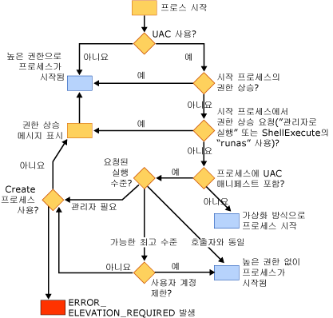

# UAC(사용자 계정 컨트롤)가 응용 프로그램에 주는 영향
[!INCLUDE[vs2017banner](../assembler/inline/includes/vs2017banner.md)]

UAC\(사용자 계정 컨트롤\)는 사용자 계정의 권한을 제한하는 Windows Vista의 기능입니다.  UAC에 대한 자세한 정보는 다음 사이트에서 찾아볼 수 있습니다.  
  
-   [Windows Vista 사용자 계정 컨트롤 단계별 가이드](http://go.microsoft.com/fwlink/?linkid=53781)  
  
-   [Developer Best Practices and Guidelines for Applications in a Least Privileged Environment](http://go.microsoft.com/fwlink/?linkid=82444)  
  
-   [Windows Vista의 사용자 계정 컨트롤 이해 및 구성](http://go.microsoft.com/fwlink/?LinkId=82445)  
  
## UAC를 사용하도록 설정한 후에 프로젝트 빌드  
 UAC를 사용하지 않는 Windows Vista에 Visual C\+\+ 프로젝트를 빌드하고 나중에 UAC를 사용하도록 설정하는 경우에는 프로젝트를 지운 후에 다시 빌드해야 제대로 작동합니다.  
  
## 관리 권한이 필요한 응용 프로그램  
 기본적으로 Visual C\+\+ 링커는 `asInvoker`의 실행 수준으로 UAC 조각을 응용 프로그램의 매니페스트에 포함합니다.  관리 권한이 있어야 응용 프로그램이 제대로 실행되는 경우\(예: 레지스트리의 HKLM 노드를 수정하거나 Windows 디렉터리와 같은 디스크의 보호된 영역에 쓰는 경우\) 응용 프로그램을 수정해야 합니다.  
  
 첫 번째 옵션은 매니페스트의 UAC 조작을 수정하여 실행 수준을 *requireAdministrator*로 변경하는 것입니다.  그러면 응용 프로그램이 실행되기 전에 사용자에게 관리자 자격 증명을 요구합니다.  이를 수행하는 방법에 대한 자세한 내용은 [\/MANIFESTUAC\(매니페스트에 UAC 정보 포함\)](../build/reference/manifestuac-embeds-uac-information-in-manifest.md)을 참조하십시오.  
  
 두 번째 옵션은 **\/MANIFESTUAC:NO** 링커 옵션을 지정하여 UAC 조각을 매니페스트에 포함하지 않는 것입니다.  이 경우에는 응용 프로그램이 가상화되어 실행됩니다.  레지스트리 또는 파일 시스템의 변경 사항은 응용 프로그램이 종료된 후에 유지되지 않습니다.  
  
 다음 순서도는 UAC의 사용 여부와 응용 프로그램에 UAC 매니페스트가 있는지 여부에 따라 응용 프로그램이 어떻게 실행되는지를 설명합니다.  
  
   
  
## 참고 항목  
 [최선의 보안 구현 방법](../top/security-best-practices-for-cpp.md)