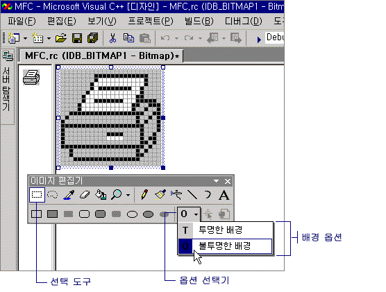

# Choosing a Transparent or Opaque Background (Image Editor for Icons)
[!INCLUDE[vs2017banner](../assembler/inline/includes/vs2017banner.md)]

이미지에서 선택 영역을 이동하거나 복사할 경우, 현재 배경색과 일치하는 선택 영역 내의 모든 픽셀은 기본적으로 투명하므로 대상 위치의 픽셀을 가리지 않습니다.  
  
 투명한 배경\(기본값\)에서 불투명한 배경으로 전환할 수도 있고 다시 투명한 배경으로 돌아갈 수도 있습니다.  선택 도구를 사용할 때 **투명한 배경**과 **불투명한 배경** 옵션은 아래 그림처럼 **이미지 편집기** 도구 모음의 옵션 선택기에 표시됩니다.  
  
   
이미지 편집기 도구 모음에 표시되는 투명 및 불투명 옵션  
  
### 투명한 배경과 불투명한 배경 사이에 전환하려면  
  
1.  **이미지 편집기** 도구 모음에서 **옵션** 선택기를 클릭하고 다음 중 원하는 배경을 클릭합니다.  
  
    -   **불투명한 배경\(O\)**: 선택 영역의 모든 부분이 기존 이미지를 가립니다.  
  
    -   **투명한 배경\(T\)**: 현재 배경색과 일치하는 선택 영역의 부분 위에 기존 이미지가 표시됩니다.  
  
 \-또는\-  
  
-   **이미지** 메뉴에서 **불투명하게 그리기**를 선택하거나 선택 취소합니다.  
  
 선택 영역의 투명한 이미지 일부를 이미 변경한 경우에도 배경색을 변경할 수 있습니다.  
  
 관리되는 프로젝트에 리소스를 추가하는 방법은 .NET Framework 개발자 가이드의 [응용 프로그램의 리소스](../Topic/Resources%20in%20Desktop%20Apps.md)를 참조하십시오. 관리되는 프로젝트에 리소스 파일 추가, 리소스 액세스, 정적 리소스 표시, 속성에 리소스 문자열 할당 등의 작업을 수동으로 수행하는 방법에 대한 자세한 내용은 [연습: Windows Forms 지역화](http://msdn.microsoft.com/ko-kr/9a96220d-a19b-4de0-9f48-01e5d82679e5) 및 [Walkthrough: Using Resources for Localization with ASP.NET](../Topic/Walkthrough:%20Using%20Resources%20for%20Localization%20with%20ASP.NET.md)을 참조하십시오.  
  
 요구 사항  
  
 없음  
  
## 참고 항목  
 [Accelerator Keys](../mfc/accelerator-keys-image-editor-for-icons.md)   
 [Working with Color](../mfc/working-with-color-image-editor-for-icons.md)