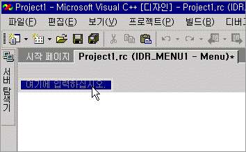
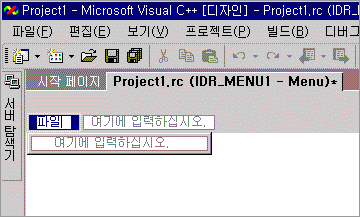

# 메뉴 만들기
> [!NOTE]
>  Express 버전에서는 리소스 창을 사용할 수 없습니다.  
  
### 표준 메뉴를 만들려면  
  
1.  **보기** 메뉴에서 **리소스 뷰** 를 클릭한 다음 **메뉴** 제목을 마우스 오른쪽 단추로 클릭하고 **리소스 추가**를 선택합니다. **메뉴**를 선택합니다.  
  
2.  메뉴 모음에서 **새 항목** 상자(“여기에 입력”이 포함된 사각형)를 선택합니다.  
  
       
새 항목 상자  
  
3.  예를 들어 "파일"과 같이 새 메뉴의 이름을 입력합니다.  
  
     입력하는 텍스트는 **메뉴** 편집기와 **속성 창** 의 [캡션](/visualstudio/ide/reference/properties-window)상자에 모두 나타납니다. 한 위치에서 새 메뉴에 대한 속성을 편집할 수 있습니다.  
  
     메뉴 모음에서 새 메뉴에 이름을 지정하면 새 항목 상자가 오른쪽으로 이동하고(다른 메뉴를 추가할 수 있도록), 메뉴 명령을 추가할 수 있도록 또 다른 새 항목 상자가 첫 번째 메뉴 아래에 열립니다.  
  
       
메뉴 이름을 입력한 후 포커스가 이동된 새 항목 상자  
  
    > [!NOTE]
    >  메뉴 모음에서 단일 항목 메뉴를 만들려면 팝업 속성을 False로 설정합니다.  
  
 관리 되는 프로젝트에 리소스를 추가 정보를 참조 하십시오 [데스크톱 응용 프로그램의 리소스](/dotnet/framework/resources/index) 에 *.NET Framework 개발자 가이드입니다.* 수동으로 관리 되는 프로젝트에 리소스 파일을 추가, 리소스 액세스, 정적 리소스 표시 및 속성에 리소스 문자열 할당에 대 한 정보를 참조 하십시오. [데스크톱 앱에 대 한 리소스 파일 만들기](/dotnet/framework/resources/creating-resource-files-for-desktop-apps)합니다. 전역화 및 지역화의 관리 되는 응용 프로그램의 리소스에 대 한 정보를 참조 하십시오. [전역화 및 지역화.NET Framework 응용 프로그램](/dotnet/standard/globalization-localization/index)합니다.  
  
 **요구 사항**  
  
 Win32  
  
## 참고 항목  
 [메뉴 편집기](../windows/menu-editor.md)