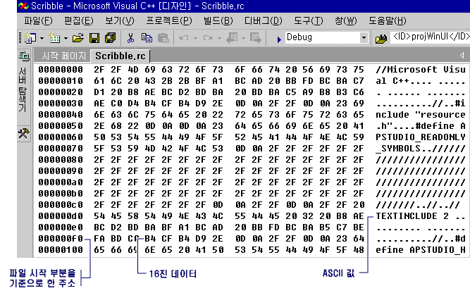

# 바이너리 편집을 위해 리소스 열기
### 이진 편집을 위해 Windows 데스크톱 리소스를 열려면  
  
1.  [리소스 뷰](../windows/resource-view-window.md)에서 편집할 특정 리소스 파일을 선택합니다.  
  
    > [!NOTE]
    >  프로젝트에 .rc 파일이 아직 없는 경우 [새 리소스 스크립트 파일 만들기](../windows/how-to-create-a-resource-script-file.md)를 참조하세요.  
  
2.  리소스를 마우스 오른쪽 단추로 클릭하고 바로 가기 메뉴에서 **이진 데이터 열기** 를 클릭합니다.  
  
    > [!NOTE]
    >  [리소스 뷰](../windows/resource-view-window.md) 창을 사용하여 Visual Studio에서 인식되지 않는 형식의 리소스를 열면(예: RCDATA 또는 사용자 지정 리소스) 리소스가 바이너리 편집기에서 자동으로 열립니다.  
  
### 이진 편집을 위해 관리되는 리소스를 열려면  
  
1.  솔루션 탐색기에서 편집할 특정 리소스 파일을 선택합니다.  
  
2.  리소스를 마우스 오른쪽 단추로 클릭하고 바로 가기 메뉴에서 **연결 프로그램** 을 선택합니다.  
  
3.  **연결 프로그램** 대화 상자에서 **바이너리 편집기**를 선택합니다.  
  
    > [!NOTE]
    >  관리되는 프로젝트에서 리소스 파일로 작업하려면 [이미지 편집기](../windows/image-editor-for-icons.md) 및 [바이너리 편집기](binary-editor.md) 를 사용할 수 있습니다. 편집할 관리되는 리소스는 연결된 리소스여야 합니다. Visual Studio 리소스 편집기에서는 포함된 리소스를 편집할 수 없습니다.  
  
    > [!NOTE]
    >  관리 되는 프로젝트에 리소스를 추가 정보를 참조 하십시오 [데스크톱 응용 프로그램의 리소스](/dotnet/framework/resources/index) 에 *.NET Framework 개발자 가이드입니다.* 수동으로 관리 되는 프로젝트에 리소스 파일을 추가, 리소스 액세스, 정적 리소스 표시 및 속성에 리소스 문자열 할당에 대 한 정보를 참조 하십시오. [데스크톱 앱에 대 한 리소스 파일 만들기](/dotnet/framework/resources/creating-resource-files-for-desktop-apps)합니다. 전역화 및 지역화의 관리 되는 응용 프로그램의 리소스에 대 한 정보를 참조 하십시오. [전역화 및 지역화.NET Framework 응용 프로그램](/dotnet/standard/globalization-localization/index)합니다.   
  
   
바이너리 편집기에 표시되는 대화 상자의 이진 데이터  
  
 바이너리 편집기에는 특정 ASCII 값만 표시됩니다(0x20 ~ 0x7E). 확장 문자는 바이너리 편집기의 ASCII 값 섹션(오른쪽 패널)에 마침표로 표시됩니다. "인쇄 가능" 문자는 ASCII 값 32 ~ 126입니다.  
  
> [!NOTE]
>  다른 편집기 창에서 편집 중인 리소스에서 바이너리 편집기를 사용하려면 먼저 다른 편집기 창을 닫습니다.  
  
 **요구 사항**  
  
 없음  
  
## 참고 항목  
 [Binary Editor](binary-editor.md)

