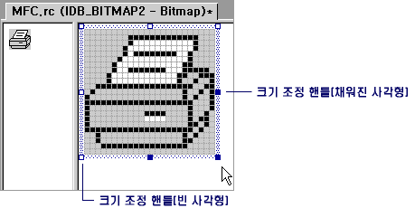

# Resizing an Image (Image Editor for Icons)
[!INCLUDE[vs2017banner](../assembler/inline/includes/vs2017banner.md)]

이미지 크기를 조정할 때 이미지 편집기의 동작은 [선택](../mfc/selecting-an-area-of-an-image-image-editor-for-icons.md) 영역이 이미지의 일부인지 아니면 전체인지에 따라 달라집니다.  
  
 선택 영역에 이미지 일부만 포함된 경우에는 이미지 편집기에서 픽셀의 행과 열을 삭제하여 선택 영역을 줄이고 빈 부분을 현재 배경색으로 채우거나 픽셀의 행과 열을 복제하여 선택 영역을 늘립니다.  
  
 선택 영역에 전체 이미지가 포함된 경우에는 이미지 편집기에서 이미지를 줄이거나 늘리고 자르거나 확장합니다.  
  
 크기 조정 핸들이나 [속성 창](../Topic/Properties%20Window.md)을 사용하여 이미지 크기를 조정할 수 있습니다.  크기 조정 핸들을 끌어 이미지의 일부나 전체 크기를 변경할 수 있습니다.  끌 수 있는 크기 조정 핸들은 실선입니다.  비어 있는 핸들은 끌 수 없습니다.  속성 창을 사용하면 선택된 부분이 아닌 전체 이미지의 크기만 조정할 수 있습니다.  
  
   
크기 조정 핸들  
  
> [!NOTE]
>  [모눈 설정 대화 상자](../mfc/grid-settings-dialog-box-image-editor-for-icons.md)에서 바둑판식 모눈 옵션을 선택하면 크기 조정이 다음 바둑판식 눈금선에 맞춰집니다.  픽셀 모눈 옵션만 선택되어 있으면\(기본 설정\), 크기 조정이 사용 가능한 다음 픽셀에 맞춰집니다.  
  
-   [전체 이미지 크기 조정](../mfc/resizing-an-entire-image-image-editor-for-icons.md)  
  
-   [전체 이미지 자르기 또는 확장](../mfc/cropping-or-extending-an-entire-image-image-editor-for-icons.md)  
  
-   [전체 이미지 줄이기 또는 늘이기](../mfc/shrinking-or-stretching-an-entire-image-image-editor-for-icons.md)  
  
-   [이미지 일부 줄이기 또는 늘이기](../mfc/shrinking-or-stretching-part-of-an-image-image-editor-for-icons.md)  
  
 관리되는 프로젝트에 리소스를 추가하는 방법은 .NET Framework 개발자 가이드의 [응용 프로그램의 리소스](../Topic/Resources%20in%20Desktop%20Apps.md)를 참조하십시오. 관리되는 프로젝트에 리소스 파일 추가, 리소스 액세스, 정적 리소스 표시, 속성에 리소스 문자열 할당 등의 작업을 수동으로 수행하는 방법에 대한 자세한 내용은 [연습: Windows Forms 지역화](http://msdn.microsoft.com/ko-kr/9a96220d-a19b-4de0-9f48-01e5d82679e5) 및 [Walkthrough: Using Resources for Localization with ASP.NET](../Topic/Walkthrough:%20Using%20Resources%20for%20Localization%20with%20ASP.NET.md)을 참조하십시오.  
  
## 요구 사항  
 없음  
  
## 참고 항목  
 [Accelerator Keys](../mfc/accelerator-keys-image-editor-for-icons.md)   
 [Editing Graphical Resources](../mfc/editing-graphical-resources-image-editor-for-icons.md)   
 [Image Editor for Icons](../mfc/image-editor-for-icons.md)