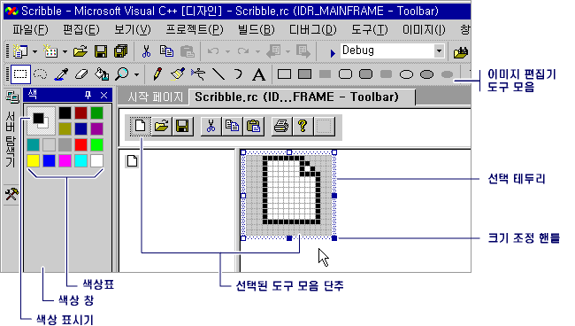

# 도구 모음 편집기
도구 모음 편집기에서는 도구 모음 리소스를 만들고 비트맵을 도구 모음 리소스로 변환할 수 있습니다. 도구 모음 편집기에서는 그래픽 표시를 사용하여 완료된 응용 프로그램에서 보이는 모양과 거의 유사한 도구 모음과 단추를 표시합니다.  
  
 도구 모음 편집기를 통해 다음 작업을 할 수 있습니다.  
  
-   [새 도구 모음 및 단추 만들기](../windows/creating-new-toolbars.md)  
  
-   [비트맵을 도구 모음 리소스로 변환](../windows/converting-bitmaps-to-toolbars.md)  
  
-   [도구 모음 단추 만들기, 이동 및 편집](../windows/creating-moving-and-editing-toolbar-buttons.md)  
  
-   [도구 설명 만들기](../windows/creating-a-tool-tip-for-a-toolbar-button.md)  
  
 도구 모음 편집기 창에는 이미지 편집기 창과 같이 단추 이미지 뷰 두 개가 표시됩니다. 분할줄이 두 창을 구분합니다. 분할줄을 한 쪽에서 다른 쪽으로 끌면 창의 상대적 크기를 변경할 수 있습니다. 활성 창에는 선택 테두리가 표시됩니다. 이미지 뷰 두 개 위에 제목 도구 모음이 있습니다.  
  
   
도구 모음 편집기  
  
 도구 모음 편집기 기능은 이미지 편집기 기능과 유사합니다. 메뉴 항목, 그래픽 도구 및 비트맵 그리드는 이미지 편집기의 항목과 같습니다. 이미지 메뉴에는 도구 모음 편집기와 이미지 편집기 사이에서 전환할 수 있는 메뉴 명령이 있습니다. 그래픽 도구 모음, 색 색상표 또는 이미지 메뉴 사용에 대한 자세한 내용은 [이미지 편집기](../windows/image-editor-for-icons.md)를 참조하세요.  
  
 관리 되는 프로젝트에 리소스를 추가 정보를 참조 하십시오 [데스크톱 응용 프로그램의 리소스](/dotnet/framework/resources/index) 에 *.NET Framework 개발자 가이드입니다.* 수동으로 관리 되는 프로젝트에 리소스 파일을 추가, 리소스 액세스, 정적 리소스 표시 및 속성에 리소스 문자열 할당에 대 한 정보를 참조 하십시오. [데스크톱 앱에 대 한 리소스 파일 만들기](/dotnet/framework/resources/creating-resource-files-for-desktop-apps)합니다. 전역화 및 지역화의 관리 되는 응용 프로그램의 리소스에 대 한 정보를 참조 하십시오. [전역화 및 지역화.NET Framework 응용 프로그램](/dotnet/standard/globalization-localization/index)합니다.  
  
## 요구 사항  
 MFC 또는 ATL  
  
## 참고 항목  
 [리소스 편집기](../windows/resource-editors.md)   
 [메뉴 및 기타 리소스](http://msdn.microsoft.com/library/windows/desktop/ms632583.aspx)

