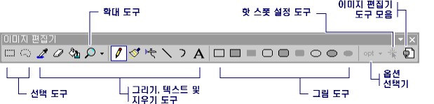
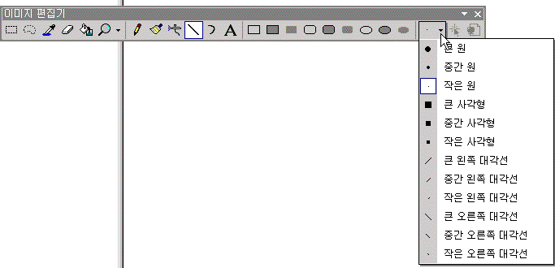

# 도구 모음(아이콘에 대한 이미지 편집기)
**이미지 편집기** 도구 모음에 그리기, 그리기, 텍스트를 입력, 지우기, 및 뷰를 조작 하는 도구가 있습니다. 또한 각 도구를 사용 하기 위한 옵션을 선택할 수 있는 옵션 선택기를 포함 합니다. 예를 들어 다양 한 브러시 너비, 배율 요소 및 선 스타일에서 선택할 수 있습니다.  
  
> [!NOTE]
>  사용할 수 있는 모든 도구는 **이미지 편집기** 도구 모음에서 사용할 수 있습니다.는 **이미지** 메뉴 (아래에서 **도구** 명령).  
  
   
이미지 편집기 도구 모음  
  
 사용 하는 **이미지 편집기** 도구 모음 및 **옵션** 선택기 도구 또는 원하는 옵션입니다.  
  
> [!TIP]
>  도구 모음 단추 위로 커서를 올려 놓으면 도구 설명이 표시 됩니다. 이러한 팁은 각 단추의 기능을 식별할 수 있습니다.  
  
 와 **옵션** 선택기 줄, 브러시 스트로크 등의 너비를 지정할 수 있습니다. 에 있는 아이콘은 **옵션** 도구에 따라 선택한 선택기 단추 변경 합니다.  
  
   
이미지 편집기 도구 모음에서 옵션 선택기  
  
 관리 되는 프로젝트에 리소스를 추가 정보를 참조 하십시오 [데스크톱 응용 프로그램의 리소스](/dotnet/framework/resources/index) 에 *.NET Framework 개발자 가이드입니다.* 수동으로 관리 되는 프로젝트에 리소스 파일을 추가, 리소스 액세스, 정적 리소스 표시 및 속성에 리소스 문자열 할당에 대 한 정보를 참조 하십시오. [데스크톱 앱에 대 한 리소스 파일 만들기](/dotnet/framework/resources/creating-resource-files-for-desktop-apps)합니다. 전역화 및 지역화의 관리 되는 응용 프로그램의 리소스에 대 한 정보를 참조 하십시오. [전역화 및 지역화.NET Framework 응용 프로그램](/dotnet/standard/globalization-localization/index)합니다.  
  
## 요구 사항  
 없음  
  
## 참고 항목  
 [표시 또는 숨기기 도구 모음](displaying-or-hiding-the-toolbar-image-editor-for-icons.md)   
 [액셀러레이터 키](../windows/accelerator-keys-image-editor-for-icons.md)   
 [아이콘에 대한 이미지 편집기](../windows/image-editor-for-icons.md)

